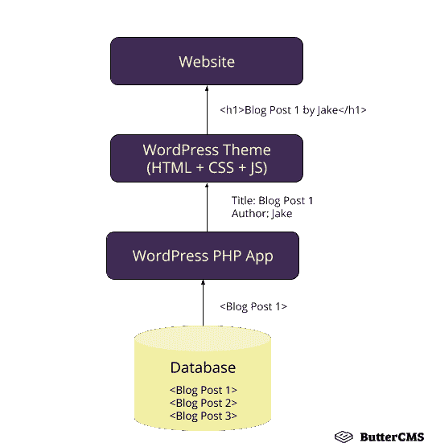
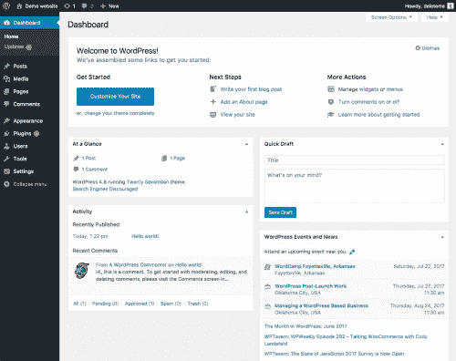
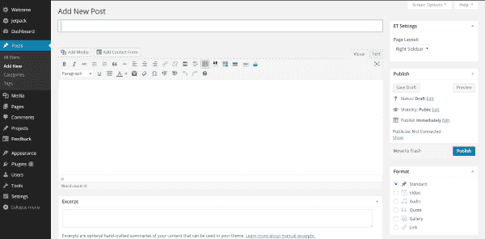
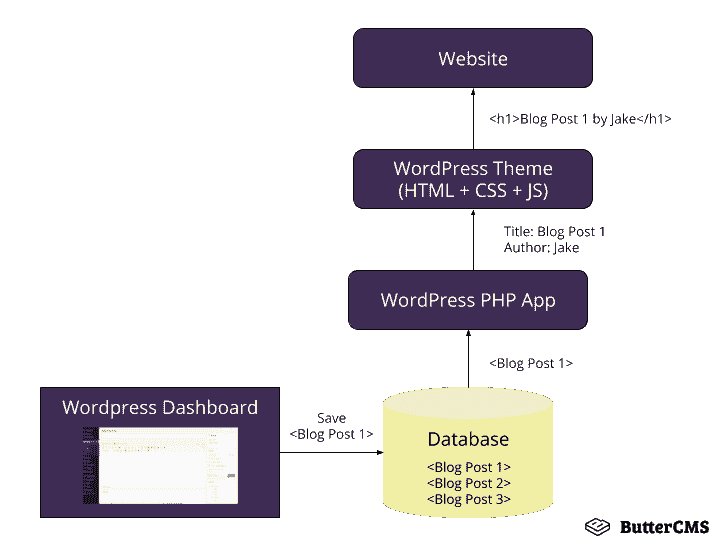
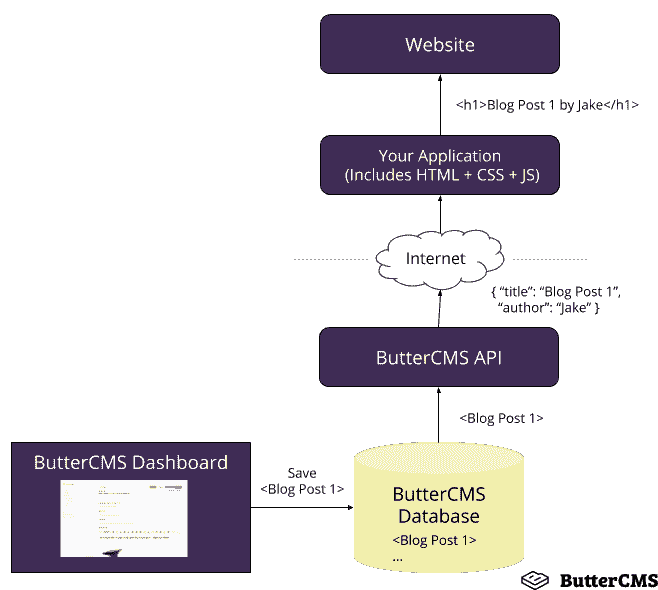
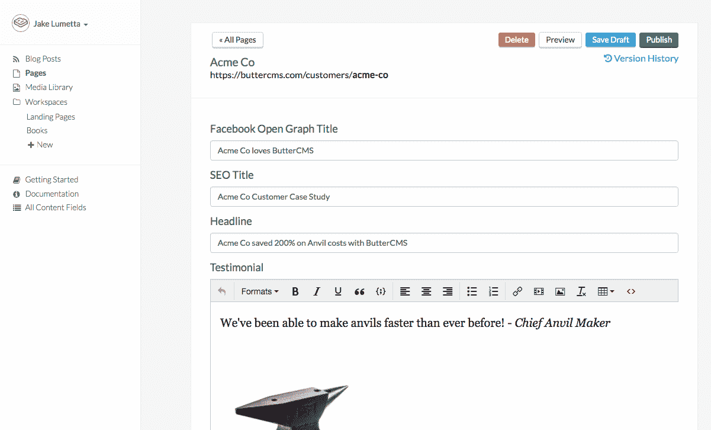

# 无头 CMS vs 传统 CMS:一次深度潜水

> 原文：<https://medium.com/hackernoon/headless-cms-vs-traditional-cms-a-deep-dive-4ec834fd6fd3>

如果你曾经使用过内容管理系统(CMS)，你可能使用过 Wordpress 或者其他传统的 CMS(我们将在后面定义“传统的”)。WordPress——及其架构——已经存在了 15 年，是 CMS 的同义词。它是如何工作的，更重要的是你如何使用它并让它做你想做的事情，这是开发者和营销人员已经习惯的一种根深蒂固的模式。

这种对 WordPress 根深蒂固的熟悉对于像 ButterCMS 这样的现代 CMS 来说是一个挑战。黄油与你所习惯的截然不同，至少从建筑的角度来看是这样的。当你第一次发现我们时，它会引出许多问题，这些问题我们将在本系列中讨论。本系列的目标是研究 ButterCMS 与 Wordpress 等传统 CMS 的比较，并阐明哪些场景可能会让你考虑 Butter 等无头 CMS。

ButterCMS 是一个基于 API 的或“无头”的 CMS。我们允许你做和 Wordpress 一样的事情，让你的客户、营销团队和非开发者使用一个友好的界面来创建营销页面、写博客文章和管理内容，但是我们用一种非常不同的方式来实现。

*你如何*与我们合作，让我们做你*想要的事情，这几乎与你使用 Wordpress 的经历相反。这是我们从头开始构建的一种方法，旨在尽可能为开发人员提供最友好的体验。*

# 什么是传统 CMS？

在传统的 CMS 中，一切都打包在一起，技术架构将前端(设计和布局)与后端(代码和内容数据库)紧密地联系在一起。当你下载 Wordpress 时，它带有:

*   一个预定义的 Wordpress 通用主题(HTML 模板，CSS，Javascript)。这些是控制你的站点外观的前端文件。
*   一个[预定义的数据库](http://www.wpbeginner.com/glossary/database/) (Wordpress 使用 MySQL) + Wordpress 内容模式。请注意，更改此模式意味着手动修改数据库。
*   Wordpress PHP 应用程序代码，增强你的网站的功能，并将数据库连接到主题。换句话说，它从数据库中提取内容(比如一篇博客文章)并将其放入通用主题布局中。



当你使用 Wordpress 并且访问者浏览你的博客文章时，下图显示了发生的情况:

1.  博客文章的原始数据是由 Wordpress PHP 应用程序从 Wordpress MySql 数据库中提取的。
2.  Wordpress PHP 应用程序将博客文章内容(标题、作者、正文、发布日期等)传递给 Wordpress 主题
3.  Wordpress 主题(由 HTML + CSS + Javascript 组成)将原始内容转换成完整的 HTML 格式，其中既包含博客文章的内容，也包含整个页面的设计和布局，然后将其发送到访问者的浏览器进行查看

为了管理内容(例如，将博客文章保存到数据库)，传统的 CMS 提供了一个仪表板，指导用户如何添加内容或更改其网站的外观。这里有一个 WordPress 仪表盘的例子:



通过点击左侧的选项，您可以在网站上添加博客文章或页面。



当你在 Wordpress 仪表盘中保存你的博客文章时，它被保存在数据库中以供以后查看:



如前所述，传统 CMS 由来已久。WordPress 是最受欢迎的传统 CMS 选项之一，自 2003 年以来[一直存在。随着企业和消费者使用互联网的方式发生了变化，对速度、多功能性和灵活性的不断变化的需求导致了无头 CMS 的产生。](https://en.wikipedia.org/wiki/WordPress)

# 什么是无头 CMS？

概括地说，传统的 CMS 为您提供:

1.  一种存储内容的方式
2.  编辑内容的仪表板
3.  显示内容的应用程序+主题

一个无头的 CMS 专注于前两个，打破了后端和前端之间的紧密联系。无头 CMS 存储内容，为您提供内容编辑仪表板，然后为您的开发人员提供一个 API，将内容拉入您自己的应用程序的前端。



当您在 headless CMS 中创建内容时，您创建的是原始内容(文本值、图像等)，而不是内容的布局或设计。然后，无头 CMS 利用 API 将原始内容传送到任何地方:网站、移动应用程序、可穿戴设备——本质上是任何连接到互联网的东西。

这是一种与 WordPress 完全不同的方法，WordPress 让你包含了它的系统(记住紧密耦合的前端和后端),所有的东西都在一个地方。让我们通过查看 ButterCMS 来进一步了解无头 CMS 是如何工作的。

# 旁注:什么是 API？

API 代表应用程序编程接口。这篇[文章用简单的英语对 API 做了很好的解释](https://medium.freecodecamp.org/what-is-an-api-in-english-please-b880a3214a82)。

# 什么是 ButterCMS？

ButterCMS 就是上面讨论的这种基于 API 的无头 CMS。Butter 是 SaaS(软件即服务),它托管和维护整个 CMS 平台，包括 CMS 仪表板(在这里管理您的内容)和内容 API。您可以查询我们的 API，将内容放入您自己的应用程序中(使用您选择的技术堆栈)。您可以在 Butter 中定义自己的定制内容模型来表示您的营销团队需要管理的任何内容。我们的客户利用我们来充实他们的公司博客、SEO 登录页面、客户案例研究、公司新闻和更新、活动和网络研讨会页面、教育中心、位置页面等等。

您可以将 ButterCMS 用于新项目，也可以将其添加到现有的代码库中。ButterCMS 提供了和 Wordpress 一样的用户友好的仪表盘来管理你的内容:



使用此仪表板，您可以为网站上的页面创建新内容，并在将内容实时发布到您的站点之前预览内容。

因为我们是 SaaS，Butter 不同于传统的 CMS，比如 Wordpress，因为我们不是你需要下载、托管、定制和维护的大型软件。相反，我们提供易于使用、高性能的内容 API，您可以将其添加到您的应用程序中。您只需将您的应用程序连接到我们的 API，剩下的由我们来处理。

Butter 旨在成为传统 CMS 的开发人员友好的替代品，所以当我们说易于使用时，我们指的是它。例如，如果您想让一个非技术人员能够向您的营销站点添加客户案例研究页面，您可以用 Butter 创建一个案例研究页面类型来表示这些页面。非技术人员将能够从我们的仪表板(如上所示)管理这些页面，内容 API 将像这样输出您的内容:

```
{ 
  "data": { 
    "slug": "acme-co-case-study", 
    "fields": { 
      "seo_title": "Acme Co Customer Case Study",
      "seo_description": "Acme Co saved 200% on Anvil costs with    ButterCMS", 
      "title": "Acme Co loves ButterCMS", 
      "body": "<p>We've been able to make anvils faster than ever before! - Chief Anvil Maker</p>" 
    } 
  }
```

内容被格式化为 [JSON](https://en.wikipedia.org/wiki/JSON) 格式，这是 APIss 的通用标准，开发人员对此很熟悉。您的应用程序可以使用这个 JSON 在您自己的品牌主题(布局+设计)中显示这些内容。

# 比较:WordPress 与 ButterCMS

下面是 WordPress 这样的传统 CMS 和 Butter 这样的无头 CMS 的对比。

## 设置

**WordPress:** 你的网站必须建立在 CMS 之上，这意味着你需要学习和(重新)建立基于 CMS 规则和流程的网站

**ButterCMS:** 在您现有技术体系中需要的地方添加 CMS 功能——CMS 是集成的，而不是基础

## 主办；主持

需要一个数据库+特定的服务器托管

**ButterCMS:** 以 SaaS 的身份交付，对主机没有任何影响

## 代码复杂性

内容、CMS 代码和网站代码共存并交织在一起，创造了相互依赖和复杂性

**ButterCMS:** 内容独立存在，通过简单的 API 调用呈现在网站的代码库中

## 安全性

需要安全升级和数据库备份

**ButterCMS:** 作为 SaaS 交付，无需维护

## 我的网站会是什么样子？

你可以选择和定制的内置主题和模板

ButterCMS: 完全控制你的内容出现的方式和位置

## 灵活性

网站必须用特定的编程语言或框架来构建/重建

**ButterCMS:** 与任何代码库集成

# 在传统和无头 CMS 之间选择

## 当传统 CMS 可能非常适合您的团队时

传统 CMS 的优势在于熟悉，而熟悉的一部分是使用的舒适性。如果你想使用内置的主题和模板作为起点，并在此基础上进行定制，像 WordPress 这样的传统 CMS 是不错的选择。

另一方面，你选择传统的 CMS 是在做出一些牺牲。根据您选择的传统 CMS，您的内容类型和交付渠道会受到限制。你也受限于 CMS 使用的任何技术栈(Wordpress 的情况下是 PHP)，所以如果你的开发团队喜欢不同的语言，这会增加他们的工作量。

以下是传统 CMS 可能适合的一些情况:

*   你没有现有的网站，或者对网站的底层技术没有主见(PHP + MySQL 也可以)，等等。
*   你有精通 Wordpress 和/或 PHP 的开发人员为你工作**或**
*   你可以把所有的开发工作外包给一个和你有良好关系的 Wordpress 代理公司(并且你能负担得起)
*   Wordpress 网站将会是一个独立的基本营销网站，你没有任何其他需要 CMS 功能的技术堆栈或应用程序(否则你会走上与 Wordpress 整合的道路)

## 当一个无头的 CMS 很适合你的团队时

一个无头的 CMS 让你完全控制你的内容出现的方式和位置。因为它不依赖于现有的技术，所以您的开发人员可以使用他们最熟悉的任何语言和框架。此外，headless CMS 更“适应未来”,因为它很容易与新技术和应用程序集成。

Headless 不使用现成的模板，所以您需要构建自己的应用程序，从 Butter 中提取内容并实现前端设计和布局。然而，重要的是要注意，如果你已经有了一个网站，你只需将我们的 API 集成到你已经有的网站中，所以你应该对它的外观有一个很好的感觉。

以下是一些无头 CMS 可能最适合的情况:

*   您已经有了一个使用现代技术栈(Node.js、React、Ruby on Rails、Django 等)构建的网站或应用程序，并且您想要轻松地添加博客和 CMS 功能
*   您希望让您的开发人员专注于您的技术堆栈，而不是让他们花费时间和精力将您的现有技术与现有传统 CMS 中的技术结合起来
*   您希望通过避免繁重的传统 CMS 代码库来确保内容快速加载
*   子域(blog.company.com)vs 子目录(company.com/blog)为您公司的博客和网页提高搜索引擎优化结果
*   你不想担心托管、维护和扩展 CMS
*   您希望最大限度地控制您的内容在多种技术(包括手机、平板电脑、可穿戴设备和任何连接到物联网的设备)上的显示方式和位置

说无头 CMS 适合每个人是不真诚的，就像说传统 CMS 是你公司的最佳选择是短视的。你的决定应该归结为你需要什么，你的开发者感觉最舒服的是什么，以及你想要 CMS 的多功能性和控制力。

在接下来的文章中，我们将探索传统 CMS(如 WordPress)和无头 CMS(如 Butter)的典型项目之旅。从那以后，我们将带您体验使用 ButterCMS 的感觉。

*本文原载于 buttercms.com*[](https://buttercms.com/blog/buttercms-vs-wordpress-headless-cms-vs-traditional-cms)**。**

*如果你喜欢这篇文章，请在下面鼓掌帮助它传播！更多类似内容，请关注我们的[*Twitter*](https://twitter.com/ButterCMS)*和* [*订阅我们的博客*](https://buttercms.com/blog/) *。**

*如果你想在你的网站上添加一个博客或者内容管理系统，而又不想乱用 Wordpress， [*你应该试试黄油内容管理系统*](https://buttercms.com/) *。**