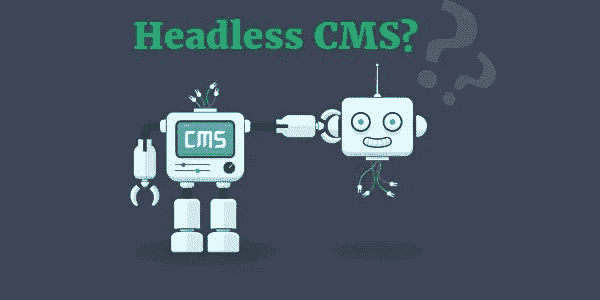
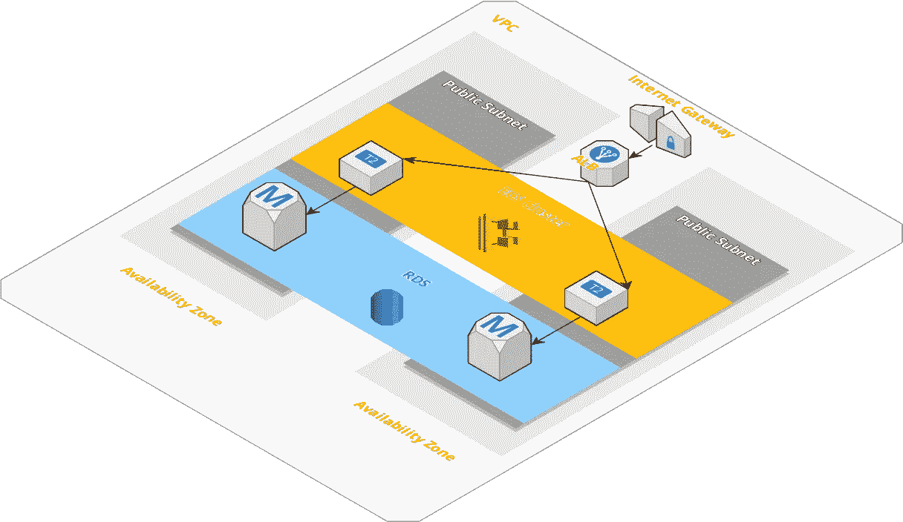

# AWS 上的无头 Wordpress CMS

> 原文：<https://medium.com/hackernoon/headless-wordpress-cms-on-aws-b64c9da8b9b5>

## 使用 Docker 快速启动 AWS 上的无头 Wordpress CMS



Credit — [https://www.superdesk.org/news/headless-cms](https://www.superdesk.org/news/headless-cms)

无头 CMS 目前很流行。但是什么是无头 CMS，为什么我应该开始使用它？

一个无头的 CMS 是一个从它的前端解耦的后端。后端是创建和发布内容的地方。而前端是显示内容的地方(网络、移动应用、机顶盒、Alexa 等)。

例如，传统的 CMS 是一个单一的网站。添加内容和显示内容使用的是同一个网站。后端和前端是**耦合**。

无头 CMS 仅用于创建和发布内容。该内容随后可通过 API 获得。用于显示内容的网站或移动应用程序是独立的。

但是为什么解耦更好呢？以下是一些原因:

*   比传统内容管理系统更快、更灵活的内容交付
*   面对用户界面变化的弹性(经得起未来考验)
*   快速设计迭代
*   增强的安全性
*   更少的发行者和开发者依赖性
*   更简单的部署

****感谢列表* [*亮点*](https://www.brightspot.com/blog/decoupled-cms-and-headless-cms-platforms)

既然我们都一致认为无头 CMS 是正确的选择。让我们来看看这些令人敬畏的 [CloudFormation 模板](https://github.com/rgfindl/headless-wordpress)，我创建它们是为了帮助你运行和管理你的 headless (Wordpress) CMS。

需要明确的是，这是一个运行在 AWS 上的 Wordpress 安装，使用基础设施作为代码和 Docker。

等等……为什么使用 Wordpress，而不是像 [Contently](https://contently.com/) 或 [Cosmic JS](https://cosmicjs.com/) 这样的酷的新的无头 CMS 服务？嗯，这些服务真的很棒，但它们要花很多钱，如果可以的话，我通常喜欢自己管理一切。还有… Wordpress 在管理内容方面真的很好。

但是 Wordpress 怎么会是无头 CMS 呢？简单，它有一个 API。

诀窍是让 Wordpress 成为无状态的，这样它就可以自动缩放，并在 AWS 上运行，实现零停机部署。

好了，无头 CMS 很酷，Wordpress 也挺酷的，我们继续。

[](https://github.com/rgfindl/headless-wordpress) [## rgfindl/headless-wordpress

### AWS -简单设置。

github.com](https://github.com/rgfindl/headless-wordpress) 

# 体系结构

我们的 Wordpress 实例使用 Docker 作为[弹性容器服务](https://aws.amazon.com/ecs/)运行。

首先我们有 [VPC](https://aws.amazon.com/vpc/) ，然后是 [ECS](https://aws.amazon.com/ecs/) 集群，然后是 EC2 实例，最后是带有任务的 [ECS](https://aws.amazon.com/ecs/) 服务。我们的 Wordpress 服务通过一个[弹性负载平衡器](https://aws.amazon.com/elasticloadbalancing/)向外界公开。我们使用 RDS 作为我们的 MySQL 数据库。



我们的 Wordpress 服务是无状态的，这意味着我们不能像 Wordpress 媒体或插件那样依赖文件系统来存储内容。每次我们的 Wordpress 服务的一个实例被产生时，它将只有被烘焙到我们的 Docker 映像中的文件。

让我们先看看我们是如何处理 Wordpress 媒体的。

我们使用一个叫做 [WP 卸载媒体](https://wordpress.org/plugins/amazon-s3-and-cloudfront/)的插件。这个插件允许我们将媒体存储在 [S3](https://aws.amazon.com/s3/) 中，并将 [CloudFront](https://aws.amazon.com/cloudfront/) 用作 CDN。看看下面的图表。我们也使用相同的 CDN 来缓存 Wordpress API…


现在我们如何处理插件？(我们可以忽略模板，因为这是无头的😃)

还记得我说过把东西烤成我们码头工人的形象吗？就是这样…我们必须在 Docker 图像中包含插件。让我们看一下那个文档并浏览一遍。

如你所见，我们的 Dockerfile 非常简单。它扩展了最新的 Wordpress 图片，然后安装了 3 个插件。它下载、解压并复制每个插件到`wordpress/wp-content/`目录。当你第一次启动你的 Wordpress 站点时，你必须激活这些插件。激活状态存储在 MySQL 中，因此您不必在每次 ECS 任务回收时都这样做。

# 装置

好了，让我们安装这个架构。首先几个先决条件。

## 先决条件

安装以下必备组件:

*   [AWS 账户](https://aws.amazon.com/)
*   [EC2 密钥对](https://console.aws.amazon.com/ec2/v2/home)
*   cim — ( `npm install -g cim`)
*   [AWS CLI](https://docs.aws.amazon.com/cli/latest/userguide/installing.html)

## 大量

现在让我们一次安装一个堆栈。

*   VPC
*   精英公司
*   无线电数据系统
*   electroniccashregister 电子现金出纳机
*   wordpress 软件

## VPC

这创建了 [Amazon 虚拟私有云](https://aws.amazon.com/vpc/)，我们的 ECS 集群和 RDS 数据库将在其中运行。

> *亚马逊虚拟专用云(亚马逊 VPC)允许您提供 AWS 云的逻辑隔离部分，您可以在您定义的虚拟网络中启动 AWS 资源。*

```
cd vpc
cim stack-up
```

## 精英公司

这创建了一个[弹性容器服务](https://aws.amazon.com/ecs/)，我们的 EC2 将在其中运行。

> *Amazon Elastic Container Service(Amazon ECS)是一种高度可扩展的高性能容器编排服务，支持 Docker 容器，允许您在 AWS 上轻松运行和扩展容器化应用。*

```
cd vpc
cim stack-up
```

## 无线电数据系统

这创建了一个我们的 Wordpress 应用程序将使用的[关系数据库服务](https://aws.amazon.com/rds/)数据库集群。

> *亚马逊关系数据库服务(Amazon RDS)使得在云中建立、操作和扩展关系数据库变得非常容易。*

```
cd rds
export DatabaseUsername="???"; export DatabasePassword="???"; cim stack-up
```

## electroniccashregister 电子现金出纳机

这创建了一个[弹性容器注册表](https://aws.amazon.com/ecr/)，它将保存我们的 wordpress 服务的 docker 图像。

> *Amazon Elastic Container Registry(ECR)是一个完全托管的 Docker 容器注册表，它使开发人员可以轻松地存储、管理和部署 Docker 容器映像。*

```
cd ecr
cim stack-up
```

## wordpress 软件

在我们发射这个云阵之前。我们需要把我们的 Wordpress 图片推送到 ECR。

**推送图像**

```
cd wordpress/src
```

[注册表认证](http://docs.aws.amazon.com/AmazonECR/latest/userguide/Registries.html#registry_auth)

*   `aws ecr get-login --registry-ids <account-id>`
*   复制/粘贴输出以执行 docker 登录，还将`/headless-wp`附加到存储库 url。

构建图像

*   `docker build -t headless-wp:<version> .`

[推送图像](http://docs.aws.amazon.com/AmazonECR/latest/userguide/docker-push-ecr-image.html)

*   `docker tag headless-wp:<version> <account-id>.dkr.ecr.<region>.amazonaws.com/headless-wp:latest`
*   `docker tag headless-wp:<version> <account-id>.dkr.ecr.<region>.amazonaws.com/headless-wp:<version>`
*   `docker push <account-id>.dkr.ecr.<region>.amazonaws.com/headless-wp`

**更新版本**

确保`Version`参数 in _cim.yml 与上面的`version`标签匹配。ECS 任务定义将从 ECR 中提取图像。

**叠加起来**

一旦`Version`被设置，你可以使用`cim stack-up`用新版本更新堆栈。

```
cd wordpress
cim stack-up
```

祝贺你，你的新 Wordpress 网站现在可用了。

首先运行 Wordpress 安装向导。

接下来启用我们添加的一些插件。

添加一些博客文章和页面。

然后查看 API。例:`https://<cdn-url>/wp-json/wp/v2/posts`

# 环境变量

祝贺你安装了无头 Wordpress。如果你在路上遇到什么困难，请不要犹豫，向我寻求帮助。

我想解释的一件事是 Wordpress 环境变量，因为它们确实把所有东西都联系在一起了。它们告诉我们的 Wordpress 安装关于 RDS 数据库、媒体 S3 桶和 CloudFront CDN URL。让我们来看看。这些可以在 Wordpress 栈的[AWS::ECS::task definition](https://github.com/rgfindl/headless-wordpress/blob/master/wordpress/wp.stack.yml#L233)中找到。

`WORDPRESS_DB_*`变量直接来自 RDS 堆栈。CloudFormation 允许您导出可以在其他堆栈中导入的输出变量。

`WORDPRESS_CONFIG_EXTRA`变量是我们配置 [WP 卸载媒体](https://wordpress.org/plugins/amazon-s3-and-cloudfront/)插件的地方。首先，我们通过`AS3CF_AWS_USE_EC2_IAM_ROLE` var 告诉它使用我们的任务角色 [AWS::IAM::Role](https://github.com/rgfindl/headless-wordpress/blob/master/wordpress/wp.stack.yml#L208) 。然后我们使用`AS3CF_SETTINGS` var 来设置插件。

感谢阅读。我希望你喜欢它！