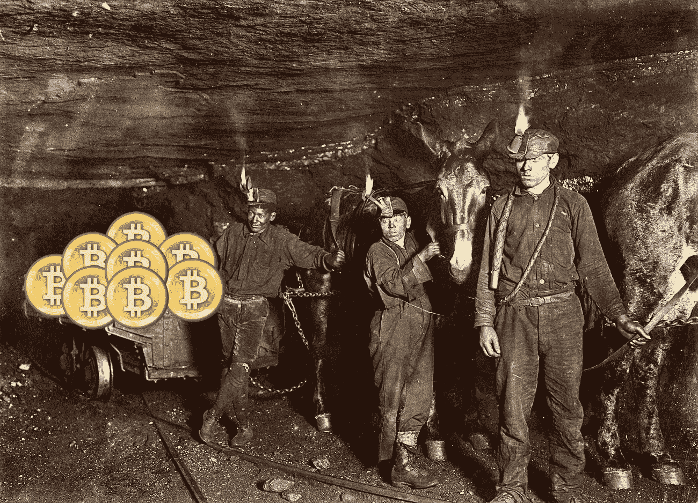

# 健康危害？在我的比特币矿场？比你想象的更有可能。

> 原文：<https://medium.com/hackernoon/health-hazards-in-my-bitcoin-mine-its-more-likely-than-you-think-f3f70671e45c>

Bitcoin miners (2018, colorized)

在无与伦比的财富前景的诱惑下，各地的人们都一头扎进了比特币的开采中。但对许多矿商来说，这样的财富代价巨大。

科尔·卡纳利博士警告说:“在矿井里呆太长时间会对人的身体造成不可逆转的损害。”“例如，在定期接触来自所谓‘思想领袖’的巨大噪音几个月后，许多矿工表现出听力损失的迹象。我曾经告诉我的一个病人，比特币的价格正在下跌，他只是茫然地看着我，不停地谈论加密将如何改变世界。”

“这还没有提到死亡的风险，”他继续说道，悲伤地摇着头。"许多矿商被价格暴跌压垮，直到最后一刻才倒下."

所以，我们想问，你会给那些担心自身健康和安全的矿工什么建议？金丝雀博士停顿了一下，然后回答道:“看，他们称之为*地穴*发生是有原因的。趁你还没被活埋，赶紧退出比特币挖矿！”