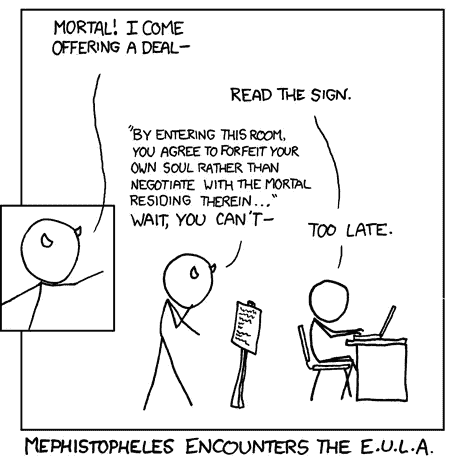
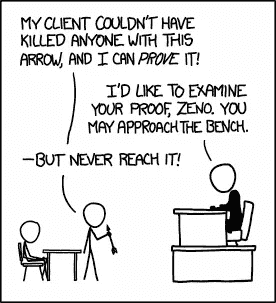
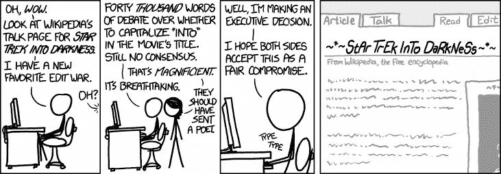
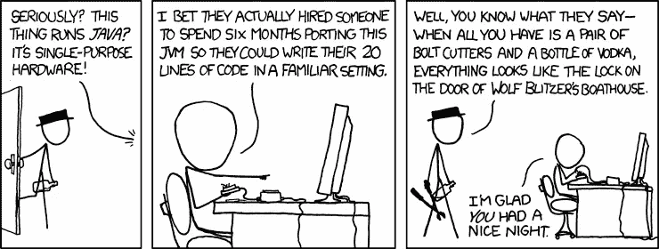

# 听听推出 ICO 的技术人员怎么说

> 原文：<https://medium.com/hackernoon/hear-from-the-techie-who-launched-an-ico-5b70538c0e0f>

## 采访 [Vanywhere](http://vanywhere.com) 的首席技术官 Gilad Menashe

我一直想在初创企业的早期阶段做出贡献。这就是 ICO 的基本功能。

在我过去的故事中，我一直在写没有实际知识的内容。我没有推出一个 ICO 的经验，我想到了采访一个有建立和推出 ICO 经验的人。吉拉德很乐意帮我。

我们请来了 [Vanywhere](http://vanywhere.com) 的首席技术官吉拉德·梅纳舍。

## **给我们介绍一下你自己吧？**

> 我在互联网技术、安全、移动、SAAS、区块链技术、AWS、web 应用和计算机视觉领域拥有超过 15 年的经验。我管理开发团队已有 14 年，在过去的 9 年里，我一直担任 R&D 的副总裁，在那里我开发了一种产品，这种产品成为了公司的旗舰产品，也是将他们转变为技术领先的市场领导者的关键因素。
> 
> 我的工作已经赢得了数百万美元的合同，客户包括美国国家航空航天局、波音公司、联合航空公司、美国航空公司、加拿大空军和以色列国防军等。我还在以色列国防情报局(8200)工作过，作为开发团队的一员，开发(C / C++)嵌入式(硬件)和桌面应用程序。

## **哇！你第一次听说区块链和 ICOs 是什么时候？**

> 两年前，我有机会看到智能合同是什么样子，我立刻爱上了这个想法。

谁不想呢。智能合同是一个巧妙的想法。对于那些不知道智能合约的人，不要担心，我可以解释。

Credits : [xkcd](https://xkcd.com/501/)

一份正常的合同是相当愚蠢的，它不会强制执行自己。你需要先付钱给律师来签订合同。然后，如果一方不同意协议，你应该再次支付律师为你打官司。这是以时间和金钱为代价的。

智能合同是自动执行的计算机化合同。

马克已经五个月没付房租了。当 Sara 提问时，他答应以后再付钱。她无依无靠，请不起律师。法院需要八个月到将近一年的时间来执行诉讼。唯一的选择是说服马克。

如果他们在智能合同上达成协议，计算机代码会在每月的约定日期将钱从马克的账户转移到萨拉的账户。第二次不需要马克的同意。

这将为萨拉节省大量的金钱和时间。她不必雇律师，等上几个月或几年才能讨回公道。

Credits : [xkcd](https://www.explainxkcd.com/wiki/index.php/1153:_Proof)

智能合同不会消除律师，但它消除了不必要的诉讼。从而节省了老实人的金钱和司法机关的宝贵时间。

这是吉拉德爱上的想法。

## 我同意你的观点，吉拉德，聪明的合同是明智的！告诉我们 Vanywhere 的情况？它是如何帮助人们的？

> 作为用户，Vanywhere 允许您与他人进行实时联系。一个能在整个过程中指导你、与你相关并给予你全力关注和专业知识的人。作为一名技能者，Vanywhere 允许你与世界分享你的技能，帮助他人，并将这一过程转化为加密货币。

## 您在 Vanywhere 中使用智能合约吗？

> 当然，智能合约处理支付和评级系统。当发起呼叫时，智能合约从用户那里收取费用，并保留 48 小时，在这一点上它被释放给 Skiller。
> 
> 这 48 小时冷却期的目的是在出现争议时为争议的提出和解决创造一个窗口。如果用户对他们接受的服务感到满意，资金将在 48 小时内自动发放给 Skiller。如果用户不满意，他们可以注册一个争议，Vanywhere 团队将对此进行调查。
> 
> 解决争议时，Vanywhere 将考虑各方的记录，并保留令牌，直到争议解决。如果 Skiller 获得用户的 5 星评级，令牌将立即发放给他们，没有冷却期。

Credits : [xkcd](https://www.explainxkcd.com/wiki/index.php/1167:_Star_Trek_into_Darkness)

## 【Vanywhere 为什么选择推出 ICO？

> ICOs 让生活在任何地方的任何人，只要相信我们的想法，都可以轻松参与我们的代币销售。智能合约确保我们的贡献者在付款后无缝地获得 VANY 令牌。另一个原因是我们平台的支付方式是基于加密货币的。所以通过 ICO 筹集资金是很自然的事情。此外，加密货币允许你处理小额支付，而没有集中平台的高额费用。

## 你在推出 ICO 时面临的挑战是什么？

> 我们面临的技术挑战之一是如何利用所有 [QTUM](https://qtum.org) 的优势，并最大限度地发挥 Vanywhere 平台的全部潜力。我们还必须处理智能合同中处理争议的复杂机制。

QTUM 似乎很有前途。它就像是智能合约的跨平台区块链。在软件开发的早期，你必须为 Windows 操作系统、Mac、Linux、移动操作系统等分别编码。后来 Java 想出了跨平台支持，你可以一次编码，轻松部署在多个平台上。

QTUM 在不同的区块链做类似的事情，比如比特币和以太坊。这在技术上是不准确的，但是我想你已经明白了。它基本上支持互操作性。使用 QTUM 的好处是如果比特币或以太坊有进步(当然会有)。您将能够无缝地利用它们的功能。

Credits : [xkcd](https://xkcd.com/801/)

## 一个人如何能从你的 ICO 中获益？

> 他们将有机会成为不断增长的社区的一部分，在那里他们可以使用他们的代币购买服务，甚至通过提供服务获得代币报酬。

我明白，与其他令牌相比，我喜欢 VANY 令牌的原因是它的频繁使用。我目前正在找人远程教我吉他。我相信这将适用于来自不同背景的人，如艺术、音乐、编程、旅游、烹饪、营销等

## 你能给那些正准备推出第一个 ICO 的人什么建议？

> 从技术角度来看，你的首要任务应该是安全性和易用性，我们希望给贡献者一个非常清晰的流程，并尽量减少出错的机会，同时保护他免受所有掠夺者的攻击，要考虑的事情有:钓鱼网站、DDOS、保护所有公司和员工社区帐户。

## 我们如何能与你取得联系？

> 非常欢迎您加入我们的电报(https://t.me/vanywhere)和访问我们的网站:[https://www.vanywhere.com](https://www.vanywhere.com/)

谢谢你，吉拉德·梅纳舍。

***拍手请*** 👏，*谢谢*😊。*关注我们，*[*HackerNoon*](https://hackernoon.com)*和我(*[*Febin John James*](https://medium.com/u/75a616711f4e?source=post_page-----5b70538c0e0f--------------------------------)*)了解更多故事。*

*如果你是一名黑客、企业家、程序员……正在区块链或加密货币领域做着史诗般的事情。请与我联系。*

我很乐意与我的读者分享你从经历中获得的见解。我不收你任何东西，是免费的，这里是我的[*LinkedIn*](https://www.linkedin.com/in/febinjohnjames/)*。*