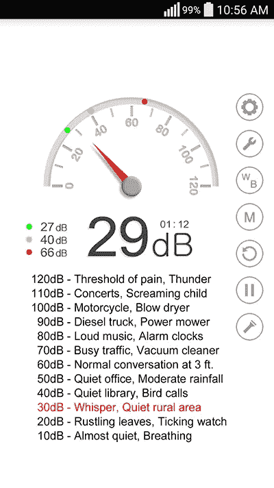

# 听力损失:趁早预防

> 原文：<https://medium.com/hackernoon/hearing-loss-prevent-it-before-its-too-late-4be712da062b>

Widespread earbud use may contribute to hearing loss in loud environments. Photo by [Alex Blăjan](https://unsplash.com/@alexb?utm_source=medium&utm_medium=referral) on [Unsplash](https://unsplash.com?utm_source=medium&utm_medium=referral).

你知道这种声音:你耳朵里挥之不去的高音。对一些人来说，这可能是微弱和暂时的。对另一些人来说，它会使人虚弱，而且是永久性的。

由于日益嘈杂的环境和个人音频设备的广泛使用，噪音导致的听力损失正在成为一个巨大的公共健康问题。世界卫生组织估计，12-35 岁的人群中有近 50%暴露在不安全的噪音中。

矛盾的是，今天听吵闹的音乐会阻碍你将来享受音乐的能力。但是不管在什么情况下，你都可以使用一些工具来享受音乐和减轻听力损失。

Watch [on YouTube](https://www.youtube.com/watch?v=GzbEAkVIKXA). Subscribe to [my channel](https://www.youtube.com/c/gregyeutter?sub_confirmation=1).

# 为什么我们的耳朵会响

耳鸣只是听力丧失的症状之一。耳鸣及相关疾病有多种原因，但最常见的原因之一是暴露在嘈杂的声音中。

通常情况下，声波会导致我们耳朵里成千上万根细小的毛发振动。当这些毛细胞弯曲时，它们会向大脑发送电信号。

不幸的是，响亮的声音会导致这些毛细胞破裂。当断裂时，大脑认为毛细胞对声音有反应，即使它没有。这就是导致耳鸣的原因。

> 不管有没有耳鸣，你都无法恢复失去的听力。

不幸的是，与人体上的其他毛发不同，这些毛细胞不会再生。一旦它们被打破，它们就永远被打破了。

科学家们正在研究可以再生这些内耳毛细胞的治疗方法，但我们距离广泛应用还有几年时间。

有时耳鸣会减弱或消失。这可能是由于大脑重新映射自己，忽略了死亡的毛细胞。然而，在许多情况下，这种铃声会持续几年或几十年。不管有没有耳鸣，你都无法恢复失去的听力。

# 个人音频设备

Personal audio devices are in widespread use today. Photo by [Remy_Loz](https://unsplash.com/@axellvak?utm_source=medium&utm_medium=referral) on [Unsplash](https://unsplash.com?utm_source=medium&utm_medium=referral).

21 世纪的礼仪要求在公共场所使用耳机作为个人音频设备。如果你购买了一部新的 iPhone，它会附带一套耳塞。你没有理由不遵守公共场合戴耳机的规定。

但是你在特定环境下使用的耳机类型可能会影响你的听力。

iPhone 和许多其他设备附带的耳塞确实只适用于低背景噪音的环境。在噪音较大的环境中，比如飞机和地铁，你必须把你的个人音频调到潜在的不安全水平才能听得清楚。

这是因为大多数耳塞在隔离外界声音进入你的耳朵方面做得很差。

## 入耳式监听系统

谢天谢地，有耳塞的替代品。一个经济有效的解决方案是购买一副隔音耳机，如入耳式监听器(iem)。

In-ear monitor style headphones, such as the [Zero Audio Carbo Tenore](https://amzn.to/2uvIQ62)*, seal the ear from outside sounds.

iem 通常有硅胶头来密封耳朵，防止外界声音进入。把它们想象成可以播放音乐的耳塞。

IEM 式耳机从便宜到非常贵，都有定制的选择。我是零音频吉他的粉丝，这款吉他能以不到 50 美元的价格提供高保真音质。

关于 IEMs 有一点需要注意:你必须确保它们[合适并且正确插入](https://www.youtube.com/watch?v=HrVDcmGcVYg)。您可能需要尝试不同的技巧。如果隔音耳机安装不当，它们几乎不会比普通耳塞有什么好处。

## **主动降噪耳机**

耳塞的另一个安全替代品是一套有源降噪耳机。虽然它们往往价格昂贵，但对于长时间的听力会话来说，耳挂式降噪耳机可能比 IEM 式耳机更舒适。

[Bose](https://amzn.to/2GJmtii) *以他们的主动降噪耳机闻名，但其他厂商已经迎头赶上。与 Bose 相比，我更喜欢索尼的声音签名——我关心音质，但不是训练有素的音响发烧友——我的日常司机是索尼 WH-1000XM2 *。

The [Sony WH-1000XM2](https://amzn.to/2Eclou6)* not only sounds great, but it is also comfortable for extended listening sessions.

这款索尼无线耳机不仅听起来很棒，而且我可以戴上它几个小时——甚至在整个海外飞行期间——而且感觉仍然很舒服。我在走路、乘坐各种交通工具以及在咖啡店工作时都会用到它。噪音消除非常有效，以至于我经常发现自己以最低的音量播放音乐或有声读物。

# 喧闹的地方

Music at concerts is often played at extremely unsafe volume levels. Photo by [Yvette de Wit](https://unsplash.com/@yvettedewit?utm_source=medium&utm_medium=referral) on [Unsplash](https://unsplash.com?utm_source=medium&utm_medium=referral).

但是你并不总是处于适合戴耳机的位置。你可能会发现自己在一个嘈杂的场所与朋友社交，或者因为城市噪音而无法入睡。

谢天谢地，有两种耳塞你应该考虑拥有。第一种类型适用于音频质量非常重要的活动，如音乐会。第二个是尽可能减少声音，比如当你想睡觉的时候。

## 高保真耳塞

[Etymotic Research ER-20XS](https://amzn.to/2uZDkso)* high-fidelity earplugs.

如果你发现自己偶尔处于嘈杂的环境中，拿起一双[Etymotic Research ER-20XS](https://amzn.to/2uZDkso)*。音乐家和音乐会观众喜欢这种耳塞，因为它们可以减少大约 20 分贝的外部声音，而不会对音质产生太大影响。

[这款 ER-20XS 鞋款](https://amzn.to/2uZDkso) *配有 3 种不同尺寸的鞋尖，因此很容易获得完美的合脚感。和 IEMs 一样，你必须[正确插入这些耳塞](https://www.youtube.com/watch?v=HrVDcmGcVYg)，否则它们对保护你的听力没有多大作用。

## 泡沫耳塞

[Hearos 32db Foam Earplugs](https://amzn.to/2H5uAWt)*

Etymotic Research 耳塞非常适合保持音频保真度。但是当你只想屏蔽声音的时候，比如睡觉的时候，它们就不太好用了。此外，对于侧卧者来说，这种同音双音是不舒服的。

对于睡眠的完全隔音，我推荐[hear OS Ultimate Softness 32 dB](https://amzn.to/2H5uAWt)*泡沫耳塞。这些一次性耳塞非常舒适，它们会显著降低所有声音。

如果舒适是嘈杂环境的一个问题，你也可以考虑泡沫耳塞。不过注意，音质会比一套高保真耳塞差。

与 IEMs 和高保真耳塞一样，参考[插入指南](https://www.youtube.com/watch?v=8vHP8K3BsrA)来学习如何正确插入泡沫耳塞。

## 分贝计应用程序

[Sound Meter](https://play.google.com/store/apps/details?id=com.gamebasic.decibel&hl=en_US) for Android.

最后，你应该了解听力损伤的阈值，并了解那些声音是什么样的。你可以很容易地为你的手机下载一个声表 app，比如 iOS 的[分贝 X](https://itunes.apple.com/us/app/decibel-x-db-dba-noise-meter/id448155923?mt=8) 和 Android 的[声表](https://play.google.com/store/apps/details?id=com.gamebasic.decibel&hl=en_US)。

请注意，分贝计应用程序不会像专用的计量器那样准确，但它会让你大致了解不同环境的噪音有多大。

# 付诸实践

如果你在嘈杂的环境中，哪怕只有一点点机会，也一定要带上耳塞。它们非常小巧，几乎没有重量，所以很容易放在包里或夹克里。

每当你去一个不熟悉的地方，比如酒店，带上泡沫耳塞。你永远不知道在试图入睡的时候会经历什么样的声音。

如果你需要在嘈杂的地方听个人音频设备，你应该使用降噪或隔音耳机。如果这些你都没有，那大概还是避免听音乐比较好。

只需几个工具，你就可以在许多情况下保护你的听力。

**感谢阅读。如果你喜欢这篇文章，请点击上面的拍手按钮，并与你的朋友分享。我也鼓励你订阅我的 YouTube 频道，获取更多的数字健康内容。**

*我可能会从点击代销商链接后的购买中获得一小笔佣金。