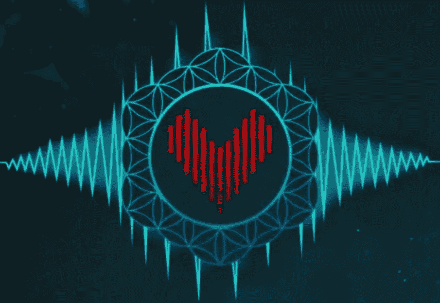
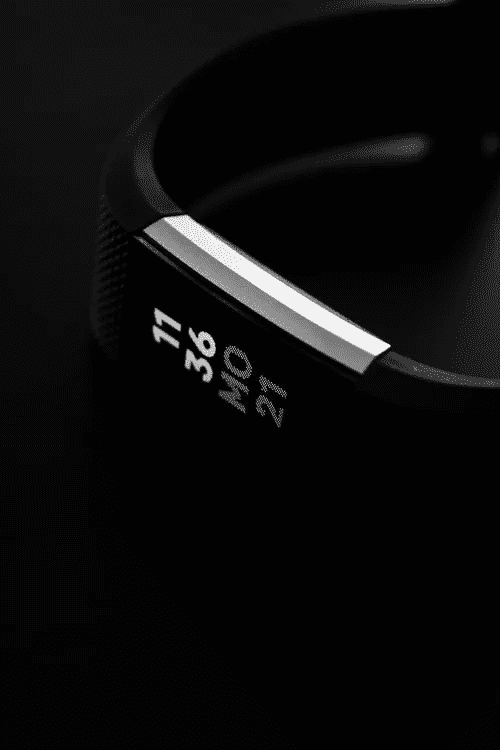
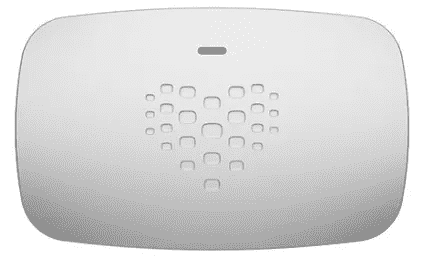
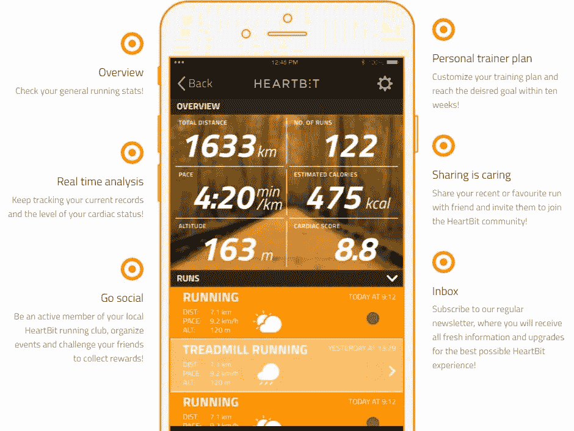
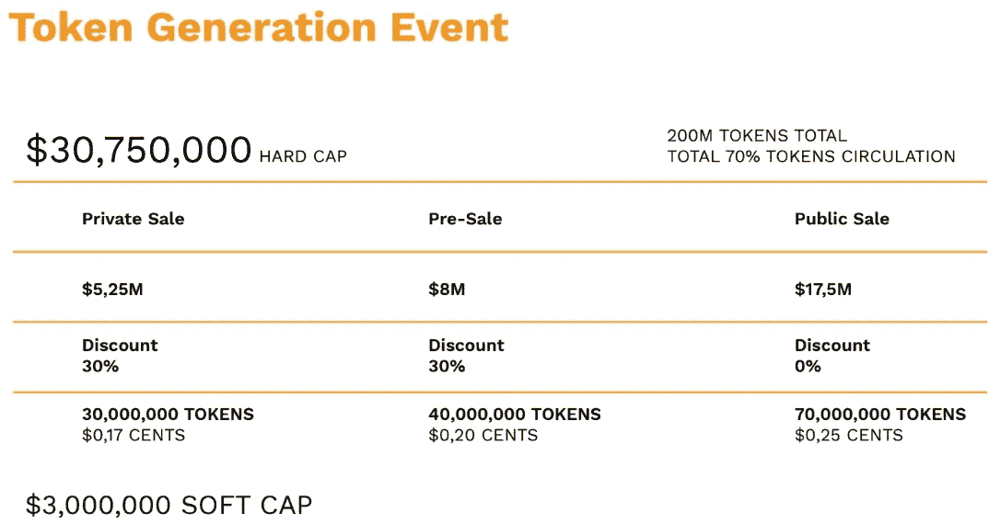

# HeartBit ICO 回顾:We Heart 区块链

> 原文：<https://medium.com/hackernoon/heartbit-ico-review-we-heart-blockchain-7e6a440f43ee>

Your Heart Loves You. You Should Love it Back

“清场！”你永远也不想听到医生在病房里说出这个词。但是如果你在除颤器的接收端，你无论如何也听不到。

哦，更糟糕的是——那时你可能已经在进入天空中的大区块链的路上了。忽视你内心的代价是，嗯，死亡。拜托，谁需要这样的生活呢？

现在，不要让可怕的开场吓到你。我保证会越来越开心。

但有时，我们需要了解事实并从中学习，而不是假装它们不存在。

你最重要的资产之一，当你读到这封信时，那颗在你胸腔里滴答作响的心，值得你去爱和关注。

匈牙利区块链初创公司 [**HeartBit**](https://token.theheartbit.com/) 旨在提供监测和改善全球心脏健康的手段。

该团队计划如何实现这一目标？继续滚动，你就知道了。但这不是比赛，所以别把手指磨破了，好吗？

在我们开始之前，让我们保持同样的节奏:

***免责声明*** *:这不是投资或理财建议。无论如何我都不是金融专家。本文中的大部分信息都是推测性的，仅仅是我个人的观点。在参与任何创业项目之前，一定要进行自己的研究。*

永远记住，你用你的资金做什么是你自己的决定。如果这个决定对你一个人来说太难了，向金融专家寻求指导。

*我可能会也可能不会收到创建此内容的少量令牌分配。也就是说，我会尽我所能保持公正和公平。我尽量避开所有的 FOMO 和 FUD，也绝不希望把这些情绪传染给我的秘密首脑伙伴们。*

现在，我们可以在加快速度前稍微热身一下:

Your AI-equipped, blockchain-boosted, medical data-monitoring, reward-giving training partner

# 嘣，嘣，嘣

人类的心脏——在你潜意识的魅力下不停地跳动——通常被认为是理所当然的。

既然看不到，那就干脆忘了吧。如果你是那种在任何情况下都尽量少走路的人，你可能会感觉不到自己的心跳。

> 心脏的不可见性暴露了它可怕的重要性。

与我们身体中的其他器官不同，心脏是我们可以积极加强的器官。心血管健康是你身体能量的基础。

你的心脏越强壮，血管中流动的携氧血液就越多。血液中的氧气越多，你的能量就越多。

关键是，为了你的短期和长期健康，照顾好你的心脏。

现在，HeartBit 项目给 DIY 医疗保健行业带来了一些独特的、发自内心的新东西。该平台比今天基于手腕的解决方案有很多优势。

让我们再深入一点。首先，我们来看看现在有什么可用的。然后我们将探索一项新的，即将到来的技术。…

How fit is your bit?

# 当前产品

今天的 FitBits 和 Garmins 是神奇的科技产品。

嵌在手表表面下方的传感器可以监测你的心率，并可以将你的数据通过蓝牙传输到 iPhone 等辅助设备上。

在这个设备上有一个应用程序——就像安德玛的 MapMyRun——可以跟踪你的心跳并处理结果。

当你停下来思考人类通过 ***通过稀薄的空气*** 发送数据可以完成什么时，是只有我还是你完全被震惊了？

但是我跑题了。

智能手表并不是唯一的游戏。有多种方法可以监控你的生物钟…

**你可以把心率监测器绑在胸前**。但是它们在运动中容易滑动并且很难重新定位。

你可以将手指插入脉搏血氧仪。这些仪器可以测量你血液中的氧饱和度，还可以测量你的脉搏。但只是在短时间内，而不是在你运动的时候。

你可以把心率监测器插在耳朵里。想学一个大词？光电容积描记图(PPG)是用一盏小灯照在你的皮肤上，根据血管反射的光来测量血流量。

一些跑步者使用这种方法，但是不出所料，这种方法在市场上并不流行。耳塞意味着不同类型的节拍。

所有这些产品类型都迎合个人口味。但不管它们如何追踪，所有这些设备都只是在记录你的基本心率。

这是一件好事，不要误解我，但今天的技术可以做得比这好得多。

如果你的年龄足够大，还记得倒带和快进磁带，然后跳到 CD 的耗时麻烦，那么你会欣赏 HeartBit 的硬件设备为健身和医疗行业带来的 quantum leap。

# 把自己变成区块链甲骨文

我听到你，在几个街区前，心里在想，“我们离区块链理工还有多远，天哪？”好吧，好吧，我们终于准备好品尝了。

如果你不熟悉区块链神谕的概念，让我来解释一下。区块链无法访问他们网络之外的数据。没有这些数据，智能合约除了休眠之外什么也做不了。

当外部条件得到满足时——例如，支付完成、价格波动或最新足球比赛的获胜者——甲骨文将结果发送给区块链，后者随后触发智能合同的执行。

那么，如何成为一名物理先知呢？通过佩戴 HeartBit 的健身设备。

你到底是怎么使用这个小工具的？很好的问题…

# HeartBit 项目的核心

还记得我告诉过你 HeartBit 是如何在心脏保健行业向 FFWD 施压的吗？该团队通过结合硬件和软件来加速技术创新。

> HeartBit 是您心脏的个人移动心电图系统，记录区块链的结果。

你开始看到这里的可能性了吗？你不用去医院脱下你的衬衫，让护士把一堆白色的圆盘连接到机器上，你可以自己做。

如果你愿意，你甚至可以不脱衣服。

Futuristic multi-purpose gadgetry

## 五金器具

心电图(ECG 或 EKG)测试是测量心脏电效率的有效诊断工具。

可视化是对简单心率监测的主要升级。

健康的心脏在跳动时保持特定的节奏。EKG 会显示你心脏跳动时的模式。训练有素的眼睛可以发现有节奏的不规则。

如果你的心脏漏跳了一拍，你实际上可以*看到*它。

EKG 测试也可以帮助诊断心壁厚度的变化。他们也能发现心肌或组织的损伤。

现在我们可以用 HeartBit 设备进行这些测试。这个小工具可以单独使用，也可以夹在项目的训练上衣上，随时随地进行分析。

无论是作为预防措施还是治疗计划的一部分，每天都有这项技术可用，不仅方便，而且极具成本效益。

## 软件

HeartBit 硬件的阴是该项目的移动应用，未来将在 iOS 和 Android 平台上发布。

An athlete’s good friend

追踪您的跑步记录，定制您的养生方案，并与您的锻炼伙伴分享，同时实时全面分析您的心脏。

如果你的胸腔正在接受医生的治疗，你只需点击一下鼠标就可以给医生发送一份心脏报告。

# 区块链类固醇

HeartBit 的硬件和区块链支持的软件的强大鸡尾酒，当完全开发出来时，将成为世界上最复杂的活动跟踪器。

你将能够根据你希望你的心脏如何反应来调整你的锻炼。但是事情远不止如此。

以下是 HeartBit 提高锻炼计划效率的几种方法:

## 极其精确的读数

普通的老式心脏监护仪每秒只能测量 2 个数据点。HeartBit 每秒可以测量 6K 个数据点。

现在，如果你不想做算术，它已经为你做了:HeartBit 测量的数据是类似设备的 3000 倍，令人难以置信。

## AI 向你学习

用 HeartBit 系统训练足够长的时间，它会准确地知道你和你的心脏如何对不同的身体和环境条件做出反应。

由于与 IBM Watson 的战略合作关系，HeartBit 的定制算法将能够告诉你时间、地点和理想的天气，这将有助于你发挥最佳水平。

## 环境知识

集成的环境传感器可以检测高水平的危险气体并发出警报。有些有害污染物是无味无嗅的。你可能穿着它们跑来跑去，深深地吸气，却不自知。

如果你的跑步路线穿过北京或洛杉矶等污染严重的城市的街道，HeartBit 可以告诉你何时最好在室内进行锻炼。

# 令牌化奖励系统

HeartBit 项目的原生 ***实用程序*** ***令牌*** ，HBIT，距离上路还有几个月的时间。但是某些细节现在已经有了:

As of writing, the pre-sale date is TBD

HBIT 令牌在 HeartBit 生态系统中有许多用途。首先，它们将成为应用程序内付费订阅的一种支付方式。

该团队计划继续燃烧从高级会员那里收集的代币，直到总供应量减半。当那一天到来时，只有 1 亿枚代币能够流通。

多方面的、完全透明的——你知道，区块链提供动力的*——奖励和捐赠基金也在筹划中。*

平台用户将通过申领达到里程碑的 HBIT 代币来激励他们达到健身目标。

因此，如果你已经经常锻炼，现在你可以声称 crypto 只是做你的事情。此外，如果你选择与医学研究公司分享你的匿名健康数据，你甚至可以获得更多的代币。

此外，令人同情的是，HBIT 奖励池的接受者将包括那些与生活在缺乏适当医疗基础设施地区的公民分享专业知识的医生。

# 最后的想法…

可穿戴设备市场预计到明年将达到 250 亿美元，而且没有放缓的迹象。我们都知道区块链空间增长有多快。

通过结合这两个行业，HeartBit 团队已经将自己置于一个很好的位置，以声称先发优势。他们即将推出的技术是任何人现在都无法提供的。

该项目还解决了现实世界中许多不同的需求，包括医疗和娱乐方面的需求。

想象一下职业运动队和奥林匹克运动队的经理和教练。配备了 HeartBit 技术，他们可以监控整个队的场上心跳。

通过利用人工智能和机器学习，体育项目可以根据个人情况为运动员定制训练。

想想所有的病人和医疗专业人员，他们将被赋予远程交流的权利。他们将拥有移动的、医院级别的设备来为他们收集数据。

如果你看一下这个项目的团队和顾问，你会看到不仅仅是一些医生和教授。这其中有一些精明的头脑。

Bitcoin.com 大学的首席运营官·马特·托卡伊是一位杰出人士，至少在区块链领域是如此。没有比这更隐秘的了。就我个人而言，我总是喜欢看到一个区块链专家作为核心队友。

这个项目真正吸引人的是它鼓励人们滋养心灵的使命。这么多人因为心脏问题提前离开我们，这是一个可悲的事实。

尽管心脏健康是一件严肃的事情——从身体上和经济上来说——它和区块链理工大学一样，没有得到足够的主流关注。

体育组织可以是紧密结合的团体，有时规模很大。这只需要像 NFL 或 MLS 这样的球队努力实现广泛的采用。

通过提供持续监测和分析你的心脏的方法，你可能能够及早发现问题，在它接近你之前把它留在尘埃中。

或许，如果你能向保险公司证明你的心脏健康，他们会愿意降低你的保费。

但我不知道有哪家保险公司喜欢大幅削减费率——这一点可能需要团队在医疗保健行业内建立伙伴关系。

撇开潜在的保险削减不谈，如果你已经在实践中监测你的心跳，请密切关注 HeartBit 在未来几个月的成就。

这个项目的技术可能正是你所需要的，让你的心脏更好、更强、更慢。

## DYOR

因为我是我的心脏和区块链理工大学的忠实粉丝，我不禁感激 HeartBit 团队想要完成的事情。

但这只是我。进行你自己的分析总是一个好主意。如果出现任何问题，请联系团队。可靠的区块链创业公司对于好奇的查询有很快的周转时间。

方便起见，这里有一些资源供您更好地熟悉项目并与团队交往:

[heart bit 网站 ](https://token.theheartbit.com/)

[**HeartBit 白皮书**](https://drive.google.com/drive/folders/1TtJqy593UTSGUXS7UFETNgrFh1SiXC4e)

## 社交

> [脸书](https://www.facebook.com/Heartbit-177918886251324/)LinkedInMediumReddit
> 
> [电报](https://t.me/heartbit_official)推特 YouTube

## 顺便说一下…

如果你喜欢你在这里看到的，并且需要帮助把你的加密信息传递给大众，我很想听听你的项目。

请随时联系我:blockchainauthor 作者在 Gmail

*BountyOx username = block chain author*