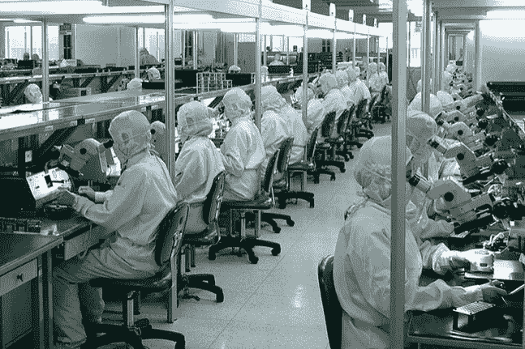

# 感人肺腑:首席执行官和可怜的工厂工人真的真的很关心机器人的权利

> 原文：<https://medium.com/hackernoon/heartwarming-ceo-with-miserable-factory-workers-really-really-cares-about-robot-rights-4fdc57e167c1>

Source: [https://www.flickr.com/photos/jurvetson/52581560/](https://www.flickr.com/photos/jurvetson/52581560/)

在一次科技世界道德会议上，以经常侵犯海外工厂工人权利而闻名的硅谷公司(Silicon Corp .)首席执行官杰克·琼斯(Jack Jones)鼓舞了观众，他大胆地为完全假设的有意识机器人的福祉挺身而出。

琼斯说:“看，现在是我们作为一个社会接受全意识、自主和智能机器人——如果它们曾经存在的话——作为完整的人应该得到严肃的道德和法律考虑的时候了。”琼斯的工人只能靠最低工资勉强度日。他花了一点时间签署了一项决定，将他的员工已经很少的休息时间减少一半，并增加他们的工作时间，然后他向起立鼓掌的人宣布，“未来我们如何对待机器人将是我们人性的真正考验和决定因素。”

哇！在科技行业，没有多少人有足够的勇气来解决我们这个时代真正的道德问题——也没有多少人有足够的关心来考虑那些目前不存在、可能永远不会存在的人的权利。已经有人给这个人颁发诺贝尔和平奖了！