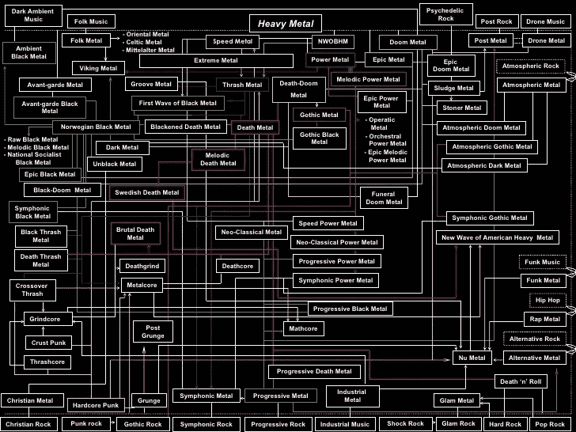

# 软件开发重金属？

> 原文：<https://medium.com/hackernoon/heavy-metal-for-software-development-70732ab3cae6>

我反抗了。多年来。我嘲笑“金属头”(现在也是，不过那是另一个故事了)。我无法忍受骨头嘎吱作响的吉他声和令人呕吐的人声。

但是几年前，发生了一些事情。我内心的某些东西突然爆发，我被改变了，就像索尔兄弟正在去大马士革的路上。

就像扫罗弟兄一样，我不会在这顿悟的时刻停留太久，但我会赶紧告诉大家一个好消息:金属对工作很有用！(通过工作，我只能为自己一个[软件](https://hackernoon.com/tagged/software)工程师的背景作证。)开放式办公室仍然是一件莫名其妙的事情，总有几个傻瓜在听得见的地方闲荡，喋喋不休地谈论他们周末做的无聊的事情。再见了，深度工作。但是，还有希望。你可以插上耳塞，在你最喜欢的[音乐](https://hackernoon.com/tagged/music)播放器上点击播放。这样，你可以控制你想听到的声音，也可以淹没那些你不想听到的声音。

但是你选择什么音乐呢？这显然是你的个性、情绪、倾向等的反映。我们中有多少人偶尔会转向金属？根据我的观察，不多。相对而言，金属仍然只是一种反文化，即使现在生活在阴影中(也许是出于选择)。如果你不知道这个名副其实的声波宇宙，请继续读下去。谁知道呢，你可能会发现一个新的最喜欢的东西。

金属(可以说)诞生于英国中部的工业区，因此整个亚属都是黑暗和暗淡的美学。一些伟大的金属专辑在一件事上做得相当出色:它们向听众传达了一种潜意识的信息，就像一盒情感的磁带。*金属存在的主要原因是情绪*。情绪是我们如此重要的一部分:我们不断地经历情绪，甚至当我们深入工作的时候。

还有*积极的(平和、喜悦、感激、成就感)*和*消极的(愤怒、悲伤、焦虑、沮丧)*情绪，有时都同时在我们的脑海中上演。我(可能很天真)的评估是，大脑需要处理情绪。通过引入听觉代理，你允许你大脑的一部分放纵这些情绪，并在后台处理它们。

因此，金属音乐是一种强有力的工具，可以帮助塑造你的感觉，以及你想要如何感知你的环境。

如果你想从科学中得到答案，那么很遗憾，还没有一个明确的共识。

[所以](https://www.digitalmusicnews.com/2018/02/21/metal-music-good-health-study/)

[很多](https://www.sciencealert.com/here-s-why-heavy-metal-is-good-for-you)

[研究](http://mobile.abc.net.au/news/2015-06-25/study-finds-heavy-metal-reduces-anger-depression/6571820)

…赞成，

和

[所以](http://newsroom.melbourne.edu/news/heavy-metal-music-has-negative-impacts-youth)

[很多](https://nutritionfacts.org/2017/12/07/the-health-effects-of-heavy-metal-music/)

[对阵](https://mic.com/articles/105154/being-a-metal-fan-might-be-very-bad-for-your-health)。

在我看来，击败任何研究的东西，是可以被称为金属的音乐种类的纯粹多样性。看看我在网上找到的一个更好的表达方式。

这张地图只是一种观点。我敢肯定，金属纯粹主义者将能够在那张照片上为缺失的流派打出至少 70 个洞，但这不是重点。

关键是，所有这些都是直接从我(不是你想的那个不太好的词)和几个朋友的经历中推断出来的。可能对你有用，也可能没用。就是这么回事。沉重的、充满情感的音乐是引人注目的:无法逃避强烈观点的形成。我的希望是，你不要仅仅因为有这么多乍看上去令人不快的东西，就把它完全一笔勾销。

两件事。首先，我的音乐偏好几乎每天都在变化，但我确实经常转向金属，因为它有助于深入工作所需的隔离。下面的段落大概说明了我遵循的方法。我故意漏掉了很多伟大的艺术家和专辑，因为这不是“我最喜欢的金属乐队列表”。

第二:有时候拔掉耳塞，关掉音乐应用程序会更好。是啊，很明显，有社会规范，还有职场礼仪，甚至还有简单的常识。我的意思是，你想看看当你一起重构一些代码的时候，你的同事脸上的表情吗？我猜不会。所以有了这个免责声明，我会假设你是一个负责任的成年人，继续我想说的。

再说一次，这些仅仅是建议，非常主观，来自我的经验，但是你也许可以制定出你自己的系统。或者你已经有了自己的系统，在这种情况下，我很想听听。这是清单。插上耳塞，加入旅行吧！

## 需求分析:黑色/金属柱

对我来说，这些是最令人回味和审美愉悦的类型。忧郁但令人愉快的背景，几乎是吉他的织物，加上空间感强的快速鼓，有助于创造一种有利于分类的氛围。在这个阶段，你主要是把需求分类到不同的篮子里，或者故事，甚至史诗。你正在头脑中形成想法，未来挑战的味道已经让你的创造力源源不断。你需要慢慢来。

为了陪伴你进入这个新生的时代，这里有两个例子，首先是艾法拉的[法尔的专辑*Elil*。这是根据《T4》一书改编的三部曲专辑中的第一部。是的，关于兔子的野蛮金属音乐。总行程。](https://www.metal-archives.com/board/viewtopic.php?f=2&t=44613)

接下来，一个非常不同的声音。毫无疑问，灵感来自《指环王》、Rauros 乐队[Falls](https://fallsofrauros.bandcamp.com/)和他们的专辑*The Light in The dwelling in 朽木*。如果你是金属音乐的新手，将温柔与这种音乐联系起来可能会很奇怪，但只要看看标题，告诉我这不会引起惊奇的感觉:“地球古老的羞怯的优雅”，“鸬鹚在岩石上颤抖”。

另见:[王座中的狼](https://wolvesinthethroneroom.bandcamp.com/)，[星辰森林](https://a-forest-of-stars.bandcamp.com/)，[光明使者](https://lightbearer.bandcamp.com/releases)，[阿加罗](https://agalloch.bandcamp.com/)，[德鲁克](https://drudkh.bandcamp.com/)。

## 设计:渐进金属

在设计阶段，你真的在拉伸那些大脑肌肉。精神体操要求你彻底考虑事情，并找到可能达到最佳结果的最佳途径。无论你是在设计解决方案还是测试，你都想要彻底，你想要发现每一个隐藏的口袋，这些口袋可能隐藏着巨大的未来痛苦，同时也要找到创新的金块，让你的工作变得壮观。

进步金属是一个聪明的流派，有一种(如果我可以这么说的话)数学的感觉。这是令人惊讶的，聪明的，具有挑战性的。对我来说，设计阶段通常没有音乐，但有时，一些音乐会有所帮助。这里有一个恒星的例子，来自伯克利音乐学院，[梦剧场](https://en.wikipedia.org/wiki/Dream_Theater)与他们的专辑*的思路*。

或者，你可能会喜欢上梅舒格。

## 编码:无人机金属

对，所以你现在进入正题了。当你试图把设计写成冷酷的硬代码时，是时候测试你的肌肉记忆为你服务得有多好了。也许你需要一些节奏和安慰。无人驾驶金属不仅如此。我发现缓慢、有节奏、沉重的音乐有助于我集中注意力，这是像编码这样的深度工作所需要的。

例如，[地球](https://en.wikipedia.org/wiki/Earth_(American_band))和他们的专辑*黑暗天使，光明恶魔 I.*

一直这样下去，这才是重点。这只是第一部分的[两部分](https://www.youtube.com/watch?v=Rr1MLceqp8Q&t=472s)专辑。

## 测试:经典

这只是所有标志性事物的占位符(比如:大部分是黑色安息日，还有其他不太重要的不朽)。你正在测试你的代码，看看你是否看到了想要的结果，并确保没有意外。同样，你想要彻底，你想要记录每一个发现，并让它可追溯到以后。但是你希望它吸引人并且有趣。

让 Ozzy 的[黑色安息日](https://en.wikipedia.org/wiki/Black_Sabbath)陪你踏上那段旅程。

另见:[梅加德思](https://en.wikipedia.org/wiki/Megadeth)、[铁娘子](https://en.wikipedia.org/wiki/Iron_Maiden)、[杀戮者](https://en.wikipedia.org/wiki/Slayer)

## 对于调试:斯托纳厄运

我最喜欢做的事情之一是设置一系列断点，然后消失几个小时。无论是我自己的代码还是别人的手工，与*控件*携手同行，导航堆栈，发现每个角落隐藏的宝藏，都是一种美好的体验。

不用说，这是一项繁重的脑力劳动，它可能有助于将世界拒之门外。同样，就像上面的“编码”一样，你可能会喜欢沉重、缓慢和有节奏的东西。

Stoner Doom 是一种非常非常缓慢和沉重的 Doom 金属的子流派，其特点是(相对而言)快节奏和低音沉重的音乐。

比如这个:Bongripper 的一张专辑。

或者是这张由[电音巫师](https://en.wikipedia.org/wiki/Electric_Wizard)制作的专辑。

## 我们积极分子朋友的一句话

这种金属亚文化被父母、老师、宗教领袖和其他老傻瓜嘲笑，被认为会导致年轻人变得暴力或滥交，或者总体上令人不快的不满者。尽管如今嘲笑这样的观点是可以接受的，但还有其他更严重的问题困扰着行星金属。鉴于金属音乐是如此强大的直达主动脉的线路，有许多乐队通过他们的歌词、图像或粉丝群传播激进的种族主义、厌女症和仇恨观点。只要知道这些不可避免的不愉快会在你的流派之旅中突然出现，如果你决定开始一个，并知道*音乐是工具，你是建设者，而不是相反*。

## 总结

这可能是一个未知的新世界，你可能会对上面介绍的多样性感到困惑。下次当你坐下来工作时，如果你的音乐播放器使用相同的默认播放列表，暂停一下，试试这些。有 97.3%的可能性(任意数字，只是表明观点)你会讨厌它，认为我是个疯子。但是如果你是那 2.7%的人当中的一员，实际上喜欢这里的一些东西，我会很高兴知道。我会在圣保罗大教堂为你点燃一支蜡烛。；)