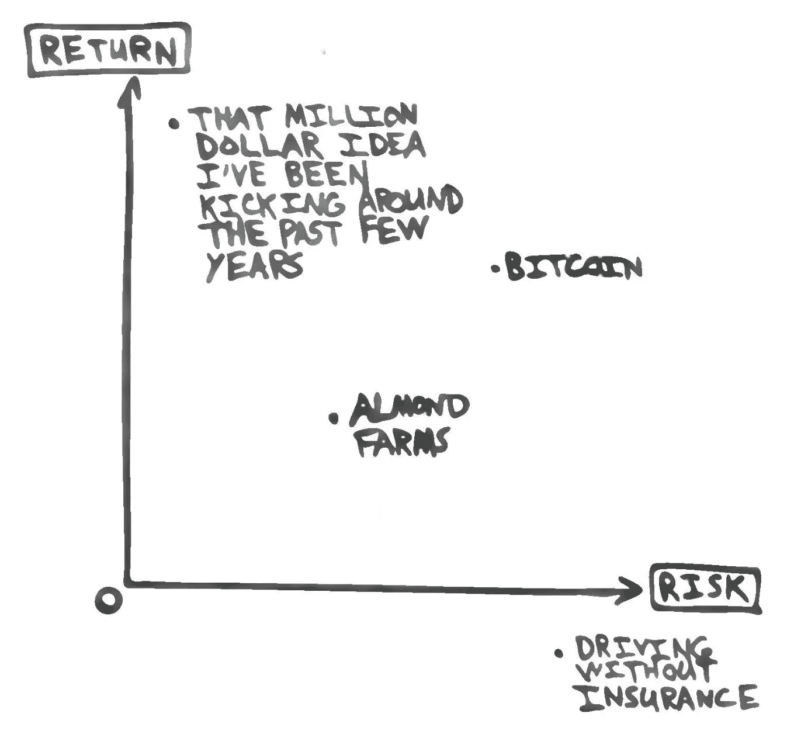

# 对冲乐趣

> 原文：<https://medium.com/hackernoon/hedge-fun-venture-capital-e4f50db9ea09>

This chart was not drawn to scale, nor does it constitute financial advice.

尽管我是一名中等偏上的司机，但我积极购买汽车保险。这确保了在(希望)我遇到车祸的可能性很低的情况下，我将能够(再次希望)指望 USAA 支付费用。支付这笔费用可以防范可能发生的金融灾难。

如果每个在奥斯汀市中心开车的人都同时撞坏了他们的车，会怎么样？除了每个人都低于平均水平的驾驶，USAA 会为此做好准备。他们付钱给一家再保险人，一家为保险供应商提供保险的公司，以防范可能出现的财务负面事件。

如果金融市场崩溃，世界末日来临，该怎么办？特别是纳西姆·尼古拉斯·塔勒布和[马克·斯皮兹纳戈尔](https://www.universa.net/)将他们的职业生涯建立在对冲金融灾难性事件的基础上，这些事件从来没有人们想象的那么“罕见”(很像那些[深色池塘里的鸟](https://www.nytimes.com/2007/04/22/books/chapters/0422-1st-tale.html))。他们购买在大小危机发生时变得有价值的期权，以防范不利的金融事件，尽管是暂时的。假设一个人没有在底部卖掉所有东西，在这种情况下，他们可能是灾难性的。

如果保险和对冲感觉天生悲观，那是因为他们是。它要求一个人定期损失少量的钱，当坏的结果发生时变得有价值。当我开车的时候，我非常高兴，因为我没有遇到车祸，但是保险带来的额外的内心平静是有代价的。

找到悲观的对冲并不困难——我一直在寻找乐观的对冲。那些不仅仅是定期无利可图，价值数倍于其成本，而且只发生在*期望的*结果之后。新兴的[技术](https://hackernoon.com/tagged/technologies)符合这一描述:各种规模的公司都在为[的未来](https://hackernoon.com/tagged/future)而努力，如果不是更积极的话，将会比现在更加先进。找到那些最好的风险投资机会[是极其困难的](https://hackernoon.com/limited-partners-not-limited-opportunity-a06a8d20b8bc)——大多数投资者无法找到，原因是准入限制或者仅仅是他们自己对投资和世界的心态。当然，绝大多数风险投资机会不会爆发，也不会获得数倍于其成本的回报。它们确实是未来的选择。

幂律、凸性、黑天鹅——都指向我们生活在一个不太正常的世界。即使我们接受这一事实，为自己投保坏事和好事也是极其困难的，因为这不仅要花费金钱，还要花费时间。不过，我们需要玩这个游戏，因为正如弗雷德·威尔逊在《不确定性和风险》上写的:

> 风险是与长期回报相关的。不冒险赚钱是很难的。而那些告诉你有低风险/无风险赚钱方式的人，要么是在骗你，要么是在骗自己。

为不好的，好的，极度意外的事情投保？那不冒险。选择不每月支付 USAA，而依靠我周围每个司机的技能？现在*那个*就是。