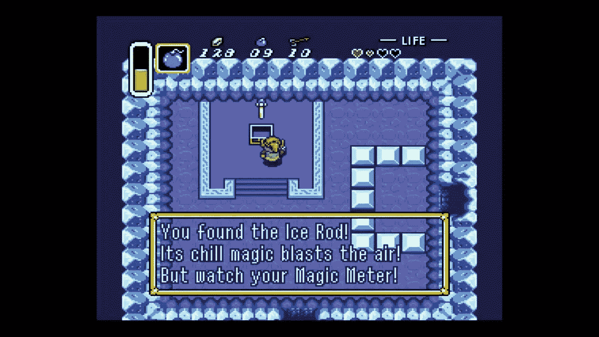

# 防止你的工作遭遇“职业悬崖”

> 原文：<https://medium.com/hackernoon/hedging-your-career-staying-agile-in-a-world-of-career-cliffs-59cda2b9236c>

我假设的职业生涯噩梦很简单:某天早上醒来，没有任何可用的技能带着我度过下一次转变。我把我工作的这种世界末日情景称为“职业悬崖”

在这种未来的失落中，我一无所有。没有合适的工具，没有合适的体验，没有合适的联系。我被困住了，没有工作，没有选择。结果，我不能旋转，我被迫看着世界的其他部分经过，继续成长，学习和进步，而我…没有。

这种偏执深深地伤害了我。作为婴儿潮一代的孩子，我目睹了我周围很多成年人在职业生涯中碰壁，然后陷入困境，就像瀑布中的岩石一样。无论是 2008 年经济衰退的受害者、互联网繁荣(和萧条)的受害者，还是其他一些情况的受害者，他们都面临着棘手的局面。宏观环境是单向流动的——向下流动，而且是全力流动——但并不是每个人都随波逐流。

我的父亲在福特汽车公司的汽车行业度过了 30 年，他只是成千上万像他一样的人的一个轶事——这些人在一个行业度过了 30 或 40 年的职业生涯，却在 2008 年的大衰退中失去了这些工作。

当你失去了 30 年来唯一熟悉的职业，你认为转向新的职业会有多容易？十多年前受此事件影响的数百万美国人发生了什么？他们现在在哪里？谁反弹了？谁没有呢？

总而言之，美国经济在 2008 年失去了 260 万个工作岗位，[这是自二战结束以来最高的年度失业总数。](http://marked the highest yearly job-loss total since 1945, the year in which World War II ended.)

虽然我的家人肯定直接受到了这一损失的影响，但它也以另一种方式打击了我。我在 2009 年大学毕业，当时美国的就业市场是这样的:

Via [https://www.cbpp.org/research/economy/chart-book-the-legacy-of-the-great-recession](https://www.cbpp.org/research/economy/chart-book-the-legacy-of-the-great-recession)

因此，我很早就知道职业不是用来混日子的。如果你不能逆来顺受，你就会被打败。

这可能是为什么我从一开始就立即开始拓展我的新闻学位的部分原因:我不仅仅是一个作家，我会说；我是一个交流者。如果我是一个交流者，那么也许我也可以做销售。如果我能做销售，也许我能做市场营销。如果我能做市场营销，也许有一天我能在风险投资公司工作。谁知道还有什么？

我承担的每一个角色都帮助我获得了一项新的资产或技能。我认为这就像在角色扮演电脑游戏中获得一个新的武器或工具，[就像你在塞尔达](https://www.youtube.com/watch?v=KRuC8yo6Bqw)中获得“冰棍”的那一刻。

In Zelda, the Ice Rod lets you freeze enemies and put out fires. Much like picking up a skill like cold-call selling.

我想，我拥有的工具越多，我就越能防范我一无所有、别无选择的噩梦场景。

到目前为止，我在用不同的方式复述我的故事和推动打开新门的墙壁方面获得了相当多的经验。我喜欢把工作看作是它们的组成部分和你所使用的技能的总和。我喜欢为自己创造多条“选择你自己的冒险”路径，以便在“倒楣事”发生时总是有一个安全的开伞索选项我总是在想我的下一份工作，不管我现在的工作在哪里。

但是我注意到这种想法对很多人来说并不是天生的。看着这个充满选择的世界，选择下一步要做的一件事，这似乎是不可思议的，也不太可能考虑如何突破进入一个你目前没有任何关系的行业。

此外，我也开始注意到我周围越来越多的“职业悬崖”的例子。

还有职业生涯中期的转变*(一个长期呆在家里的母亲如何重返职场？*)，还有一个意想不到的裁员事件*(如果你工作的公司彻底倒闭，你如何继续前进？)，*资源不足的社区存在技能差距*(如果你是第一个上大学的人，你如何获得突破和成功所需的支持？)*，还有技术墙*(如果你的专业领域现在可以由一个更自动化的系统控制，你还能成长为什么？)*，还有移民问题*(如果你刚到一个国家，如果没有签证担保，你如何获得工作和职业发展？)，*还有这么多。

随着今天劳动力市场的流动性如此之大，我认为最大化你的工作选择以对冲你自己的职业生涯比以往任何时候都更重要，就像你可能会为自己建立一个财务风险档案。虽然这对我来说可能是一个非常私人的问题，但我想对你来说有几个选择也不是一个坏主意。

*原载于* [*干擦*](http://bethanycrystal.com/blog/2018/12/28/hedging-your-career-staying-agile-in-a-world-of-career-cliffs/) *。*