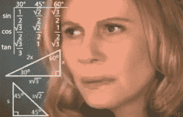
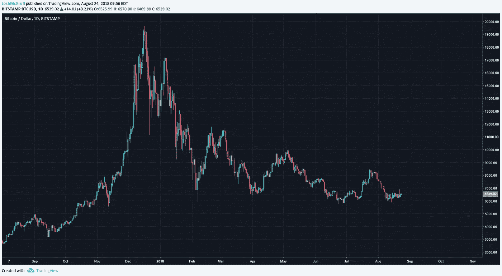
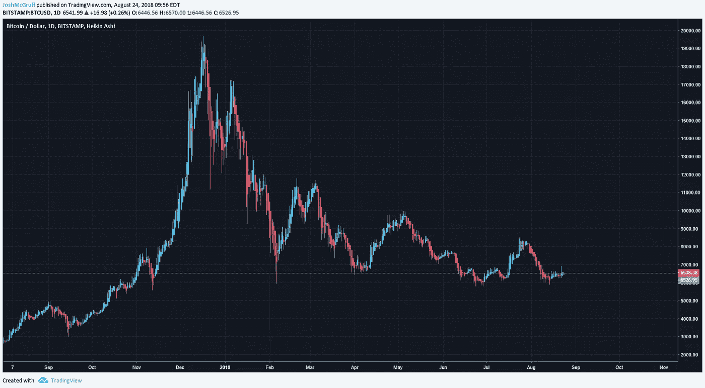
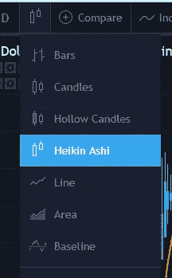
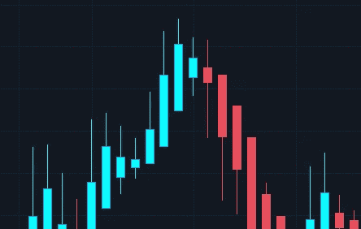
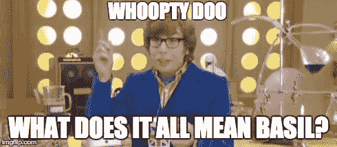
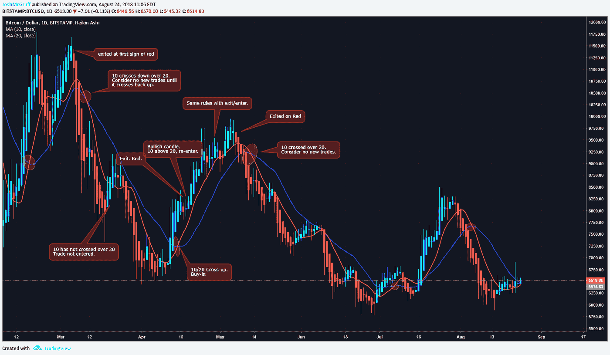

# Heikin-Ashi:趋势是你的朋友

> 原文：<https://medium.com/hackernoon/heikin-ashi-the-trend-is-your-friend-8a5028fcc0c8>

交易者朋友们，你们好！在这篇文章中，我想讨论一下我觉得在加密交易环境中一个非常没有被充分利用的工具。这个工具，如果你从标题上看不出来，就是 *Heikin-Ashi* 蜡烛。

你可能会问自己，“好吧，麦克格拉夫先生，什么是 Heikin-Ashi 蜡烛？”嗯，他们是一个强大的烛台，利用烛台的平均价格来平滑的趋势。如果你想看它的技术公式，可以在 [Investopedia](https://www.investopedia.com/trading/heikin-ashi-better-candlestick/) 上找到。

E=mcTrend

因此，让我们来看看使用传统烛台的图表与使用 Heikin-Ashi 烛台的图表之间的差异。

Normal Candlesticks

Heikin-Ashi Candlesticks

看到了吗？在呈现明显的上涨趋势和下跌趋势方面，Heikin-Ashi 比*平稳得多。就我个人而言，我发现我喜欢用大得多的时间框架来跟踪一个硬币的整体趋势。(1 天或以上)*

要访问这些，在你的交易视图中选择顶部的蜡烛，然后 Heikin-Ashi

“A whooollleee neeew wooorrrrllldddd”

你应该知道的关于 Heikin-Ashi 蜡烛的一些事情是灯芯也显示了一种趋势的力量。

Cool wicks. But not as cool as John Wick.

下面没有灯芯的看涨蜡烛表示强劲的买入压力，上面没有灯芯的看跌蜡烛表示强劲的卖出压力。两边都有灯芯的蜡烛表示犹豫不决以及牛熊之间的争斗。

还要注意，传统烛台*上使用的大多数烛台图案*不适用于 Heikin-Ashi，但 [Dojis](https://www.investopedia.com/terms/d/doji.asp) 和[旋转台面](https://www.investopedia.com/terms/s/spinning-top.asp)适用！传统的 TA 形状，如楔形和三角形，仍然适用。

Well I’ll tell you Austin…

那么你能用这些做什么呢？首先，你可以用一枚硬币更清楚地了解整体趋势。这成为了一个强有力的工具，用来判断是否有一个小的降温，或者整个趋势是否从看涨转为看跌(反之亦然)。

接下来，我想给你们展示一下麦克格拉夫剧本中的一页。

“Happy?” “Yeah, we happy”

让我们以*我不是有执照的财务顾问*开始。这纯粹是我做的事情，如果你决定使用它，你要自担风险。

现在我们已经在 Heikin-Ashi 上了一堂速成课，如果我们在图表上添加一些均线，我们会发现使用简单但强大的趋势交易策略的能力。

我在这里使用的是 1 天时间框架内的 10 天和 20 天移动平均线。

当 10 日穿越 20 日时，我们有看涨蜡烛线，我买入。我将在第一根看跌蜡烛线出现时退出交易。这是一个保守的策略，但它可以拯救你的屁股。回头测试一下你就知道了。

如果蜡烛线再次看涨，*10 仍然在 20* 上方，我将重新进入交易。如果 10 毫安穿过 20，我不会考虑另一个交易，直到 10 再次穿过。

一下子就这么多了。这里有一张[的漂亮图片](https://www.tradingview.com/x/TJO1d6r6/)来帮助强调我的观点，下面是一张检查表。

OoOo Pretty colors!

> *用一个简单的清单再次总结一下*:
> 
> *1)10 毫安是否越过 20 毫安*上方？
> 
> **是的。**输入交易并继续核对清单。
> 
> **号**停止。在它出现之前不要交易。
> 
> *2)有看跌蜡烛出现*？
> 
> 不，等到它来了，让你的赢家跑吧。
> 
> **是的。**退出交易，继续核对清单。
> 
> 10 毫安是否越过了 20 毫安？
> 
> **No.** 重新进入看涨蜡烛的交易，回到步骤 2。
> 
> 是的。交易被认为结束了。在 10 毫安穿过 20 毫安之前，不要重新进入。

编辑:我觉得有点无聊，为此我在 TradingView 上创建了 Pine 脚本！如果你愿意，可以随意把它添加到你的工具带上。回溯测试一切！

[https://www . trading view . com/script/dPtBIwnQ-MC gruff-Heikin-Ashi-MA-Strategy-With-Fill/](https://www.tradingview.com/script/dPtBIwnQ-McGruff-Heikin-Ashi-MA-Strategy-With-Fill/)

这份清单给交易者提供了一套简单的规则，并消除了你交易中的情绪。你遵守规则，不管你“感觉”如何。它更保守，你会晚些进场，早些出场。但是，你在保护你的资本。一点点收获加起来！

另外，因为这是在 1 日图上使用的，你有足够的时间来监控你的交易。你真的只需要每天查看几次图表，并设置一些警报，让你知道是否发生了灾难性的事情。这也可以用来打开多头/空头和其他时间框架。我看到其他人也更喜欢均线或均线，而不是普通的均线。它们将提供不同的进/出信号。

对此我只能说，回溯测试一切！在使用你的资金之前，你应该用历史数据和交易记录来测试你的策略。如果你决定使用这个策略，我当然会推荐同样的方法。

Little gains add up! Protect your capital!

我希望你能从中学到一些关于 [Heikin-Ashi](https://hackernoon.com/tagged/heikin-ashi) 蜡烛的东西，也许是一个新的测试策略。作为一名趋势交易者，我发现 Heikin-Ashi 是我腰带上最常用的[工具之一。](https://hackernoon.com/tagged/tools)

如果您愿意，可以在以下平台上关注我:

**推特:**[@ JoshMcGruff](https://twitter.com/JoshMcGruff)
**insta gram:**[@ JoshMcGruff](https://www.instagram.com/joshmcgruff/?hl=en)
**trading view:**[https://www.tradingview.com/u/JoshMcGruff/](https://www.tradingview.com/u/JoshMcGruff/)

喜欢这个故事吗？学点东西？请我喝杯啤酒表示感谢！CashApp — $JoshMcGruff

最后，来加入我们的免费加密小组[比特币共济会](https://discord.gg/5KpVGhE)吧，我帮助创建了这个小组，让我知道这是否对你有帮助，或者你是否讨厌它！

