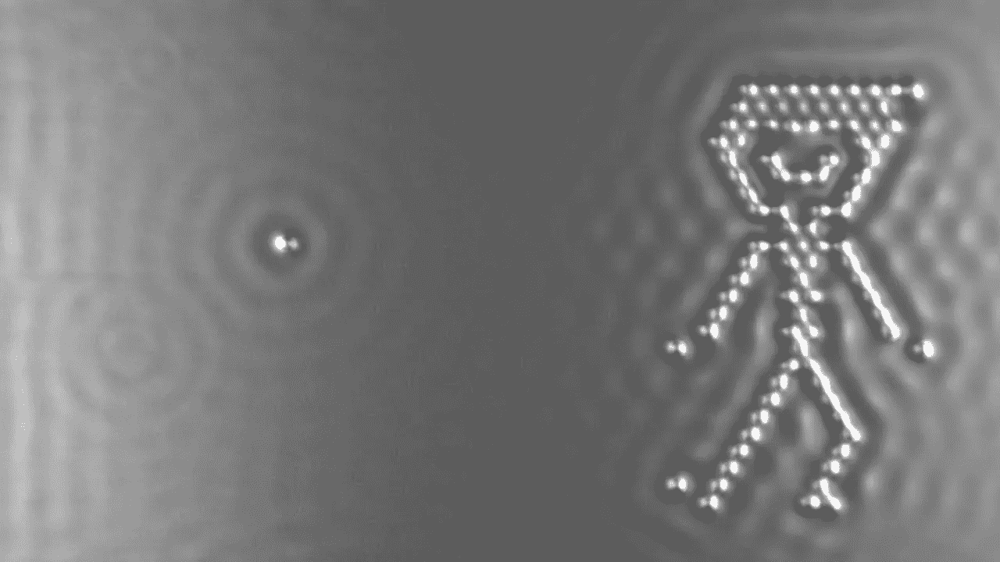
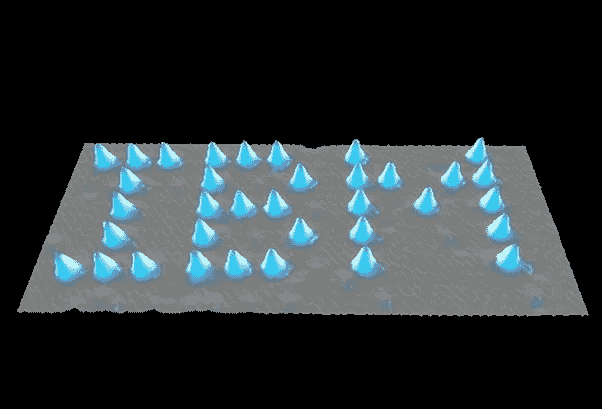
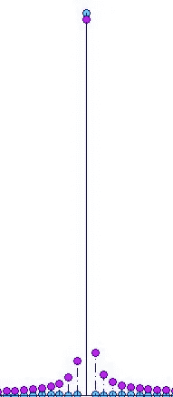

# 海森堡的测不准原理并不意味着你有心灵遥感

> 原文：<https://medium.com/hackernoon/heisenbergs-uncertainty-principle-doesn-t-mean-you-have-telekinesis-7868eb9bfc83>

IBM’s *A Boy and His Atom*

最近偶然看到一本书，叫 [*打破做自己的习惯*](https://www.amazon.com/Breaking-Habit-Being-Yourself-Create/dp/1401938094) ，作者是 Joe Dispenza 博士。看了几章后，我不得不放弃这本书。这本书的整个基础似乎是基于对海森堡测不准原理和观察者效应的误解。在这里，我肯定是很挑剔的，而且很可能是这样的情况，Dispenza 博士有关于如何打破习惯的可靠建议；是我自己的自我阻止了我继续读下去，不一定是 Dispenza。

但我还是想在这里澄清一下，解释一下我们应该如何解读海森堡的测不准原理。德彭扎博士在书的开头解释了他认为的[观察者效应](https://en.wikipedia.org/wiki/Observer_effect_(physics))是什么。从理论上讲，一个电子可能同时出现在每个地方，但是一旦被观察到，我们观察电子的行为就确定了它的位置。正因为如此，Dispenza 似乎认为意识有能力影响我们所看到的客观世界。基本上来说，思想超过了物质。然后他继续用这个作为激励策略。"*你有改变世界的力量！"*

不你不知道。至少不是那样。

物理学家使用这个术语，观察者效应，来描述人类*必须看到*他们正在做的实验的问题，可见光可以影响这些实验。光本身与电子相互作用，所以用光照射电子希望测量它实际上会通过改变它的动量来干扰它。并不是观察的行为改变了粒子的环境，而是为了让我们能够看到，必须存在的其他变量。

海森堡的测不准原理是一条自然法则，它似乎阻止我们测量一个波粒的确切位置，同时计算它的动量。几千年来，西方科学一直认为微观世界是由小球组成的，我们大多数人都是以同样的方式想象它们的。然而，当我们看得更近时，我们越来越开始意识到，对于我们周围事物的基本性质，东方世界有一个更好的理论。这个世界似乎并不是由围绕着其他小球旋转的小球组成。它似乎表现得更像时空中的振动。

How particles are better imagined

科学中的许多困惑来自于词汇的缺失，主要是因为我们仍然在寻找这些词汇的最佳定义。所以当有人用*粒子*这个词的时候，不要想到一个小球的*玩意儿；*这现在是一个过时的词，暗示了太多的固体结构属性。

Wave at single point in time

在最基本的意义上，你可以把不确定性现象想象成试图把果冻钉在墙上。当我们试图测量声波的位置时，也会出现类似的问题。告诉我，*声波到底在哪里？甚至有可能定位波的位置吗？从某种意义上来说，是的，我们可以通过把这个波动分割成更小的子波动来估计那个波的最大峰值，直到我们得到单个时间点的最大峰值。但是现在我们遇到了另一个问题。因为我们已经把这个波切割成最小的波动，所以我们无法再测量它的频率。记住，一个波的频率是给定时间内波峰或波谷的数量；因为我们已经把波压缩到一个时间点，它实际上没有频率。**这就像声波的位置/频率不确定性原理。***

这里我们还没有完全破解海森堡原理的解释；量子世界更加神秘。但是这两种不确定性描述了我们能够从量子系统中提取多少信息。这是我遇到的关于这个主题的最好的视频。谢谢 PBS 时空。

海森堡的测不准原理基本上是说，我们永远不可能既知道一个波粒的位置，又知道它的动量。这里有一个由 Veritasium 制作的[视频，展示了这一原理的实际应用。他演示了单缝实验，其中一束激光指向一条缝。当你开始缩小狭缝时，奇怪的事情开始发生:激光在狭缝的另一侧开始变宽。他对世界为何如此的解释相当缺乏。](https://www.youtube.com/watch?v=a8FTr2qMutA&t=178s)

> “在某一点上，你来到这个极限，所以如果你缩小这个[狭缝；让位置更精确】再往前，你就要打破这种不确定关系了。所以需要发生的是动量的不确定性需要上升…以确保我们不违反海森堡的不确定性原理。”

我确信他在所有其他方面都是一个非常聪明的家伙，(事实上我知道是这样；我发现自己经常看他的视频)，但像这样的解释只会混淆视听。与其含沙射影地说数学本身影响了粒子的行为，不如简单地说，*我们不知道这到底为什么会发生，但它正在发生。*

谈到量子物理学的*为什么*，我们知道的不多。我们还在研究*什么*部分。有时候，物理学家不愿意承认这一点，他们可能会试图用诸如“2+2 可以等于 5”这样的话来为自己的无知开脱 基本上是在暗示我们在处理量子物理的时候要忽略逻辑。这真的是完美的逃避；一旦我们发现非常难以解释的东西，我们就简单地断定它根本无法解释。随着时间的推移，人们总是会发现他们认为是悖论的东西(例如，人们不会从地球上掉下来的圆)，随着时间的推移，这些悖论总是会通过逻辑被揭穿。同样的事情最终也会发生在量子物理学上。仅仅因为我们目前无法解释它，并不意味着我们最终发现了一个无法解释的悖论；这只是意味着我们有更多的工作要做。

但我们可以肯定的是，我们没有心灵遥感。