# “你好”，来自移动端:说话人识别中的 TensorFlow Lite

> 原文：<https://medium.com/hackernoon/hello-from-the-mobile-side-tensorflow-lite-in-speaker-recognition-7519b18c2646>

*阿里巴巴技术团队探索了一种新的移动语音识别方法，解决了该领域的主要挑战*

声音生物识别，或声纹，已经被银行用来验证客户身份，如[巴克莱](https://www.telegraph.co.uk/technology/news/10044493/Say-goodbye-to-the-pin-voice-recognition-takes-over-at-Barclays-Wealth.html)和[汇丰](https://www.theguardian.com/business/2016/feb/19/hsbc-rolls-out-voice-touch-id-security-bank-customers)。随着技术的改进，它可能会在银行和安全领域得到进一步的应用。说话人识别也可以在监视犯罪调查中找到应用。

尽管该技术有这些潜力，但在该领域仍有许多挑战需要克服。目前大多数说话人识别发生在服务器端。阿里巴巴科技团队提出了一个在客户端使用 TensorFlow Lite 的解决方案，通过机器学习和其他优化措施来解决当前模型的许多常见问题。

**服务器端模型的问题:**

由于目前大多数说话人识别都是在服务器端进行的，因此以下问题非常普遍:

网络连接性差

延长的延迟

用户体验差

过度扩展的服务器资源

**阿里巴巴的客户端替代:**

为了解决这些问题，阿里巴巴科技团队决定在客户端实现说话人识别，并使用机器学习来优化说话人识别。

这种解决方案本身也存在一定的挑战。在客户端实现说话人识别非常耗时，为了弥补这一点，需要进行多种优化。阿里巴巴技术团队设计了一些方法来:

通过机器学习优化结果

加速计算

减少耗时的操作

减少预处理时间

过滤掉不重要的音频样本

删除不必要的计算操作

阿里巴巴科技团队提出的方法构成了一套解决方案，有助于解决说话人识别技术面临的挑战。

# 定义说话人识别

## 情节

语音识别可以有效地应用于许多场景，包括:

1) **媒体质量分析:**识别人声、通话中的静音、背景噪音。

2) **说话人识别:**为手机语音解锁、远程语音识别等验证语音。

3) **情绪识别:**识别说话人的情绪和情绪状态。当与一个人的声纹、正在说的内容、情绪识别相结合时，可以增加安全性并防止声纹伪造和模仿。

4) **性别识别**:区分说话人是男是女。这是另一个有助于确认说话者身份的工具。

## 过程

训练和预测是说话人识别的两个主要阶段。训练阶段用旧数据建立计算模型，预测阶段用模型给出当前数据的参考结果..

培训可以进一步分为三个步骤:

1)用梅尔频率倒谱算法提取音频特征。

2)将人类声音标记为正面，将非人类样本标记为负面。用这些样本训练神经网络模型。

3)使用最终训练结果来创建移动预测模型。

简而言之，训练流程就是特征提取、模型训练和移动模型移植。对于预测，流程是提取语音特征，用该特征运行移动模型，得到最终的预测结果。

# 人工智能框架

TensorFlow Lite 的推出是在 2017 年 11 月的谷歌 I/O 年度开发者大会上宣布的。TensorFlow Lite 是一款面向移动和嵌入式设备的轻量级解决方案，支持在多种平台上运行，从机架式服务器到小型物联网设备。

随着机器学习模型的广泛使用，出现了在移动和嵌入式设备上部署 TensorFlow Lite 的需求。幸运的是，TensorFlow Lite 允许机器学习模型在低延迟推理的设备上运行。

Tensorflow Lite 是谷歌的一个 AI 学习系统。它的名字来源于它的工作原理。张量意味着 N 维数组，流意味着基于数据流图的计算。TensorFlow 是指张量从数据流图的一端流向另一端的计算过程。TensorFlow 是一个将复杂的数据结构传输到 AI 神经网络进行分析和处理的系统。

下图显示了 TensorFlow Lite 数据结构:

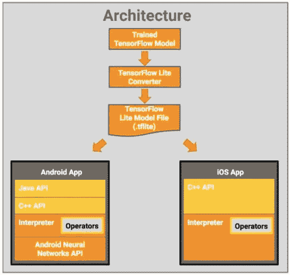

TensorFlow Lite architecture diagram

# 梅尔频率倒谱算法

## 算法介绍

对于这个解决方案，阿里巴巴技术团队使用了梅尔频率倒谱算法。该算法用于说话人识别。使用该算法包含以下步骤:

1)输入声音文件并将其解析为原始声音数据(时域信号)。

2)通过短时傅立叶变换、加窗和分帧将时域信号转换为频域信号。

3)通过梅尔频谱变换，将频率变成人类可以感知的线性关系。

4)通过 Mel 倒谱分析，采用 DCT 变换分离 DC 分量和正弦分量。

5)提取声谱特征向量，转换成图像。

开窗和成帧的目的是确保语音在时域中的短期平稳特性。梅尔频谱变换用于将人类听觉对频率的感知转换成线性关系。梅尔倒谱分析用于理解傅立叶变换，通过傅立叶变换，任何信号都可以分解为一个 DC 分量和多个正弦信号的和。

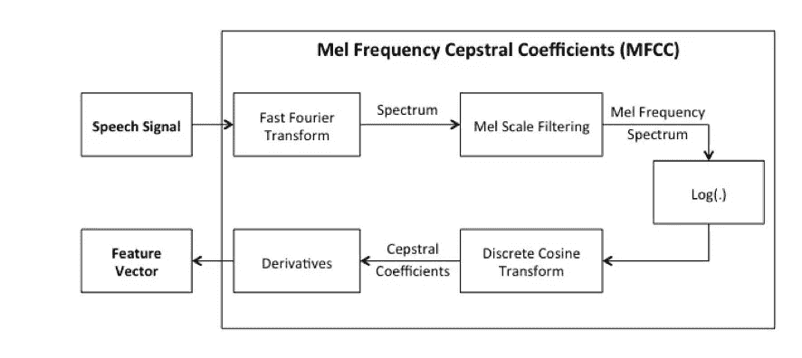

The Mel-frequency cepstrum algorithm implementation process

## 短时傅立叶变换

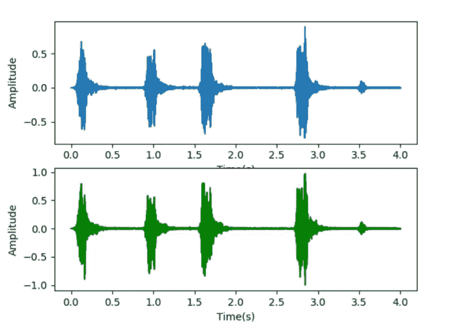

Time domain sound signals

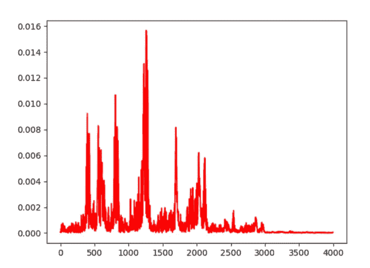

Frequency domain sound signals

声音信号是一维时域信号。很难找到频率如何变化的规律。如果我们通过傅立叶变换将声音信号转换到频域，就会显示出信号的频率分布。但同时它的时域信息会缺失，无法看到频率分布随时间的变化。为了解决这个问题，出现了许多联合时频分析方法。短时傅立叶变换、小波和维格纳分布都是常用的方法。

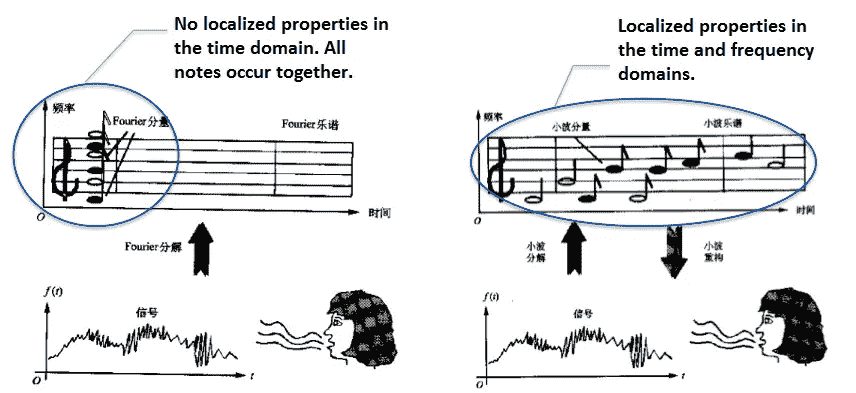

FFT transform and STFT transform

信号频谱可以通过傅立叶变换获得，并且可以被广泛地利用。例如，信号压缩和噪声降低都可以基于频谱。然而，傅立叶变换建立在信号是稳定的假设上，也就是说，信号的统计特性不随时间变化。然而，声音信号不是静止的。在很长一段时间内，有许多信号会出现，然后立即消失。如果所有的信号都经过傅立叶变换，声音随时间的变化就无法准确反映。

本文使用的短时傅里叶变换(STFT)是经典的联合时频分析方法。短时傅立叶变换(STFT)是一种与傅立叶变换(FT)相关联的数学变换，用于确定时变信号的局部区域中正弦波的频率和相位。

短时傅立叶变换(STFT)的概念是首先选择具有时频局部化的窗函数，然后假设分析窗函数 h (t)在短时间内是平稳的，这确保 f (t) h (t)在不同的有限时间宽度内是平稳信号。最后计算各个时刻的功率谱。STFT 使用固定窗函数，最常用的包括汉宁窗、汉明窗和布莱克曼-哈里斯窗。汉明窗是一种广义余弦窗，在本文的解决方案中使用。海明窗可以有效地反映某一时刻能量与时间的衰减关系。

本文中的 STFT 公式采用原始的傅里叶变换公式，

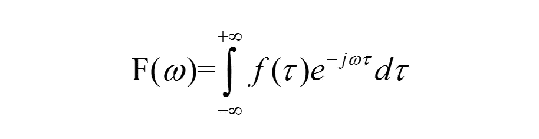

并向其添加窗口函数，创建以下更新的 STFT 公式:

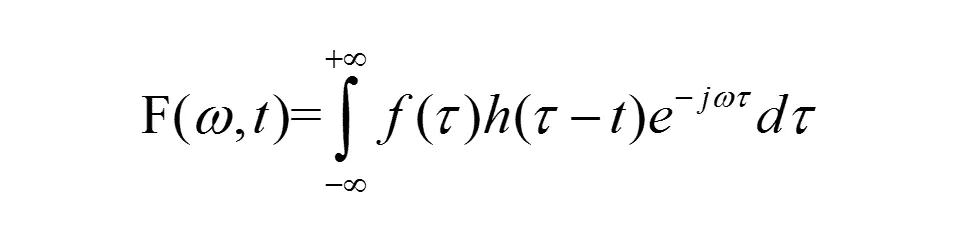

下面是一个汉明窗函数:

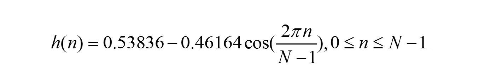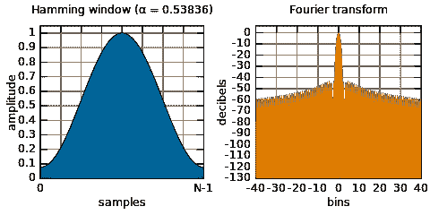

STFT transform based on the Hamming window

# 梅尔光谱

光谱图通常是大地图的形式。为了将声音特征转换成合适的大小，通常需要通过 Mel 尺度滤波器组将其转换成 Mel 谱。

## 梅尔标度

梅尔量表是由史蒂文斯、沃尔克曼和纽曼在 1937 年命名的。众所周知，频率的单位是赫兹(Hz ),人类听觉的频率范围是 20–20000Hz。

但是人类的听觉并不以线性方式与诸如 Hz 的标度单位相关。例如，如果我们已经适应了 1000 赫兹的音调，那么当音调频率增加到 2000 赫兹时，我们的耳朵只能感知到频率可能增加了一点，而我们永远不会意识到频率增加了一倍。将普通频率标度转换为 Mel 频率标度的映射如下:

上面的公式改变了频率，使其与人的听觉感知成线性关系。也就是说，如果一个梅尔标度频率是另一个梅尔标度频率的两倍，人耳可以感知到一个频率大致是另一个的两倍。

由于 Hz 与 Mel 频率之间存在对数关系，如果频率较低，Mel-frequency 会随 Hz 快速变化；如果频率很高，Mel 频率将缓慢变化。这说明人的耳朵对低频声音比较敏感，对高频声音反应较弱。该规则构成了 Mel 比例滤波器组的重要基础。

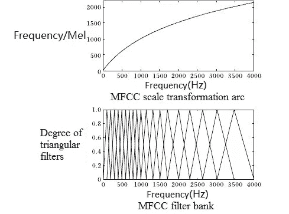

Frequency transforms to Mel frequency

下图显示了构成过滤器组的 12 个三角形过滤器。该滤波器组在低频区具有密集滤波器和高阈值，在高频区具有稀疏滤波器和低阈值。这与人耳对较高频率的声音反应较弱的事实相符。上图所示的具有相同库面积的 Mel 滤波器库是一种滤波器，广泛应用于语音和说话人识别等领域。

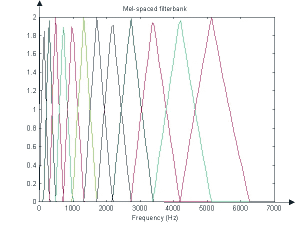

Mel filter bank

## 梅尔频率倒谱

对梅尔对数谱应用 DCT 变换以分离 DC 信号和正弦信号的分量的结果是梅尔频率倒谱(MFC)。

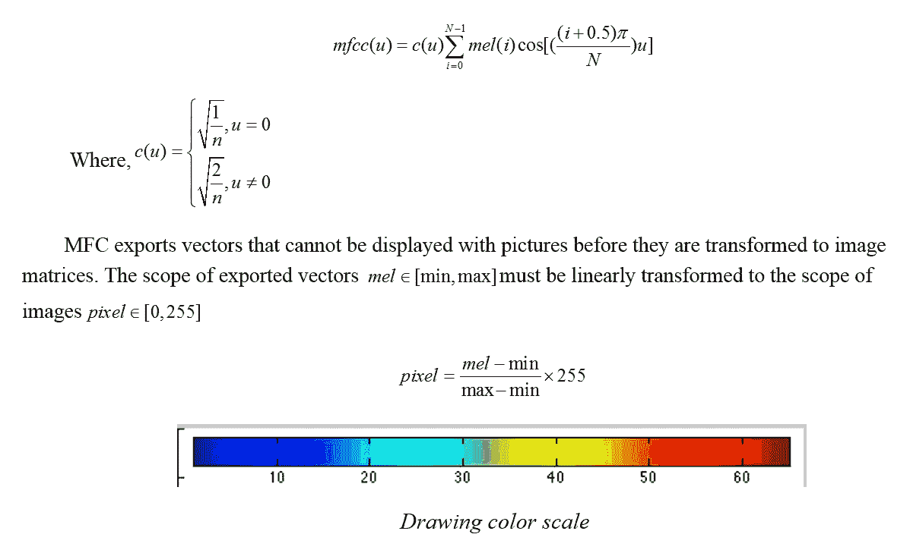

## 优化算法处理速度

由于该算法是为在客户端使用而设计的，因此需要快速处理。可以采取以下步骤来优化算法处理速度。

1) **指令集加速:**算法特点是矩阵加法和矩阵乘法运算多。ARM 指令集的引入是为了加速运算。它可以将速度提高 4-8 倍。

2) **算法加速:**

> a)选择人声频率范围(20HZ~20KHZ)，滤除非人声频率范围以外的输入，减少冗余计算。
> 
> b)降低音频采样率以减少不必要的数据计算。这是可能的，因为人耳对过高的采样率不敏感。
> 
> c)合理切割窗口和截面，避免计算量过大。
> 
> d)检测无声部分，以便可以删除不必要的部分。

3) **采样频率加速:**如果无线电采样频率过高，选择下采样，将最高采样频率设置为 32 kHz。

4) **多线程加速:**将音频分成多个片段，由多线程并发处理。线程数量取决于机器容量。默认设置是四个线程。

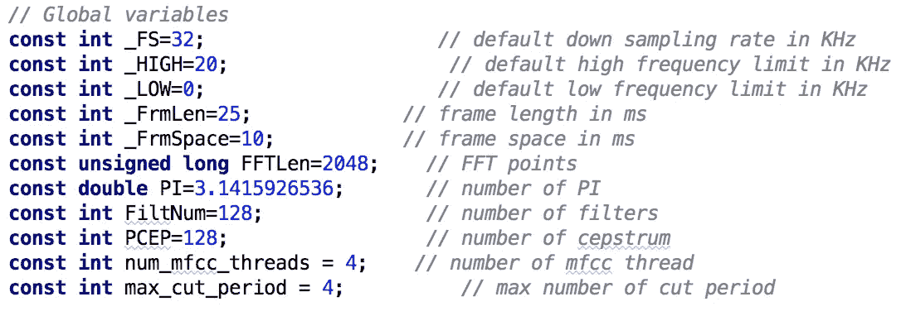

Algorithm parameters selected by the engineering team

# 说话人识别模型

## 型号选择

卷积神经网络(CNN)是一种前馈神经网络。CNN 网络包含人工神经元，可以对其领域中的一些神经元做出反应。这种类型的神经网络非常适合处理大型图像。

20 世纪 60 年代，Hubel 和 Wiesel 在研究猫大脑皮层中帮助局部感知和方向选择的神经元时，发现了可以用来简化反馈神经网络的独特细胞结构。这导致他们提出了 CNN 的概念。细胞神经网络已经成为许多研究领域的热点，特别是在模式分类方面。

CNN 受欢迎的部分原因是它们能够跳过复杂的图像预处理，并允许直接导入原始图像。[第一个类似 CNN 的网络是由 K.Fukushima 在 1980 年提出的新认知网络](https://www.rctn.org/bruno/public/papers/Fukushima1980.pdf)。从那以后，多名研究人员致力于改进 CNN 模型。这些努力中最重要的是亚历山大和泰勒提出的改善认知的工作。这项关于改善认知的研究结合了各种方法的优势，避免了耗时的误差反向传播。

一般来说，CNN 结构由两个基本层组成。其中一层是特征提取层。在这一层中，每个神经元的输入连接到前一层的局部接受域，并提取该局部域的特征。一旦提取，该局部域特征相对于其他特征的位置关系是固定的。

另一个是特征映射层，它们聚集在一起形成网络的每个计算层。每个特征映射层是一个表面，其中所有神经元具有相同的权重。使用具有小影响函数核的函数，例如 sigmoid 和 relu 作为 CNN 的激活函数，特征映射结构保证了特征映射的恒定位移。自由网络参数的数量减少了，因为同一映射表面上的神经元共享相同的权重。在 CNN 中，每个卷积层后面紧跟着一个计算层，用于获得局部平均值和二次提取。这种特定的次要特征提取降低了特征分辨率。

CNN 主要用于识别被修改但没有变形的 2D 图像，例如被放大的图像。由于 CNN 的特征检测层通过训练数据进行隐式学习，因此使用 CNN 可以避免显式特征提取的需要。

CNN 也可以同时学习，因为它在相同的特征映射表面上为神经元赋予相同的权重。这使得 CNN 比神经元相互连接的网络更有优势。局部权重共享使 CNN 在语音识别和图像处理方面具有独特的优势。在布局上，CNN 更接近实际的生物神经网络。权重共享确保网络不太复杂，并且 CNN 不必在特征提取和分类期间处理数据重构的复杂性，因为多维输入向量的图像可以直接输入到网络中。

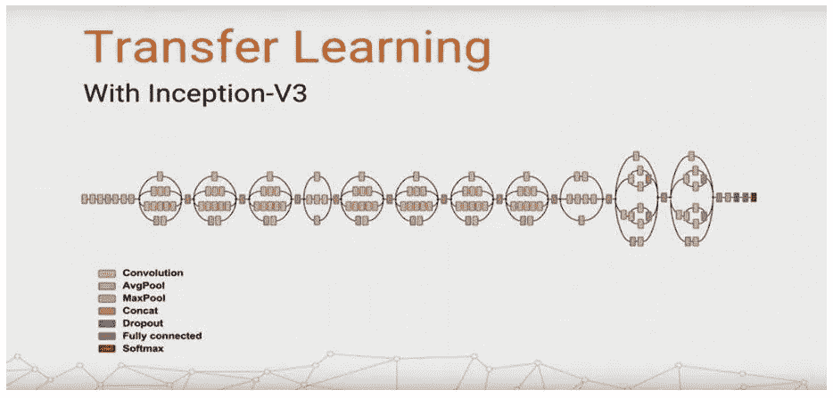

Inception-v3 model

精确的 Inception-v3 模型在本文中被用作说话人识别模型。分解是 v3 模型最重要的改进之一。7x7 CNNs 分解成 2 个一维卷积(1x7，7x1)，3x3 CNNs 也分解成 2 个卷积(1x3，3x1)。这加速了计算，进一步深化了网络，并使其更加非线性。v3 型号网络输入从 224x224 升级到 299x299，并且改进了 35x35/17x17/8x8 模块的设计。

使用 TensorFlow 会话使模块能够在代码层实现训练和预测。TensorFlow 官方网站提供了如何使用 TensorFlow 会话的详细信息。

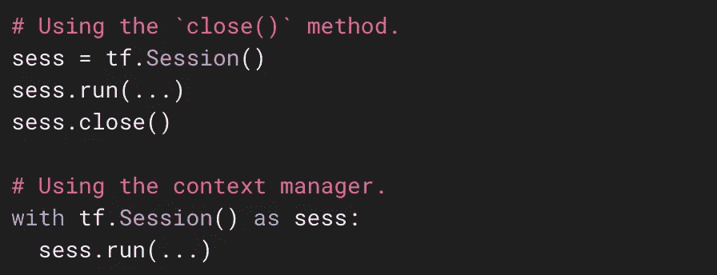

Using a TensorFlow session

## 模型示例

在受监控的机器学习中，样本通常分为三组:

> ***列车设置:*** *此设置用于估算车型。它学习样本数据集，并通过匹配一些参数来建立分类器。它创建了用于训练模型的分类方式。*
> 
> ***验证集:*** *该集用于确定控制模型复杂度的网络结构或控制参数。它调整通过学习获得的模型的分类器参数，例如选择隐藏神经网络中的单元数。验证集还用于确定控制模型复杂性的网络结构或参数，以试图避免模型的过度拟合。*
> 
> ***测试集:*** *该集用于检查最终选定的最优模型的执行情况。主要用于测试训练好的模型的识别能力(比如识别率)。*

在第二章中描述的梅尔频率倒谱算法可以用于获得作为样本文件的说话人识别。人类声谱内的声音作为正样本，动物声音和其他非人类噪声用作负样本。这些样本然后被用于训练 Inception-v3 模型。

本文以 TensorFlow 作为训练框架，以 5000 个人声样本和 5000 个非人声样本作为测试集，以 1000 个样本作为验证集。

## 模特培训

一旦样本准备好了，它们就可以用来训练 Inception-v3 模型。经过训练的模型的收敛可以生成在客户端上可用的 pb 模型。在型号选择中，选择编译 armeabi-v7a 或更高版本，NEON 优化默认开启。换句话说，打开 USE_NEON 的宏可以加速指令集。CNN 中超过一半的运算发生在卷积上，因此指令集优化可以将运算速度提高至少四倍。

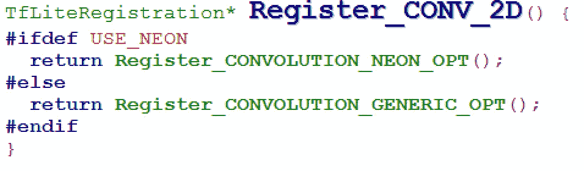

Convolution processing function

TensorFlow 提供的 toco 工具可用于生成 lite 模型，该模型可由客户端上的 TensorFlow Lite 框架直接调用。

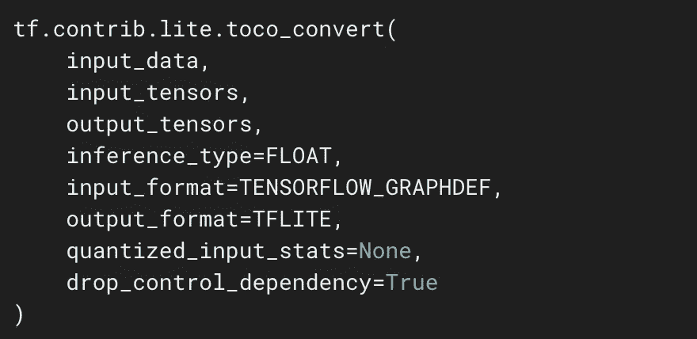

Toco calling interface

## 模型预测法

MFC 可以用来提取人声文件特征，生成预测图像。使用在培训中生成的 lite 预测模型会产生以下结果:

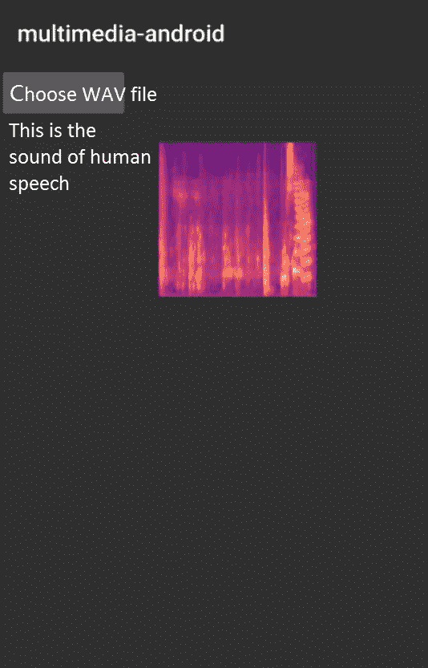

Model prediction result

# 结论

上面提出的方法可以帮助解决当今说话人识别领域中的一些最困难的挑战。在客户端使用 TensorFlow Lite 是一项有用的创新，有助于利用机器学习和学习以及神经网络来推动技术向前发展。

(Original article by Chen Yongxin 陈永新)

# **参考文献:**

[1]https://www.tensorflow.org/mobile/tflite

[2] [基于 MFCC 与 IMFCC 的说话人识别研究](http://kns.cnki.net/kcms/detail/detail.aspx?filename=2009059683.nh&dbcode=CMFD&dbname=CMFD2010&v=)[D]. 刘丽岩. 哈尔滨工程大学 . 2008

[3] [一种基于 MFCC 和 LPCC 的文本相关说话人识别方法](http://kns.cnki.net/kcms/detail/detail.aspx?filename=JSJY200604040&dbcode=CJFQ&dbname=cjfd2006&v=)[J]. 于明,袁玉倩,董浩,王哲. 计算机应用. 2006(04)

[4]噪声环境中的文本相关说话人识别[C].库马尔·帕万，贾汉瓦尔·尼蒂卡，

钱德拉·马赫什。设备与通信国际会议。2011

[5]https://github.com/weedwind/MFCC

[6] [https://baike.baidu.com/item/ARM 指令集/907786?fr=aladdin](https://baike.baidu.com/item/ARM 指令集/907786?fr=aladdin)

[7][https://www.tensorflow.org/api_docs/python/tf/Session](https://www.tensorflow.org/api_docs/python/tf/Session)

# 阿里巴巴科技

第一手、详细、深入的阿里巴巴最新技术信息→脸书: [**【阿里巴巴科技】**](http://www.facebook.com/AlibabaTechnology) 。Twitter:[**【AlibabaTech】**](https://twitter.com/AliTech2017)。