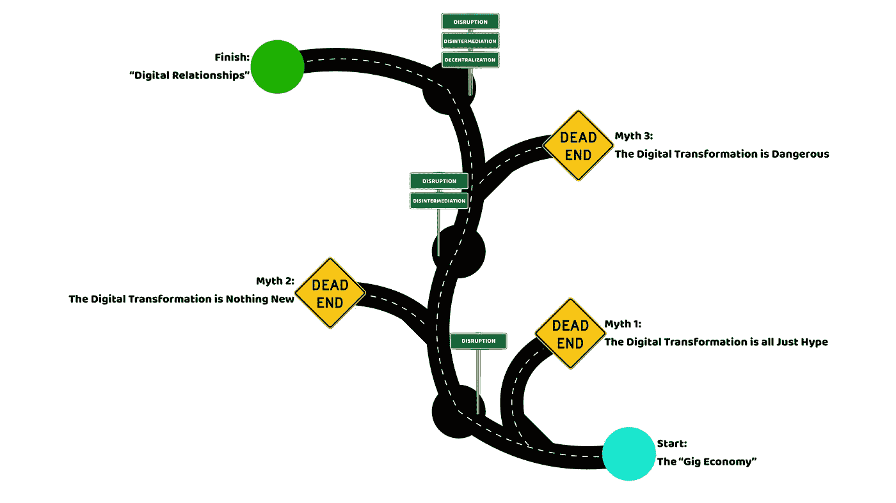

# 你好零工经济！为我们的“数字关系”做好准备

> 原文：<https://medium.com/hackernoon/hello-gig-economy-get-ready-for-our-digital-relationships-b885b3a43fb4>

## ***我的人生教训:“停止说话，开始行动”***

Photo by [Brandon Jacoby](https://unsplash.com/photos/Ab-W3gen18Q?utm_source=unsplash&utm_medium=referral&utm_content=creditCopyText) on [Unsplash](https://unsplash.com/search/photos/new-york-personal-view?utm_source=unsplash&utm_medium=referral&utm_content=creditCopyText)

我很幸运。我有机会在一家“大型电子公司”和一所大学工作。我还参与了其他几项“工作”,帮助政府和国际组织进行数字化转型。

这一经历使我处于一个独特的位置，可以与各种类型的人建立各种不同的工作关系。我每天都亲眼目睹数字社会对我们与他人互动方式的影响。

需要澄清的是，我所说的“数字关系”并不是指网上的浪漫关系，而是构成我们生活的所有其他类型的关系，在新兴的数字演出经济中，这些关系让我们成为现在的我们。

# **关于数字化转型(和零工经济)的 3 个神话**

当我与同事和学生交谈时，我注意到他们对“数字化转型”的影响有很多困惑。在这些对话中，有一点特别突出。

> 我们大多数人都倾向于低估这种转变对我们与他人互动的影响。

以下是我经常听到的关于数字化转型的三个误区。

## *1 —数字化转型只是炒作*

与我交谈过的大多数人似乎都不把“数字化转型”当回事。

他们不相信当前的人工智能解决方案是智能的，认为它们只适用于特定的用例(在医疗保健、游戏、人脸识别等方面)。).

他们不太相信秘密经济。他们已经了解了区块链技术在社会、环境和监管方面的缺陷。他们认为比特币是一种时尚。

不幸的是，大多数人低估了技术发展的速度，以及它如何改变我们建立信任和维持关系的方式。

## *2 —数字化转型并不新鲜*

另一派承认正在发生一些重要的事情，但将数字转型与以往的技术革命相比较。

在过去，我们总是能够应对新的颠覆性技术，这种观点认为，这一次也将如此。这辆车给了我们一种新的自由和控制感。光和电极大地改变了我们的生活和工作方式。这两种技术都改变了世界，我们设法应对这些变化。

人们经常提到年轻一代。对他们来说，数字化转型是自然而然的事情。我同意。但是，许多人高估了年轻一代应对数字化转型的能力。例如，我对学生的经验是，他们知道如何使用新技术，但他们不明白这些技术是如何工作的，或者他们不考虑它们如何影响社会。

技术变化的速度和技术发展“自我强化”的事实让我相信这次情况真的不同了。

## *3 —数字化转型是危险的*

还有最后一类人，可能人数较少，他们害怕数字化转型。

他们警告超级智能机器的副作用(“奇点”)。他们确信我们大多数人都会失业(或者更糟)。

他们对变革速度和当前技术变革的潜在问题的看法是正确的。

但是这里有一个误解。例如，我遇到了更多关于律师因为智能合同的实施而丢掉工作的故事。这种说法是不正确的。我非常相信计算机编码的“智能合同”及其在“物联网”环境中组织和构建关系的潜力。但他们不会取代律师。它们只会迫使律师以不同的方式思考、行动和工作。

# **入门**

*谷歌*首席执行官桑德尔·皮帅今年早些时候表示，数字技术(他指的是人工智能)将比“火”或“电”更重要

 [## 谷歌 CEO:人工智能比火或电更重要

### 桑德尔·皮帅表示，关注人工智能的未来“绝对”重要。

www.cnbc.com](https://www.cnbc.com/2018/02/01/google-ceo-sundar-pichai-ai-is-more-important-than-fire-electricity.html) 

我不想在这里(重新)开始“重要性”的讨论，但是皮查伊先生有他的道理。

数字化目前正以前所未有的方式和前所未有的速度改变着世界。或许最重要的(也常常被忽视的)是，数字化转型对我们组织自己、建立和维持关系的方式产生了巨大影响。

不止如此。数字化促成了零工经济的出现，这比更多临时工和自由职业者职位的出现对社会的影响要大得多。

要了解数字技术如何塑造“零工经济”并影响我们所有的关系(不仅仅是我们的工作关系)，考虑“数字化的 3d”可能会有所帮助。

A “Gig Economy” Roadmap

## *1 —中断*

数字技术产生了许多新的商业模式。想想*亚马逊*、*网飞*、 *Airbnb* 、*优步*。

这些“数字”公司还没有淘汰传统的老牌公司。我们还有超市、出租车和酒店。

> 但数字化改变了“我们的期望”。

我们(作为消费者)变得更聪明，联系更紧密，要求也更高。我们喜欢数字技术提供的“速度”和“便利”，我们不愿意放弃它。我们的“声音”(作为最终消费者)比以往任何时候都更加强大。

因此，我们与企业的关系发生了巨大变化。即使是 B2B 公司也需要更认真地对待消费者的观点。

数字化也在其他方面赋予人们力量。例如，数字技术帮助我们更加了解自己的健康。我们可以监控自己的活动(想想智能手表)。传感器、大数据和算法提供的信息可以帮助医生做出更多更好的诊断。但是它们也让我们更加了解我们的健康状况。传统的等级医患关系被打乱。

在许多情况下，数字化改变了传统的关系和互动形式。

## *2 —脱媒*

我们“信任”的人、时间、地点也发生了变化。过去，我们严重依赖机构、中介和其他第三方，而现在，我们越来越信任数字系统和算法。[我在](https://hackernoon.com/why-our-lives-will-never-be-the-same-again-1a2e36b127a4)之前写过这个，但是看起来我们对“旧世界”的机构越来越没有信心。

分布式账本技术(包括区块链)、智能合约和人工智能的快速发展只会让信任进一步自动化。

> 制度化的信任被“数字信任”所取代。

显而易见，“信任”、“信念”和“信心”的自动化对工人-雇主关系、领导力的意义以及管理运作方式有着巨大的影响。

与同龄人直接交流和互动的机会(通过社交媒体，没有第三方的干扰)使我们更具创业精神，并创造了新的创意机会(想想 *YouTube* 、 *Instagram* 等)。).

## *3 —权力下放*

我们与数字技术的“新”关系也使得点对点连接、通信、互动和交易成为可能。算法和数据分析帮助我们找到合作伙伴、助手、赞助商、帮助、住宿等。

当然，这些数字系统并非完美无缺，但事实是我们越来越依赖分散的“点对点系统”这些新系统的便利吸引了我们。

> 这种更松散的(数字)联系和互动比旧的“正式”的固定约会和仪式化会议方式要快得多，也舒服得多。

而且不止于此。我们现在还可以在在线“虚拟”空间“见面”和互动，即使我们彼此相距数千英里(例如，想想游戏行业的发展)。虚拟现实和增强现实只会增加这种无与伦比的消费者体验和我们相互联系的方式。

# **行动的时间到了**

当然，关于数字化转型的神话有一定的真实性。我不想全盘否定他们。

而且，这三个神话(**炒作**、**无新意**、**危险**)往往会引发有趣且娱乐性的讨论。

数字化转型、技术创新和零工经济是当下的热门话题。我以前写过这些话题的吸引力，甚至在学术界也是如此。“顶级作者”的排名已经完全重新洗牌，目前“技术作者”占据主导地位。

但问题是。总的来说，有很多关于数字技术及其改变我们生活和工作方式的能力的谈论，但最终我们倾向于继续像“一切照旧”一样运营

> 这就是我们出错的地方。我们必须“开始行动”

对我来说，这意味着今年我必须改变我教授大学课程的方式。我不仅会讨论数字化转型(“照常营业”)，还会为我的学生创造机会，让他们在我作为高管的工作和其他“工作”中所经历的模拟“真实世界”的情况下，研究和试验数字化的 3d(**颠覆**、**去中介化**和**去中心化**)。

对于下一代来说，理解数字技术发展的原因和方式至关重要。我不是指学术上的知识，而是真正实用的“知识”他们必须学会不断地自我教育。他们必须能够建立数字关系，帮助他们在快速变化的社会中进步。

只有到那时，他们才会为即将到来的事情做好准备。

> 我们都应该开始行动起来，意识到数字化正迫使每个人都发生快速变化。

我们正在经历一个“数字化转型”的窗口。现在是我们所有人问自己以下问题的时候了:

*   数字化对我的生活意味着什么？
*   对我的工作会有什么影响？
*   零工经济中有哪些机会？
*   数字化的挑战和威胁是什么？

也许我们需要学习新的东西来找到这些问题的答案。就这样吧。在一个快速发展的世界里，不断的自我学习是必须的。基于这些问题的答案，我们必须做出决定。

> 有一点是肯定的:“一切照旧”在(非常)不远的将来不会成为我们大多数人的选择。

*感谢您的阅读！请点击*👏*下面，还是留下评论吧。*

每周都有一个新故事。因此，如果你关注我，你不会错过我关于数字时代如何改变我们生活、工作和娱乐方式的最新见解。