# hello proto vue——vue . js 的原型组件框架

> 原文：<https://medium.com/hackernoon/hello-protovue-prototyping-component-framework-for-vue-js-8d33351e59c0>


当[原型制作](https://hackernoon.com/tagged/prototyping)一个应用程序的新交互元素时，搭建布局来展示各个部分是如何组合在一起的通常是有帮助的。这种方法有几个问题。

1.  仅仅为了探索一个小而重要的交互，从本质上重建一个应用程序布局可能需要大量的开发工作。
2.  获得正确的抽象级别是困难的。如果你让原型看起来和实际应用一模一样，你就是在邀请团队讨论与手头问题无关的设计问题。

考虑到这一点， [v1Labs](https://v1labs.com) 最近启动了一个新的开源组件框架，名为 [Protovue](https://www.producthunt.com/upcoming/protovue) 。目标是给设计者和开发者一个工具来组装抽象的布局，在 5 分钟内构建一个原型。

一款功能性的[阿尔法](https://www.npmjs.com/package/v1labs-protovue)今天上市。我将向您展示如何创建下面的布局。继续关注 [Codesandbox.io](https://codesandbox.io/s/ry7z3x808q?module=%2Fsrc%2FApp.vue) 。

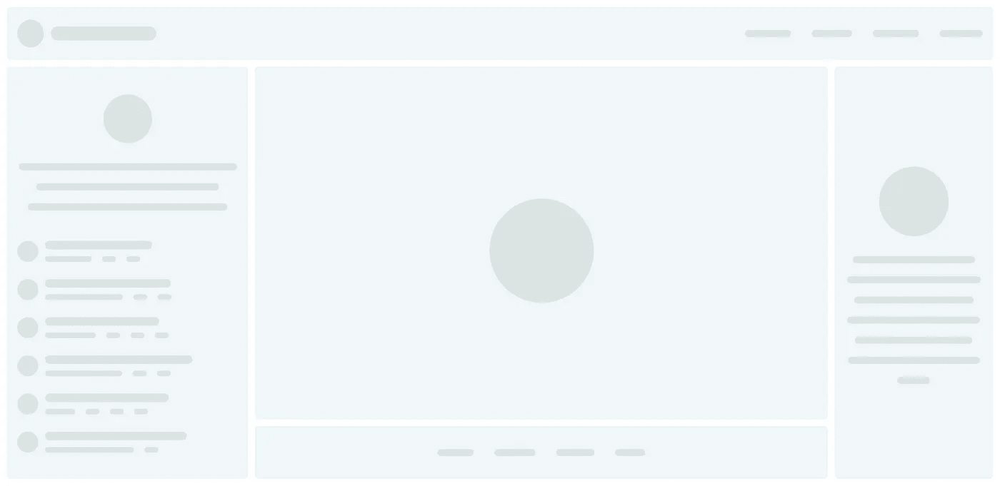

# 安装 Protovue

如果使用的是 CodeSandbox，只需添加`v1labs-protovue`作为依赖即可。要添加到本地 Vue.js 应用程序运行:

```
$ npm install v1labs-protovue --save
# or
$ yarn add v1labs-protovue
```

然后在初始化 vue 的时候添加 Protovue 作为插件。

```
import Vue from "vue";
import Protovue from "v1labs-protovue";Vue.use(Protovue);new Vue({});
```

# 设置网格

默认情况下，网格被设计为`100%`宽，`100%`高。将您的网格添加为`v-app`的第一个元素是一个好主意。

```
<v-app>
  <v1-grid guides size="12x10" gap="10">
  </v1-grid>
</v1-grid>
```

上面的网格是`12 columns` x `10 rows`，单元格之间有一个`10px`的间隙。还要注意`guides`属性。这显示了一个蓝线网格，旨在帮助您布局单元格。一旦你放置好所有的细胞，你就可以移除它。

带参考线的网格应该是这样的。

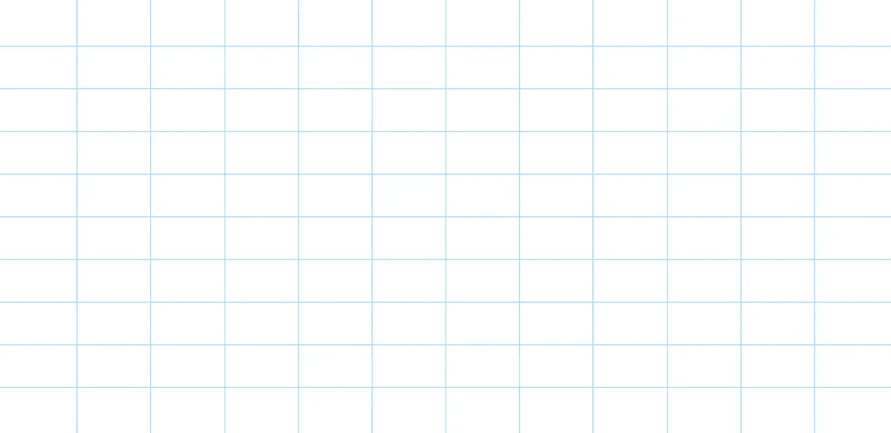

# 添加单元格

首先让我们添加一个单元格来表示导航。

```
<v1-cell size="12x1" />
```

在这种情况下，我们只需要一个跨越`12 colums`和`1 row`的单元格。应该是这样的。

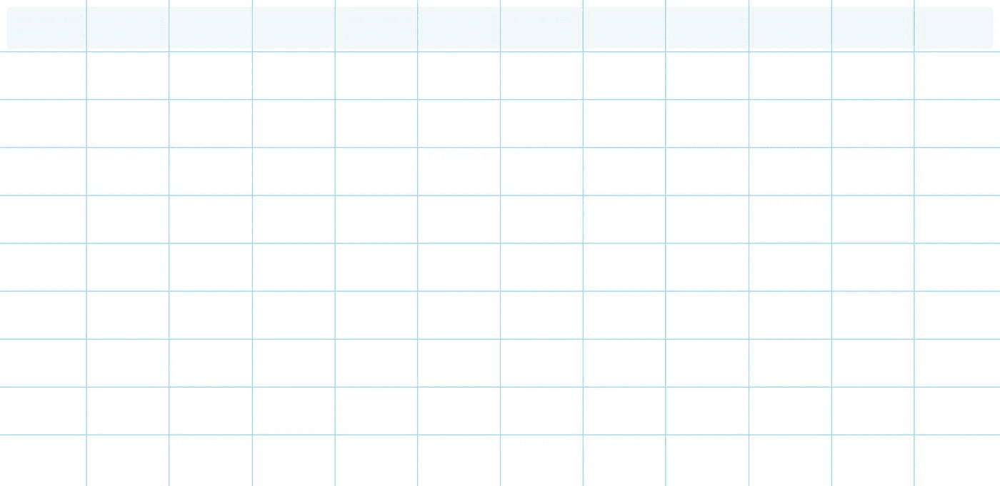

现在是左边栏。

```
<v1-cell size="3x9" y="1" />
```

这个`3x9`单元格有一个`y="1"`属性，它从顶部偏移单元格 1 行。

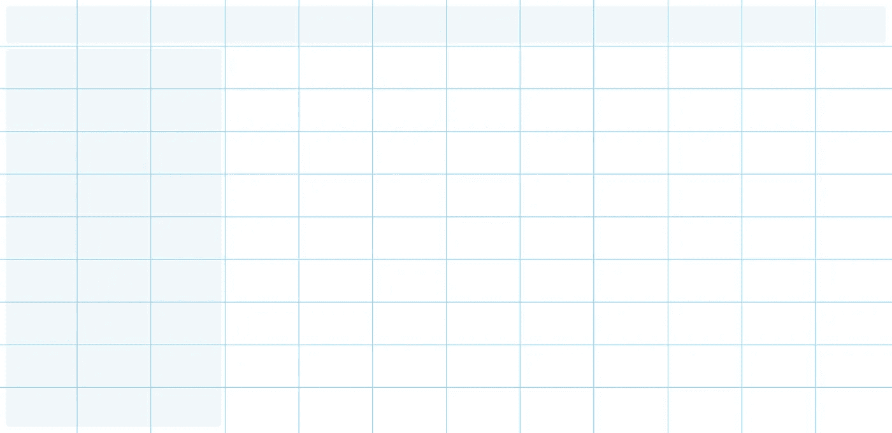

右边栏和左边非常相似。

```
<v1-cell size="2x9" y="1" x="10" />
```

我们使它变得更窄，并从左边偏移它。

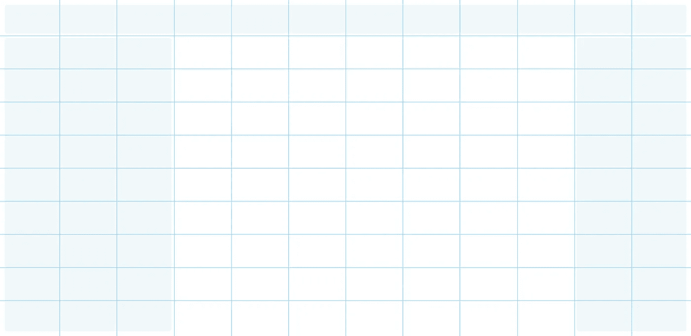

找到窍门了吗？现在让我们添加主要内容单元格和页脚单元格。

```
<v1-cell size="7x8" y="1" x="3" />
<v1-cell size="7x1" y="9" x="3" />
```

现在你已经放置了所有的单元格，所以从`<v1-grid>`中移除`guides`属性。这是你目前应该有的。

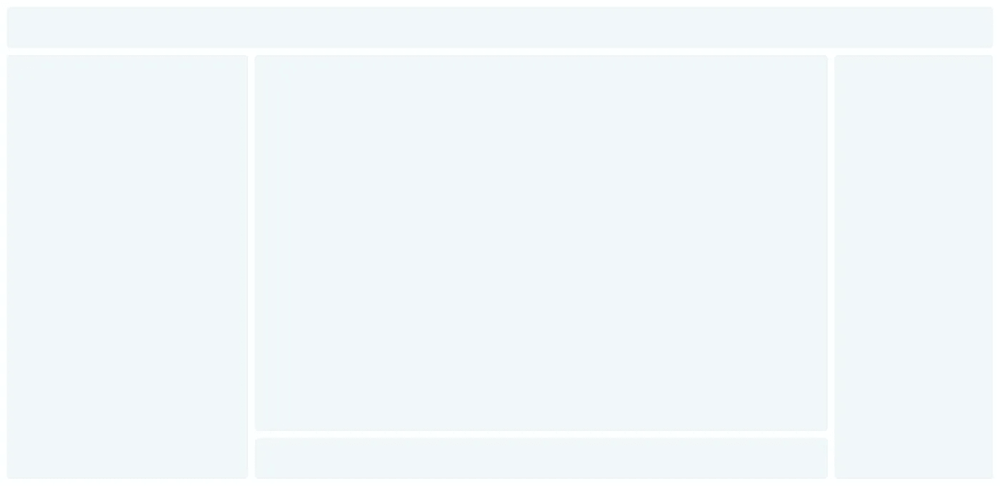

# 添加模拟导航

在第一个单元格中，添加一个`<v1-nav />`元素。

```
<v1-cell size="12x1">
  <v1-nav />
</v1-cell>
```

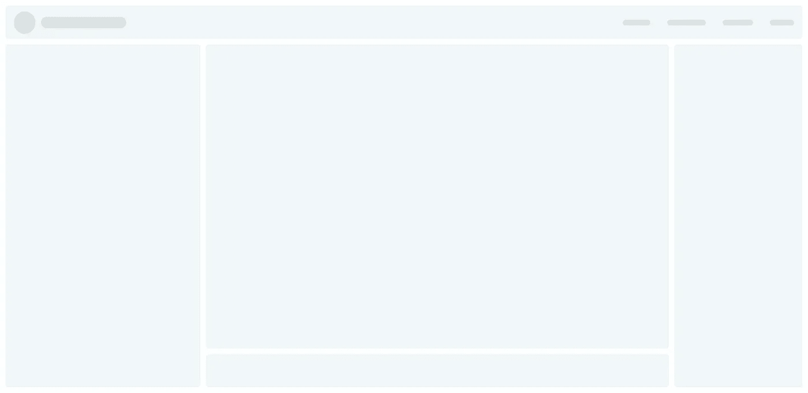

# 左侧栏内容

```
<v1-cell size="3x9" y="1">
  <v1-image center round width="70px" height="70px" />
  <v1-text center rows="3" />
  <v1-avatar count="6" />
</v1-cell>
```

*   图像元素为`centered` `round`和`70x70`。
*   文本为`centered`宽 3 行。
*   头像元素重复 6 次。

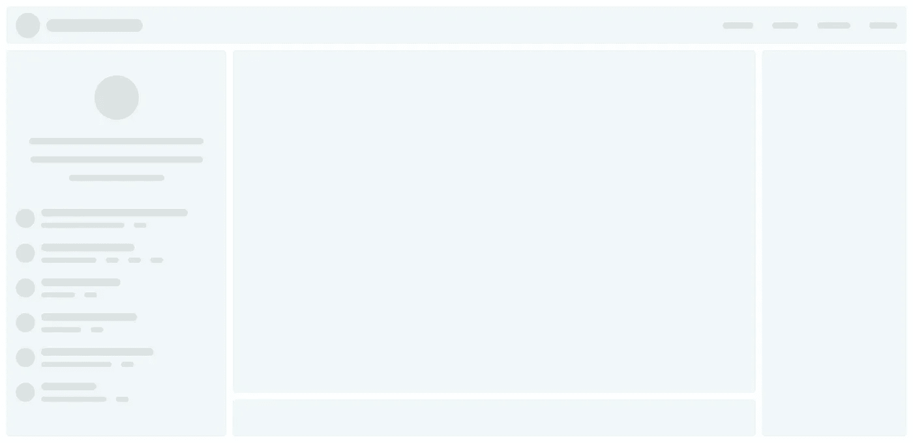

# 右侧栏内容

```
<v1-cell middle size="2x9" y="1" x="10">
  <v1-image center round width="100px" height="100px" />
  <v1-text center rows="7" />
</v1-cell>
```

类似于左边的内容元素。请注意，将`middle`添加到单元格中会使内容垂直居中。

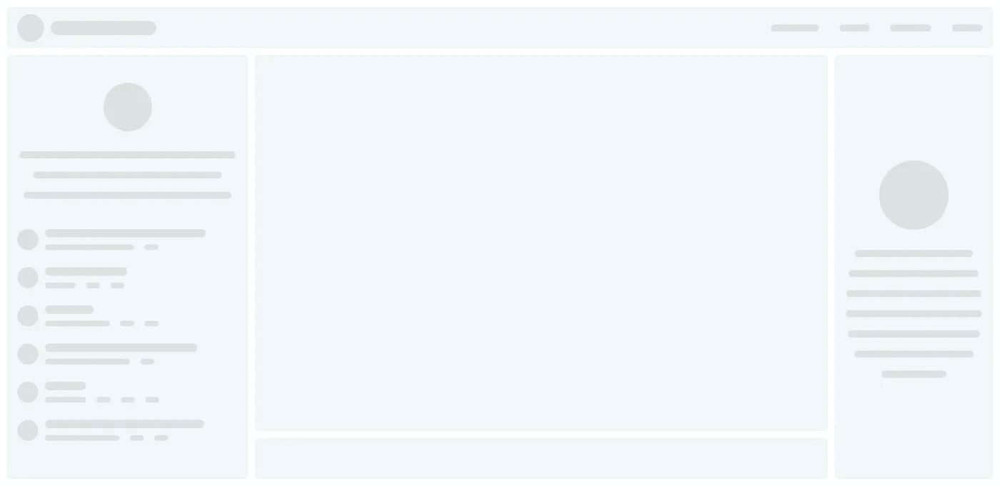

# 页脚内容

```
<v1-cell size="7x1" y="9" x="3">
  <v1-footer />
</v1-cell>
```

很简单。只是增加了一个`<v1-footer />`元素。

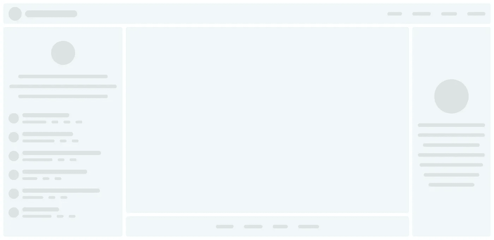

# 准备开始原型制作

只需要几行代码就可以搭建你的应用。

```
<v1-grid size="12x10" gap="10">
  <v1-cell size="12x1">
    <v1-nav />
  </v1-cell>
  <v1-cell size="3x9" y="1">
    <v1-image center round width="70px" height="70px" />
    <v1-text center rows="3" />
    <v1-avatar count="6" />
  </v1-cell>
  <v1-cell middle size="2x9" y="1" x="10">
    <v1-image center round width="100px" height="100px" />
    <v1-text center rows="7" />
  </v1-cell>
  <v1-cell middle size="7x8" y="1" x="3">
    <!-- PROTOTYPE GOES HERE -->
  </v1-cell>
  <v1-cell size="7x1" y="9" x="3">
    <v1-footer />
  </v1-cell>
</v1-grid>
```

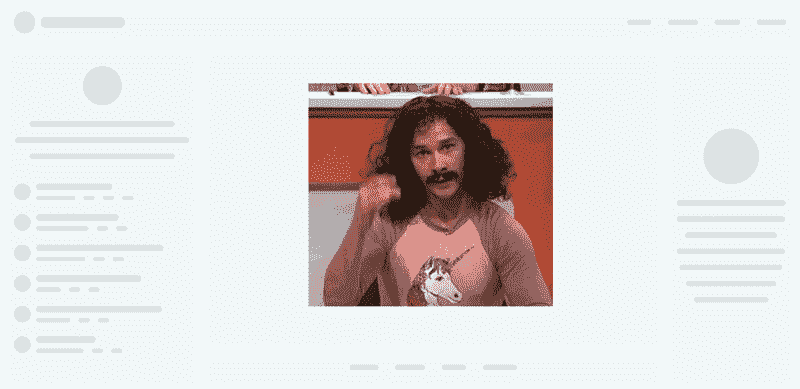

# 了解 Protovue 的最新进展

支持我们的[产品搜索](https://www.producthunt.com/upcoming/protovue)以获取教程和发布更新。您还可以投票决定我们优先考虑哪些新组件。如果你有兴趣投稿，请点击 checkout 或 [github repo](https://github.com/v1Labs/protovue) 。