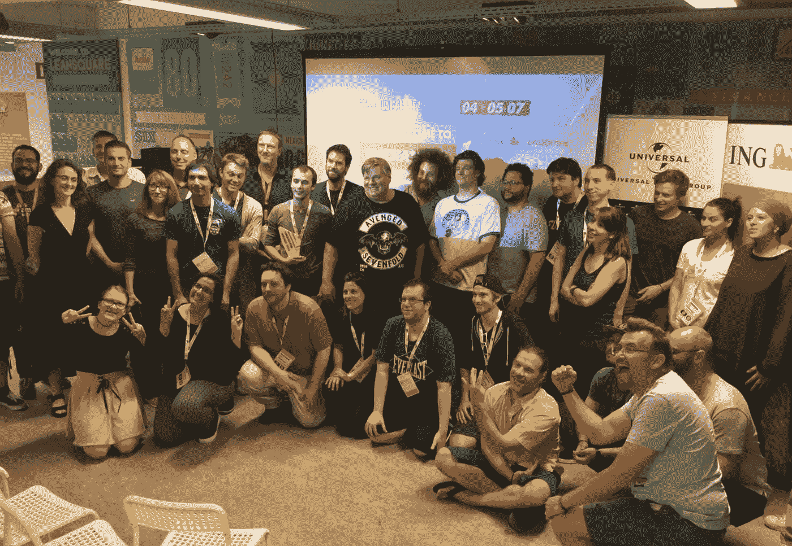
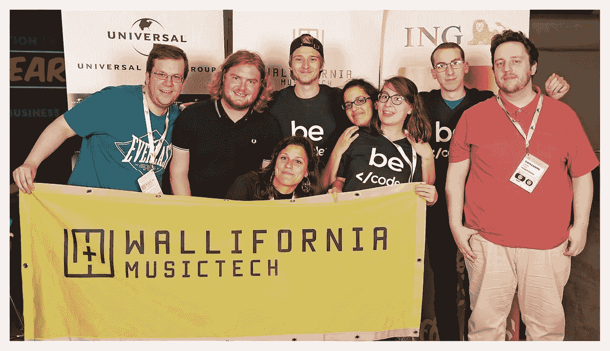
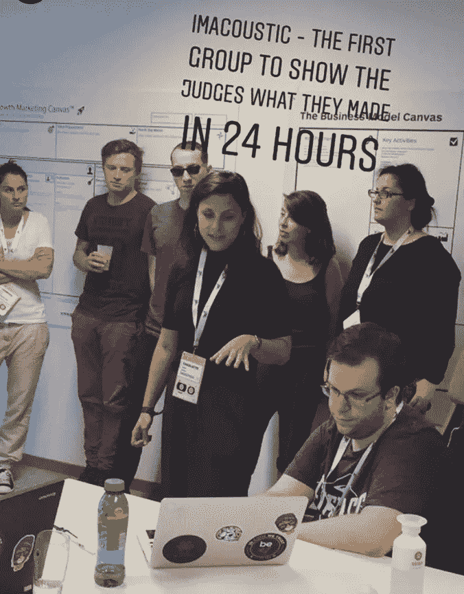

# 她的第一次黑客马拉松

> 原文：<https://medium.com/hackernoon/her-first-hackathon-2c6cb75aadc4>

Wallifornia Hackathon

对于任何新开发人员来说，黑客马拉松都是一次变革性的经历。为什么？因为它们提供了一个切实可行的机会，可以从零开始构建一些东西，然后在不到 24 小时内“交付”一个最小可行产品(MVP)。在线的是现金奖励，行业关系，和吹牛说我做到了这一点的权利！

事实上，这是大多数开发人员在其职业生涯中至少经历一次的一种仪式。对于新开发人员来说，这 24 小时既令人兴奋又令人沮丧，因为他们第一次学习如何与团队合作，熟悉新的 API，然后对最终产品中包含哪些功能做出关键选择。

最近，Cloudinary 赞助了在比利时列日举行的[加州音乐技术黑客马拉松](http://walliforniamusictech.com/)。来自“Be < /code >”代码学校的八名开发人员来到我们的桌子旁，检查我们的 API，并学习如何启动一个[黑客马拉松](https://hackernoon.com/tagged/hackathon) [项目](https://hackernoon.com/tagged/project)。为了加速他们的学习，Tamas Pieros 和我创建了一个即兴工作室，然后退后一步，看着这个团队创建他们的获奖作品。

对于新开发人员[**Charlotte Tusset**](https://www.linkedin.com/in/ACoAABNTaRYBAqE7gBAACq2aes_4BIVL6CvecYw/)，这是她的第一次黑客马拉松…

Imacustic the Winning team from Be <Code/>

两天前，我参加了由 Wallifornia MusicTech 组织的第一次黑客马拉松。谁会相信呢？两个月前，我几乎不知道什么是编码。

尽管开始很艰难，我们的团队还是设法完成了一个项目，名为*ima 声学*，超出了我们的预期*。ima 声学*是一个基于图像(比如艺术家的图片)生成声音或音乐的平台。

作为学习者和好奇的头脑，我们在没有任何具体想法的情况下参加了黑客马拉松，并很快被其他参与者的期望和才能所淹没。在这样的新环境中，最重要的是克服自己的恐惧，保持动力，迪克西特·塞德里克·斯韦伦斯(C.O.O @BeCode)。我们要感谢 Cloudinary 的代表 Dan 和 Tamas，感谢他们在整个 24 小时挑战中对我们的指导。

我们最大的挑战:

*   沟通:由于事先准备不足，我们发现很难在七人团队中进行透明的对话。
*   **音乐诀窍:**尽管我们中的一些人对音乐产业非常感兴趣，但我们并不是专家。我们也不是音乐家。所有这些使情况变得复杂。
*   **项目范围:**无数的想法从四面八方涌来。把它们削减到现实的比例并为我们的项目划出一个可行的范围需要时间。

我们学到了什么:

*   准备是关键。
*   尽早熟悉黑客马拉松流程。
*   作为一个小组工作，分担任务。
*   在限定时间内挑战自我。
*   将 Cloudinary、YouTube 和 Last.fm 中的 API 集成到我们的代码中。
*   “多干活，少睡觉！”对我们所有人来说都没有效率。

[**Charlotte**](https://www.linkedin.com/in/ACoAABNTaRYBAqE7gBAACq2aes_4BIVL6CvecYw/) **demos the Imacoustic MVP**

从个人的角度来看，我意识到超越自我和从头脑中驱逐黑暗思想的重要性。整个团队都会因为缺乏动力而受到影响。

我也越来越适应公开演讲和其他人的评价(这不是一件容易的工作！).

我仍然像以前一样对音乐行业充满热情，并且愿意在这个领域工作。

感谢 [**Be Code**](https://www.linkedin.com/company/becode.org/) 为您提供的这种新的学习方式和机会！还有谢谢队友([罗曼](https://www.linkedin.com/in/romain-vandevoorde/)、[杰弗里](https://www.linkedin.com/in/geoffrey-poelmans-167200155/)、[科隆布](https://www.linkedin.com/in/colombe-sechehaye-14654a163/)、[梅里](https://www.linkedin.com/in/mery-lamri/)、[纪尧姆](https://www.linkedin.com/in/guillaume-deruwez-98328a134/) &、塞德里克)这一切都是值得的！

夏洛特说得好！

我们希望在这里听到您对第一次编程体验的评论和想法，或者给我们发一条推文#herfirsthackathon @cloudinary