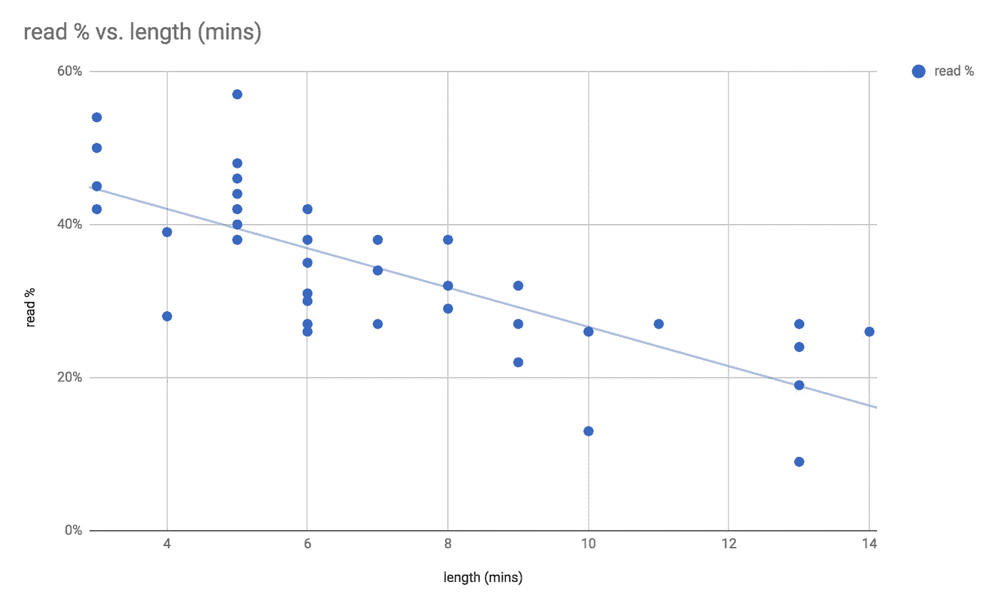
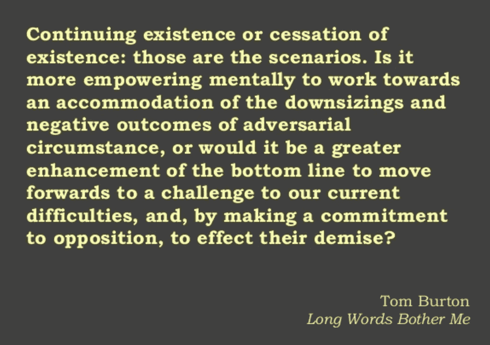

# 以下是我在 8 年 700 篇文章后总结的关于技术写作的顶级技巧

> 原文：<https://medium.com/hackernoon/here-are-my-top-tips-on-technical-writing-after-8-years-and-700-posts-38b0718e0d40>

自 2009 年 12 月 26 日以来，我定期在我的个人博客[theburningmonk.com](https://theburningmonk.com)上写关于各种技术话题的文章。可以说，我有很多技术写作的实践经验。

我喜欢学习，也喜欢分享。我喜欢通过写作来分享我学到的东西，因为这也有助于巩固我的理解。

在过去的 3 个月里，我的帖子在媒体和我的博客上每月被浏览 75000 次。因此，证据表明，我的作品至少没有拒绝读者！

所以为了帮助更多的人分享他们的知识和见解，这里有一些我写作时遵循的简单规则。

# **头脑中的“专长诅咒”**

**最重要的**经验法则是永远记住*你是你领域*的专家 *。当你分享知识和经验时，你需要注意你对读者的假设。*

尤其是当你讨论一种方法的优点或问题时。总是在前面明确地陈述你的假设和背景。这有助于读者理解**为什么**你要这么做，以及你所面临的限制。

在*西蒙·西内克*的不朽话语中，[从为什么](https://www.youtube.com/watch?v=u4ZoJKF_VuA)开始，这就引出了下一点。

# **推销问题，而不是解决方案**

“Brad, sell me this pen”

就像《华尔街之狼》中的一个伟大场景:迪卡普里奥向乔·博恩瑟出售一支钢笔。

创造需求，然后提供解决方案。

把问题卖给读者。帮助他们理解为什么这是一个值得解决的问题。如果没有一个有趣和有价值的问题，你的解决方案的优点是无关紧要的。

在可能的情况下，我试图列出一个“好”的解决方案应该是什么样的，以及它应该具有什么样的属性。在描述了解决方案之后，我将结束我必须做出的权衡。这通常会围绕*成本*、*复杂性*和*效率*这三个支柱展开。

如果你没有预先定义什么是“好”，那么认知偏见就很容易钻进来。我们经常下意识地扭曲“好”的定义以适应我们的解决方案，并在这个过程中失去客观性。我们都有这种[确认偏见](https://en.wikipedia.org/wiki/Confirmation_bias)，无法逃避。但是提前定义“好”有助于我们对自己诚实。

请记住，您的解决方案可能只适用于特定的环境。如果人们采纳了你的解决方案，却不了解它的工作环境，那么他们就有失败的风险。更糟糕的是，如果失败还不够明显，那么你可能已经开始了另一场货物崇拜

# 保持简短

在 medium 上，你可以看到你的帖子需要多长时间阅读，以及有多少人从头到尾阅读了它。不出所料，有一个明显的趋势，越长的帖子阅读率越低。

我整理了我的无服务器相关帖子的统计数据，这就是我所看到的。

这也反映在我个人的阅读习惯上。我倾向于在几个回合内完成较长的帖子，因为我经常在中途失去注意力。我很少能一口气写完一篇长文章，即使我真的很喜欢它。

对你来说，这意味着你应该让事情简短、有力、切中要害。不要磨磨蹭蹭地试图把事情解释到第 n 度。

如果有必要，使用项目符号，并保持每行一个。

写好帖子，然后再读几遍。每次运行时，删除不必要的单词或重组句子，使它们更简洁。

例如，“生存还是毁灭，这是个问题”可能很模糊，留给读者很多思考的空间。更长、更大的版本实际上远没有那么清晰！

Courtesy of Kevlin Henney’s talk “7 ineffective coding habits of many programmer” — [https://www.slideshare.net/Kevlin/seven-ineffective-coding-habits-of-many-programmers](https://www.slideshare.net/Kevlin/seven-ineffective-coding-habits-of-many-programmers)

# **实话实说**

不用说:-P

# **图说千言**

套用常识，图片太多也不好。

此外，保持图片的相关性。我们都喜欢猫的图片，但是太多的图片(或者断章取义的使用)会让人不舒服。

# **开始强势**

我在演讲时也遵循这个建议，并试图用一个强有力的信息开始一场演讲或帖子。

把你的读者的注意力持续时间想象成一种货币。你必须先赢得观众的注意力，然后才能把他们花在技术讨论上。

# 结论

这就是我写作时遵循的 6 条简单规则。freecodecamp 的人也有一些非常好的在媒体上写作的建议。

希望这篇文章能帮助你提高写作水平。如果你对我如何改进自己的写作风格有任何建议，请随时通过下面的评论告诉我。

大家复活节快乐！