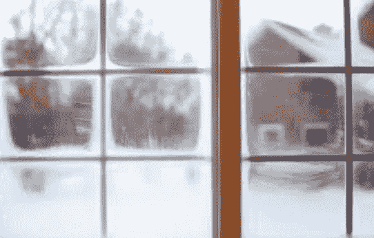
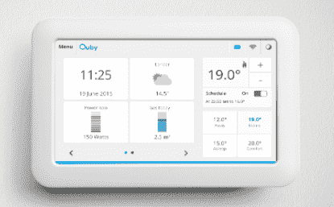
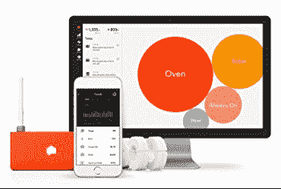
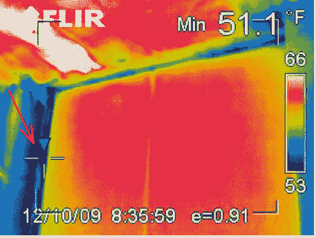
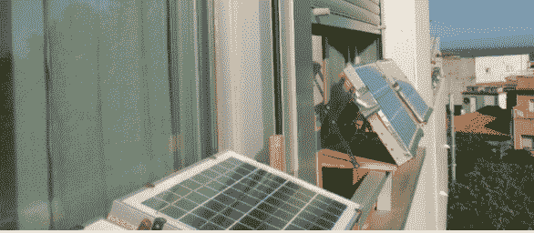
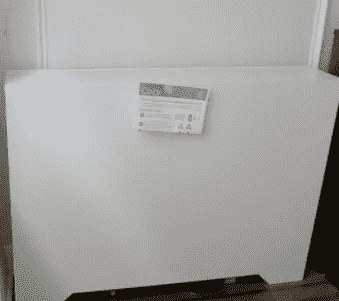
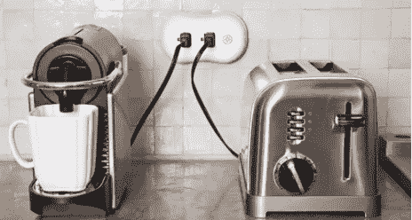
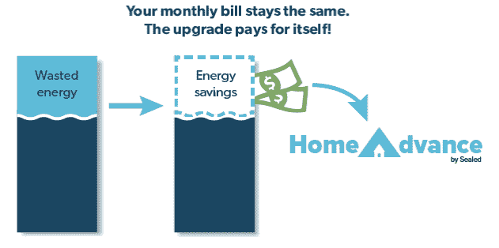
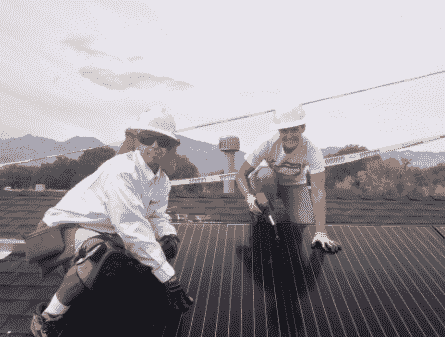

# 3 种类型的创业公司帮助你减少能源浪费和节省资金

> 原文：<https://medium.com/hackernoon/here-are-the-startups-helping-you-fight-utility-waste-and-save-you-money-c47a40b15b93>

我们都讨厌在公用事业上花钱。我重点介绍了一些公司和其他举措，它们致力于为租房者节省能源开支——通过提供轻便、廉价的工具、新的融资工具来支付昂贵的改造费用，或者比你的公用事业更便宜的绿色能源。作为租房者，我们应该意识到并支持这些努力。

根据[房地美](http://www.freddiemac.com/research/consumer-research/20161115_renters_cost_of_utilities_more_concerning_than_rent.html)的一项调查，相比租金上涨(63%)，更多的租房者担心公用事业账单上涨(70%)。

这些担忧并非空穴来风。根据对公共房地产记录的一项分析，公用事业费用(电、气、水和下水道)给房主的成本增加了 [25%，给租房者的成本增加了](https://www.attomdata.com/news/company-news/power-conversion/)高达 [27%](https://www.bls.gov/opub/btn/volume-1/pdf/a-comparison-of-25-years-of-consumer-expenditures-by-homeowners-and-renters.pdf) 。这些成本对低收入租房者的打击最大，吃掉了他们全部收入的 21%。最大的公共事业罪魁祸首是能源，电力和天然气占公共事业总成本的 49%，其次是互联网和手机(29%)，然后是水(7%)。在电费和煤气费中， [58%](https://rpsc.energy.gov/energy-data-facts) 是因为供暖和制冷。很明显，更多的节能和节能产品意味着更多的钱和对租房者的财务授权。

对于租房者和房东来说，大多数解决方案都不切实际或过于昂贵

租房者比房主节能的可能性低 30%-40%。太阳能电池板或绝缘改造是(1)太烦人或不可能搬到你的下一个公寓，或者(2)太[昂贵](http://www.jchs.harvard.edu/sites/jchs.harvard.edu/files/carliner_research_brief_0.pdf)与[大量前期成本](https://grist.org/article/2010-06-25-greening-homes-requires-credit-which-fannie-and-freddie-should-u/)。业主——拥有这栋楼的人——不关心为你省钱，因为你自己支付水电费。租房者和房东之间的利益差距被称为“分割激励问题”。所以你——租房者——使用现有的东西:通风的窗户和杀死地球的电器，你的房东从 20 世纪 80 年代以来就没有更新过。

分割激励问题留下了很多钱。[地板、墙壁和天花板的隔热改造](https://www.salford.ac.uk/news/articles/2016/weve-built-an-entire-house-in-a-lab-to-dispel-energy-efficiency-myths)，[索尔福德能源屋的研究发现](https://www.salford.ac.uk/__data/assets/pdf_file/0003/562134/pdf1-Energy-House-brochure.pdf)，节省了 63%的取暖费用，每年节省 500 美元。诺丁汉大学发现，最具成本效益的改造，如价值 5000 美元的织物隔热和双层玻璃窗，在 T4 的投资回收期为 3 到 6 年。类似的研究发现，全天控制每个房间的温度——并使用智能通风口，如 [Ecovent](http://www.thisismoney.co.uk/money/bills/article-2644012/Energy-House-scientists-make-rain-snow-test-energy-efficiency.html) 或 [Flair](https://flair.co/) ,关闭空房间的气流——可以节省能源从 [25%](https://www.ecoventsystems.com/faq) 到 [40%](http://www.thisismoney.co.uk/money/bills/article-2644012/Energy-House-scientists-make-rain-snow-test-energy-efficiency.html) ,每个房间的成本为[490 美元](https://www.ecoventsystems.com/faq)。例如，晚上关上窗帘可以节省高达 17%的取暖费用。如果每天关闭所有百叶窗的想法让你不知所措， [Luftron 的智能窗帘在最佳时间打开和关闭，每个窗户 350 美元](https://www.cnet.com/news/smart-home-showdown-somfy-shades-vs-lutron-serena/)。

不幸的是，对于大多数租房者来说，这些节省成本的解决方案过于昂贵或不切实际，尤其是如果他们无法将这些改进带到下一个公寓的话。幸运的是，创业公司和其他计划开始解决这些问题。

**迎接对抗能源浪费的创业公司**

**策略#1:租赁者负担得起的便携式工具**

为了解决一些工具太笨重或无法搬到你下一个公寓的问题，一系列便携式节能或发电工具已经上市。

*   **智能温度计**。一个 250 美元的 Nest 可以节省[10–15%的](https://thesmartcave.com/smart-thermostat-money-savings/)供暖和制冷成本，一位分析师估计，通过每年节省 120 美元，[的投资回收期为 1.5 年](http://www.flannelguyroi.com/nest-thermostat-save-money/)。这些都很小，当你搬到不同的公寓时，很容易安装和重新安装。 [Heat Seek](http://heatseek.org/) 生产一种智能温度计，可以收集每小时的温度数据，为缺少热量的租户辩护。

[智能恒温器示例](https://commons.wikimedia.org/wiki/File:QubyDisplay_Home_withbackground.png)

*   **能量监控器**。[感知家庭能源监视器](https://sense.com/)连接到你家的配电板，并提供对你的能源使用情况的洞察。Neurio 是一家太阳能监测公司，声称可以将太阳能的投资回收期减少 30%。当你所在地区的用电需求很高时，Ohm Connect 会付钱给你，让你减少用电。根据常见问题解答，居民一年能挣 100-300 美元(T21)。

感知家庭能源监视器告诉你你在哪里浪费了最多的能源

*   [**能源审计**](https://www.energycircle.com/blog/2010/01/22/how-an-energy-audit-some-caulk-and-insulation-total-cost-1175-is-saving-me-1000-per-year) 。花 200-400 美元或者[甚至免费的](http://www.siliconvalleypower.com/for-residents/save-energy/home-energy-audit)，当地的技术人员会在你的房子里测量气流和探测通风源。利用这些信息，您可以使用有针对性的隔热措施来节省供暖和制冷成本。一个人记录他在审计上花了 400 美元，在绝缘和人工成本上花了 500 美元，每年节省了 1000 美元，结果一年就收回了投资。搜索[住宅能源服务网络](http://www.resnet.us/directory/search)的数据库，寻找你附近的能源审计员，但是通过在商业改善局数据库中搜索他们的业务来确认他们已经通过了测试。此外，看看你的电力或天然气供应商是否会因为你的审计而给你安装绝缘材料的折扣。一个人发现他的供应商给了这些商品 75%的回扣。

能源审计员来到你家，使用上述数据找到通风和能源损失的来源。

*   **即插即用或便携式太阳能**。200-3000 美元的太阳能电池板[和](https://pluggedsolar.com/) [Inergy Solar](https://www.treehugger.com/solar-technology/off-grid-solar-system-box.html) 可以让你避免昂贵的劳动力和建筑成本，因为这些电池板可以安装在甲板上或放在地上。此外，它们可以直接插入你家现有的插座并发电。爱好者们将这些面板改装成在他们的公寓里使用，将它们放在窗台或阳台附近。密歇根理工大学的一项研究发现[即插即用系统可以创造不到 5 年的回收期](https://www.treehugger.com/renewable-energy/plug-and-play-solar-could-be-next-clean-energy-wave-us.html)，[比普通太阳能系统快 2 年](https://news.energysage.com/understanding-your-solar-panel-payback-period/)。在未来，[能产生能量的太阳能窗户](http://www.newsweek.com/fossil-fuels-transparent-solar-panels-harvest-energy-windows-msu-691308)可能会变得很普通，绕过安装太阳能所需的空间或劳动密集型物理改造。

一位作者渴望用窗台和阳台板让他的公寓“远离网格”。

*   **智能散热器盖。在你的散热器上包裹一个价值 250 美元的舒适罩，你可以更好地控制房间的温度。你再也不用在严冬打开窗户了。另外，一个舒适的是数字监控的。因此，当它们被放置在整个建筑中时，数据被反馈给锅炉以重新分配热量。能源效率的提高带来了两年的回报。**

*   **智能网点**。ThinkEco 的 45 美元的修改插座(或“modlet”)可以轻松插入现有的插座，并防止电器消耗待机功率。也被称为“吸血鬼能源”，这种形式的电力使用占英国家庭能源使用的近[7-8%](http://webarchive.nationalarchives.gov.uk/20090609033948/http://www.berr.gov.uk/files/file31890.pdf)。[投资回收期从 6 到 9 个月不等](http://marketmakersnyc.sallan.org/resources/M_Shibata-thinkeco-NYAS-Market_Makers.pdf)。

**战略#2:新融资以克服前期成本**

为了解决一些工具或改造过于昂贵的事实，市场上出现了一系列新的融资机会，让租户能够负担得起 1 万至 2 万美元的太阳能电池板或绝缘改造。重要的是，虽然房东必须提供同意，但这些工具并不要求同一个租户(平均在 1-2 年内搬出)偿还债务。[房东必须向新租户披露这一义务，但这不应成为障碍，因为租户通常面临不变的公用事业成本](https://www.policymattersohio.org/research-policy/sustainable-communities/energy/pay-while-you-save)。

*   **票据融资。** [Matter.solar](http://matter.solar/tenants/how-it-works/) 和[Ouachita Energy cooperation](http://efc.web.unc.edu/2017/08/15/arkansas-electric-co-op-tripled-efficiency-program-participation/)(在阿肯色州)是为能源效率或太阳能改造预付费用(或帮你找到贷款人)的项目。几十年节省下来的能源支付了前期成本和利息，导致租户的水电费增加很少或几乎没有增加。这种融资工具被称为“票据融资”如果租户在投资回收期之前搬出，那么[义务可以转移给新租户](https://aceee.org/sector/state-policy/toolkit/on-bill-financing)，因为改进留在物理结构中。类似地， [Sealed](https://www.greentechmedia.com/articles/read/new-york-green-bank-funds-a-startup-making-pay-as-you-save-efficiency-upgra#gs.b1SJQwY) 面向房主，并计划在未来与租房者合作。

[Sealed 对账单融资的直观说明](https://www.freecleansolar.com/Energy-Finance-s/264.htm)，第三方预先支付成本(“太阳能贷款支付”)，受益人在电费储蓄的帮助下偿还贷款

*   **众筹。**T4【bloc power】和 [Mosiac](https://www.fastcompany.com/1681060/a-kickstarter-for-solar-with-a-twist-invest-in-crowdfunded-solar-projects-and-make-some-cash) 没有依靠像 Sealed 这样的单一公司来提供融资，而是扩展了这一概念。同一州的投资者可以贷款资助节能或能源生产改造项目。租户可以通过账单融资偿还债务，或者，在 Mosaic 的案例中，甚至可以通过将多余的电力出售给公用事业公司来偿还债务。[一个教堂使用 BlocPower 的方案每月节省 3000 美元。](https://www.fastcompany.com/3045532/a-crowdfunding-site-lets-you-bring-energy-efficiency-to-poor-neighborhoods)

人们和其他小投资者——不是银行或大投资者— [借给你资金为你的项目融资。](https://commons.wikimedia.org/wiki/File:Crowdfundingescense.jpg)

*   **养畜棚**。虽然这种解决方案仍然需要你征得房东的同意，但替代电网公司向低收入家庭提供免费或低价的太阳能电池板，以换取社区志愿者和工作实习生获得安装这些电池板的实践经验。因为这种模式对租房者和房东都是免费的，房东不能抱怨成本，也没有义务偿还。

[电网替代主管和实习生在工作](https://www.flickr.com/photos/departmentofenergy/22065141071)

**策略#3:购买当地公用事业以外的能源的新来源**

这种策略最大限度地减少了激励分离问题的两个方面。任期不是问题。租房者可以购买更便宜的可再生能源，不管他们住在哪里。前期成本不是问题。第三方建造并维护这些农场。最后，房东的同意不是问题。当地的太阳能农场回避了在你的屋顶上安装太阳能的需要；这项要求阻止了高达 92%的美国居民使用太阳能。

*   **“聪明的”能源零售商。** [Drift](https://www.fastcompany.com/40426961/drift-is-an-entirely-new-type-of-power-utility-that-lets-you-take-control-of-your-electric-bill) ，可供纽约市居民使用，使用机器学习算法从多家供应商处购买、交易和出售能源，以优化价格。他们[估计可以节省 10%-20%的成本](https://qz.com/995551/the-startup-drift-is-one-of-new-yorks-newest-utilities-allowing-peer-to-peer-trading-for-the-electric-smart-grid/)。
*   **太阳能农场**。 [Solstice](http://ny.solstice.us) 、Renovus 和 [Arcadia Power](https://blog.arcadiapower.com/can-now-join-community-solar-farm-100/) 建造太阳能花园，租户可以[使用账单融资以很少或没有前期成本的方式租赁太阳能电池板](https://news.energysage.com/community-solar-go-solar-without-rooftop-panels/)。例如，纽约的 Renovus 和马萨诸塞州的 Nexamp 允许租赁者购买比市场价格便宜[10%](https://ithacavoice.com/2016/05/43368/)-[-15%](https://www.nexamp.com/what-we-do/community-solar/more-info)的能源，而无需预付任何费用。太阳能产生的能量所节省的成本不仅可以支付租金，还可以抵扣你的水电费。Energysage 有一个数据库,你可以用它找到你附近的社区太阳能项目。
*   **微网。**你不再需要一个大型的集中式太阳能发电厂，在空间稀缺的城市里建造这样的发电厂既昂贵又不切实际。微电网是独立能源生产商的网络，比如你的邻居，他们可以把多余的能源卖给你。你可以购买更便宜的能源，他们可以赚更多的钱。[通过使用最新的技术，减少电力传输的距离，并消除开销，微电网可以削减高达 13%的成本。例如，加州大学圣地亚哥分校通过其微电网每年为](https://aquicore.com/blog/microgrids-reducing-energy-costs-increasing-reliability/)[节省 800 万美元](https://aquicore.com/blog/microgrids-reducing-energy-costs-increasing-reliability/)。绿山电力公司的[270 万美元的微电网将在 2-5 年内收回成本](http://www.renewableenergyworld.com/articles/print/volume-20/issue-4/features/microgrids/how-one-small-us-town-will-save-millions-with-a-microgrid.html)。Lo3 Energy、ME SOLshare 和 Sonnen 正在努力为农村和城市居民提供能源。

*   **储存额外能量的电池。随着夜幕降临，太阳能电池板无法再发电，迫使家庭依赖电网。但是有了电池，太阳能可以全天储存微电网和太阳能农场产生的额外能量。一块价值 14，000 美元的电池可能需要 8-12 年才能收回成本。虽然针对的是房主，但是通过提高太阳能农场和微电网的效率，Swell 也可以使租房者受益。**

[*布鲁克林微电网项目插图*](/intelligent-cities/park-slope-gowanus-microgrid-uses-blockchain-for-solar-energy-exchange-8eabf8000d69)

理想情况下，我们将生活在一个政策能够激励开发商、房东或租户建造或改造绿色建筑的社会。例如，德国最近的法案帮助租房者在他们的公寓里使用太阳能。但在那之前，为了节省你的水电费，还需要做一些工作。这些产品从长期来看是不错的投资，几十年后会有回报并为你省钱。

如果你使用过这些产品或服务，我很想听听你的经历。

*☞同意还是不同意？在 LinkedIn 上加我加备注* [*此处*](https://www.linkedin.com/in/wu12345/) *。*