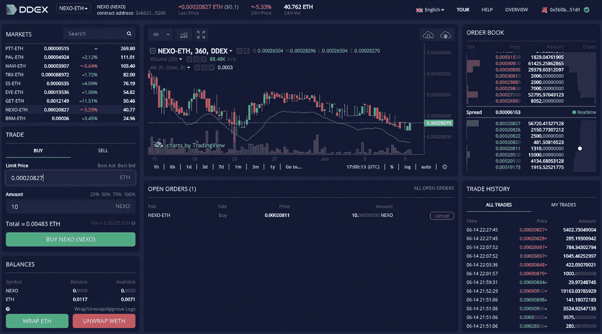

# 以下是我在分散交易所交易 ERC20 代币时发现的情况

> 原文：<https://medium.com/hackernoon/here-is-what-i-found-trading-erc20-tokens-in-decentralized-exchanges-491832ab3590>

我不是交易者，但我想测试分散交易是如何运作的。在分散交易中，交易所不持有你的加密资产，交易直接发生在交易者的钱包之间。我测试了四个流行的基于开放协议的交易所。

# 雷达继电器

[雷达中继](http://radarrelay.com/)提供丰富的交易经验。它有一个直观的用户界面，因此它是一个伟大的工具，首次交易者。你只需点击几下就可以开始交易，它不需要注册、填表或验证。

点击右上角的“选择钱包”按钮，选择您的钱包，批准请求，您就可以开始了。

该界面直观地分为四个部分。在屏幕的最左侧，您可以看到自己的钱包功能。它显示你的 ETH 余额，代币余额，帮助你愤怒 ETH 到 WETH(交易 ERC20 代币的必要步骤)，启用/禁用代币，等等。

在左起第二部分，您可以选择您想要购买或出售的代币，并下达市价/限价单。

第三和第四部分向您显示所选令牌的统计数据，如价格图表、订单簿、交易历史等。

在右上角，你有按钮，显示每个代币的数量和你的帐户部分，当你可以检查你下的订单。与其他继电器相比，我们的雷达继电器订单完成得更快。

雷达中继支持多种多样的令牌。他们与其他的接力者一起提供流动性。您可以将他们的 API 集成到您的 dApps 中，以帮助用户无缝地交换令牌。他们为你提供 Rest 和 WebSocket APIs。您可以使用它们的 API 列出、下订单和订阅订单。

我有机会采访雷达接力赛的队伍。

## **相对于市场上的其他继电器，你打算如何脱颖而出？**

> 像所有继电器一样，我们生活在未来，并试图向后工作。在这个过程中，我们每个人都需要找到自己的位置。我们预计转播商将在用户体验、代币库存、费用、监管策略、品牌资产、产品生态系统和流动性方面展开竞争。与大多数中继站相比，我们是独一无二的，因为我们对雷达本身的教育资源进行了大量投资，更重要的是，对整个生态系统进行了大量投资。我们认为，教育对于将人们带入 0x 生态系统和代币经济至关重要。

## **作为去中心化行业的先驱之一，您面临着哪些挑战？**

> 像我们这样的继电器是在我们创建它的时候定义这个类别的。这是一个很大的责任，我们想做好它。类别创建的挑战之一是找到监管的清晰度。我们讨厌监管套利，这太天真了。我们正与我们的律师和监管机构并肩工作，以确保我们成为监管问责制的榜样。这需要时间，也是一个挑战，但我们很乐意接受这个挑战！

## 告诉我们你的团队，是什么让你与众不同。

> 最初，一小群人在科罗拉多州的一个地下室工作，现在已经变成了一个几乎 30 人的团队，在世界各地工作。我们有不同的背景和经历，但我们的目标是一致的，那就是让世界进入代币经济。作为一个专注于建立一个多代持续发展的公司的团队，我们的责任、愿景和影响力的价值观已经根植于我们所做的一切。

## **在获取、培养和留住客户方面，你面临的挑战是什么？**

> 类别创建的另一面是管理和教育。要成为代币经济中的公民或使用雷达中继，需要新的思维模式，需要克服技术障碍。例如，一些新用户很难理解在集中交易所拥有一个账户和拥有一个钱包来控制他们的私钥和令牌之间的区别。一旦我们能让用户进行交易，我们的价值主张就会被点击，他们就会成为一个传播者！

## **你计划将更多的产品推向市场吗？**

> 为了执行我们让世界进入代币经济的使命，我们需要针对不同客户原型和用例的多种产品。自从 10 月推出 Radar Relay 以来，我们的月平均销量增长超过 500%，但我们才刚刚开始！我们的产品路线图包括不同类型的用户界面、用户工具和支持其他令牌类别，如收藏品和证券。

## **您计划如何提供流动性？**

> 交易场所的大部分交易量来自自动化交易者，他们通常是以编程方式进行交易的金融工程师。这些自动交易者发现雷达中继，因为他们感到沮丧，害怕在集中交易所交易，因为所有的黑客攻击和资金损失。我们刚刚发布了更新的 [API 和 SDK](https://developers.radarrelay.com/) ，雇佣了一个业务开发团队，并且很高兴能够扩大我们的流动性合作伙伴网络！

## **你们有没有完成任何一轮融资？**

> 是的，2017 年冬天，我们从一群了不起的投资者那里筹集了 300 万美元。我们优化了任务一致性、对空间的信念以及为我们移山的能力。你可以在这里阅读更多关于加薪的信息:[https://medium . com/radar relay/radar-relay-funding-9873d 52 a5 de 5](/radarrelay/radar-relay-fundraising-9873d52a5de5)

# ERC·德克斯

[ERC dEX](http://ercdex.com/) 有一个简单的用户界面，像大多数去中心化的交易所一样，它没有注册。点击几下就可以开始交易了。不像雷达中继你必须购买 ZRX 代币开始交易。在他们即将推出的产品版本中，制定市场订单的交易员根本不需要持有 ZRX。

您必须选择令牌对，指定您想要购买/出售的数量，以创建您的订单。您可以为订单指定一个时间限制，超过该时间后订单将过期。像大多数交易所一样，它提供烛台、订单簿等。

ERC dEX 对上市代币有严格的核查程序，这一措施将在一定程度上保护交易者。他们还采取了一些措施和举措来促进高流动性。然而，我们在 ERC 德克斯的订单需要几天才能完成。

他们已经建立了一个名为 Aqueduct 的交易工具包，它提供了开发人员可以用来自动化交易的 API。他们还有一个灵活的计划，激励那些向他们承诺流动性的合作伙伴。

他们还有一个做市商程序，没有编码经验的交易者可以用它来自动化交易和回溯测试策略。与其他分散式交易所相比，ERC dEX 在确保流动性方面投入了更多努力。

ERC 德克斯是由一个拥有丰富行业经验的强大团队建立的。首席执行官 David Aktary 曾与 IBM、JP Morgan 等公司合作。首席技术官 Luke Autry 是 Sharefile 的一员，该公司后来被 Citrix 收购。我们还注意到一件事，团队中所有的 c 级员工都是程序员，并一直保持着体面的 Github 档案。

我有机会采访了 ERC 德克斯公司的首席执行官大卫·阿克塔里。

## 相对于市场上的其他继电器，你打算如何脱颖而出？

> 我们正在通过我们的输水管道网络实现全球共享流动性的理念。这个网络激励生态系统中的每个人尽可能广泛地分享流动性。没有其他继电器有这个。我们也将成为令牌化证券的合规交易场所，我认为其他中继商也不会这么做。

## 作为去中心化行业的先驱之一，你面临的挑战是什么？

> 任何不以“流动性”来回答这个问题的人都是错误的。流动性是所有分散交易的最大问题。我们正在解决这个问题，并取得了良好的进展，但这需要时间。

## 告诉我们你的团队，是什么让你与众不同？

> 我们在 0x relayer 领域是独一无二的，因为我们的团队不仅来自软件工程背景，而且我们还拥有丰富的金融和业务经验和关系。这在许多方面帮助了我们。

## 在获取、培养和留住客户方面，你面临的挑战是什么？

> 我们在这方面面临一些挑战。
> 
> 流动性产生流动性——有流动性的地方，用户就会去哪里，所以我们有一点开始的问题。正如我之前所说，我们正在解决这个问题，但这需要时间。
> 
> 我们的总部设在美国，从事的业务中的法规可能有点不清楚。我们正在尽一切努力尽可能做到合规，但这样做可能意味着牺牲一项原本会为我们带来大量用户的行动。为了实现我们的长期目标，这是我们愿意做出的牺牲。

## 你计划将更多的产品推向市场吗？

> 绝对的。我们目前在市场上有 3 种产品:我们的 ERC dEX 继电器用于代币现货交易，我们的 Aqueduct 流动性网络，以及我们的做市商自动化工具包。我们知道我们将增加符合安全令牌现货交易，但我们也可能增加使用其他协议的产品。我们一直在认真考虑的一些产品包括 dY/dX、b0x 等。

## 你打算如何提供流动性？

> 我们的流动性网络有 80 多个成员，包括 Hehmeyer Trading 这样的大型做市商和 Bamboo Relay、Shark Relay 和 Amadeus Relay 这样的中继商。我们是唯一收取费用并利用这些费用来激励流动性提供者的中继商。我们通过做市商计划做到这一点。我们的计划有两个层次，我们的机构计划和我们的指定做市商计划，旨在使做市过程民主化。我最近发表了一篇关于这一点和注册的好处的博客，只需投入 100 美元。在那篇博客发表后的几天内，我们已经有近 60 人注册了。

## 你们完成任何一轮融资了吗？

> 到目前为止，我们大部分都是自举，但是现在种子期已经过半。感兴趣的投资者应该联系 finance@ercdex.com。

# Paradex

[Paradex](http://paradex.com) 提供体面的交易体验。你可以从连接你的钱包开始。您需要通过点击顶栏上的市场按钮来选择令牌对。他们交易的代币数量有限。

一旦您选择了您想要购买/出售的价格的代币，您就可以通过授权 Metamask wallet 来下订单。

Paradex 提供了不错的交易体验。你可以从连接你的钱包开始。您需要通过点击顶栏上的市场按钮来选择令牌对。他们交易的代币数量有限。

一旦您选择了您想要购买/出售的价格的代币，您就可以通过授权 Metamask wallet 来下订单。

您的订单将显示在打开的订单簿上，直到完成。我们在 Paradex 上的订单花了将近两个小时才完成。

# DDEX

在 [DDEX](https://ddex.io/) 交易类似于用雷达中继交易。连接 MetaMask 钱包，包乙醚，下单。一旦您下了订单，它将被列在“未结订单”部分。DDEX 不提供像雷达中继那样的限时命令。

DDEX 使用 Hydro 协议作为网络层，承诺更快的交易和高流动性。它们还提供了自动化交易的 API。我们在 DDEX 的订单花了两到三个小时才完成。

我也联系了 DDEX 团队，他们回答了我的问题。

## 相对于市场上的其他继电器，你打算如何脱颖而出？

> 1.执行，Hydro 协议是少数几个共享流动性协议之一，该协议在以太坊主网和 0x 协议之上有产品 live build。
> 
> 2.地理位置，DDEX 是亚太地区唯一的 0x 继电器。
> 
> 3.移动优先，DDEX 本地应用测试版正在 iOS 和 Android 上测试。由于 crypto 是 24/7 的，所以具有原生钱包内置应用程序的 DEX 将比 PC 版 DEX 有更好的用户体验。

## 作为去中心化行业的先驱之一，你面临的挑战是什么？

> 与其他百万 DAU 应用相比，以太坊钱包用户有限

## 告诉我们你的团队，是什么让你与众不同。

> Hydro Protocol 团队在北京和西雅图工作。团队成员来自微软、Palantir、百度、谷歌、脸书、美国银行、阿里巴巴、Classbox、真格基金。来自技术世界和金融服务市场的人才。
> 地理位置让这个团队与众不同。由于交换是由文化障碍和法规障碍造成的分段标记。

## 在获取、培养和留住客户方面，你面临的挑战是什么？

> DEX 的普遍采用率真的很低。与集中交易相比，我们需要时间来教育市场和创造利基市场。

## 你计划将更多的产品推向市场吗？

> 移动 DDEX 应用程序将是世界上第一个在一次安装中拥有自己的钱包+ DEX 的 DEX。

## 你计划如何提供流动性

> 我们的 API 文档易于阅读和实现。此外，我们还与全球多家做市商合作，并有一个内部的量化团队。

## 你们完成任何一轮融资了吗？

> Hydro Protocol 于 2018 年 1 月进行了一轮私募发行，30 家机构投资者参与了该轮发行，包括 FBG、Inblockchain、真格基金、丹华资本、Garry Tan、Alexis Ohaninan、Nirvana Capital、Draper Dragon

## 结论

这是 relayers 的早期阶段，现在断定谁是赢家还为时过早。截至目前，雷达中继提供了一个伟大的交易体验。流动性是每个继电器面临的共同挑战。尽管 dEX 已经采取措施获得高流动性，但需要时间才能看到结果。

这个故事是我们“深入探索 ERC20 生态系统”系列的一部分。故事的第三部分即将出版。在下一个故事中，我们将解释 0x 的未来潜力。

请鼓掌👏，谢谢你😊。关注我们 Hackernoon 和我([**Febin John James**](https://medium.com/u/75a616711f4e?source=post_page-----491832ab3590--------------------------------)**)了解更多故事。**

> **我们还采取措施拉近在加密领域工作的人们的距离。如果你是密码空间** [**的开发者、设计师、营销人员、作家、商人、企业家等，请填写此表格**](https://goo.gl/forms/2DeOVlb9CS5qNiK02) **。我们将整理列表并与您分享，这可以帮助您建立您的网络。**