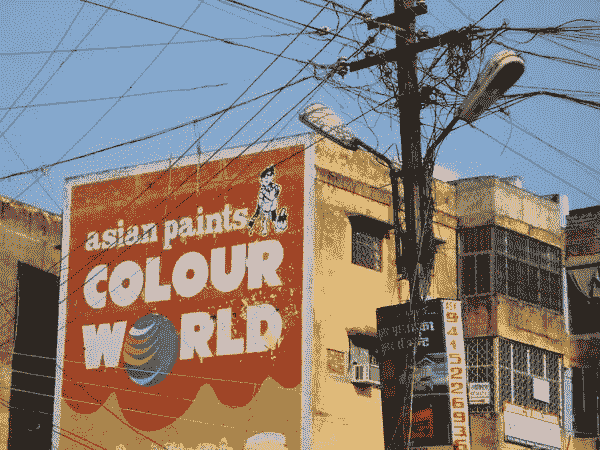

# 这里有一个市场，你可以“不中断”建立一个独角兽

> 原文：<https://medium.com/hackernoon/heres-a-market-you-can-undisrupt-to-build-a-unicorn-da87b48f539f>

(在我继续说下去之前，先介绍一下背景——在国外生活了近 15 年后，我去年回到了印度，全职研究我的想法(和我自己),所以我的帖子和想法通常都是从这个角度出发的。)

# 本着“先卖后建”的精神，我一直在为我的想法测试市场。

如果我在更有凝聚力的国家测试我的想法——大多数人聚集在少数几个地方——这不会很困难。

例如，如果每个人几乎每天都上网，不管他们的人口构成如何，我可以简单地专注于确定满足我需求的前 3-4 个网站，并从那里推动参与。

It has become too popular. Everyone still goes there though (Courtesy: [Pexels](https://www.pexels.com/photo/accounting-apps-bookkeeper-business-273691/))

然而，印度不是这样的。这里有几个吸引眼球的营销渠道的例子。

## 非目标渠道

1.  报纸传单和插页
2.  广告牌(在印度被称为广告牌)
3.  壁画
4.  卡车、汽车和人力车后面的扬声器
5.  调频广播
6.  电影广告
7.  公共汽车和其他公共交通工具的侧面

Literally a Wall Paint ad

## 半渠道和目标渠道

1.  路边亭和摊位(自选)——尽管这种情况正在改变，但这个国家没有足够的商场来使商场摊位成为一种可行的营销渠道
2.  平面广告
3.  报纸分类广告
4.  在线分类广告
5.  WhatsApp 群组
6.  短信广告
7.  像 T2、脸书和 YouTube 这样的庞然大物

在一个有十亿人口的国家，你需要探索大量的渠道来发现哪些渠道最能产生你的目标市场。

另一方面，任何人都可以创建一个统一的界面，通过这个界面，[初创公司](https://hackernoon.com/tagged/startups)和企业可以有效地接触到 3-5 个渠道，从而在营销领域产生真正的影响。

*原载于 2018 年 3 月 15 日*[*ramachandr . in*](https://ramachandr.in/2018/03/14/streamlining-marketing/)*。*