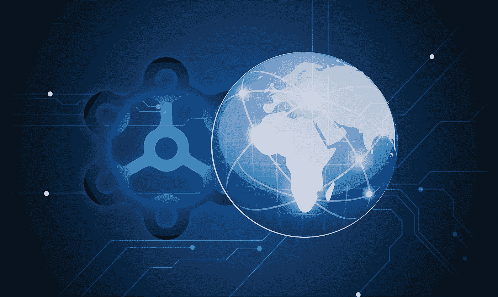

# 以下是区块链将如何改变世界

> 原文：<https://medium.com/hackernoon/heres-how-blockchain-will-change-the-world-3a465a18e33c>

虽然今天有许多改变生活的新技术正在开发中，但很少有技术具有区块链的潜力。区块链技术是一种革命性的存储方法，使外部篡改几乎不可能，它使以前不可能或不切实际的各种活动成为可能。通过关注这种方法是如何进一步发展和应用的，你可以提前感受到变化，这些变化将从根本上重新定义我们交流、学习和做生意的方式。

**分解区块链**

区块链技术是一种数字存储方法，其中各个信息片段相互链接。由此产生的数据集合就像一个长链，几乎不可能被篡改或窃取而不被发现。这使得任何使用区块链的人都可以确信他们的数据是安全的。

**区块链方法的诸多应用**

通过提供高级别的数据安全性和可靠性，区块链技术支持各种活动和资产，包括:

*   可行的加密货币——数字货币只有按照可预测的数量和一致的时间表发行，才能取得成功。区块链是确保这种情况发生的最可靠的方法。出于这个原因，任何使用区块链技术的平台都可以发行自己的虚拟货币，并承诺永远不会因过度生产而使这些资产贬值。这反过来使加密货币销售成为一种可行的投资形式，因为投资者可以像购买股票或债券一样充满信心地购买它们。
*   智能合同——区块链可以存储合同，其中包含关于如何执行条款的全面信息。然后，这些合同根据它们长期收集的信息自我执行，而不需要签约方的任何投入。这使得企业和个人可以签订协议，而不用担心协议会以有偏见的方式执行。这对像虚拟商品生产这样的行业来说尤其有价值，在这些行业，内容创作者和品牌之间的合同在 T4 是出了名的难以执行。
*   质量记录-数字交易需要清晰、准确、可检索的参与者资产记录，以及他们选择如何转移这些资产的记录。区块链技术是创建和保护这些记录的最佳选择。区块链不仅可以抵御外部篡改和盗窃，而且由于它们是分散的，因此可以从各种位置快速访问它们。这使得在全球范围内交易加密货币、虚拟商品和许多其他产品变得更加容易。

随着区块链技术被大规模采用，它将为无数其他为个人和企业创造价值的活动打开大门。比如，通过创造可行的加密货币，区块链让公司在吸引投资方面有了更大的灵活性。同样，通过让生产虚拟商品和其他高需求产品变得更容易，这项技术为消费者提供了更多选择，也为企业提供了更容易获得偿付能力的途径。这些和其他优势有可能在全世界创造财富和机会。

BLMP 2018，新加坡

BLMP(block Chain Licensing market place)是区块链的一家技术公司，致力于消除障碍，促进虚拟商品行业中围绕供应链管理交易的复杂问题的信任。

*BLMP Network 利用区块链技术，将全球的数字平台与全球品牌连接起来，将跨任何数字平台的官方授权虚拟商品货币化；从游戏到流媒体服务&社交媒体，让数百万用户能够接触到一个全新的品牌虚拟产品世界。*

联系我们:

[网站](https://www.blmp.network/)

[推特](https://twitter.com/BLMPNetwork)

[脸书](https://www.facebook.com/BlmpNetwork)

[领英](https://www.linkedin.com/company/blmp/)

[AngelList](https://angel.co/blmp-network)