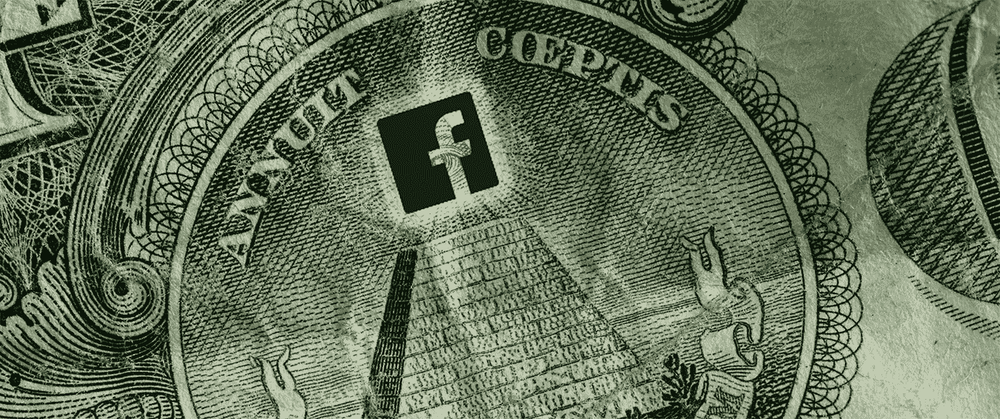
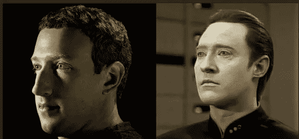
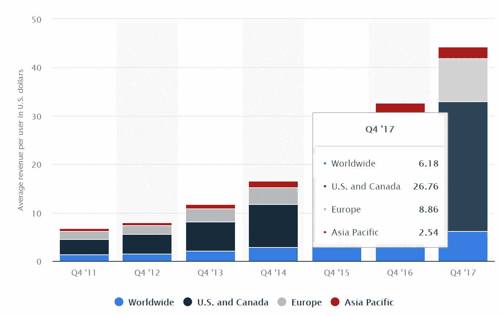
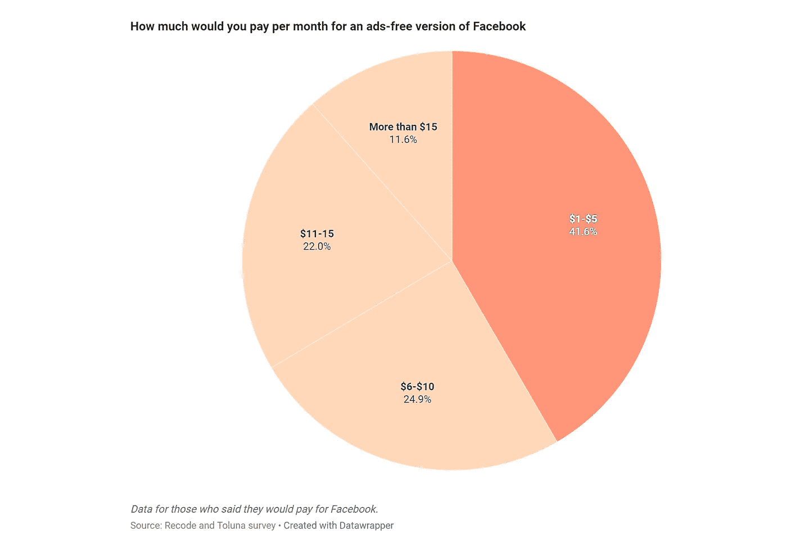
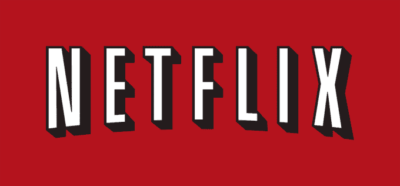
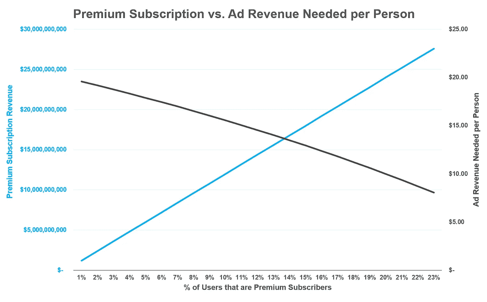
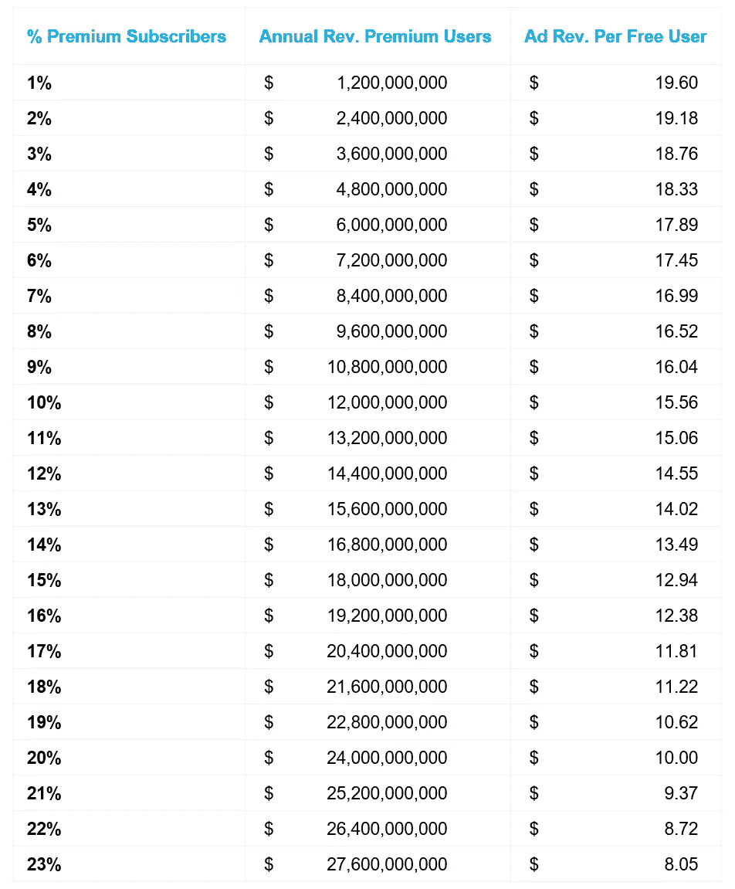
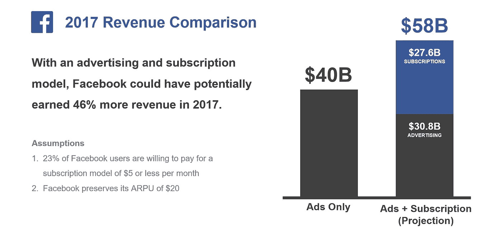
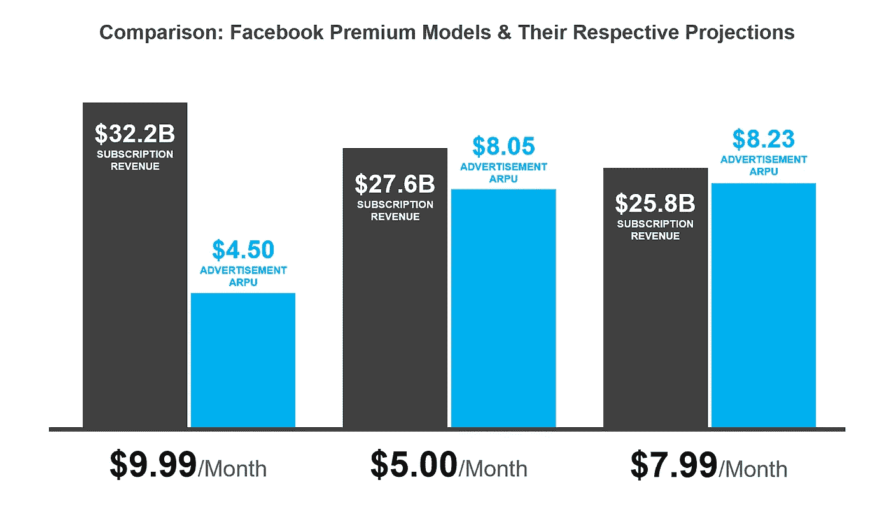

# 为脸书买单

> 原文：<https://medium.com/hackernoon/heres-how-much-facebook-premium-should-cost-12e6d611c854>

## 你会为隐私付费吗？

*参加文章底部的调查，分享你愿意为在脸书获得无广告、数据隐私的体验支付多少钱。我们将在*[*worthy t Twitter*](https://twitter.com/itsworthyt)*页面上发布结果。*

基于消费者的支付模式对我来说是一个非常有趣的领域。作为 [Worthyt](https://worthyt.io) 的联合创始人，我发现自己处于一个非常令人兴奋的领域，帮助社交媒体平台和内容创作者赚取独立于广告的收入——即直接基于粉丝的货币化。用户可以在 Reddit、Twitter 和 YouTube 等网站上发送和接收微提示(少至 10 美分),以支持他们喜欢的平台上的内容！这是足够的商业推销，如果你想了解更多，你可以下载并尝试我们的 Chrome 扩展:

无论如何，当谈到撼动社交媒体商业模式时，显然我开始流口水了。最近，脸书的数据泄露事件引发了今年最大的一次模型重组。在《剑桥分析》的证词中，马克·扎克伯格面临了一连串的质问，让观众怀疑他是否真的是外星人。

就我个人而言，我认为在那几个小时里，作为这个星球上最臭名昭著的人，他很好地控制了自己。话虽如此，一个特别的问题触动了许多互联网用户的心弦:

> 脸书会考虑向使用社交媒体的用户收费吗？

扎克伯格表示，公司“肯定会考虑这样的想法”作为回应，像史蒂夫·沃兹尼亚克(生活在岩石下的人，苹果公司的联合创始人)这样的互联网人物提到，他其实很喜欢这个想法，并且更喜欢一个没有广告的脸书，在那里他不用担心自己的个人数据被监控和出售。

因此，有了这种可能性的基础，现在的问题变成了这个模型会是什么样子，以及用户实际上需要为这个理论上的脸书溢价支付多少钱。

# 数据

## 脸书税收

首先，让我们列出一些数字来了解我们正在处理的问题。2017 年，脸书在全球创造了近 400 亿美元的收入。同样在 2017 年，它打破了用户记录，在当年 6 月全球超过[20 亿用户。](https://techcrunch.com/2017/06/27/facebook-2-billion-users/)

毫无疑问，其大部分收入来自广告，计算得出的结论是，每个用户平均为这家社交媒体巨头带来 20 美元。然而，平均是有误导性的；亚太地区的用户人均收入约为 2.50 美元，而美国的用户人均收入超过 26 美元，相差超过 10 倍。

Average Revenue per User, Q4 2017 — [Source: Statista](https://www.statista.com/statistics/251328/facebooks-average-revenue-per-user-by-region/)

## 用户意见

然而，我们是否忽略了更大的问题？毕竟，我们甚至不知道用户是否愿意为脸书付费！幸运的是， [Recode 和 Tulona](https://www.recode.net/2018/4/11/17225328/facebook-ads-free-paid-service-mark-zuckerberg) 的合作伙伴帮我解决了这个问题。

2017 Study of Facebook Users by Recode

77%的用户即使有选择也不会为脸书付费，而 23%的用户会按月付费。因此，在我们从上一节的数据中了解到的 20 多亿潜在用户中，只有大约 4.6 亿人愿意实际付费。但不止于此。

在这 4.6 亿人中，如果价格超过每月 5 美元，则有不到一半的人(41.6%)不会支付。换句话说，如果强制执行超过 5 美元的入场费，脸书可能只有 2.686 亿用户。因此，考虑到所有这些数据，脸书可以追求什么样的选择，对我们(脸书用户)来说会是什么样的呢？

# 这些场景

## 纯订阅

在纯订阅模式下，用户必须付费才能使用平台。虽然这种模式可能不受欢迎，但它可能是切断与广告商和数据收集联系的更直接的方法。美国著名的视频流媒体服务公司网飞为其用户成功运用了这一模式。如果不付费，用户就无法观看任何视频。但假设采用这种模式，脸书将立即失去 77%的用户，只剩下 4.6 亿潜在用户。

为了产生与 2017 年相同的收入，这意味着每个用户每年必须支付 86.96 美元，或每月 7.25 美元。但是 7.25 美元并不是全部；毕竟，如果价格超过 5 美元，大约一半说愿意付钱的人会争辩说太贵了，不想付钱。

这意味着只有 2.686 亿用户会真正愿意付费。但在这种模式下，价格几乎跃升至每月 12.50 美元！在那个价位，33.6%的人还是愿意支付月租费的。但这意味着我们必须再次重新计算，导致每个用户每月高达 21.57 美元。

根据 Recode 的研究，在这个价格范围内，只有 11.6%的人可能仍然会购买付费机型。因此，最终重新计算后，剩下的用户将需要每月支付 62.50 美元，或者每年大约 750 美元。相比之下，康卡斯特的 Xfinity 服务在马萨诸塞州波士顿的 100 mbps 下载每月收费 49.99 美元。

即使最高 5 美元仍可以利用 23%的脸书用户支付，这也只能让这家社交媒体巨头每年净赚 276 亿美元(每月 23 亿美元)，而其 2017 年的收入为 400 亿美元。收入将下降 31%。通过纯订阅服务，脸书不太可能经营一种让其利益相关者满意的商业模式。

## 高级订阅模式

通俗地说，这种模式被称为*无广告体验*，在 Spotify 或 Hulu 等许多应用程序中经常使用。就连谷歌的视频部门 YouTube 也推出了一个优质的无广告体验 YouTube Red。尽管这些模式听起来很不错，但即使是流行的音乐流媒体服务 [Spotify 在 2017 年也只报告了 50 亿美元的收入](https://www.musicbusinessworldwide.com/spotify-is-set-to-end-2017-with-70m-subscribers-and-5bn-in-revenue-but-how-much-money-will-it-lose/)。因此，尽管脸书的纯订阅模式对其投资者来说可能是不可持续的，但它能在付费模式下生存吗？如果有，多少？

好吧，再考虑一下 5 美元的订阅，因为 5 美元在订阅模式领域并不荒谬——[Hulu 的价格是 7.99 美元](https://www.hulu.com) , [Spotify Premium 的价格是 9.99 美元](https://www.spotify.com/us/premium/?checkout=false),[YouTube Red(现在被称为 YouTube Premium)的价格也是 9.99 美元](https://www.youtube.com/premium)。从前面的分析中，我们知道，如果所有 20 亿用户中只有 23%(4.6 亿)愿意支付，订阅价格每年将产生大约 276 亿美元。剩下的 15.4 亿免费用户，脸书仍然需要通过广告来弥补剩下的 124 亿美元。

这意味着每个用户平均每年需要带来 8.05 美元的收入，或每月 0.67 美元。这比每个用户需要为脸书赚的钱少了近 60%。也许这可以减少 60%的广告。

下面的图表说明了 2017 年基于高级用户百分比的人均广告收入。虽然 Recode 和 Tulona 的研究得出结论，23%的脸书用户愿意支付 5 美元或更少的费用购买高级订阅，但我想知道如果这个比例实际上更低，经济情况会是什么样。

图表显示，即使所有脸书用户中只有 10%每月支付 5 美元的额外费用，每个剩余用户每年只需为每个用户(ARPU)带来大约 15.50 美元的平均收入，而不是 20 美元，这意味着每个用户减少 22.5%的广告收入。

另一方面，如果脸书决定为非付费用户保留现有的免费用户体验，赚取 20 美元 ARPU，其广告收入将为 308 亿美元。结合订阅模式，它将使脸书 2017 年的收入达到 584 亿美元，比实际收入高出约 46%。

An illustration of the 2017 revenue vs. 2017 hypothetical revenue based on my calculations

其他一些要考虑的假设数字可以是从其他高级订阅模型复制粘贴的数字。即使是 10 美元，Recode 的研究显示，愿意支付的受访者中有 58.4%愿意花那么多钱。7.99 美元，这是 Hulu Plus 的低端价格，脸书高级模式的年收入约为 258 亿美元，广告 ARPU 约为 8.23 美元——如果 Recode 研究的结论是准确的，这比 5 美元模式略差。但是 9.99 美元，这是 Spotify 和 YouTube 等公司为其优质服务收取的费用，优质收入可以为脸书带来 322 亿美元的年收入，免费用户可以获得 4.5 美元的 ARPU。

基于这些数字，对于这家科技巨头来说，高级模式似乎是一个值得进一步探索的有趣模式。一方面，脸书可以减少对广告的依赖，另一方面，它甚至有可能提高收入。

请注意，这只是基于公开信息和调查假设的表面分析。还有许多其他假设需要考虑，这些假设会影响整体底线——例如，脸书观众中 18 岁以下的比例是多少？这可能会扭曲可以支付高级服务的相关样本规模，因为许多 18 岁以下的个人没有独立的支付选项(或者他们有吗？现在的孩子真的有吗？毕竟我见过小孩用 iPhones 比我的好，所以我估计也不算太牵强……)。

# 隐私是一种奢侈品

通过高级订阅，虽然脸书会赚更多的钱，高级用户可能会更放心地知道他们的数据不会被第三方出售或窃取，但绝对相信你的数据和消费者资料会安全地存储在脸书，不会被传递出去，可能会让用户仍然感到有点不安。阴谋论充斥着对脸书是否超越其边界监控用户和收集数据的争论，包括通过电话监听。虽然脸书否认这一点，但这一说法和其他说法的存在凸显了社交媒体巨头在保护用户隐私方面的不信任。

与网飞等平台完全放弃广告的纯订阅模式不同，付费模式仍可能要求脸书收集 100%用户群的数据，而只向 77%的用户群做广告。一些付费会员可能会觉得更安全，因为他们知道脸书没有主动大规模出售他们的数据，但如果阴谋论被证明是真的，知道这些数据可能会在某个时候非法获得，甚至是在桌子底下获得，仍然会有些不安。

如果脸书向用户推出 5 美元的高级服务，我怀疑自己会不会注册。即使是 1 美元，我也只是假设，在这一点上，所有公司想要的关于我的甜蜜、有趣的数据都已经被吸干了，而所有真正留给我去保护的是我毫无价值的樱桃核。如果脸书为其用户推出 5 美元的高级服务，以某种方式保证对任何数据跟踪的零容忍(如此无懈可击的承诺，甚至阴谋论者都找不到任何漏洞)，那么我可能会考虑订阅它，并让我未来的孩子加入进来。

但考虑到家庭以及美国家庭平均规模为 2.58 人的事实(呃，什么？)，即每个家庭每月 12.90 美元，或每年 154.58 美元。隐私会成为奢侈品吗？你会认为自己是脸书 23%付费无广告用户中的一员吗？请接受我们下面的调查，一旦结果发布，请在 [Worthyt Twitter 页面](https://twitter.com/itsworthyt)上查看！

