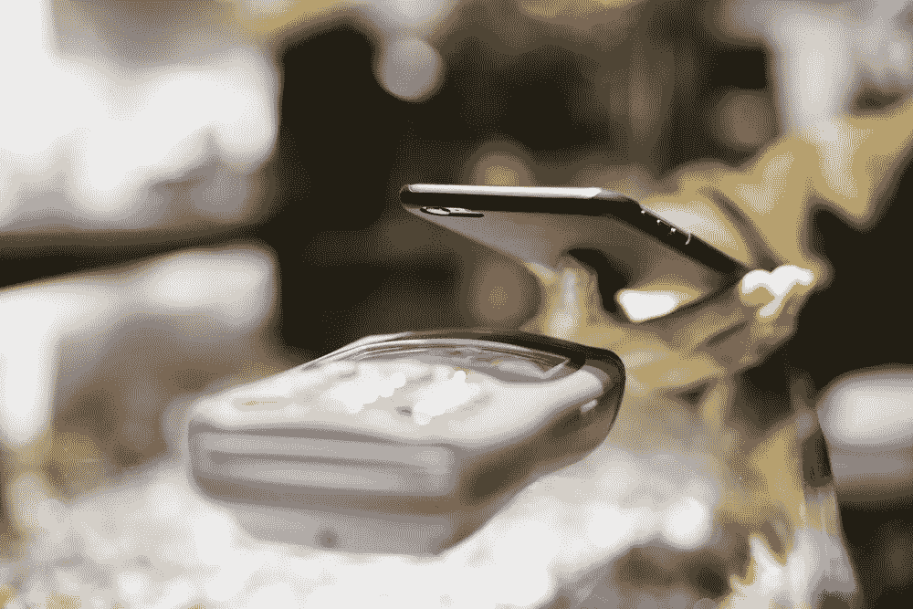

# 以下是 NFC 如何打破隐私壁垒并影响我们的安全性

> 原文：<https://medium.com/hackernoon/heres-how-nfc-is-knocking-down-privacy-barriers-and-impacting-our-security-3f0e5c0fcd09>

还记得第一次需要您的手机号码来创建在线帐户吗？

如果你像我一样，你可能会感到有些不情愿。

*“我不想让他们知道我的手机号码。他们为什么需要它？”*

> 现在，我们大多数人不假思索地输入自己的号码，或者让自动填充功能帮我们完成。

当然，我们都努力保持勤奋，保护我们的数据和个人信息。但是，正如 Equifax 事件告诉我们的那样，它有时真的超出了我们的控制。

## **随着技术在日常生活中变得越来越普遍，我们将继续与数据隐私和安全问题作斗争。**

对于 NFC 或近场通信等技术来说尤其如此，这是一种用于 Apple Pay 和 Amazon Key 等服务的无线数据传输方法。

在 Apple Pay 中，手机中的 NFC 芯片与收银机的扫描仪非常接近，它会激活并传输您的信用卡信息。对于 Amazon Key 来说，NFC 芯片可以让送货员工打开门上的数字智能锁。

> NFC 已经成为主流，它不仅仅是用手机支付食品杂货或递送包裹。

一些人对送货员走进他们家的想法感到震惊。就我个人而言，我更担心的是我们自愿放弃的所有数据，而不是有人进入我的家。

## **如果我们要移交我们的数据，我们应该对它有更多的控制权。**

随着我们在日常生活中越来越多地使用 NFC，它的一些使用案例引起了人们对数据和身体健康安全的担忧。

问题是，使用 UID 标识符存储在标准 NFC 芯片上的数据很容易被克隆或复制。当 NFC 被用于进入某人家中时，出现了一系列新问题，正如亚马逊通过其关键服务所展示的那样。

这种技术可以很容易地让人们通过复制身份进行身份盗窃或欺诈，从而通过智能锁获得访问权限。

## 伪造多重身份的人可以以清洁服务或递送包裹为借口进入住宅。

目前，只有亚马逊的送货团队上门。

但是，如果他们想获得最大的利益，并在全国范围内推广这项服务——目前只有 37 个城市提供这项服务——亚马逊必须扩大他们对邮政服务、UPS 和联邦快递的访问。

随着越来越多的人在家中安装智能锁，从维护和清洁服务到送货人员，每个人都需要访问该系统。

> 让这些数据有一个共同的后端是有意义的，而不是委托给一个实体。

如果你所有的门禁记录都被黑客攻陷了会怎么样？他们会知道你通常什么时候不在家，或者什么时候最容易被闯入。

## 一个基于区块链的系统将有助于解决我们的数据和物理家园的安全问题。

在[区块链](https://hackernoon.com/tagged/blockchain)上复制一个身份并不容易。

清洁工或送货员的身份将明确地与记录联系在一起。一旦有人刷或扫描门禁进入你的家，那记录就是不可改变的。

> 在区块链的门禁系统上，人们可以查看记录，知道是否有任何异常。

当 NFC PKI(公钥基础设施)与区块链结合时，它创建了真实世界和区块链之间的安全链接。个人信息存储在这个分布式系统中绝对更加安全。

**不久前，我做了一个关于这个主题的演讲，有人问我，“你认为未来我们会有门和锁吗？”**

这个问题可能看起来有点极端，但它代表了一个有趣的视角。会不会有一天，我们会对让别人进入我们的家完全麻木不仁，以至于我们对安全的概念会发生改变？

## **NFC 和数据共享运动并没有放缓。**

公共交通系统已经在使用 NFC 进行支付。

亚马逊刚刚开设了第一家没有收银员的商店，允许人们在通过应用程序付款的同时带着杂货离开。厨房电器现在配备了传感器，可以与其他物体进行通信，并收集关于我们习惯的个人数据。

> 我们接触这些设备越多，暴露的漏洞就越多。

由我们来决定在我们的社会中我们想要多少访问和安全，以及为了方便我们愿意放弃什么。

**感谢阅读！**

**想了解更多信息？在这里** **与萨曼莎** [**取得联系。**](https://earn.com/samrad/)