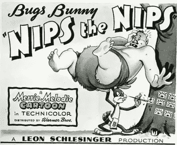
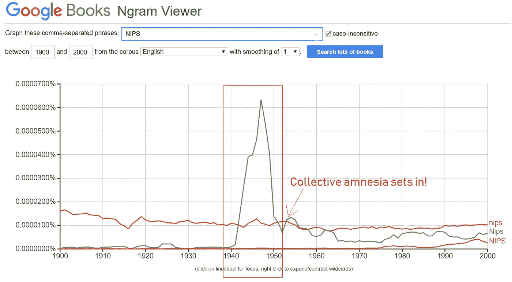
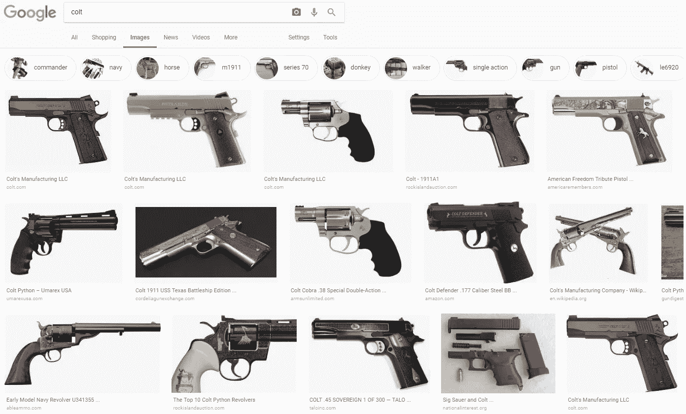

# 这是标题 NIPS 的问题，这不是你可能会想到的:1

> 原文：<https://medium.com/hackernoon/heres-the-issue-with-the-title-nips-and-it-s-not-what-you-might-be-thinking-about-1-523e4b7305c1>

## 对集体健忘症和对暴行的假古化的咆哮

当我浏览抗议 [NIPS 委员会](https://nips.cc/Conferences/2018/Board)可怜的拒绝更改名字的推文和咆哮时，我震惊地得知**唯一的**抗议重点是*在我们的文化中作为带有明显歧视女性内涵的双重双关语的流行。*

*这立即引发了我对白人和特权最迷人的黑暗力量之一的思考:制造、滋养和维持集体失忆症的能力，作为掩盖针对弱者和被剥夺权利者的集体犯罪的工具。*

*很少有人意识到，就在不久前，在这个国家，单词 ***Nips*** 是一个广泛使用的对日本血统的人的蔑称(这是对日语中日本的一种曲解)。事实上，二战期间制作的许多宣传片和文学作品都反复使用了这种诋毁。《西雅图星报》1944 年 12 月 14 日的社论，实际上标题是“ [***是时候对日本人的回归***](http://depts.washington.edu/civilr/after_internment.htm) ”了。就连漫画也未能幸免。1944 年福瑞兹·弗里伦执导的电影《兔八哥之夜》对日本血统的人进行了令人震惊的种族主义描写。(看下面的海报)*

**

*Credit: By Source, Fair use, [https://en.wikipedia.org/w/index.php?curid=34152564](https://en.wikipedia.org/w/index.php?curid=34152564)*

*在五年内，来自政治光谱的两种颜色的军团，社会工程师，权力经纪人，伪活动家，PC / tone 警察部队，以及假“醒来”的盟友已经从语言织锦中洗去了污点，不仅从普通的说法中，而且从普通消费的文学中。(见下面 Google-Ngram 浏览器的图表)*

**

*Source: [https://books.google.com/ngrams/graph?content=NIPS&case_insensitive=on&year_start=1900&year_end=2000&corpus=15&smoothing=1&share=&direct_url=t4%3B%2CNIPS%3B%2Cc0%3B%2Cs0%3B%3Bnips%3B%2Cc0%3B%3BNips%3B%2Cc0%3B%3BNIPS%3B%2Cc0](https://books.google.com/ngrams/graph?content=NIPS&case_insensitive=on&year_start=1900&year_end=2000&corpus=15&smoothing=1&share=&direct_url=t4%3B%2CNIPS%3B%2Cc0%3B%2Cs0%3B%3Bnips%3B%2Cc0%3B%3BNips%3B%2Cc0%3B%3BNIPS%3B%2Cc0)*

*仅这张图表就足以证明理事会声明中所流露出的令人震惊的无知，声明中写道“*”一些受访者想知道这个名字是否被故意选为双关语。事实并非如此。这个名字在 1987 年被选定，牛津英语词典等资料显示，这个俚语指的是身体的一部分，直到几年后才开始使用。*’。没错。真真实实的陛下！在过去的日子里，大约在公元 1987 年，这个词根本没有流行的负面含义！*

*我认为，这种特定的有毒无知与两种交织在一起的现象有着深刻的联系:一种是*错位的受害者身份*，另一种是我称之为 [***的仿古暴行***](https://hackernoon.com/tagged/faux-ancientization) 。*

*当我写这篇文章时，我生动地回忆起我与傻瓜们的愉快对话(无论是在美国还是在印度)，他们确信自己正被狡猾懒惰的*吃白食者*无情地伤害，这些人正榨取学术界或其他地方的平权行动计划 ***，仅仅因为*** 他们的曾曾曾祖父被奴役、致残、种族清洗或被驱逐。这些对话通常会附带一些问题，基本上是“*的变体，他们还能免费通行多久？*'*

*反过来，这又与教育系统的系统阉割和通过掩盖所犯罪行的严重性来删改和粉饰历史教学大纲有关，因此下一代不仅开始于众所周知的清白历史和对有毒的无视背景的精英统治的巨大幻想，而且还被哄骗相信不公正的时代远比它实际存在的时间要长。于是有了 ***的说法*** 。引用凯兰崔尔在*魔戒:指环组:* ***中的话，一些本不该被遗忘的东西丢失了。历史成为传奇。传奇变成了神话。****

*这一惨败事实上强化了多元化董事会/专门小组/委员会的必要性。最近在旧金山一家咖啡馆的一次谈话中，我和我的同事正在讨论 Colt 的一个有趣方面——旗舰计算学习理论会议，名为“ [CALL FOR OPEN PROBLEMS](http://www.learningtheory.org/colt2018/call.html#openproblems) ”，当时我们旁边的人(她显然在司法系统工作)非常震惊地得知在 ML/AI 中有一个名为“ *Colt* 的旗舰会议。“你知道什么是*小马*吗？”她问。她让我们进行谷歌图片搜索，而不是进行口头现实检查。*

*所以，是的。这是图片搜索结果的样子！*

**

*总结一下，*

*1:如果你觉得有必要为此做点什么，这是 change.org 的请愿书:*

* [## 在请愿书上签名

### NIPS 董事会成员:#抗议者 NIPS: NIPS 首字母缩略词鼓励性别歧视，是一种诽谤。更改名称

www.change.org](https://www.change.org/p/members-of-nips-board-protestnips-nips-acronym-encourages-sexism-and-is-a-slur-change-the-name?recruiter=552354677&utm_source=share_petition&utm_medium=twitter&utm_campaign=share_petition) 

2:在推特上放大自己声音的标签是: [# **抗议者**](https://twitter.com/hashtag/ProtestNIPS?src=hash)

3:这是一个不完整的咆哮。鉴于 NIPS 研讨会的最后期限即将到来，我将把这篇咆哮的第二部分推迟到周末，内容涉及黑色幽默、伦理和行动主义之间的相互作用。

合十礼。*