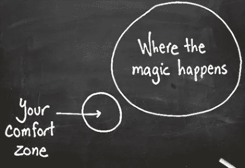
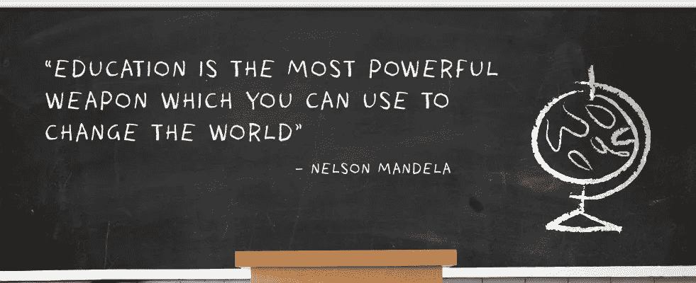
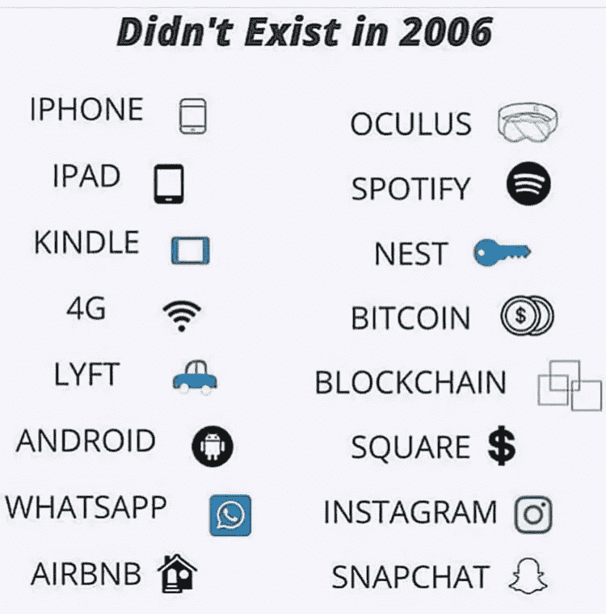
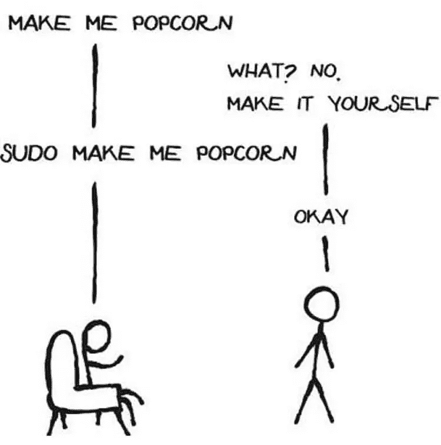

# 这是两年自学编程教给我的东西

> 原文：<https://medium.com/hackernoon/heres-what-2-year-long-self-taught-coding-taught-me-6e047de8fe58>

If you want to get anywhere, you must not fear exploration.

## 我的背景

2001 年我 4 岁。那是我第一次用电脑“上网”。从一开始，我就一直是个好奇的孩子。我知道如何设置拨号连接、上网、查看电子邮件、在雅虎信使上聊天、谷歌搜索等等。尽管有网络狂热，微软绘画和弹球一直是我的最爱。我喜欢在 MS Word 上写作，并随意打印出来。这让我觉得自己很强大。

当我写这篇文章时，我是一名大四学生，正在攻读信息技术专业的工程学位。现在情况变了——没有“拨号上网”了。我既不玩弹球，也不随便打印，觉得自己战无不胜。

> 作为一个孩子，没有人真正听你的。每个人都认为你是理所当然的，因为你是一个 4 岁的孩子。但是你知道吗？电脑非常认真地对待我的命令。我让它做什么它就做什么，这就是作为一个孩子，我通过使用电脑感受到的力量。

我想让每个人都觉得他们的声音被听到了，并采取了行动。这就是为什么我想提出申请。应用程序听取来自各个种族、种姓、宗教、性别、肤色的人的意见。申请没有歧视。

> 这就是我如何发现我应该学习如何编码，如果可能的话，教别人如何编码。

现在，我已经把自己培养成可以生产的应用程序。尽管学习永无止境，但将课堂知识应用到现实世界中所获得的满足感是无与伦比的。

# 成功的秘诀存在吗？

Mediocrity is achieved when one operates within the comfort zone. Excellence is achieved when one operates outside the comfort zone.

如果我告诉你有一个预先准备好并经过检验的成功秘诀，你会相信吗？你们大多数人会说:没有。那为什么我们一直在谷歌上搜索“如何成功”或者看“成功人士的共同习惯”之类的视频呢？是因为我们想从文章和视频中找到相似之处吗？

**嗯，简而言之:没有取得成功的秘诀。**

# 长回答—

在学习如何编码的 2 年漫长旅程中(实际上我仍处于学习阶段，它永远不会停止)，唯一让我坚持下去的是，我最初开始的原因在我做的每件事情中都实现了。我从未觉得这是浪费时间/精力。

## 有高潮也有低谷。

我们知道坐在屏幕前几个小时试图解决一个错误是多么可怕。这个错误不仅会让代码停止工作，还会让你发疯。有时候你会想辞职，只为了一个假期。谁不觉得低？但真正的问题是:即使经历了这一切，你还想回来调试那个 bug 吗？调试完小 bug 有没有觉得自己学到了很多东西？做更多的事会给你带来刺激吗？

也有过几次高潮。例如，在业内得到认可和欣赏意味着很多。当您第一次运行脚本时没有一个错误和警告。当你的同事走过来问你一个编码问题时，你会觉得这很重要。当你开始从你喜欢做的事情中赚钱时，感觉就像一个童话故事。这种感觉是解放的，授权的。感觉你无所不能。几乎任何东西。

> 关键是永远不要停止探索。科技充满了冒险。它教会你微妙的细微差别，教会你耐心，教会你如何维护事物。

在编程语言中，感谢上帝他们没有口音，否则世界上某些地方的一些语言会很难理解！编程语言的好处在于，你可以随意改变它的形式。JS 等一些语言的通用性超乎想象。曾几何时，JS 不被认为是一个很好的工具，现在它是一切。

> 技术专家是新的上帝。他/她可以用区块链、机器学习、物联网等技术改变你的整个世界。

这里点几下，那里点几下，就可以创建任何应用程序。这听起来不是比什么都厉害吗？

# 在这两年中，我学到的 10 件事—

1.  **没有什么是容易的。没什么。甚至对技术人员也没有:**我肯定你听说过类似“在 5 分钟内完成这件事”、“用 6 行代码完成这件事”的教程。但是在这 5 分钟和 6 行代码的背后，坐着一个计算机科学的奇迹，他应用了非常有思想的工程逻辑，让你在 5 分钟内得到结果。我们今天使用的所有机器学习的 API，都有奥术知识投入使用。那些 API 调用起来容易做起来难。幸运/不幸的是，在这个行业中，仅仅调用 API 是不够的。你必须知道如何从头开始构建它。换句话说，算法逻辑是不可分的。
2.  **时刻让自己跟上最新潮流:**2006 年还不存在的东西清单:instagram、snapchat、区块链、物联网、比特币、iphone、wifi、认知计算、云计算、Uber——不一而足。你看，如果你不保持更新，你可能会成为一个 70 岁的人，不知道这个世界上发生了什么。最终，道恩的理论会作用于你。

**3。探索是无可替代的:如果你害怕涉足深水领域，那么你将很难在科技行业取得成功。如果你每天都没有学到任何新东西，那你对科技世界来说就太慢了。**

**4。代码中出现 bug 是一件幸事:**实际上这都是关于视角的。我是这样看的——错误越多，学习就越不舒服。bug 占了学习内容的 40%左右。

**5。编程教你简单:**编程最棒的一点是，最终每个问题都被分解到最后一点，这使得问题看起来更简单。同样的类比也适用于日常生活。如果你是编程高手，你很有可能是处理生活曲线球的高手。

**6。编码让你成为更好的表现主义者:**编程时的最佳实践之一是使用注释和清晰的逻辑来保持代码的可读性。这意味着您没有机会弄乱代码。一切都清晰、简洁。这导致你成为一个更好的表现主义者。

**7。编程让你成为一个问题解决者:**在你学会如何编码之前和之后，你对待问题的态度会完全不同。

**8。你很清楚你周围的环境:因为你太了解这个系统，所以诈骗者很难欺骗你。例如，你在信用卡诈骗中上当的几率非常低。你会知道所有的诡计，因此提前很好地意识到它。你知道保持在线安全的最佳实践。这也可能让你成为家里的宗师。**

**9。编码让你意识到自己的潜力:**编码给你动力。它让你觉得你可以做任何事情来改变这个世界。你需要的只是一个想法、一台笔记本电脑和一个互联网连接。你可以四处去黑 WiFi 取乐，你可以做很酷的人工智能应用什么的。

**10。编码让你与上帝相连:**编码让你意识到自己的真正潜力，这一事实让一个人感觉自己像上帝。每个人都有改变世界的潜力，只是他们中的一些人会引导自己的能量。你对自己的兴趣探索得越多，你就会变得越强大。

我希望我们每个人都能意识到自己，这样他们才能知道科技是如何改变他们的生活的。值得一试。