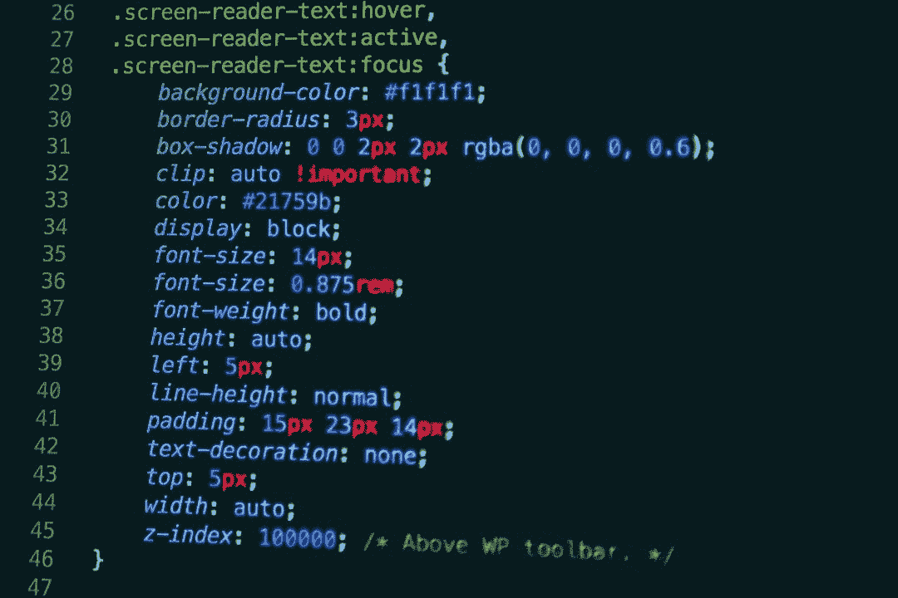
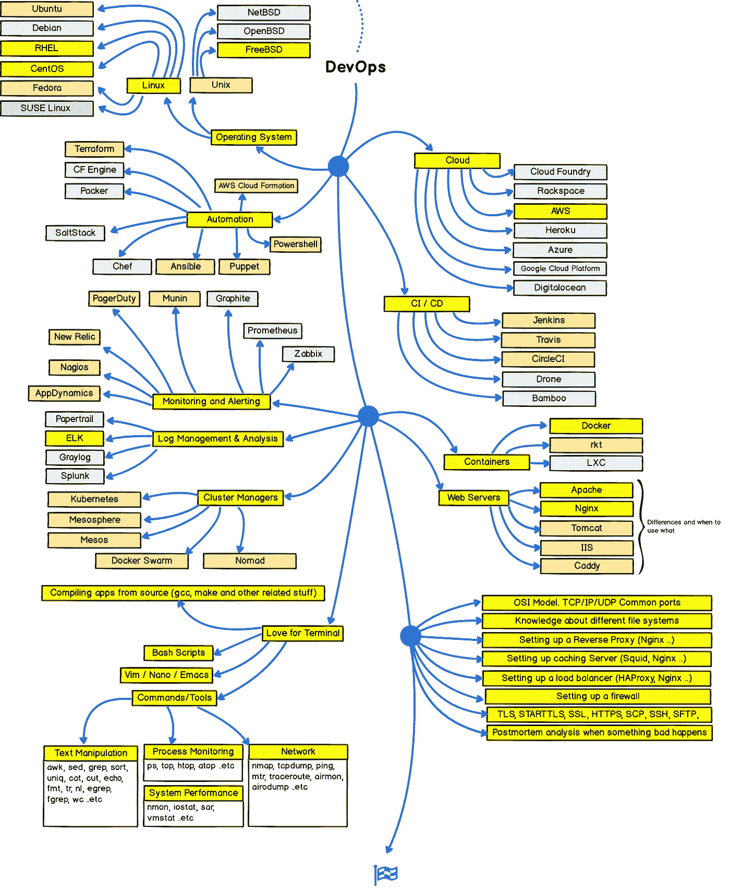

# DevOps 不是这样

> 原文：<https://medium.com/hackernoon/heres-what-devops-isn-t-f37e40af05ea>

本文主要澄清围绕 DevOps 的一些误解。然而，考虑到观众中可能有读者不知道 DevOps 实际上翻译成什么——作为一个定义，我将无耻地复制维基百科对术语“DevOps”的定义，并试图以一种真正理智的方式绕过它。定义如下:

> DevOps 是一种软件工程文化和实践，旨在统一软件开发(Dev)和软件运营(Ops)。DevOps 运动的主要特征是强烈提倡在软件构建的所有步骤中进行自动化和监控，从集成、测试、发布到部署和基础设施管理。DevOps 旨在缩短开发周期、增加部署频率和更可靠的版本，与业务目标紧密结合

Tbh(其中“h”是“诚实”的缩写)，DevOps 是一个持续改进的过程——这也是它有趣和值得追求的地方。从设计背景来看，当我第一次跳入编程和开发时(那时，对我来说所有的“开发”都是重新编写 Android 内核和从已有的皮肤或“rom”中挑选提交)，我发现自己处于一种疲惫的状态。然而，DevOps 抓住了我的兴趣——这是一个永无止境的改进过程。

现在我们已经熟悉了 DevOps 到底是什么，让我们把注意力集中在这篇文章的标题所关注的主题上——devo PS 不是什么。有很多关于 DevOps 的误解，事实上，我也陷入了很多这样的“误解”——直到一个真正的 DevOps 工程师为我澄清了它们。

# 误解一——一个称自己为熟练的#DevOps 工程师所需要做的就是学习一堆工具

不。DevOps 不仅仅是学习“一套工具”的学科远不止这些。当然，无论如何都不能忽视所有这些“工具”,比如 Docker、Jenkins 和 Ansible(这三个工具都是开源的)——还必须精通它们。DevOps 工程师基本上是“获取开发团队编写的代码并使其在生产级环境中的服务器上可靠运行的人。”

除了熟悉工具之外，如果不精通，也必须熟悉编程语言，如 Ruby、Python、Go、Javascript 和 C++。

# 误解二——“我们公司做 DevOps。我们用詹金斯自动部署！”

在进入#DevOps“场景”之前，我所做的就是创建网站。就是字面意思。以前只要我有了新想法，我就会为它创建一个网站——这让一切看起来更“官方”，也让我的 GitHub 图表更环保。

我觉得我有点跑题了。然而，重点是——有一个叫做“Netlify”的工具，它帮助开发者为网站提供服务，他们使用自己喜欢的编程语言(我知道)创建网站，比如 HTML 和 CSS，有时甚至是 Javascript，通过将 GitHub、GitLab 或 BitBucked 存储库绑定到服务上。

除了可以免费将一个域连接到 Netlify，并且该服务向该域提供一个自动的(免费的)SSL 证书之外，Netlify 一旦在存储库中合并了一个更改，就会自动触发一个新的部署，这是它真正美丽的地方。

然而，作为一个使用 Netlify 在互联网上部署了某个网站的开发人员，我没有资格说我“做了 DevOps”或“沉迷于 DevOps 来部署网站”只是没有。

# 误解三——devo PS 不仅仅是自动化

虽然自动化是 DevOps 的一大部分，但我们不能将 DevOps 的全部等同于自动化。当涉及到 DevOps 时，还有很多事情要做——毫无疑问，自动化是其中必要且“关键”的一部分。

想象一下，你站在一个满是听众的礼堂前，这些人对你演讲的主题非常熟悉，而你的一个同事却脱口而出“DevOps”这个术语。想象一下，你所做的就是用 Netlify 做网站。在这一点上，(由于重复和明确的方向)你知道这里的主题是我和我的同事刚才说“DevOps”以“听起来很酷，更有经验。”

想象一下，你在那种情况下，一个真正的 DevOps 工程师问我们这个术语的用法。尽管我的同事非常自信地处理了(极其尴尬的)情况，但他确实错误地指出，DevOps 只不过是自动化，像拥有自动化部署这样简单的事情可以帮助人们自称为真正的“DevOps 工程师”

## 结束的

最后，希望这个由 [Kamran Ahmed](https://medium.com/u/d4eb92ea1991?source=post_page-----f37e40af05ea--------------------------------) 创建的 DevOps 路线图能像帮助我一样帮助你。前端和后端也有专门的路线图，你可能也想[看看这些](https://github.com/kamranahmedse/developer-roadmap)。要了解现实生活中的 DevOps 工程师实际上是如何工作的，你可能想要阅读[哈维·乔哈尔](https://medium.com/u/37a20dd28fc5?source=post_page-----f37e40af05ea--------------------------------)在 [Onfido Tech](/onfido-tech/how-we-devops-onfido-2fb8e69a1b83) 博客上的文章。

*PS-请随意对我阐述事实和发布☺的方式提出改进建议*

*原载于 2018 年 5 月 10 日*[*【punyavashist.com】*](https://punyavashist.com/blog/2018/05/10/here's-what-devops-isn't/)*。*