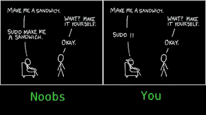

# 下面是你需要知道的关于 Linux 的一些事情

> 原文：<https://medium.com/hackernoon/heres-what-you-need-to-know-about-linux-a7de13769a74>

Linux 就像空气——你感觉不到它，甚至不知道它的存在，但你仍然需要它。从你令人上瘾的 Android 智能手机和所有你喜欢的应用程序，到空中交通控制站，甚至大型强子对撞机，一切都在 Linux 上运行。对于那些不知道的人来说，Linux 是一个基于 UNIX 的开源操作系统。我们将在这篇文章的后面讨论技术细节。

But alas, UNIX is not free

在这四年中，每个工科学生都至少会遇到和体验过一次 Linux。我的是第一年的暑假。

NIT Trichy 的技术俱乐部——Delta 和 Spider 正在招聘 Web 开发人员和应用程序开发人员。加入这些俱乐部意味着有机会与有才华的前辈和同龄人一起工作，并向他们学习。入职培训包括几轮贯穿整个假期的编码任务，以及一次黑客马拉松和我们回到大学后的[面试](https://hackernoon.com/tagged/interview)。我很自然地对学习和申请哪个角色感到困惑，因为我对此一无所知。然而，我看到了一个大多数人包括我自己都忽略了的机会——系统管理员的职位。这个名字很有吸引力，我决定试试看。

然后开始了我的 Linux 之旅。我的整个夏天都在尝试双重启动我的笔记本电脑并让它崩溃，安装虚拟机，配置 SSH，FTP，Samba 服务器，学习 LVM，Bash 脚本，最重要的是想知道为什么它对我不起作用，就像对 StackOverflow 上的那个家伙一样。经过几个小时的调试，超过了我对 Linux 的了解，我的耐心增加了(我的视力也增加了，因为下个月我必须戴眼镜)。

SSH protocol is used for remote login to another system

学习 Linux 让我对计算机及其操作方式产生了兴趣。没过多久，我就完全迷上了 Linux——在远程计算机上工作(通过 SSH)和在没有互联网连接的情况下传输文件(通过 Samba 服务器)对我来说就像魔术一样。我开始为自动化编写脚本，并用来设置提醒(cron 作业)。

我最终加入了蜘蛛俱乐部。Linux 技能也有助于获得明年的实习机会。

无论动机是什么，Linux 都是程序员和电子爱好者必须学习的操作系统。当你开始从事技术工作时，这几乎成了一种必然。我的许多同学在工作面试中被问到关于基本 Linux 命令和概念的问题。

Linux 的实践经验胜过通过陈旧教科书的数小时学习。如果您希望对 Linux 有一个基本的了解，或者您即将有技术面试，下面的内容可能会对您有所帮助。

# 这里有一些你必须知道的基本 Linux 概念。

## 1.什么是 Linux？

Linux 是基于 UNIX 的开源操作系统。操作系统是管理计算机硬件和软件的系统软件。假设你想执行 25597 / 10，操作系统是一个便于输入由计算机处理器(硬件)执行并显示到监视器屏幕(软件)的系统。开源意味着，一些优秀的人做了开发软件的所有工作，并免费发布源代码。您可以添加自己的功能，甚至调试源代码。

Linux 有各种风格/发行版，如 Fedora、Ubuntu、OpenSUSE，这些都是商业版本，而 Debian 和 Arch Linux 完全是社区驱动的。所有这些都有 Linux 内核。Linux 因其多功能性、强大的功能、快速的速度和让他们无缝安装软件的包管理器而吸引着程序员。

## 2.内核是什么？

内核是操作系统的心脏。Linux 内核是一个底层系统软件。它为用户级交互提供了一个接口。它管理系统资源，如内存、磁盘、处理器、输出设备等。

## 3.Linux 中的 shell 是什么？

Linux shell 基本上是一个用户界面。您可以将您的输入输入到 shell 中，shell 将执行命令并与 Linux 操作系统进行通信。这里也有各种各样的——巴什(伯恩还是壳牌)、CSH ( C 壳牌)、KSH(光辉壳牌)和 TCSH。

## 4.什么是 Bash？

BASH 是 Bourne Again SHell 的简称。它也是一种命令语言，有自己的命令语法。

## 5.Linux 中的文件权限是什么？

Linux 操作系统中有 3 种类型的权限，如下所示:

*   **读取:**用户可以读取文件并列出目录。
*   **写入:**用户可以在目录中写入新文件或修改文件。
*   **执行:**用户可以访问并运行目录下的文件。

这里的目录类似于 Windows 中的文件夹。chmod 和 chown 命令用于控制对 UNIX 和 Linux 系统中文件的访问。chmod 命令代表“更改模式”，允许在 Linux 中更改文件和文件夹的权限。chown 命令代表“更改所有者”。

使用 chmod，用户 U、组 G 和其他人 O 可以被授予不同的权限，比如对文件和目录的读、写或执行。读取的值为 4，写入的值为 2，执行的值为 1。添加所需权限的值，并将其分配到 UGO 的相应位置。

## 6.sudo 是什么？

它代表“超级用户做！”。如果您在任何 Linux 命令前添加“sudo ”,它将以提升的权限运行该命令。因此，您现在可以执行某些管理任务，如安装服务器或重新启动。

## 7.给‘sudo RM-RF *’会怎么样？

它是删除计算机上所有内容的代码。rm 表示删除，-rf 标志强制删除整个文件夹。*代表 Linux 系统上的所有文件/文件夹。

Nope, Never doing that

## 8.Linux 中的编辑器有哪些？

文本编辑器是任何操作系统的必备应用程序(用于纯文本、编写代码)。Linux 编辑器可以分为两类，

* GUI 编辑器——它们是图形化的、用户友好的。格迪特和崇高。*控制台文本编辑器。—它们就在终端内部工作。但是对初学者来说很难。比如纳米，六，维。

## 9.你在 Linux 文件系统中使用什么命令？

*   **pwd:** 这是一个内置命令，代表“打印工作目录”。显示你当前所在目录的完整路径。
*   **是:**该命令列出当前文件夹中的所有文件。
*   **cd:** 这代表‘更改目录’。该命令用于从当前目录切换到您想要工作的目录。
*   **mkdir:** 该命令用于创建一个全新的目录。
*   **rmdir:** 该命令用于从系统中删除一个目录。

## 10.什么是一些 Linux 文件内容命令？

*   **头:**显示文件的开头
*   **尾:**显示文件的最后一部分
*   **cat:** 连接文件并在标准输出(终端)上打印。
*   **更多:**以页面形式显示内容—一次一页。
*   **less:** 以页面形式显示内容，允许后退和单行移动。

Awwwww

## 11.Cron 是什么？

软件工具 cron 是一个基于时间的作业调度程序。Cron 安排作业(命令或 shell 脚本)在固定的时间、日期或间隔定期运行。您可以将其设置为每周五晚上下载一部电影(编写一个脚本来下载最新的电影并将其分配给 cron)。

## 12.什么是 LVM？

LVM 或逻辑卷管理是一种存储设备管理技术。它使用户能够集中和抽象组件存储设备(如硬盘和外部驱动器)的物理布局，以便更轻松、更灵活地进行管理。

## 13.什么是 CLI？

CLI(命令行界面)是 Linux 中一个基于文本的界面，它允许用户与操作系统和应用程序进行交互。它不像微软的 GUI(图形用户界面)有图形图标、链接和文件夹。CLI 允许用户通过手动输入命令来执行任务。它的工作机制非常容易和快速，但它不是用户友好的。

## 14.LILO 是什么？

LILO (Linux Loader)是 Linux 操作系统的引导加载程序，用于将它加载到主内存中，以便它可以开始运行。这里的 Bootloader 是一个管理双重引导的小程序。LILO 驻留在 MBR(主引导记录)中。

## 15.什么是 Grep、Awk 和 Sed 命令？

Grep、awk 和 Sed 是三个最有用的命令行工具。

*   grep(**G**global**R**egular**E**xpression**P**rint)用于搜索文件中的特定术语。找出你的项目报告中所有包含“结果”一词的行。
*   Awk 是一种文本模式扫描和处理语言。它主要用于 Excel 文件中的数据提取和报告。例如，只打印 excel 表格的某些列。
*   Sed 是指**S**stream**Ed**itor。它可以对给定的文件或输入流执行文本转换。例如，你分享了你朋友的作业。要用您的名字替换他的所有名字，请使用 Sed。

## 16.如何在 Linux 上找到帮助？

*   运行带有-h 或–help 标志的命令。例如，要了解 ls，请键入 ls -help。
*   man 命令显示了每个命令的详细手册。这些被称为“手册页”如果您想了解 ls 命令，请键入 man ls。

May the Linux be with you

以上问题绝非详尽无遗。要开始探索 Linux，请使用这些链接— [Link1](https://www.pcworld.com/article/2918397/operating-systems/how-to-get-started-with-linux-a-beginners-guide.html) 、 [Link2](https://www.tutorialspoint.com/unix/) 。有很多好的资源可以帮助你发展 Linux 技能。

> 大多数优秀的程序员从事编程不是因为他们期望得到报酬或得到公众的奉承，而是因为编程很有趣。
> 
> - Linus Torvalds，Linux 的创造者