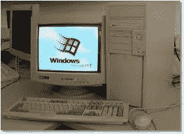
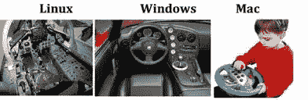
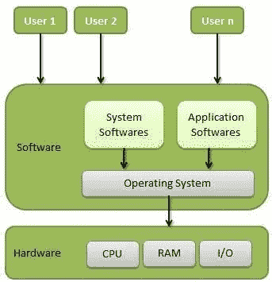
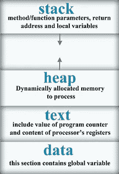
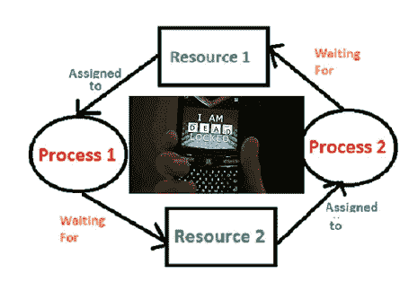
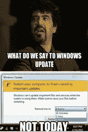

# 以下是你需要了解的操作系统

> 原文：<https://medium.com/hackernoon/heres-what-you-need-to-know-about-operating-systems-a40603e74b8d>

我拥有第一台个人电脑的时候才 7 岁。我父亲在 90 年代是一名软件工程师，所以我们是印度最早采用个人电脑的人之一。当他用它收发电子邮件和工作时，我用它来玩扫雷、玩 MS paint，当然，还偷偷打印了多拉·爱探险的彩色照片。直到现在，我爸爸都不知道怎么会在一天之内把所有子弹都用完。我童年最美好的时光是在开机时看到 windows 标志，因为那是进入互联网神奇世界的入口。

I had something like this PC

七岁的我可能从未想象过有一天我可以从手机上浏览——更不用说想到黑砖手机会变得得心应手。我这一代人是伴随着人类历史上最先进的技术成长起来的——互联网、视频通话、社交媒体、笔记本电脑、智能手机，以及人们所关心的一切——银行支付、购物、订票(电影和交通)、网上订餐。虽然我们适应了光速的这些变化，但我们在掌握它的技术诀窍方面却落后了。

从电脑开始，我有很多问题。作为一个孩子，我不明白一台机器怎么会如此强大，也不明白到底是什么让比尔·盖茨成为了(当时)世界上最富有的人。原来这两个答案都与术语“[操作系统](https://hackernoon.com/tagged/operating-system)有关。虽然我掌握了它的基本知识，但大学里的一门选修课“操作系统”帮助我了解了它的全貌。这让我对这些概念产生了浓厚的兴趣，最终我成为了一名嵌入式软件开发人员，这要求我从事操作系统方面的工作。

理解操作系统绝对是值得花时间的，因为你会明白是什么力量和能力让这些小玩意组成了今天的世界。这篇文章将作为初学者对操作系统的**介绍。**

1.  **什么是操作系统？**

操作系统是用户和计算机硬件之间的媒介。你给计算机的指令是由操作系统执行的。这是一个管理计算机硬件的软件。当计算机通电时，它会一直运行。

**2。最常用的操作系统是什么？**

操作系统为笔记本电脑、个人电脑以及操作华尔街、网络等的大型服务器提供动力。微软的 Windows 是个人和官方使用的选择。就采用率而言，苹果的 MacOS 仅次于 Windows。Linux，在开源操作系统上，是计算机程序员最喜欢的，也用于运行巨大的服务器。要了解更多关于 Linux 的知识，请参考我之前的文章[。](/@amirtha255/heres-what-you-need-to-know-about-linux-a7de13769a74)

**3。操作系统有哪些类型？**

随着计算机从真空管发展到晶体管，再到集成电路，再到超大规模集成电路，操作系统也经历了重大变化，以跟上计算机的发展。

*   **批量操作系统**——该操作系统不直接与电脑配合工作。一个操作员(人)接受具有相同需求的相似工作，并将它们分组为批次。这些批处理然后被交给 CPU 执行。操作系统的效率取决于操作员对作业的分组。
*   分时操作系统(Time-sharing OS)-在这里，任务被给定一个时间片/时间段来执行。这允许许多用户以公平的方式共享计算机资源，并且提高了 CPU 利用率。任务可以来自单个用户或多个用户。例如 UNIX
*   **分布式操作系统**——有效地管理一组不同的计算机(每台都有自己的内存和 CPU)，并使它们看起来像一台计算机。这允许共享访问文件、打印机和应用程序。
*   **网络操作系统** -单独的计算机有一个**公共服务器**，运行不同操作系统的计算机可以加入一个公共网络。像在分布式系统的情况下，远程访问是可能的。服务器的存在增强了整个网络的安全性。它们是紧密耦合的。
*   **实时操作系统**——顾名思义，它们是为时间要求非常严格的实时设备设计的，比如空中交通管制、导弹控制，甚至是自动驾驶汽车。在这里，延迟可能会导致失败。

**4。有哪些程序和流程？**

这两个术语之间有一个简明的区别。计算机程序是当被执行时执行特定任务的一组指令。进程是正在执行的程序。也就是说，为计算编写的 python 程序在执行操作时变成了一个进程。

**5。操作系统的功能是什么？**

Taken from tutorials point

如图所示，操作系统是一个与系统软件(编译器，编辑器，..)和应用软件(由用户运行)，并使用硬件执行它们。以下是操作系统的主要功能:

*   设备管理—通过设备驱动程序与设备通信，使用 I/O 控制器跟踪设备，将设备分配给进程。
*   内存管理——分配主内存/RAM ( CPU 可以快速访问它，程序在这里执行)并跟踪它。
*   处理器管理—监控处理器(CPU)和进程状态，并按预定方式分配 CPU 进行处理。
*   文件管理—控制文件系统(目录和文件)以及对它的访问。
*   安全性—提供身份验证并防止未经授权的访问。

它还监视作业和系统性能。

**6。一个进程的内存布局是怎样的？**

一个程序装入内存就变成了一个进程，内存布局由栈、堆、文本和数据组成。

Taken from bitsofcomputer

**7。什么是排班？**

在一个系统中，多个进程希望使用 CPU 来执行。为了管理它们之间的处理器，进程管理器(OS 的一个组件)选择就绪的进程并调度它执行。它必须删除一个已经运行的进程——可能是因为它完成了**或**,它需要一个输入/输出设备，并等待它**或**让其他进程拥有它们的 CPU 时间份额。这一切都是基于一定的算法。

这些进程使用时间复用来共享 CPU。每个进程都有一个称为 PCB(进程控制块)的数据结构，其中包含有关自身的信息，用于调度。流程可以处于任何状态—就绪、运行或等待。

**8。有哪些调度算法？**

进程管理器根据调度算法调度不同的进程分配给 CPU。

*   先来先服务调度
*   最短作业优先(SJF)调度
*   优先级调度
*   最短剩余时间优先(SRTF)
*   循环调度
*   多级队列调度

这些算法不是**非抢占式就是**抢占式。在非抢占式中，一旦进程进入运行状态，在完成分配给它的时间之前，它不能从执行中删除。抢占式调度是基于优先级的，最高优先级的进程一旦准备好就被给予 CPU，抢占任何较低优先级的进程。

**9。有哪些线索？**

线程或通常称为轻量级进程是进程内的执行路径。一个进程可以包含多个线程。它用于引入并行性，例如，当你访问脸书时，一个线程弹出通知，一个线程在你的提要中带来新的帖子，而一个线程可能显示聊天。

同一进程的线程共享代码段和数据段。它们被分为用户级线程和内核级线程。

**10。什么是内存管理？**

内存管理是操作系统的一项功能，用于将程序加载到主内存中。主存储器也称为 RAM。计算机只能运行内存中的程序。因此，每个要执行的程序和每个要访问的文件都必须从存储设备复制到主存储器中。这就是所谓的装载。

交换是将每个进程放入主内存，运行一段时间，然后再放回辅助内存/磁盘。当 RAM 中没有足够的空间来容纳所有竞争 CPU 的进程时，就使用它。

**11。什么是虚拟内存？**

众所周知，所有进程都需要内存。为了寻址比系统上物理安装的内存更多的内存，引入了虚拟内存的概念。这个额外的内存实际上是硬盘的一部分，用来模拟电脑的内存。它允许程序比物理内存更大。MMU(内存管理单元)用于将虚拟地址转换为物理地址。

**12。什么是缓存？**

**F** 主内存中频繁访问的数据被复制到速度更快的存储系统**缓存**。当需要数据时，检查数据是否存在于缓存中。如果没有，它将从 RAM 或磁盘复制到缓存中以备将来访问。如果再次需要该数据，这将减少搜索时间。高速缓存是有限的，并且因为它的高成本而不能代替主存储器。

**13。什么是中断？**

中断是来自连接到计算机(硬件)的设备或来自计算机(软件)中需要操作系统立即注意的程序的信号。根据中断的优先级，操作系统会决定该做什么。它通过执行对应于每个中断的称为中断服务程序的代码来处理中断。例如，被零除会导致中断。

**14。什么是进程同步？**

基于同步，流程有两种类型:

*   **独立进程:**一个进程的执行不影响其他进程的执行。
*   **协同流程:**一个流程的执行影响其他流程的执行。由于这里资源是共享的，所以这里出现了进程同步问题。

**临界截面问题**

临界区是一段代码，一次只能被一个进程访问。它包含需要同步的共享变量(同一变量的所有实例必须具有相同的值)以保持一致性。为了解决这个问题，使用了硬件或软件，如互斥锁。

**15。什么是死锁？**

流程可能需要资源来完成其功能。系统中的资源本质上是有限的，包括虚拟资源(文件系统、网络套接字等)和物理资源(内存、CPU 和所有外部设备)。当进程因等待另一个进程持有的资源而被锁定，而另一个进程又等待该进程持有的资源时，就会发生死锁。

在下图中，进程 1 想要资源 2。但是资源 2 被分配给进程 2。进程 2 需要资源 1，但它被分配给了进程 1。所以每个进程都以阻塞等待资源而告终。这几乎是一个恶性循环。

16。什么是启动？

启动计算机就是将一个 T2 装入计算机的主存储器。一旦加载了操作系统(例如，在 PC 上，您会看到初始的 Windows 或 Mac 桌面屏幕)，用户就可以运行应用程序了。

**17。为什么操作系统需要更新？**

这是大多数 Windows 用户感到沮丧的一个原因，我们需要理解为什么需要它们。

更新通常以补丁或服务包的形式来自供应商，例如微软，以解决他们现有产品的漏洞。大多数情况下，这些补丁属于安全漏洞修复或错误修复和增强。2017 年，没有更新 SMB 补丁的计算机容易受到 Wannacry 勒索软件的攻击。所以下次你得到更新的时候，最好去做。

18。什么是移动操作系统？

移动操作系统是一个软件平台，其他程序可以在移动设备上运行。移动操作系统提供应用程序访问，管理蜂窝和无线网络连接，以及电话访问。最受欢迎的是谷歌的开源安卓系统和苹果的 iOS 系统。

Windows 手机操作系统和黑莓手机操作系统也是手机操作系统，但市场份额很小。

操作系统是一个庞大的大纲，不可能在一篇文章中得到证明。要了解更多信息，请访问我在本文中使用的参考资料[www.geeksforgeeks.com](http://www.geeksforgeeks.com)和[https://www.tutorialspoint.com](https://www.tutorialspoint.com)。

如果你喜欢看书，可以参考 Silberschatz 和 Galvin 的《操作系统》。