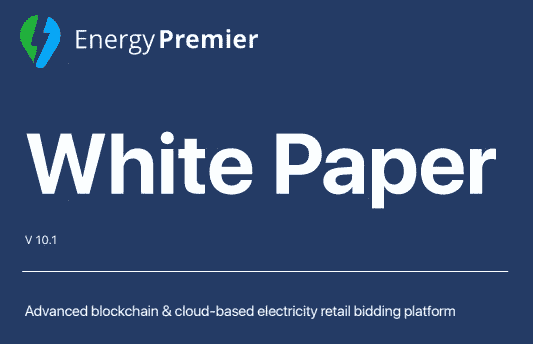

# 以下是您应该在 ICO 白皮书中寻找的内容

> 原文：<https://medium.com/hackernoon/heres-what-you-should-look-for-in-an-ico-whitepaper-dd5174127999>

是否应该加入 ICO 项目的大部分决策都取决于白皮书。几乎每个 ICO 都有一份白皮书，参与者依赖的各种信息都可以在 ICO 白皮书中找到。

白皮书是一份包含所有关于 ICO 项目的重要信息的文档，它实际上是公司的商业计划。这份文件概述了你必须知道的关于这个项目的一切——它的产品、结构、使命、好处、团队、路线图、未来计划等等。白皮书是一个非常重要的文档，因为如果它写得好，ICO 项目可以获得很多参与者和贡献者。

但是，随着每个月都有大量新 ICO 推出，您如何根据白皮书知道哪一款 ICO 适合您呢？

以下是每份白皮书应该具备的一些重要内容。

## **公司信息**

公司是什么时候成立的？它是做什么的？这家公司经营多久了？它有什么产品吗？公司在哪里？公司如何证明他们的产品不是骗局？

## **产品**

公司计划推出什么样的产品？产品有合适的描述吗？产品开发需要多长时间？你个人对此有何看法？安全有保障吗？产品上市了吗？如果没有，为什么没有？

## **团队**

公司里谁在研究这个产品？团队有能力做 ICO 吗？团队成员在 LinkedIn 或其他社交媒体渠道上有一些可验证的个人资料吗？公司有合适的区块链顾问吗？

## **目标用户**

产品的目标用户是什么？为什么？产品给目标用户带来了什么好处？

## **问题与解决方案**

公司计划解决什么问题？有多少人在处理？他们的解决方案是唯一可行的解决方案吗？

## **市场竞争**

市场上有竞争吗？公司计划如何区别于竞争对手？

## **令牌值**

代币有什么价值？可以用来换东西吗？公司将如何提高代币的价值？令牌的所有权赋予持有者什么权利？该令牌与其他令牌有何不同？

## **令牌分发**

是否解释了令牌分发将如何完成？该队的代币是否分发得当？

## **路线图**

路线图能在规定的时间内实现吗？路线图中的日期现实吗？

## **资金的使用**

ICO 的资金将如何使用？资金分配是否包括所有各方？

## **条款和条件**

公司的条款和条件是什么？

## **图表和统计数据**

图表和统计数据是真实的吗？公司为他们使用了什么资源？

# 最后

如果这些事情解释得很好，ICO 有可能在许多参与者中获得成功。白皮书必须给读者留下深刻印象，所以尽你所能，包括并解释你的 ICO 项目的所有重要内容！

我们公司 [Energy Premier](https://medium.com/u/e338af49a57a?source=post_page-----dd5174127999--------------------------------) 已经开发了一个基于区块链的电力交易平台，用于更快、更便宜、更安全的电力交易。我们目前正在启动预售和 ICO，将于 9 月 21 日开始。我们的使命是成为第一个让所有电力供应商和消费者直接进入能源市场的平台。

**有兴趣吗？** [**不要错过我们的 ICO，立即获得白名单！**](https://tokensale.energypremier.com/)

点击下方阅读我们的白皮书:

Read our Whitepaper:[**https://tokensale.energypremier.com/whitepaper.pdf**](https://tokensale.energypremier.com/whitepaper.pdf)

*感谢您的阅读！*

