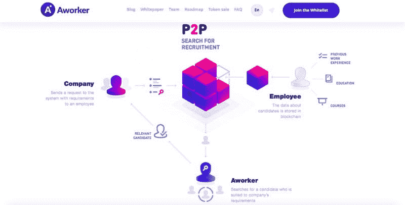

# 以下是为什么区块链会成为招聘的必需品

> 原文：<https://medium.com/hackernoon/heres-why-blockchain-will-become-a-necessity-for-recruitment-aafadbe5ad4f>

作者:Aleksandrova Serafima

毫无疑问，区块链不仅是科技界的流行语，也是全世界的流行语。一波技术颠覆将很快改变当前的人力资源算法。虽然人工智能已经在发生巨大变化，但区块链将彻底改变数据存储和共享的方式。这些只在一些社区使用的词，现在几乎每个人都知道了。

**什么是区块链？**

区块链是一种独特的[技术](https://hackernoon.com/tagged/technology)，用于在没有聚合服务器的情况下存储数据。信息存储在成千上万人的设备上(这取决于特定的区块链)。区块链有两个核心优势:公开性和可靠性。记录不能被伪造，因为它们是由系统中的所有参与者存储的。

区块链分散的权力产生了一种新的业务，这种业务正在彻底改变许多行业。区块链有助于创造一种新的商业模式，这种模式建立在技术之上，而不是人或高层管理。

这项技术本身不获取利润，也不会基于情感或自我保护做出决定。这对于招聘来说是至关重要的，在招聘过程中，主观性扮演着重要的角色。通常的做法仍然是不选择最好的员工，而是选择那些知道如何在面试中说话的人。更重要的是，这种去中心化在用户之间建立了一种强有力的联系，使得信息和价值的共享变得无缝和简单。这是当今人力资源行业的另一个重要问题，因为求职者在面试中不断在简历和作品集中撒谎，以给招聘人员留下深刻印象。

虽然区块链是游戏规则改变者的原因有很多，但有几个原因会改变人力资源行业:

*   **数据透明。**任何时候，任何参与者都可以访问初始数据，以确保他们是正确的。
*   **数据可靠性。**不是任何公司或个人都可以改变数据使之对自己有利。
*   **流程自动化**。该系统应在没有中介的情况下使用数学算法，将人为因素排除在外或减少到最低限度。
*   **独立**。数据不属于任何公司，以保持客观性。

最后，我们可以说，技术已经走过了漫长的道路，区块链的旅程才刚刚开始。区块链的相关性将很快成为所有求职者的必备知识，无论是哪个行业或职位。知道在哪里填补知识空白是一个领域，认证职业教练，如新职介绍和职业过渡服务提供商提供的职业教练，可以帮助求职者确保他们是任何新角色的最合格候选人。

对于人力资源专业人员来说，了解如何使用区块链来简化流程、创建更高级别的安全性和创新流程将确保未来的个人成功，并进一步将您定位为组织中的战略合作伙伴。

[Aworker](https://aworker.io/) 是一个力求在招聘市场发展上迈出一大步的平台。Aworker 有助于根据你的专业技能和成就找到最合适的公司和工作岗位。员工不再局限于一份工作、一家公司、一个城市甚至一个洲。现在每个工人都可以向来自世界各地的雇主证明他/她的能力。用户可以在区块链存储所有文凭、证书和其他证明其能力的文档。更重要的是，人们可以创建一个理想公司的愿望清单，看看他们需要提高哪些技能才能在那里找到工作。

此外，他们甚至可以通过被邀请参加面试来赚钱。这一切都是可能的，因为权力下放为创造新的职业生态系统提供了最好的机会。在一个工作平台上，为人们的行为付费变得更加容易:借助智能合同的力量，为熟人推荐或自己来参加工作面试付费是自动的。

和工人一起成为工人！

https://upscri.be/hackernoon/