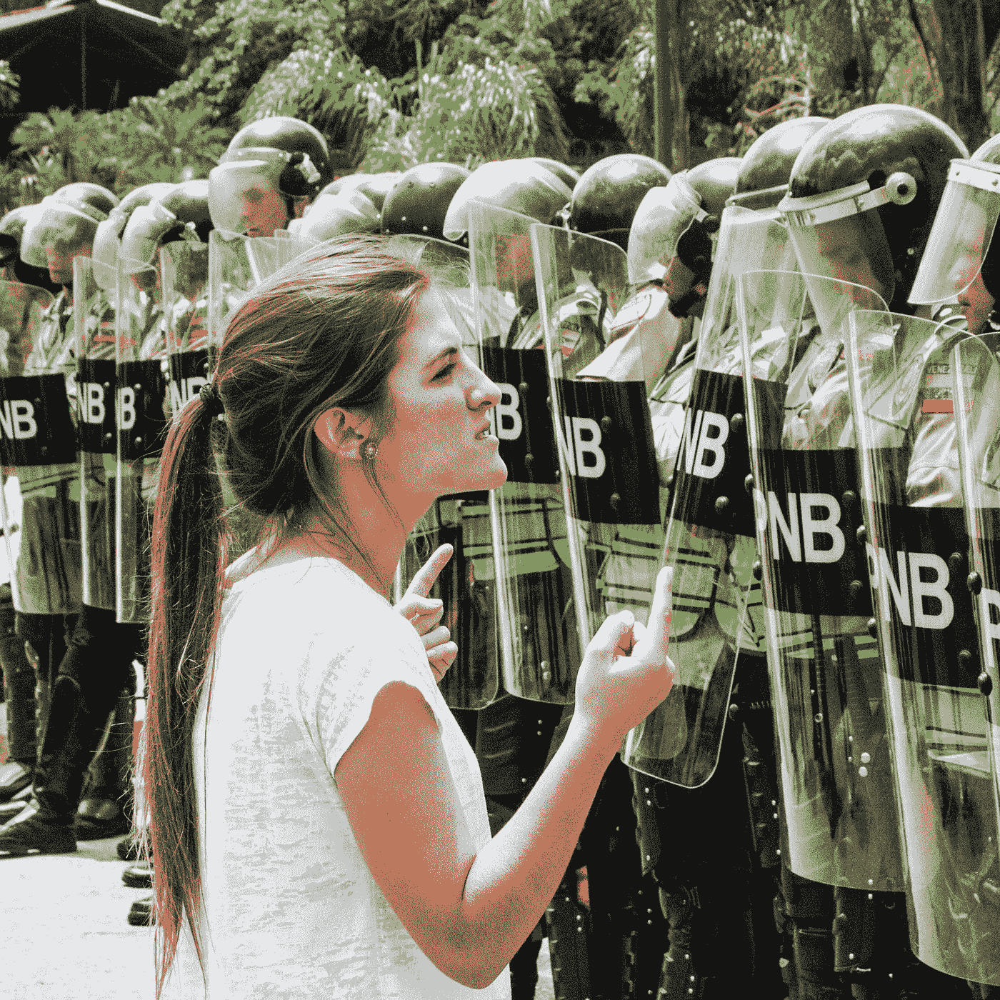
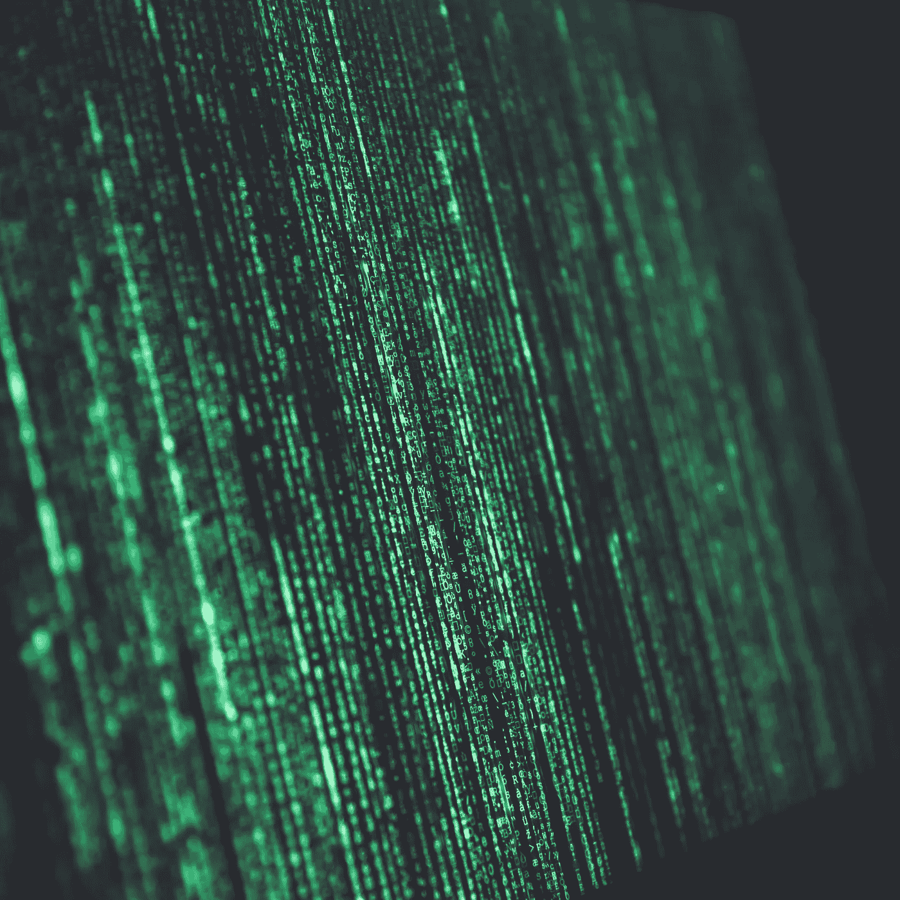
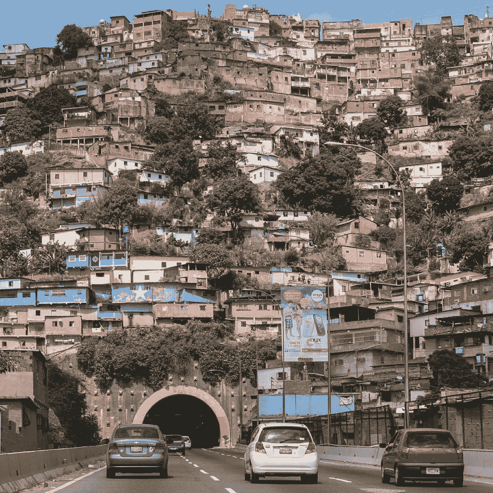

# 这就是为什么马杜罗的“石油”会失败，以及为什么它仍然应该引起我们所有人的关注

> 原文：<https://medium.com/hackernoon/heres-why-maduro-s-petro-will-fail-and-why-it-should-still-concern-us-all-e3fbfbfbbe1a>

Photo credit: [Andres Gerlotti](https://unsplash.com/photos/6rf-_Hqd8oE) via Unsplash

委内瑞拉政府最近[推出了自己的加密货币，一种基于加密算法的电子货币。对于世界上最大的石油生产国之一来说，这枚硬币将“值”一桶被称为“petro”的加拉加斯原油。他们甚至进行了硬币的预售(面向机构投资者)，声称带来了 7.35 亿美元的收入。](https://arstechnica.com/tech-policy/2018/02/venezuela-says-its-cryptocurrency-raised-735-million-but-its-a-farce/)

委内瑞拉并不是第一个走上这条道路的国家。[厄瓜多](https://www.cnbc.com/2015/02/06/ecuador-becomes-the-first-country-to-roll-out-its-own-digital-durrency.html)最近宣布了国家“电子货币”(从技术上讲，不是加密货币)，同时从[新加坡](https://www.cnbc.com/2017/10/26/singapore-cryptocurrency-blockchain-trial.html)到[塞内加尔](http://bitcoinafrica.io/2017/06/06/senegal-launches-digital-currency-on-the-blockchain/)的政府已经开始试验他们自己的数字货币。俄罗斯国会议员在 1 月下旬提出了一项法律草案，以创造一种“[加密卢布](https://www.rt.com/business-projects/417001-cryptocurrency-russia-law-ruble/)”作为该国的法定货币。

但委内瑞拉因其硬币发行的厚颜无耻而引人注目:尼古拉斯·马杜罗(Nicolas Maduro)政府无耻地(有些人可能会说是鲁莽地)宣传石油作为规避美国和欧洲制裁的一种方式。加拉加斯急需现金来支付其债券持有人的债务，这些债券持有人的债务超过 1000 亿美元，而政府的金库几乎是空的。对于拉丁美洲能源最丰富的国家之一来说，这是一个令人震惊的情况。

委内瑞拉的秘密计划并没有被国会忽视。参议员马尔科·卢比奥(共和党-佛罗里达州)和鲍勃·梅嫩德斯(民主党-新泽西州)向美国财政部长史蒂文·姆努钦发送了一封公开信，表达了他们对这一策略的担忧。(在撰写本文时，财政部尚未公开回应。)在他们的信中，参议员们还担心马杜罗的计划可能会激励其他不友好的国家效仿:

> “马杜罗的行动和(财政部)的任何相应回应都将受到俄罗斯和朝鲜等外国主权国家的密切关注，这些国家表示有兴趣开发自己的主权支持的加密货币，或者出于邪恶目的利用其他加密货币。”

问题是，像委内瑞拉这样的加密硬币提供计划几乎肯定会失败，尤其是因为它们源于逃避合法多边制裁的愿望。

然而，它们失败的真正原因是它们是由政府运营的。

Photo credit: [Markus Spiske](https://unsplash.com/photos/68ZlATaVYIo) via Unsplash

委内瑞拉的例子显示了对加密货币最初出现原因的根本性误解。美元、日元、卢布甚至玻利瓦尔等法定货币工具依赖于对发行它们的政府的信任。基于透明分布式账本模型的加密货币依赖于开放和去中心化，而不是信任。

根据定义，专制政权需要控制。他们需要知道，如果计划没有如他们所愿，他们可以做出改变。即使存在仁慈的独裁统治，这种控制狂的冲动也只是与支撑加密货币的整个哲学相对立，即证据胜于信仰。

这并不是独裁政权第一次为了自己的目的试图劫持技术进步。看一看名字中带有“硅”字的[恶名昭彰的地方列表](https://ipfs.io/ipfs/QmXoypizjW3WknFiJnKLwHCnL72vedxjQkDDP1mXWo6uco/wiki/List_of_places_with_%22Silicon%22_names.html)，就能发现在其他地方重现硅谷秘方的种种努力。

在民主的地方，比如以色列，这有时是成功的，主要是因为他们拥抱创业精神，而不是试图让它不是这样。但是在不太民主的国家，比如俄国的斯科尔科沃“创新中心”，这种方法已经失败了，因为政府“投资者”恢复了一切照旧，这在独裁政权下通常意味着老板们[从政府那里窃取](http://www.silicon.co.uk/workspace/russian-silicon-valley-skolkovo-misused-1-billion-viktor-vekselberg-personally-cited-prosecutors-report-131916?inf_by=5a7b4f60671db8d60b8b4e45)。

这是石油公司无法让马杜罗摆脱财政困境的另一个原因。从一开始，他们就将它设计成一种将政府资源转移到私人手中的机制。这就是为什么他们必须保持控制。在委内瑞拉的情况下，政府已经不可挽回地摧毁了国家货币，如此缺乏采用另一个国家的货币作为法定货币(就像一些人对美元所做的那样)——这也是他们无法控制的——马杜罗正在使用该国唯一剩下的抵押品:石油。

但是这些努力将会——至少从长远来看——无法达到预期的效果，这一事实并不意味着我们不应该关注。

最近土耳其裔伊朗“商人”Reza Zarrab 洗钱案的例子很有启发性。扎拉布不遗余力地隐藏伊朗和土耳其之间的交易，这些交易实际上使伊朗得以规避多边制裁。这些交易极其复杂的本质在一张手绘的图表中展现出来，这张图表完美地展示了一个人在巨额资金的驱使下所能聚集的创造力。数十亿美元——在某些情况下还有民族自豪感——危在旦夕。简单来说，洗钱很难规模化。

现代俄罗斯是另一个很好的例子。普京允许寡头以低廉的价格收购国有企业，从而创造了寡头。然而，他们没有意识到他们是在和魔鬼做交易。通过帮助他们，普京创造了一种他可以用国家权力强制执行的义务——而且已经一次又一次地这样做了。

Photo credit: [Skeeze](https://pixabay.com/en/barrio-house-neighborhood-buildings-546244/) via Pixabay

最终，独裁政府将会意识到他们不能完全在内部发行和管理加密货币。他们的下一个选择将是试图与加密货币公司达成普京与寡头们达成的同样的交易:“如果你按照我说的做，我会让你变得富有。”政府因此获得的杠杆增加了企业对政府的生存依赖。这种依赖永远不会消失。

银行监管的一个关键弱点是，它们的好坏取决于实施它们的政府。委内瑞拉、俄罗斯或任何其他想要进入加密货币业务的国家只需要创造一个强制执行的假象，让监管机构有机会在法定货币被兑换成加密货币时寻找其他方式。现在的情况是，一旦资金进入“加密循环”，它几乎可以去任何地方，跟踪交易变得更加困难。

目前，所有加密货币的总市值不到 5000 亿美元(最大的比特币约为 1500 亿美元)，专制国家硬币构成的威胁相对较低——即使假设它们能够成功。但随着加密货币获得认可并有能力完成越来越大的交易，大规模洗钱(比如单笔交易数百万美元)成为现实可能性。

那一天不远了。即使是对加密货币最不情愿的批评者也承认，它们不会很快消失。大多数分析师也承认，随着消费者习惯于新技术，加密货币的数量和规模都有望激增。随着一些货币无法吸引足够多的客户，整合也将不可避免。

民主政府和世界金融体系面临的关键挑战是如何与这种新技术共存。

===== ===== ===== ===== ===== ===== =====

**感谢你阅读这篇文章！**

**如果你喜欢，拍几下👏👏👏(最多 50！)将帮助它接触到更广泛的受众。**

[*马克·约翰逊*](https://www.linkedin.com/in/marccjohnson/) *是全球安全顾问，前中情局行动官。他定期撰写关于独裁政权和加密货币的文章。在推特上关注他:****@ blogguero***