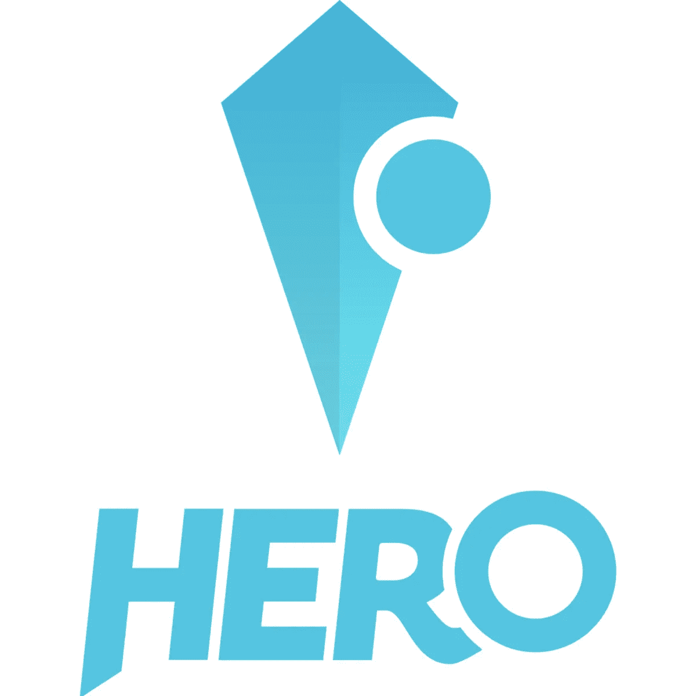

# HEROcoin 电竞赌在区块链上

> 原文：<https://medium.com/hackernoon/herocoin-revolutionizes-esport-gambling-on-the-blockchain-82573a495d15>

**专注于电子竞技的安全博彩**

电子竞技是一个快速增长的领域，2016 年估计有 2.5 亿观众。这已经使它在美国比冰球更受欢迎，而且它将在今年晚些时候超过 NFL 的粉丝总数。2016 年全球收入超过 5 亿美元，预计明年将超过 10 亿美元。每名粉丝的平均年收入刚刚超过 3 美元，仍有很大的增长空间。据估计，NBA 每个球迷的收入是 20 美元，NFL 的收入超过 60 美元。增长的主要途径之一将来自博彩业向市场的扩张。

全球在线博彩业每年的营业额高达数千亿美元。预计电子竞技的赌注将从 2016 年的约 6 亿美元增长到 2020 年的 100 亿至 200 亿美元。尽管规模庞大，但在线赌博市场仍然受到一些问题的困扰，如博彩公司缺乏竞争力的赔率和无良公司拖欠付款。《英雄》旨在通过引入英雄网来解决这些问题。这将允许用户围绕他们选择的任何博彩事件启动他们自己的安全池，并且网络协议将管理和保护所有交易。除了向所有参与者提供投注事件的完全透明性，并确保所有投注将被全额支付之外，这还将交易成本保持在最低水平。

英雄网络中的所有赌注和结算都将使用他们自己的加密货币 Hero (PLAY)来完成。英雄是以太坊区块链上分散的 ERC 20 代币，将在多个加密货币交易所上市。

**币名:**英雄币**(玩)**

**总供应量:** 252，165，029 打

**循环供给:** 115，867，645 打

市值:9671739 美元

**Ico 前价格:** 1 次= 0.0267 美元(0.00008 瑞士法郎)

**Ico 价格:** 1 玩= 0.17 美元

**通过 ICO 筹集的代币/资金:——**16，000，000 美元中的 2，021，034 美元(13%)

**解决网络赌博的信任问题**

网上赌博有各种各样的选择。大多数知名的国际博彩公司都有代表，但也有一些令人眼花缭乱的不知名的小公司。这导致了几个行业问题。

由于大多数在线博彩都是基于赔率的，由博彩公司提供赔率，这个行业长期以来一直被指责条件不公平。赔率的设定是为了给房屋提供它们所需的保证金，从而推高所有参与者的交易成本。参与赌注池消除了设置场外价格的能力，因为每个池的规则是预先确定和已知的。每个池的提供者设置交易成本，交易成本可以低至 1%。

今天所有的赌博，即使是那些赔率是众包而不是由庄家提供的平台，都有一个集中的结算系统。当你下注时，你把你的钱交给赌博公司，并且必须相信他们会把任何潜在的赢款还给你。由于有大量的影子行业参与者，市场有效运行所需的**信任和透明度**水平并不总是存在。通过确保在以太坊区块链注册的赌注池中的所有赌注按照一套预定的规则支付，Hero Network 消除了任何中间人拖欠支付的能力。

从历史上看，赌博一直是一种社交活动，朋友或同事组成赌局，对体育比赛结果或其他事件下注。随着个人在网上向匿名的博彩公司下注，赌博的**社会特征**已经消失了。英雄网络重新引入了社交元素，因为赌注池是以赌注和参与者都透明的方式形成的。

当前在线赌博网站之间结算的集中性使它们容易受到操纵。有许多冻结资金和系统被黑的例子。通过预先收集在以太坊区块链注册的池中的所有赌注，并根据下注事件的结果预先确定支付结构，Hero Network 消除了任何人操纵系统的能力。

**任何人都可以经营自己的投注池**

Hero 开发了一个竞赛界面协议，允许任何用户开始他们自己的竞赛。竞赛接口包括所有竞赛必须具有的公共属性和接口。然后，由每个提供商开始任何包含这些属性的竞赛。任何人都可以使用英雄网络协议开始竞赛。

竞赛提供商决定事件的支付规则是什么，以及提供商保留多少下注金额。提供商还决定每个下注金额中有多少进入普通底池，最少为 1%。这个普通底池稍后会根据英雄硬币持有者的持有量按比例分配给他们。这奖励了游戏的持有者，从而推高了需求。

今年晚些时候，Hero 将推出三个合同模板，使提供商更容易发起竞赛。他们将指定以下常见的游戏格式。

**百分比竞赛** —赌注根据预设的公式在赢家之间分配。

**固定赢家竞赛** —为每个池确定固定数量的赢家。最常见的格式是“赢家通吃”。

**私人竞赛**——允许你为少数玩家组织私人竞赛，同时设计自己的规则集。

Hero 也在开发一个 API，允许其他赌博网站在游戏中实现结算。ICO 收益的一部分已经被预留出来用于培养这个网络。不过，作为第一个案例，PLAY 和 Hero Network 将在他们自己的在线预测网站 herosphere.gg 上推出，该网站拥有 20 多万注册用户。

**社交媒体**

***脸书***

网址:[https://www.facebook.com/HEROcoinio/](https://www.facebook.com/HEROcoinio/)

喜欢:**8256 个** *喜欢 8435 个关注者*

过去 7 天有多少帖子/更新:**7**更新

***推特***

网址:[https://twitter.com/HEROcoinio](https://twitter.com/HEROcoinio)

追随者:**4337**追随者

过去 7 天内有多少条推文/转发: **15 条** *条推文和转发*

***电报***

网址:[https://t.me/joinchat/FsEwOwtrCZMWwHokEj70Gw](https://t.me/joinchat/FsEwOwtrCZMWwHokEj70Gw)

用户: **1 672** 成员*成员*

**讨论**

**Reddit**

网址:[https://www.reddit.com/r/HEROcoin/](https://www.reddit.com/r/HEROcoin/)

读者: **303** 读者*读者*

***Youtube***

网址:-[https://www.youtube.com/channel/UCi6gLMu21XsrnWcdS0VOwdw](https://www.youtube.com/channel/UCi6gLMu21XsrnWcdS0VOwdw)

订户:1，292 名订户

***中型***

网址:[https://medium.com/@HEROCoin](/@HEROCoin)

追随者:**45**追随者

最近 7 天有多少更新:**否**最近更新

***LinkedIn***

网址:[https://www.linkedin.com/company/herocoin](https://www.linkedin.com/company/herocoin)

追随者: **92** *追随者*

***GitHub***

网址:-[https://github.com/ByteHeroes/herocoin](https://github.com/ByteHeroes/herocoin)

**员工/团队信息:**

姓名:**保罗·波特劳尔**

头衔:联合创始人兼首席执行官

领英:[https://www.linkedin.com/in/paul-polterauer-4933a1a0/](https://www.linkedin.com/in/paul-polterauer-4933a1a0/)

姓名:**菲利普·佩因索尔德**

职位:联合创始人兼首席技术官

领英:[https://www.linkedin.com/in/philippeinsold/](https://www.linkedin.com/in/philippeinsold/)

姓名:**伯恩哈德·BLAHA**

头衔:联合创始人&首席运营官

领英:[https://www.linkedin.com/in/bernhard-blaha-28a811147/](https://www.linkedin.com/in/bernhard-blaha-28a811147/)

姓名:**安德烈亚斯·彼得森**

头衔:领先的区块链开发者

领英:[https://www.linkedin.com/in/andreas-petersson-202293b5/](https://www.linkedin.com/in/andreas-petersson-202293b5/)

额外链接:[https://github.com/apetersson](https://github.com/apetersson)

姓名:**弗拉丹·瓦斯奇**

职位:首席信息官

领英:[https://www.linkedin.com/in/vladan-vasic-534579147/](https://www.linkedin.com/in/vladan-vasic-534579147/)

姓名:**杰罗姆·罗塞洛**

标题:智能合同开发人员

领英:[https://www.linkedin.com/in/jeromerousselot/](https://www.linkedin.com/in/jeromerousselot/)

额外链接:[https://github.com/jeromerousselot](https://github.com/jeromerousselot)

姓名:**约翰尼斯·马勒**

职位:首席营销官

领英:[https://www.linkedin.com/in/johannes-mahler-941866123/](https://www.linkedin.com/in/johannes-mahler-941866123/)

**公司地址:**奥地利