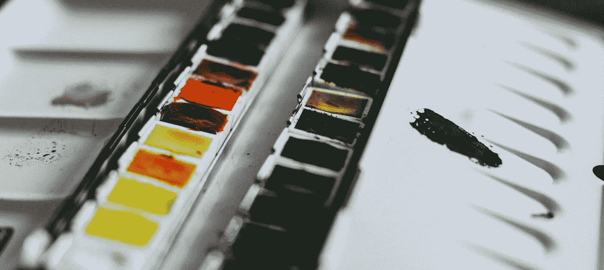
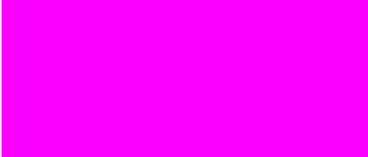

# 十六进制颜色，它们是如何工作的？

> 原文：<https://medium.com/hackernoon/hex-colors-how-do-they-work-d8cb935ac0f>

我们都见过他们，他们长得有点像这样: **#ff0000** 。这是红色的十六进制代码。然而，这到底意味着什么呢？

# 十六进制的

我们大多数人都听过二进制，但十六进制呢？十六进制，有时被称为“hex”或“base 16 ”,是二进制(base 2)的替代形式。十六进制可以用来存储数字。那么它是如何工作的呢？

## 基础知识

十六进制有 16 个可能的字符，它们包括 0、1、2、3、4、5、6、7、8、9、A、B、C、D、E 和 f。每个字符代表一个从 0 到 15 的整数。

现在我们知道了每个字符的意思，让我们开始将整数转换成十六进制。所以让我们把数字 2087 转换成十六进制。

## 一些例子

让我们首先用 2087 除以 16。这将得到 130 的结果，余数为 7。根据上面我们的图表，7 在十六进制中也是***【7’***，所以现在我们需要把***【7’***放到一边，把 130 除以 16。我们的答案是 8，余数是 2。在我们的图表上，2 是***【2】***，所以把它放到一边，我们需要用 8 除以 16。这将得到 0 和余数 8，余数 8 以十六进制形式转换为***【8】***。所以我们有 3 个结果，分别是 7，2 和 8。我们将它们以相反的顺序放在一起，得到我们的十六进制值，这意味着 2087 是***【0x 827】***。0x 表示它是一个十六进制值。

让我们尝试另一个，这次我们将尝试数字 255。首先我们需要用 255 除以 16。那将使我们得到 15 英镑，剩下 15 英镑。现在我们取余数，并把它排到我们的图表上。15 翻译成***【F’***，这样我们就可以把***【F’***留到以后了。现在我们需要用 15 除以 16，这将得到 0，余数为 15。我们知道 15 翻译成***‘F’***，这就使得我们的结果***‘0x ff’***。

# 颜色代码

十六进制颜色代码通常看起来是这样的: **#ff0000** ，但是这是什么意思呢？好吧，我们来分解一下！

## RGB

RGB 代表红色、绿色和蓝色。这些颜色是光的原色。RBG 值可能如下所示: **rgb(255，0，0)** 。起初，这可能看起来不太像，但如果我们仔细看看，第一个数字代表红色，第二个数字代表绿色，第三个数字代表蓝色。这些点中的值的范围可以从 0 到 255。让我们试着做一些颜色吧！

对于光，红色和蓝色产生品红色，所以让我们试着用 RGB 产生品红色。因此，要获得明亮的洋红色，让我们设置蓝色和红色的最大值为 255。所以我们有: **rgb(255，0，255)** ，它给了我们这样一个颜色:

rgb(255, 0, 255)

但是如果我们想让它变得更亮一点，比如更粉一点的颜色呢？我们如何做到这一点？RBG 的白色是 **rgb(255，255，255)** ，所有颜色的总和。那么我们试试把 **rgb(255，0，255)** 改成 **rgb(255，150，255)** 怎么样？我们得到了浅粉色的结果。

rgb(255, 150, 255)

那么颜色深一点怎么样？所以我们可以有一个深粉色的？在 RGB 中，黑色是 **rgb(0，0，0)** ，所以让我们的值更接近于此。所以我们试试 **rgb(150，0，150)** 。就这样，我得到了这个:

rgb(150, 0, 150)

## 十六进制颜色

现在我们对 RGB 有了很好的理解，我们可以理解十六进制颜色是如何工作的。一个十六进制的颜色大概是这样的， **#ff0000** 。但这意味着什么呢？让我们结合我们所知道的 RBG 和十六进制来计算一下。我们知道 0xFF 在十六进制中是 255，255 是 RGB 的最大值。如果我们看到#ff0000 是什么，我们可以看到它是一种鲜红色:

#ff0000

我们能发现的是 **#ff0000** 翻译成 **rgb(255，0，0)** 。让我们再次尝试得到我们的洋红色，我们知道它是 **rgb(255，0，255)** ，所以让我们看看 **#ff00ff** 得到了什么。

#ff00ff

厉害！我们得到了洋红色，现在让我们再次尝试得到更亮的颜色，但这次是十六进制的。我们 RGB 中的浅洋红色是 rgb(255，150，255)，所以如果我们把 150 转换成十六进制，150 除以 16 就是 9，余数是 6。9 除以 16 是 0，余数是 9，这就是我们的十六进制值***‘0x 96’***。结果是我们的十六进制颜色#ff96ff，当我们看到结果时，我们得到我们的浅洋红色。

#ff96ff

# 结论

读完这篇文章后，你就能理解十六进制颜色是如何工作的，前两个字符是红色的，接下来两个是绿色的，接下来两个是蓝色的。我希望这篇文章教会你一些新的东西，无论是十六进制颜色、RGB 还是 base16。

如果你喜欢这篇文章，请在下面的其他社交媒体平台上关注我:

 [## Danny Tran (@hoogleyb) * Instagram 照片和视频

### 335 个关注者，115 个关注者，116 个帖子-见来自 Danny Tran 的 Instagram 照片和视频(@hoogleyb)

www.instagram.com](https://www.instagram.com/hoogleyb/)  [## 丹尼·特兰(@HoogleyB) |推特

### Danny Tran 的最新推文(@HoogleyB)。我很自豪地说我是一名高级 web 开发人员，但我更自豪地说…

twitter.com](https://twitter.com/hoogleyb) 

如果你发现文章有什么问题，请在下面的评论中提出来，我会改正的！

编码快乐！