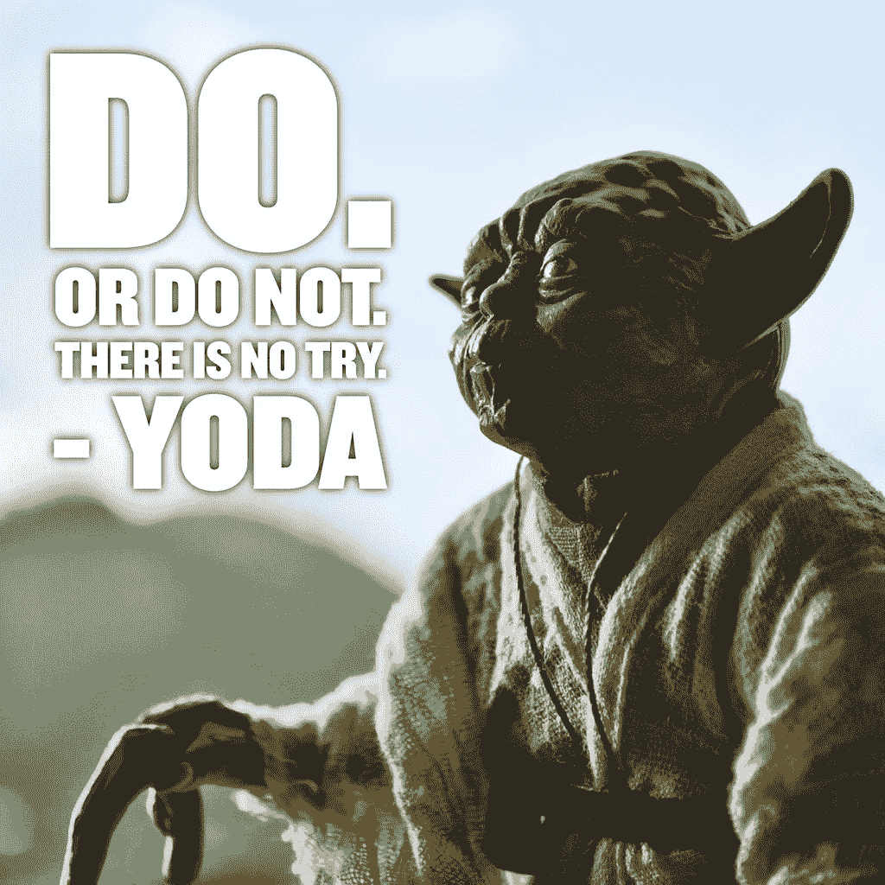

# 这些密码迷因会让你笑掉大牙..

> 原文：<https://medium.com/hackernoon/hey-look-here-memes-on-crypto-scene-4b6cc29aaa7b>

## 从好莱坞电影的各种动机场景中摘录的几个片段变成了疯狂加密的滑稽喜剧迷因！

我们都是正在兴起或者应该说已经建立的加密货币炒作的一部分。更严重的是，我要说的是，加密货币目前的估值约为[**【479，907，863，820】美元**](https://coinmarketcap.com/charts/)**对所有不知道如何阅读这个数字的人来说，这个数字是 4790 亿美元。**

**我们应该同意这是件大事...**

**抛开所有严肃的话题，我决定和大家分享一些有趣的秘密，试一试吧。**

***Guardians of the Galaxy***

**“我环顾四周，你知道我看到了什么吗？失败者。我是说，就像，那些失去东西的人。我们有，伙计，我们有，我们所有人。家园，我们的家庭，正常的生活。你会认为(l̶i̶f̶e̶)比特币(T8)获取的比给予的多，但不是今天。今天它给了我们一些东西。这给了我们一个机会。”**

***The Pursuit of Happyness***

**“永远不要让别人告诉你你不能做某事。连我都不知道。你有一个小小的钱包，你必须保护它。人们自己不能生成私钥，他们想告诉你你不能这样做。你想要什么，就去得到它。句号。好吗？”**

**Inception**

**“最有弹性的寄生虫是什么？细菌？一种病毒？肠道蠕虫？一个**令牌**。有弹性……极具传染性。一旦一种标记控制了大脑，就几乎不可能根除。一个完全成形的**令牌**——被完全理解——可以持续下去。”**

***X-Men Days of Future Past***

**“仅仅因为(某人)[比特币](https://hackernoon.com/tagged/bitcoin)跌跌撞撞，迷失了方向，并不意味着他们永远迷失了。”**

**Good Will Hunting**

**"有些人不相信加密货币，除非有人先用它们赚了数百万。"**

**Finding Nemo**

**“就一直买。继续买吧。继续买，买，买。我们该怎么办？我们买，买。”**

**Cast Away**

**“我知道我现在必须做什么。我必须留住 BTFD，因为明天 BTC 将会崛起。谁知道潮水会带来什么？”**

**Rocky, from *Rocky Balboa***

**“没有人会像‘dip’那样用力，但这并不在于你能打多用力。关键是你能承受多大的打击，并让**继续购买蘸酱**。而是你能买多少，然后继续前进。*这就是获胜的方式***

****

**Frodo and Sam, from *The Lord of the Rings: The Two Towers***

**佛罗多:“我们坚持什么，山姆？”**

**山姆:“这个世界上一定有某种创，值得我们为之战斗。”**

**Dumbledore, from *Harry Potter and the Chamber of Secrets***

**“显示我们真实身份的不是我们的职业。是我们的 **HODL** ”**

**最后，正如尤达所说**

****

**“Do, or do not. There is no ‘try.’ “ *Star Wars***

**我将根据对这篇文章的回复进行跟进。啦啦队员们，交易愉快！**

***参考文献:***

***list25.com，*[*Amazon.com*](https://www.amazon.com/Inception-Leonardo-DiCaprio/dp/B0047WJ11G)**

**如果你做到了这一点，你就成功了！！祝您愉快！**

*****Prady |***[***@ pradyumna _ d***](https://twitter.com/pradyumna_d)***| "使用***[***bear tax***](https://bear.tax)***申报您的加密货币税！"*****