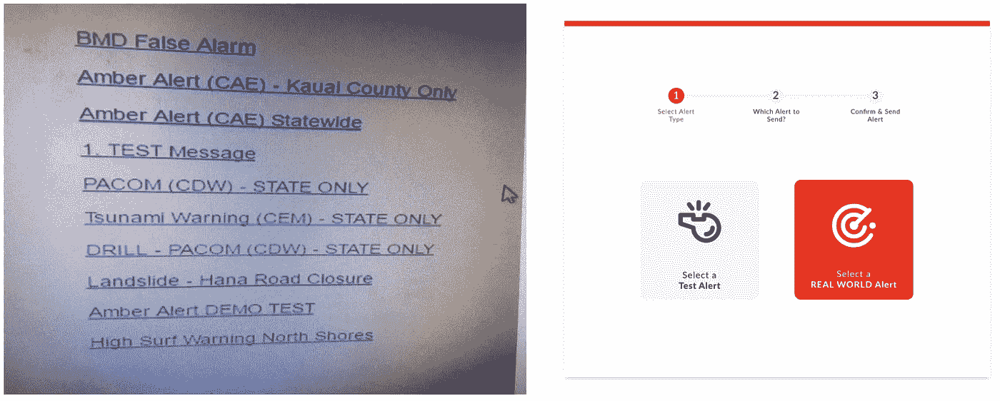
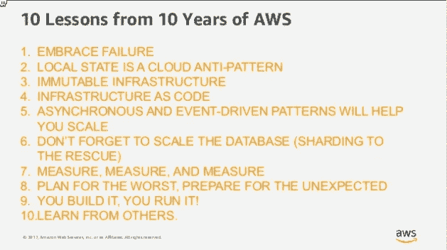

# 嗨，黑客:本周科技

> 原文：<https://medium.com/hackernoon/heyo-hackers-this-week-in-tech-7c93129368d7>

嗨，黑客们，

在[黑客中午](http://hackernoon.)这一年的开始是忙碌的。在过去的 90 天里，我们的平均日阅读量超过了 18 万，峰值为 1，715，680 分钟(1/7)。那是 3 年 3 个月零 5 天的阅读时间。在过去的一个月里，我们的故事被 [Investopedia](https://www.investopedia.com/news/why-ripple-may-still-end-coinbase/) 、 [The Ringer](https://www.theringer.com/tech/2017/12/28/16825892/crypto-castle-december-2017-profile) 、 [Nasdaq](http://www.nasdaq.com/article/4-innovative-use-cases-for-blockchain-cm901636) 、 [Gizmodo](https://gizmodo.com/reddit-email-vulnerability-leads-to-thousands-of-dollar-1821808073) 、 [Android Authority](https://www.androidauthority.com/lastpass-authenticator-security-825988/) 、 [Trusted Reviews](http://m) 、 [Salon](https://www.salon.com/2018/01/07/the-world-of-cryptocollectibles-like-cryptokitties-looks-like-the-internets-early-days/) 、 [Houston Chronicle](http://www.houstonchronicle.com/techburger/article/Here-s-the-beef-1-2-18-12466846.php) 、 [CNET](https://www.cnet.com/news/otto-smart-lock-company-suspend-operations-employees/) 、 [SlashGear](https://www.slashgear.com/lastpass-authenticator-android-app-is-easy-to-break-into-28513035/) 、 [TechSpot](https://www.techspot.com/news/72743-weekend-tech-reading-what-happened-vista-cisco-detect-malware-encrypted.html) 为了继续加速这条增长之路，我们需要与更多的一流科技公司合作。如果你在一家一流的科技公司工作，并且正在阅读这篇文章，可以考虑[成为每周赞助商](https://weeklysponsor.paperform.co/)。你将获得数百万的优质品牌印象，数以千计的伟大网站访问者…你将开始与我合作😜

# 事不宜迟，以下是本周的 20 大科技新闻:

## [架构](https://hackernoon.com/tagged/architecture)

[**整体服务器 Vs 微服务 Vs 无服务器——真正的赢家？开发商**T5 由](https://hackernoon.com/monolith-vs-microservice-vs-serverless-the-real-winner-the-developer-8aae6042fb48)[埃利奥特福布斯](https://medium.com/u/eb71d34fbe09?source=post_page-----7c93129368d7--------------------------------)制作。这些新建筑风格的福音派似乎有一个潜在的主题，那就是世界是黑白的。

## [API](https://hackernoon.com/api-stories/home)

[**通过**](https://hackernoon.com/avoiding-memory-leak-in-golang-api-1843ef45fca8) **[Iman Tumorang](https://medium.com/u/ef42567fbbae?source=post_page-----7c93129368d7--------------------------------) 避免 Golang API** 中的内存泄漏。根据我们在 Kurio 的真实故事，我们如何因为没有用正确的方法来做而努力争取每一个版本。

Pictured left, the actual government ballistic missile alert system user interface.(@[CivilBeat](https://twitter.com/CivilBeat/status/953127542050795520?ref_src=twsrc%5Etfw)). Pictured right, a Hacker Noon [contributor’s take](https://hackernoon.com/redesigning-hawaiis-emergy-alert-interface-in-the-open-91c6318a7045) on redesigning it ([Fairpixels](https://medium.com/u/4215676b2666?source=post_page-----7c93129368d7--------------------------------)).

## 避开夏威夷的意外紧急警报

[**由**](https://hackernoon.com/redesigning-hawaiis-emergy-alert-interface-in-the-open-91c6318a7045) **[Fairpixels](https://medium.com/u/4215676b2666?source=post_page-----7c93129368d7--------------------------------) 在 Open** 中重新设计夏威夷紧急警报系统的界面。为什么如此重要的任务会有如此恐怖的界面，这绝对是个谜。

## [区块链](https://hackernoon.com/blockchain/home)将……

[**打造区块链:灰纸**](/@omergoldberg/building-a-blockchain-the-grey-paper-5be456018040) 作者[奥默·戈德堡](https://medium.com/u/49b16006351c?source=post_page-----7c93129368d7--------------------------------)。*(是)一个不断增长的* [*记录列表*](https://en.wikipedia.org/wiki/Record_(computer_science)) *，称为块，使用* [*密码术*](https://en.wikipedia.org/wiki/Cryptography) *进行链接和保护。每个块通常包含一个* [*散列*](https://en.wikipedia.org/wiki/Cryptographic_hash_function) *指针作为到前一个块的链接，一个* [*时间戳*](https://en.wikipedia.org/wiki/Trusted_timestamping) *和事务数据。*

[**区块链和密码行业值得关注的 5 位女性！**](https://hackernoon.com/5-notable-women-in-the-blockchain-and-crypto-industry-6dd5981c0e7d) 由[出资购买](https://medium.com/u/8e38a3ae68f4?source=post_page-----7c93129368d7--------------------------------)。*一些最大的 ico、数字货币支付平台，甚至区块链的科技开发公司都是由女性创立的。*

## [浏览器大战](https://hackernoon.com/tagged/browsers)

[**火狐量子值得吗？**](https://hackernoon.com/firefox-ffe71d0e16c3) 作者[乔丹·鲍曼](https://medium.com/u/4df1a9a93466?source=post_page-----7c93129368d7--------------------------------)。我赞成尝试新的应用程序。可能是因为我喜欢别人为我的工作做同样的事。所以，我决定做一个简单的实验。我会使用 Firefox Quantum 几个星期，看看它是否值得浏览器切换的小麻烦。

[**网上购物在非洲行不通是因为这种网络形式**](https://hackernoon.com/online-shopping-in-africa-doesnt-work-because-of-this-web-form-e4974a8d165a) 作者[大卫·奥克维](https://medium.com/u/c0cc0c671b4c?source=post_page-----7c93129368d7--------------------------------)。我参加过几次科技活动，他们邀请所谓的大师和专家来解释非洲的数字景观，但我对他们关于为什么电子商务没有流行起来的任何答案都不满意。事实证明，用户在网络浏览器上的点击并没有完全转化为实际销售的原因非常简单——送货和账单信息表单。

## [Crypto](https://hackernoon.com/tagged/cryptocurrency) 轰！

****作者:[乔希·奎特纳](https://medium.com/u/e79b000993b7?source=post_page-----7c93129368d7--------------------------------) *现在的诀窍是集中注意力，尽可能多地了解正在发生的事情，永远不要投资超过你可以轻松输掉的金额。*****

****[**我对 2018 年及以后最有价值的加密市场洞察**](https://hackernoon.com/my-most-valuable-crypto-market-insights-for-2018-and-beyond-5c0a454fb278) 作者 [Pierre Rognion](https://medium.com/u/100bbba7af33?source=post_page-----7c93129368d7--------------------------------) 。 ***比特币是特洛伊木马。一夜暴富的诱惑是有其目的的:它为分散的未来和那些对社会动荡持怀疑态度的人充当了特洛伊木马。*******

****[**为什么、做什么、如何投资加密货币**](https://hackernoon.com/cryptocurrencies-be4b3e326387) 作者[阿萨夫·埃洛维奇](https://medium.com/u/bf912a8da233?source=post_page-----7c93129368d7--------------------------------)。*比特币期货在* [*CBOE 和 CME*](https://www.bloomberg.com/news/articles/2017-11-29/nasdaq-is-said-to-plan-bitcoin-futures-joining-biggest-rivals) *(以及今年晚些时候的纳斯达克)的推出被认为是将加密货币带入主流的一项重大成就。这将让投资者有更多选择，利用更传统的金融工具押注比特币。*****

## ****[深度学习](https://hackernoon.com/tagged/deep-learning)****

******让 AlphaGo Zero 成功的三招**作者[塞斯·魏德曼](https://medium.com/u/3e4c62db5817?source=post_page-----7c93129368d7--------------------------------)。*“2017 年，深度学习和人工智能领域取得了许多进展，但很少有人像 DeepMind 的 AlphaGo Zero 那样引起如此多的关注和兴趣。这个程序确实是一个令人震惊的突破:它不仅击败了 AlphaGo 的早期版本——击败了 17 次世界冠军 Lee Sedol 的程序。*****

********

## ****[AWS 内部](https://hackernoon.com/tagged/aws)****

****[**AWS 10 年的 10 个教训**](https://hackernoon.com/10-lessons-from-10-years-of-aws-part-1-258b56703fcf) **(以及**[**Part 2**](https://hackernoon.com/10-lessons-from-10-years-of-aws-part-2-5dd92b533870)**)**作者[阿德里安·霍恩斯比](https://medium.com/u/a8fba86a184d?source=post_page-----7c93129368d7--------------------------------)。*在过去的 10 年里，我有机会在采用云技术的公司工作，尤其是 AWS。*****

****[**恐怕你在想 AWS Lambda 冷启动都错了**](https://hackernoon.com/im-afraid-you-re-thinking-about-aws-lambda-cold-starts-all-wrong-7d907f278a4f) by [崔琰](https://medium.com/u/d00f1e6b06a2?source=post_page-----7c93129368d7--------------------------------)。*当我在 API Gateway 的环境中与人们讨论 AWS Lambda 冷启动时，我经常得到这样的回应:“嗯，这只是第一个请求，对吗？所以，如果一个请求很慢，下一百万个请求就会很快。不幸的是，这过于简单化了。*****

## ****[产品管理寿命](https://hackernoon.com/product-management-life/home)****

****[**敏捷(做对)是由**](https://hackernoon.com/agile-done-right-is-continuous-design-f85e24733654)**[约翰·卡特勒](https://medium.com/u/4c3f4fe11e6b?source=post_page-----7c93129368d7--------------------------------)连续设计** 。*价值不是“运输的”…而是一个不断增强和扩展的价值网络。“产品”是短暂的交付机制……十年前是人，今天是移动应用，明天是 Alexa，十年后是 AI。*****

****[**狗屁产品经理说的话，由**](https://hackernoon.com/shit-product-managers-say-translated-1628d08aa7dd)**[斯蒂芬·考涅塔](https://medium.com/u/829d5c865a60?source=post_page-----7c93129368d7--------------------------------)翻译** 。嘿，让我们关闭离线循环。我会留出两周一次的时间让我们同步。温柔萍提交你的 AI。****

## ****[SaaS](https://hackernoon.com/tagged/saas)营销****

****[**SaaS 免费增值 vs 免费试用 vs 混合型获客模式**](https://hackernoon.com/freemium-vs-free-trial-vs-hybrid-customer-acquisition-model-b8cd3287f9f0)**by[Myk Pono](https://medium.com/u/deeb5accef0a?source=post_page-----7c93129368d7--------------------------------)。*我们花了无数时间研究客户获取策略和定价模式。作为其中的一部分，我们采访了 SaaS 的行业领袖。我们发现，几乎每家 SaaS 公司都会经历一场关于是否提供免费试用或免费增值的激烈辩论。*******

## ******[启动速度](https://hackernoon.com/tagged/startup)******

******[**创业假设就像屁眼——每个人都有一个，大多数都是狗屁**](https://hackernoon.com/startup-assumptions-are-like-assholes-everyone-has-one-and-most-are-full-of-shit-de189391aa0d) 作者[马特沃德](https://medium.com/u/de3bd78f4455?source=post_page-----7c93129368d7--------------------------------)。我们有假设。我们有想法。这些毫无意义。知道这一点是成功的关键。知道自己不知道什么，并愿意学习和适应市场需求的企业家是成功的企业家。******

****[**不要筹集风险投资资金——反对的三个主要原因。**](https://hackernoon.com/do-not-raise-vc-funding-3-reasons-against-it-7c5f6d4efbec) 作者[卡尔·弗里乔森](https://medium.com/u/c0fa8e8b3ccd?source=post_page-----7c93129368d7--------------------------------)。创业的唯一途径不是你在 Techcrunch 上读到的。独立建立你的公司给你无限的选择。如果你珍惜自己的创业自由，就不要过早地走上风险投资的道路。****

## ****我们可能都在一个[电子游戏中……](https://hackernoon.com/tagged/gaming)****

****[**模拟假说——为什么量子物理学、人工智能和东方神秘主义者一致认为我们身处一个电子游戏中**](https://hackernoon.com/the-great-simulation-why-quantum-physics-artificial-intelligence-and-eastern-mystics-all-agree-b6c185213a18)**Riz Virk。*最近，因为埃隆·马斯克等知名人士的公开讨论，一种认为我们可能生活在一个巨大的电子游戏中，也就是人们常说的“模拟假说”的观点引起了广泛关注。随着虚拟现实技术变得越来越复杂，我们也开始关注虚拟世界，比如即将由史蒂芬·斯皮尔伯格执导的巨制电影《Ready Player One》中的全方位绿洲。*******

******直到下一次，不要把世界的现实视为理所当然。******

******致以亲切的问候，******

******[大卫·斯莫克](http://www.davidsmooke.net/)、[AMI](http://twitter.com/ami)******