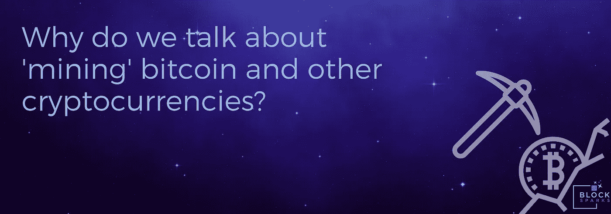

# 嗨嗬，嗨嗬，用一个糟糕的比喻我们开始…

> 原文：<https://medium.com/hackernoon/hi-ho-hi-ho-with-a-bad-metaphor-we-go-68bdf88af02d>

就像用钱包这个词来描述我们藏私人钥匙的地方，而不是我们的[加密货币](https://hackernoon.com/tagged/cryptocurrency)本身一样，我发现自己在与加密货币的产生有关的‘挖掘’这个词上苦苦挣扎。

我知道它是如何产生的，因为理解和采用如此创新的东西取决于将它与人们已经理解的概念联系起来。因此，加密货币的最早发起者需要某种东西来传达新区块的创建方式。它需要暗示这个过程是艰苦的工作，需要应用处理能力和持续的投资，还需要一定程度的随机回报。虽然试图将比特币确立为一种新资产类别的第一个例子，但将它与黄金或宝石等由稀缺性和提取难度决定的其他价值储存手段联系起来也是有意义的。

因此，我们“挖掘”加密货币，以产生新的区块和安全交易。矿工是加密生态系统的命脉，他们利用自己的电力和处理能力运行复杂的哈希计算，依次保护每个新区块，创建不可磨灭的区块链账本，每笔交易都驻留在账本上。

虽然它可能不需要在地下深处挖掘隧道，但秘密采矿是一项艰巨的工作。这是故意的——新比特币的发行受到难度的监管，通过一种自我调整算法，根据两周内解决的区块数量自动调整，以确保无论网络上有多少活跃的矿工，开采的硬币数量大致相同。块奖励本身也每 4 年减半，以确保可能产生固定数量的硬币，并且还考虑到摩尔定律和网络上硬件的上升能力。

这种“工作证明”对于共识算法的运行至关重要，它使成功攻击或破坏区块链成为不可能——为了改变交易记录(例如双重花费一枚加密硬币),攻击者将需要控制 51%的采矿网络，并复制迄今为止整个区块链的工作证明——这是一种不可能的高货币成本，因为这种做法肯定会以弄巧成拙的方式破坏资产本身的价值。

因此，当人们批评加密货币本身本质上是“坏的”时，这很奇怪，因为它需要大量的电力。是的，这是一笔巨款——但它是由个体矿工或矿池支付和投资的，它完成了保护和管理区块链所需的一切，促成了一个价值数十亿美元的货币网络。

上一次我在一家有正规线下分支机构的银行开户时，他们的“工作证明”在他们时髦的伦敦零售场所显而易见，在优雅的门厅里有一群员工(我认为那家分支机构现在实际上是一家全酒吧的小酒馆)。他们在每个网点都用电，通过 SWIFT 或 Visa 处理网络使用大量的处理能力，每个员工在他们有空调的办公室上下班都会产生碳排放。他们把利润花在舒适的椅子上，用免费的笔填写必须打印和分发的纸质表格，然后雇佣更多的人和力量安全地粉碎它们。

浪费？这完全是一个视角问题。

但我确实认为缺乏简单和流行的理解是一个促成因素，使用“挖掘”这样的术语来描述解决复杂的加密哈希并没有真正的帮助。没关系，它不会很快改变！

Crypto 没有银行金库或分支机构。理论上，任何人都可以通过下载一些软件并运行算法来挖掘加密货币。然而，如今要开采比特币，你需要功能强大的硬件和专门制造的芯片组成的复杂装备，以及地热等廉价的电力来源。由于所涉及的难度和电力需求，许多矿工聚集在矿池中处理计算——就像彩票辛迪加一样工作，他们都单独进行计算，并根据输入在池中分配奖励。

但你可以使用基本的国产硬件，甚至在你的浏览器中，挖掘一千多种其他货币，你也可以在基于云的挖掘服务器上租用处理器。在每种情况下，你所做的是推测你选择的硬币的未来价值，相对于设置的支出，根据你多久可以得到正回报。一些网站已经探索了通过挖掘赚钱的方法，在你阅读的时候使用你的设备进行挖掘，同时提供对其内容的无广告访问……在实践中，你所能注意到的只是你笔记本电脑上的风扇速度加快了一点。

比特币挖掘背后的实际数学是复杂的。要成为矿工或使用加密货币，你不需要了解数学，但这个视频很好地解释了矿工实际上在用他们的处理能力做什么，以及这是如何以加密方式保护网络的——只需 3 分钟:

[https://www.youtube.com/embed/lik9aaFIsl4](https://www.youtube.com/embed/lik9aaFIsl4)

所以你知道了:没有矮人，宝石，金块或者珍贵的矿石。只是一堆代码…但重要的是你用它做什么。

*原载于*[*www . block sparks . io*](https://www.blocksparks.io/hi-ho-hi-ho-with-a-bad-metaphor-we-go/)*。*