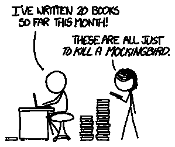
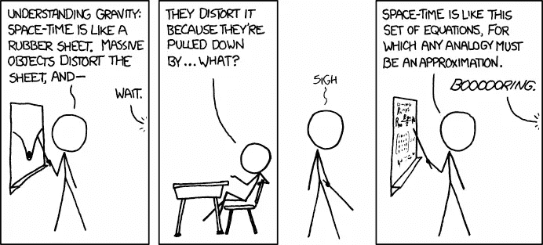
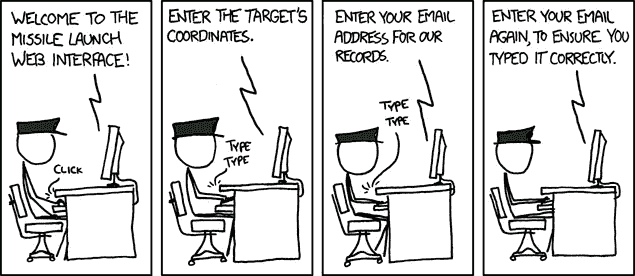
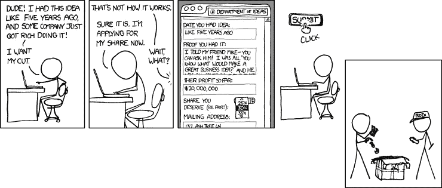
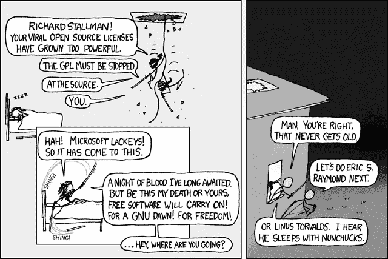
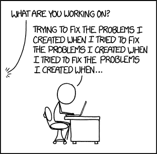
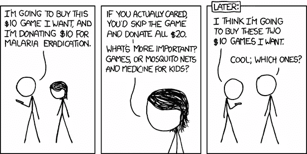
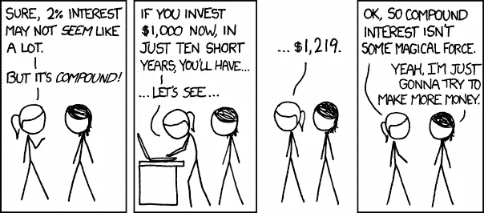

# 区块链上隐藏的机会

> 原文：<https://medium.com/hackernoon/hidden-opportunities-for-you-on-the-blockchain-b110a1e5bbcb>

我确实后悔没有投资加密货币。但后来我意识到交易不是我的事。我想做我有优势的事情。在过去的几个月里，我致力于学习区块链。现在，我看到了不那么明显但却有回报的机会。由于这个领域是新兴的，只有少数人对区块链有更深的了解。大多数人只了解它的表面。有些人只是听说过，不知道它是什么。如果你能对技术有更深入的了解，你会受益匪浅。[商业区块链](https://courses.edx.org/courses/course-v1:LinuxFoundationX+LFS171x+3T2017)Linux 基金会的 edX 课程是一个很好的课程。[区块链革命](http://amzn.to/2E0QTLC)推荐阅读。一旦你对基本原理有了很好的理解，你就可以教别人，引入你自己的想法，甚至推出它们。这里有一些你可以从中受益的机会。

# 写故事

Credits : [xkcd](https://what-if.xkcd.com/76/)

关于区块链有很多带术语的文章，但是故事比较少。有一群很好的观众在寻找简化的解释。由于这是一个新兴市场，许多想法仍有待想象。你可以通过思考区块链在不同行业的用例来写区块链。区块链将如何影响健康产业？还是教育行业？你也可以结合不同领域的想法来写作。《T4》是一本很棒的书，它可以帮助你以一种可以理解的方式简单地解释主题。

 [## WTF 就是区块链？

### 理解区块链的 3500 字简明英语终极指南。

hackernoon.com](https://hackernoon.com/wtf-is-the-blockchain-1da89ba19348)  [## 我们已经知道区块链的杀手级应用

### 就在不久前，硅谷还对加密货币嗤之以鼻。遍布山景城的咖啡店和…

hackernoon.com](https://hackernoon.com/we-already-know-blockchains-killer-apps-f2d443eba35) 

# 用心教学

Credits : [xkcd](https://xkcd.com/895/)

我在 Udemy，Blockgeeks 等探索了很多区块链课程。这些课程中有些是好的。但是，还有改进的余地。它可以变得更加简单、有趣和吸引人。最近碰到[隐型僵尸](https://cryptozombies.io/)。它通过构建一个游戏来教你写一个聪明的契约。它在[黑客新闻](https://news.ycombinator.com/item?id=16113133)上面。对这类课程的需求很大。

[CryptoZombies](https://cryptozombies.io/)

 [## 通过建造一个来了解区块链

### 了解区块链如何工作的最快方法是建造一个

hackernoon.com](https://hackernoon.com/learn-blockchains-by-building-one-117428612f46)  [## 区块链到底是如何运作的？我做了一个应用程序给你看。

### 根据维基百科，区块链是:

medium.freecodecamp.org](https://medium.freecodecamp.org/how-does-blockchain-really-work-i-built-an-app-to-show-you-6b70cd4caf7d) 

# 验证想法

Credits : [xkcd](https://xkcd.com/970/)

你有一个创业的想法。当你把它和产品的基本版本(MVP)一起投放市场时，你就知道它是有效的。只有当人们付钱给你时，你才能确定。通常开始接受付款会很困难。你需要注册公司，完成法律程序等。加密货币可以帮助你避免这样的麻烦。您可以创建一个钱包，设置 API，然后立即开始接受付款。

# 启动

Credits : [xkcd](https://xkcd.com/827/)

非技术人员很难自己使用区块链。像比特币基地这样的初创公司正在应对这个市场。有一些想法可以帮助非技术人员利用区块链解决方案，如生成智能合同、管理 ICO 资金等。我在探索 ICO 交钥匙解决方案，大多数都很贵。你必须筹集一轮种子资金来提供这样的解决方案。负担得起的解决方案是绝对需要的。

 [## 旅行链

### 旅游业的分散数据交换](https://wallet.travelchain.io/?r=coinpot1992) 

# 创建开源区块链项目

Credits : [xkcd](https://xkcd.com/225/)

在互联网时代，创建社区变得很容易。当 Vitalik Buterin 关于比特币的想法被拒绝时，他与分享他想法的人一起启动了以太坊项目。如果你没有想法，我建议你去看看基于开源区块链的项目，比如比特币、以太坊等。想办法改进它，或者将它的想法与不同的领域结合起来。以太坊 ICO 特色是去中心化支付体系+众筹的组合。

 [## poanetwork/ico 向导

### ico-wizard -使用开源向导在以太坊网络上创建 ERC20 令牌和众筹活动(ico)。无编码…

github.com](https://github.com/poanetwork/ico-wizard) 

# 为开源区块链项目做贡献

Credits : [xkcd](https://www.commonlounge.com/discussion/211e473236144eec95311ac40e4808f7)

一名来自 Linux 基金会的高级雇员解决了他们的 [Hyperledger](https://github.com/hyperledger) 项目需要更多贡献者的问题。为开源项目做贡献是值得的，因为这反映了你的技能。雇主重视这样的开源贡献。如果我想雇人，我要做的第一件事就是搜索他们的 Github 个人资料，查看他们的贡献。

 [## 超级分类帐项目

### GitHub 是人们构建软件的地方。超过 2700 万人使用 GitHub 来发现、分享和贡献超过…

github.com](https://github.com/hyperledger) 

# 创办一个非营利组织

Credits : [xkcd](https://xkcd.com/871/)

区块链解决的最大问题是消除了中间人。制片人从作品中获得合理的收入。在印度，中间商剥削了农业。非营利组织正试图利用区块链在区块链上直接连接消费者和农民。找一个你熟悉的被中间人剥削的行业。尝试使用区块链来消除它们。就这样，你有了一个非营利组织的想法。

以太坊是区块链上最大的社交企业之一。他们创造了一个平台，可以让程序员、企业家、社会企业家、矿工等受益。

投资者可以在智能合同的帮助下为非营利组织提供资金。这意味着，如果只有某些里程碑是实现了资金将被释放。这将使非营利组织对他们所做的工作更加负责。区块链还增加了系统的透明度。你可以在区块链上找到你捐款的具体受益者。

 [## 以太坊项目

### 以太坊是一个运行智能合约的分散平台:应用程序完全按照编程运行，没有任何…

ethereum.org](http://ethereum.org) 

# 筹集资金

Credits : [xkcd](https://xkcd.com/947/)

为你的想法筹集投资从未如此简单。ICOs 解决的最大问题是，任何地方的任何人都可以成为投资者。你不必经历繁琐的过程或创造一定的收入才有资格。骗子利用了这些。将来可能会有一些防止欺诈的机制。如果你有想法。投资不会是你最大的障碍。你只需要把想法传达给合适的人，帮助你筹集投资。企业家通常都有这些技能。

新兴市场带来了很多机会。区块链市场也是如此。投资不是唯一有回报的事情。在区块链上投资阅读、写作、编程、教学和开发想法可以获得更多回报。如果你能在区块链大规模采用时投资这些隐藏的机会，你将成为思想领袖。 ***鼓掌请*** 👏 😬。

在接下来的几天里，我会为你写 5 个精彩的故事。请[帮我买些咖啡](https://www.buymeacoffee.com/febin)来帮我达成目标。在这里给我推荐你的故事主题。

也可以捐赠加密货币。

## 比特币

1 nywhkugdfsm 5 kmxnkkmwe 5 zre 6 es 9 jbpg

## BCH

16 ju 3 fswl 23 syftykbeh 7 gfudxzjrfzyfx

## 以太币

0x 847376 bc3e 7459 b 4324 df 33 BC 17 b 2335 aa 14 af 05

> 谢谢你远道而来。关注我们， [HackerNoon](https://hackernoon.com) 和我( [Febin John James](https://medium.com/u/75a616711f4e?source=post_page-----b110a1e5bbcb--------------------------------) )了解更多故事。我正在写一本关于区块链的书。如果你想得到预发布版本[，在这里注册](https://goo.gl/forms/jhkzLnsYm3yrLMlD2)。我还推荐一本书，里面有我写的每一个故事。对于这个故事，它是 [*区块链革命:比特币背后的技术如何改变货币、商业和世界。*](http://amzn.to/2EtascE) **读书是无价之宝。(如果您没有时间阅读，请查看**[**Mentorbox**](https://mentorbox.com/partners?affiliate_id=898086&aff_sub=&aff_sub2=&nopopup=true&noautoplay=false&cookiepreview=false))。