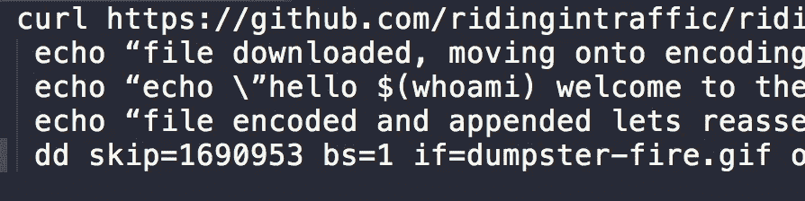

# 像偷东西一样藏起来

> 原文：<https://medium.com/hackernoon/hide-it-like-you-stole-it-d703a8872a29>



我喜欢研究创造性的做事方式。很多时候，我会看一个恶意软件的例子，享受他们如何完成一些讨厌的事情。这方面的最新例子涉及到一个加密挖掘机器人和他们的脚本如何在一个 postgres 盒子上运行。这是在 impreva 的博客中发现的。
[https://www . imper va . com/blog/2018/03/deep-dive-database-attacks-Scarlett-johanssons-picture-used-for-crypto-mining-on-postgre-database/](https://www.imperva.com/blog/2018/03/deep-dive-database-attacks-scarlett-johanssons-picture-used-for-crypto-mining-on-postgre-database/)

这是利用一个名为 dd 的命令，然后在上传时使用如何渲染/检查图像。它也可以被认为是“可怜人的隐写术”
假设我们想要隐藏一个 shell 脚本或一系列命令。我们可以将它隐藏在图像文件的末尾。图像处理器将从上到下读取文件。这允许我们简单地把我们想要的附加到一个文件的末尾，然后当我们想要运行它的时候，使用 dd 把那个数据从末尾复制到一个单独的文件中。你说，让我们看看。
首先，我从 NPR 借了一个 gif，但我把它扔进了 github，这样我就不能重定向到 NPR，称之为礼貌。我将使用 curl 把文件拉下来并输出

```
curl [https://github.com/ridingintraffic/ridingintraffic.github.com/raw/master/dumpster-fire.gif](https://github.com/ridingintraffic/ridingintraffic.github.com/raw/master/dumpster-fire.gif) -o dumpster-fire.gif
```

直接链接在这里[https://github . com/ridgin traffic/ridgin traffic . github . com/raw/master/dumpster-fire . gif](https://github.com/ridingintraffic/ridingintraffic.github.com/raw/master/dumpster-fire.gif)
这将呈现一个漂亮的小动画 gif 没什么大不了的。下一步将是在我的终端中，我将做一个简单的 shell 脚本来打印一些文本。

```
echo “echo \”hello $(whoami) welcome to the fire\””>>script.sh; chmod +x script.sh; ./script.sh```
```

将脚本直接回显到另一个文件中，然后将该文件设置为可执行文件，然后运行该脚本。一个超级多余的方式运行命令，但挂我。
下一步就是看我们的 gif，建立原始尺寸。这里是 curl 命令下载的那个文件的 ***ls -l*** 。

```
$ ls -l dumpster-fire.gif
 -rw-r — r — 1 myuser staff 1690953 Mar 19 19:44 dumpster-fire.gif 
```

编号 ***1690953*** 是以后重新组装的重要位。现在把第一部分和第二部分结合起来。

```
curl [https://github.com/ridingintraffic/ridingintraffic.github.com/raw/master/dumpster-fire.gif](https://github.com/ridingintraffic/ridingintraffic.github.com/raw/master/dumpster-fire.gif) -o dumpster-fire.gif; echo “echo \”hello $(whoami) welcome to the fire\”>>dumpster-fire.gif; 
```

而下面的 ***ls -l*** 把它当成了一个更大的文件

```
$ ls -l dumpster-fire
 -rw-r — r — 1 myuser staff 1691010 Mar 19 19:44 dumpster-fire.gif 
```

如果我们在 gif 上做一个尾部，我们会看到二进制数据，然后是我们附加的文本。接下来，如果我们预览 gif，它仍然会渲染，甚至是动画，因为浏览器是哑的，从上到下读取文件，从来不会遇到错误。

如果我们要下载修改后的 gif 文件，我们可以从文件末尾提取脚本并运行它。这个魔术可以用 dd 和我们之前保存的偏移来完成。

```
dd skip=1690953 bs=1 if=dumpster-fire.gif of=temp.sh;
```

如果我们将它与 execute 结合起来，我们可以让它在创建后立即运行。

```
dd skip=1690953 bs=1 if=dumpster-fire.gif of=temp.sh; chmod +x temp.sh; ./temp.sh
```

现在，我们在图像文件的末尾藏了一个脚本文件，然后把它们拆开，运行一些讨厌的东西。让我们隐藏一点。因此，如果有人对图像文件进行跟踪，至少不会是纯文本。我们可以简单地通过 base64 编码/解码来实现。我不打算从头到尾再看一遍，而是直接将脚本文件的回显写入图像，我们将首先在文件保存时通过 base64 管道传输它，然后在重组部分中，我们将通过解码运行它以获得 bash 脚本。

```
curl [https://github.com/ridingintraffic/ridingintraffic.github.com/raw/master/dumpster-fire.gif](https://github.com/ridingintraffic/ridingintraffic.github.com/raw/master/dumpster-fire.gif) -o dumpster-fire.gif; echo “file downloaded, moving onto encoding”; echo echo \”hello $(whoami) welcome to the fire\”|base64 >>dumpster-fire.gif; echo “file encoded and appended lets reassemble”; dd skip=1690953 bs=1 if=dumpster-fire.gif of=temp.sh; base64 --decode temp.sh >> hello.sh ; chmod +x hello.sh; ./hello.sh 
```

现在剧本至少隐蔽了一点，用字符串都找不到。我们可以更进一步，如果我们想在文件末尾存储一个加密卷。我们可以使用 truecrypt 创建一个文件容器，然后将该容器放在图像的末尾，而不是启动脚本。
然后只需将加密的容器装入 true crypt。这是一个很好的方法，可以把东西藏在某个地方，然后运输到一个只有你有钥匙可以打开箱子的地方。有时候罪犯有创造性的做事方法，了解他们是怎么做的也无妨。你知道的越多，知道就成功了一半。