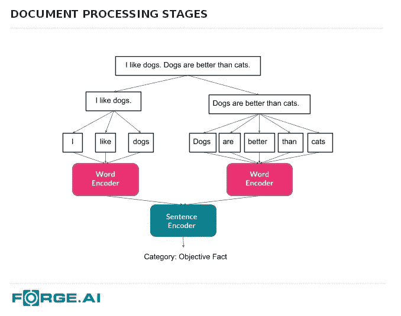
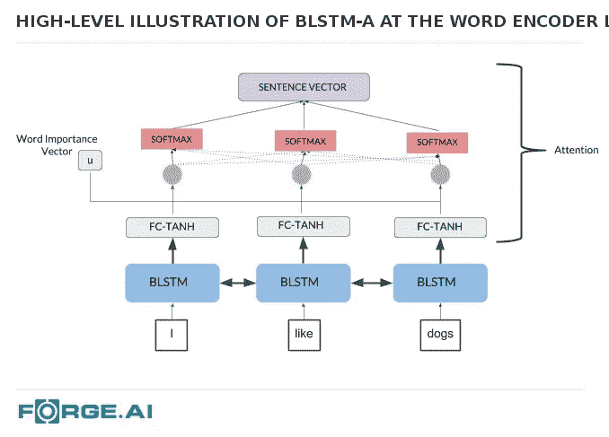
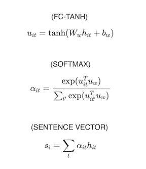
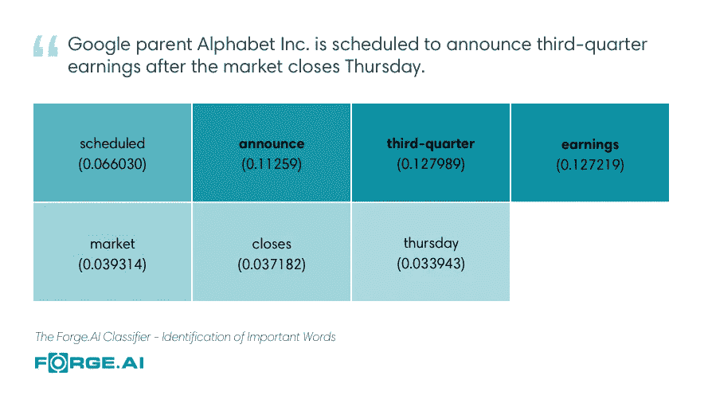
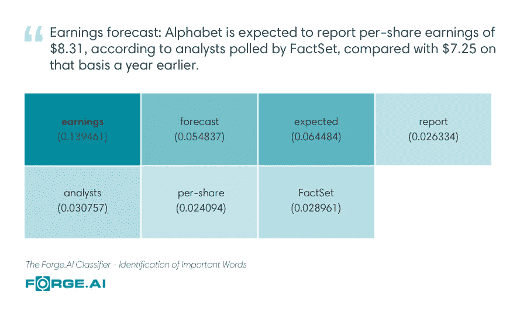
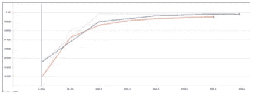
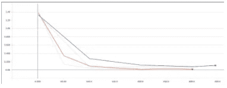
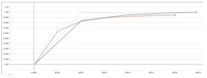
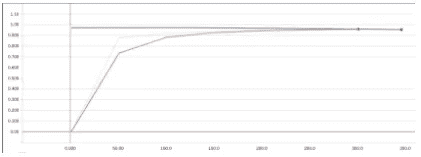

# 锻造厂的等级分类。人工智能

> 原文：<https://medium.com/hackernoon/hierarchical-classification-at-forge-ai-5745160f01c7>

## 布兰登·麦金齐

# 动机

假设您想在多个特定级别上对单个文档进行分类。此外，您还想知道一个文档是否包含多个主题，并且有多大把握。例如，当我写这篇文章的时候，谷歌新闻正在显示一篇名为 [*的文章，内容是带有川普税红利*](https://www.forbes.com/sites/baldwin/2018/01/29/income-stocks-with-a-trump-tax-bonus/#1582081a4a3d) 的收益股票。我们可能希望捕捉文章中包含的主要主题，以及我们对这些主题包含在文章中的信心的相关度量。这种分类可能看起来像下面这样

**1。金融:70%**

a.股票市场:63%(占 70%)

b.税收:37%(70%中的 37%)

**2。政治:30%**

a.行政部门:100%

上述主题分类引发了许多问题:

*   我们如何决定何时将一个给定的类别包含在我们的列表中？
*   在给定的类别中，我们如何决定是否应该再往下一层？
*   我们如何训练一个系统，使其既足够通用，可以从大量的文档中挑选出有意义的类别，又足够专业，可以深入到这些类别中的每一个？

我们需要找到一种方法来有效地表达和学习知识的层次结构。

# 大创意:分层注意力网络

神经网络的主要优势之一是能够自动学习数据中对于做出准确预测很重要的特征。在自然语言处理任务中占主导地位的一个神经网络组件是双向注意力 LSTM(bl STM-A)。使用 GRU 代替 LSTM 也很常见，因为 gru 已经[显示出与 lstm 相当的](https://arxiv.org/abs/1412.3555)性能，并且它们训练起来更快。

CMU 和微软研究院在 2016 年发布了一篇题为“[文档分类的分层注意力网络](http://www.cs.cmu.edu/~./hovy/papers/16HLT-hierarchical-attention-networks.pdf)”的论文，提出了一种结合 BGRU-A 组件来学习文档表示的聪明方法。作者观察到文档是由句子组成的，而句子本身是由单词组成的，他们希望将这种内在的组合性编码到他们的神经网络架构的设计中。他们通过对给定文档中每个句子的单词标记应用 BGRU-A，即**单词编码器**，从而产生每个句子的矢量表示。句子向量序列然后被送入另一个 BGRU-A，即**句子编码器**，以获得文档的单一向量表示。下图从一个包含两个简单句子的文档的高度说明了这一点。颜色表示身份—相同的单词编码器组件用于处理句子 1 和 2 中的单词标记。

***Figure 1\. Document Processing Stages.*** *High-level illustration showing the main processing stages for a document both before and within the network. As a preprocessing step, documents are segmented by sentence, and then by words, before being fed to the network. The same word encoder (BLSTM-A) is applied to each of the tokenized sentences. The vector representation of each sentence is then fed to a sentence encoder (BLSTM-A), whose outputs can be projected to obtain the logits and eventual prediction.*

# Forge 的分级注意力网络。人工智能

在 Forge，我们有两种层级:

1.  **数据层级:**我们分类任务的标签存在于一个预定义的层级中。
2.  **模型层次:**模型的架构本身就是层次化的。

**数据层次**

我们的训练数据由组织成目录层次结构的文档组成，其中给定目录的名称定义了其下所有文档的标签。因为我们有一个嵌套的目录结构，这意味着一个文档可能有不止一个标签。具体来说，给定文档的可能标签集由从根目录到文档位置的路径上的目录名组成。

我们将一个唯一的模型与数据层次结构中的每个目录相关联，包括根目录。唯一的例外是不包含至少两个子目录的目录，因为我们没有理由在一个或零个标签上训练模型。下面显示了一个目录层次结构示例。

***Figure 2\. Organiztion of Training Data.*** *Example illustration of how the training data is organized into a label hierarchy. A unique model is training on each node of the data hierarchy. The three shaded regions shown here would correspond to three models: one trained on all documents, one on all Finance documents, and one on all Earnings documents, respectively. This gives us a tree of models, each of which are specialized in their own region of the data hierarchy.*

在这个例子中，根级模型被训练为将文档标记为金融、政治或者被省略的剩余标签之一(由省略号表示)。根据预测的可信度，我们可能希望将文档传递给下一级别的模型。如果根级模型预测该文档属于 Finance，我们可以将该文档发送给专门针对 Finance 中的文档进行训练的模型，该模型将输出股息、收益或 Finance_Other。在每个类别下都有一个特殊的标签，是为那些不能被整齐地放入任何子类别的文件保留的。例如，上图中直接放在 Finance 下的文档将被标记为 Finance_Other，我们在其中添加了父名称，以强制限制没有两个类别具有相同的名称。我们可以沿着预测路径继续这个过程，直到满足我们的停止条件(例如，接收到低于 80%的预测置信度)。

例如，我们可以通过遍历前两个预测标签的预测路径来探索多主题文档。另一个选项可以是向下遍历到接收高于某个预定义阈值的预测置信度的任何子类别。请注意，如果我们想要增加所采用的平均路径数，我们必须降低我们的置信度阈值。例如，如果我们的阈值高于 0.5，我们将永远不会遍历一个以上的路径。这说明了在解释输出置信度值时必须小心的原因，输出置信度值只是一个网络的 softmax 概率，该网络被馈送了很可能包含不止一个突出主题的文档。

考虑一个理想的情况，一个模型已经被训练来准确地识别两个主题，主题 A 和主题 B，何时出现在文档中。如果我们向模型提供一个文档，其内容在主题 A 和主题 B 之间平均分配，我们应该如何解释输出预测集“主题 A: 50%，主题 B: 50%”？在这个特定的例子中，可以认为网络没有混淆和/或最大程度地不确定要分配的主题，而是它已经以相同的比例观察到主题 A 和主题 B 的信号，并且在其输出中准确地传达该信号。然而，问题是，在一般情况下，不可能确定一个模型是否不确定分配哪个标签，或者是否相对确定存在少数主题。

**模型层级**

之前，我们提供了 BLSTM-A 组件的高级概述，以及如何在分层注意力网络中使用它。在这里，我们更详细地描述完整的模型架构。下面是在字编码器级别使用的 BLSTM-A 的示意图。这也是展开的/展开的表示，其中，不是示出指向自身的自循环 LSTM 循环，而是在沿着输入序列的每一步示出网络的相同副本。同样，颜色表示身份，因此任何具有相同颜色的组件都是彼此的精确副本，共享权重等等。

***Figure 3\. High-level illustration of BLSTM-A at the word encoder level.*** *Each output of the BLSTM is fed through a fully-connected layer with tanh activation function, which also projects the outputs to the same dimensionality as the word importance vector. The inner product between the word importance vector and each output is sent through a softmax layer, which outputs the normalized (across timesteps) attention weights. The sentence vector is then computed as the weighted sum of the BLSTM outputs.*

双向 LSTM 为我们提供上下文感知的单词表示，注意力层输出这些表示的加权和，以给出句子表示。注意机制通过用**单词重要性**向量对 BLSTM 输出序列的每个元素进行评分来运行。单词重要性向量取代了传统注意力机制中通常所说的**查询**。目标是学习重要性向量的表示，使得其与上下文感知单词向量(从 BLSTM 输出)的内积产生单词重要性的某种度量。由于重要性向量是与模型参数的其余部分联合训练的，所以给定单词的**重要性**的含义是通过训练任务 **—** 隐式定义的。重要单词是主要出现在某个特定标签中的单词。形式上，第**I**句中第**t**个单词的上下文感知向量(BLSTM 输出状态)由 **h_it** 表示，并且

其中 **s_i** 是从 BLSTM-A 输出的句子向量表示。这导致文档中每个句子的句子向量。然后用不同的 BLSTM-A 对这些向量运行相同的过程，称为句子编码器(只是为了与单词编码器区分开来)，对每个句子相对于另一个句子的重要性进行评分。与单词重要性相似，重要句子是那些包含特定单词模式的句子，这些单词主要出现在特定标签的文档中。这就减少了我们的模型被一些政治性的词语打乱的机会，这些词语出现在一个关于家庭烹饪的文档中。然而，如果文档的整个部分因政治*而失控*，这是模型增加其文档可能被标记在政治下的相对置信度的好理由。

最后，值得注意的是，重要单词/句子的检测发生在对文档标签的预测之前，这也是作者在原始论文中强调的。当我们考虑这些模型时，很容易意外地改变信息流动的方向，这就是前面提到的区别的原因。该模型不是使用标签来找出重要的单词，而是首先客观地找到**有信息的单词模式，这些模式将*然后*用于确定下游的标签。我们知道，小批量梯度下降通过首先平均批量中每个示例的梯度来更新模型权重。该平均值以及批量平均值上的增量更新的效果是，我们学习了对数据中的循环模式给予高分的重要性向量的表示，这些数据通常对于确定文档标签是有用的。我们把有噪声的信号平均掉，把重要的信号合成。事实上，我们观察到的重要性向量的表示可以采用非常有趣的值，如下例所示。**

****

*****Figure 4\. Classifier Importance Vectors.*** *The left image is the word importance vector and the right image is the sentence important vector. The horizontal axis corresponds to the values of the vector elements and the axis going into the page is the training step, so we are seeing the distribution of values in the vector in fifty step intervals. For more plots showing the classifier performance as a function of training steps, please see the Appendix at the end.***

# **实施说明**

**与原始论文相比，我们初始化单词嵌入来预训练[手套嵌入](https://nlp.stanford.edu/projects/glove/)，而不是从头开始训练它们。斯坦福大学 NLP 小组在维基百科和 Gigaword 的 60 亿个标记上训练了预训练嵌入。我们发现这既提高了成绩，又减少了训练时间。**

**各个文档被转换成矩阵表示，使得行 *i* 和列 *j* 中的条目对应于文档中第 I 个句子的第 j 个单词。插入零填充，使得矩阵的列数等于最长句子中的字数。但是，请注意，对于一批文档中的句子和单词的数量，我们是灵活的，允许每个文档的句子数量和最长句子的长度可变。这是通过使用 TensorFlow 的 tf.while_loop 函数结合动态 tf 动态展开序列来实现的。张量数组对象。**

**为了在服务期间支持快速训练时间和灵活性，模型在训练期间使用序列化的 TFRecords protobufs，在服务期间使用原始张量。通过利用 TensorFlow 中模型签名的概念，这种分离是可能的，这允许人们定义输入/输出模态并将它们与唯一标识符相关联。**

**模型本身被序列化为二进制协议缓冲区。在服务时，使用 TensorFlow C++ API 加载它们，使用将模型加载到内存和将张量提供给输入层所需的最少操作集。启动时，服务器将完整模型树的副本加载到线程安全队列中，每个可用线程有一个模型树。REST 端点被公开，以允许客户端发出包含要分类的文档的 POST 请求。发出请求会触发请求处理程序，该处理程序将从队列中弹出模型树，查询预测的层次结构，并在完成时将模型树放回队列中。**

# **重要词汇的注意视觉化**

**对于任何预测，我们也可以提取关注层系数最大的单词。大的系数对应于由重要性向量确定的得分相对较高的单词和句子。每个单词的重要性由其对应方块的阴影来说明。阴影越暗，越重要。该模型预测该文档属于“财务→收益”类别，置信度超过 99.99%。请注意，我们只显示文档的一部分，因此也只显示分数的一部分，所以分数的绝对值并不重要 **—** 一个分数相对于另一个分数的值是可视化的重点:**

**单词重要性-第一句**

****

**单词重要性-第二句**

****

*****Figure 5\. Word Importance Values for Two Sentences.*** *These examples are showing the top words from two sentences contained in the article, “*[*Alphabet Earnings: What to Watch*](https://www.wsj.com/articles/alphabet-earnings-what-to-watch-1508923802)*”.***

# **附录**

****剧情****

**为了快速演示，我在笔记本电脑上运行了一个包含 2899 个文档的小型数据集的模型，其中 80%用于训练(橙色)，20%用于评估(蓝色)(随机选择)。整个训练过程花费了不到 30 分钟的时间，在此之前，一些早期停止指标确定验证准确性达到了稳定水平。主要的超参数包括:**

*   **批量:64**
*   **嵌入大小:300**
*   **GRU 国家人口:256**
*   **词汇容量:60000**
*   **每个文档考虑的最大句子数:60**
*   **每句话要考虑的单词标记的最大数量:80**

****精度****

****

****损失****

****

**每类精度**

**金融**

****

**政治**

****

**制药公司**

****

**合法的**

****

**注:本帖原载于我们的博客:[https://www . forge . ai/blog/hierarchical-classification-at-forge . ai](https://www.forge.ai/blog/hierarchical-classification-at-forge.ai)**