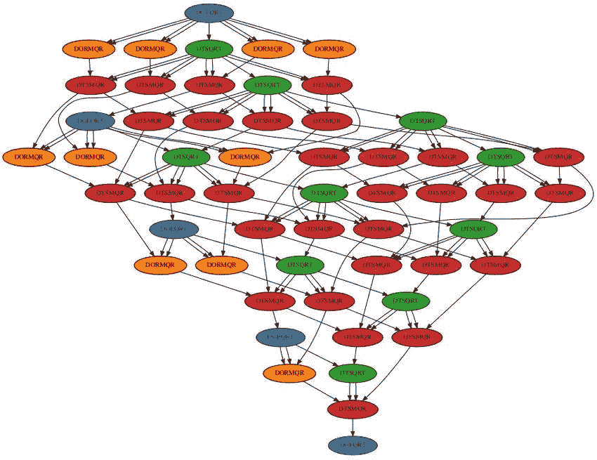
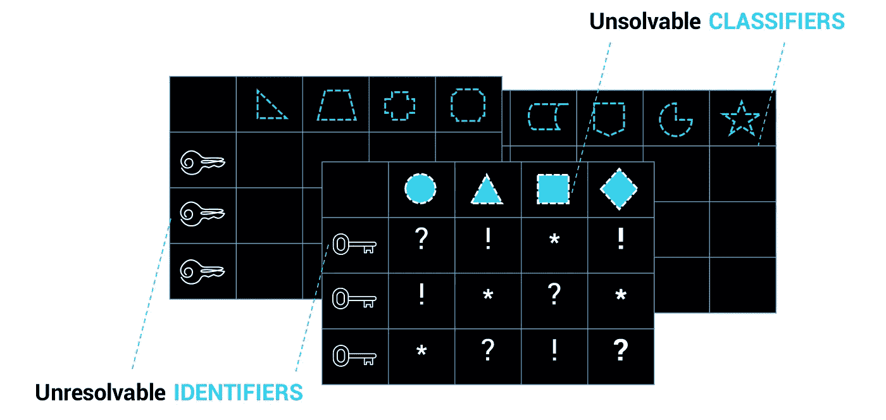
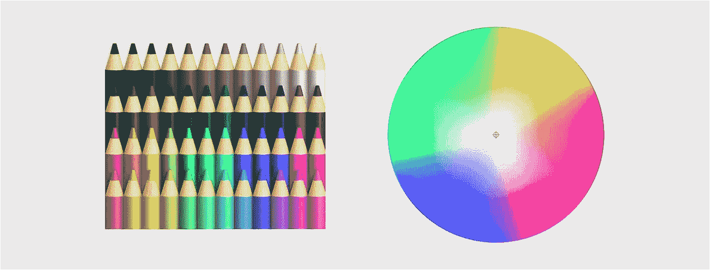

# 高清数据

> 原文：<https://medium.com/hackernoon/high-definition-data-eeab16b055a3>

**可验证声明**是一种新型的高清晰度数据资源。这是一种重要的新型信息，因为高清数据在数字世界中有很多有用的应用，可以深刻改变社会在物理世界中的运作方式。这是在人、机器和信息之间建立信任网的基础。

以这种格式捕获的数据可以是高分辨率和高保真度的。
这篇文章解释了这些新标准的核心概念，并提出了思考具有“高清晰度”质量的数据如何能够产生工程和数据科学的突破。

## 让我们从一些简单的信息理论开始

[信息论](https://en.wikipedia.org/wiki/Information_theory)是一种解释信息如何被量化、存储和交流的方法。我想在这个范围内加上*信息如何被估价*。

## 图表

信息论的一个特别有用的子领域是图论。这有助于我们解释信息相互联系的方式。

我们可以使用友谊的类比，通过描述他们的关系(如*友谊*)来理解(关于人的)信息是如何连接的。

在图论中，术语*节点*和*边*提供了描述信息对象([节点](https://www.w3.org/TR/2014/REC-json-ld-20140116/#dfn-node))及其连接([边](https://www.w3.org/TR/2014/REC-json-ld-20140116/#dfn-edge))的基本抽象。你可以通过把人想象成节点，把他们的关系想象成边，在头脑中构建一个图的组成部分。在这个类比中，人是点，关系是连接他们的线。

友谊通常是相互的，所以连接两个朋友的边两端都有箭头。这是循环和动态的。它认为互动是信息流(包括感觉！)—两种方式，朋友之间。

但是如果有人把你当成朋友，而你只是把他们当成熟人，你们之间的边缘可能只指向你自己，是单向边缘。仅由单向边连接的节点创建一个有向图。每个个体都是独一无二的，并且有独一无二的边，这意味着这个图是无环的。当你遍历图形时，它不会重复。用专业术语来说，这是一个[有向无环图](https://www.techopedia.com/definition/5739/directed-acyclic-graph-dag) (DAG)。

当我们研究图论在信息技术(如网络和区块链)中的具体应用时，为什么普通图和 T2 有向无环图之间的区别会变得更加明显。

## 链接数据图

[链接数据](https://en.wikipedia.org/wiki/Linked_data)是一种新的网络规范，已经由[万维网联盟](https://www.w3.org) (W3C)正式制定，相信它可以以创建更好的网络的方式组织和连接数据。

> 关联数据使人们能够在网上发布和使用信息。这是一种跨网站创建基于标准的机器可读数据网络的方法。它允许应用程序从一个链接数据开始，并沿着嵌入的链接到 Web 上不同站点上托管的其他链接数据。

一般来说，链接数据的数据模型(编码为 [JSON-LD](https://json-ld.org) )是一个一般化的、带标签的、有向的[图](https://www.w3.org/TR/2014/REC-json-ld-20140116/#dfn-graph)，它可以有循环连接、非循环连接或者两者都有。该图包含的[节点](https://www.w3.org/TR/2014/REC-json-ld-20140116/#dfn-node)通常是一些数据，比如一个[字符串](https://www.w3.org/TR/2014/REC-json-ld-20140116/#dfn-string)、[数字](https://www.w3.org/TR/2014/REC-json-ld-20140116/#dfn-number)、[类型值](https://www.w3.org/TR/2014/REC-json-ld-20140116/#dfn-typed-value)(日期、时间……)，或者一个资源定位器( [IRI](https://www.w3.org/TR/2014/REC-json-ld-20140116/#dfn-iri) )。

这个简单的数据模型非常灵活和强大。它能够模拟几乎任何类型的数据——包括具有互惠关系的朋友网络的例子！

## 有向无圈图

在[有向无环图](https://www.techopedia.com/definition/5739/directed-acyclic-graph-dag) (DAGs)的数据模型中，每个节点都是唯一的，都有唯一的边。

这个简单的数据模型也非常灵活和强大，因为它能够建模几乎任何类型的数据。在我们的人际关系类比中，这描述了仅仅是熟人的网络之间的单向关系——当没有互惠时！

Dag 优于一般链接数据图的地方在于它们是确定性的。这就是 Dag 是区块链型数据结构的基础的原因，其中信息的排序是重要的。

## 默克勒山

一个[散列](https://en.wikipedia.org/wiki/Hash_function)是信息的实际抽象。它是通过算法将任何数据输入转换成确定的固定输出而产生的，例如 256 个字母和数字的字符串。

当数据能够被可靠地复制，并且它所编码的信息不会随着时间的推移通过熵的力量而被破坏或衰减时，数据具有更高的保真度。我们说数据是可以验证的。使用散列函数对数据进行加密编码，提供了数学上可证明的信息保真度。这也使得通过[内容寻址能力](https://www.google.com/url?sa=t&rct=j&q=&esrc=s&source=web&cd=1&ved=2ahUKEwieltuWlazfAhVTThUIHfx8AG0QFjAAegQIBRAB&url=https%3A%2F%2Fipfs.io%2Fipfs%2FQmXoypizjW3WknFiJnKLwHCnL72vedxjQkDDP1mXWo6uco%2Fwiki%2FContent-addressable_storage.html&usg=AOvVaw1NbmlDQG22RJW3V-HnEpCP)更容易找到数据。每个数据资源的唯一性(由其哈希值表示)为信息提供了一个可识别的指纹。这使得数据不可替代，这对于减少数据错误和会计欺诈(如重复计算)非常重要。

[Ralph Merkle](https://en.wikipedia.org/wiki/Ralph_Merkle) 对信息技术做出了巨大贡献，他提出了一种散列数据的方法，然后使用散列值将这些数据联系起来。信息节点的散列值被添加到新信息节点的报头中，然后被散列。这在节点之间创建了一个编码的关系。在链接链中，数据通过指向前一个节点的散列引用进行链接。由于每个节点(由其哈希值表示)都是唯一的，因此这些节点之间的边也是唯一的。由于信息只能确定性地添加，这就创建了一个有向无环图。在这种情况下，我们将其称为 Merkle DAG。

Merkle DAG 将数字编码的信息固化成一系列不可改变的状态表示。

索赔数据的任何节点的内容地址都可以由数据的加密散列来定义。图表的方向是从孩子流向父母。没有父节点的节点被认为是叶子，必须至少有一个子顶点才能连接到图。图中显示了这一点，其中表示索赔的每个节点都可以归属于另一个索赔节点。节点之间的关系被表示为节点图中的边(在该图的视觉表示上连接节点的线)。

这些数据结构增加了一个强大的新功能，可以捕获整个信息图的状态——包括所有节点的状态及其所有关系的状态。我们将看到这是如何提升信息的分辨率和保真度的——尤其是当这些信息是关于一个唯一确定的主题时。这产生了高清晰度的数据，可用于一系列的应用，这是以前不可能的！

## 分散标识符

标识符可以被认为是记录定位器。在数据库的上下文中，这些是数据库的[主键](https://en.wikipedia.org/wiki/Primary_key)。问题是，每个数据库都有自己的一组记录定位器，并且键由数据库的所有者和管理员拥有和控制。这导致记录被“捕获”——如果它们包含关于我们的个人信息，或者如果我们想要跨数据库系统共享记录，这就不好了。

Limitations of traditional (Web 2.0) Databases

一个新的标识符标准已经从[重启信任网](http://www.weboftrust.info)社区的工作中诞生。这现在正通过 W3C 正式成为分散标识符 [(DID)规范](https://www.google.com/url?sa=t&rct=j&q=&esrc=s&source=web&cd=1&ved=2ahUKEwjq14qc66nfAhVLUxoKHa7UDtcQFjAAegQIChAB&url=https%3A%2F%2Fw3c-ccg.github.io%2Fdid-spec%2F&usg=AOvVaw3EWiGqkZPSON2xa1Nhnm6W)。DID 是一个通用的唯一标识符( [UUID](https://en.wikipedia.org/wiki/Universally_unique_identifier) )，它是使用特定的方法(比如散列其他特定的信息)得到的。这可以放在一个分散的[公钥基础设施](https://en.wikipedia.org/wiki/Public_key_infrastructure) (DPKI)上，比如一个区块链，在那里它可以作为一个记录定位器。

DID 允许创建具有解析到该唯一标识符(或该标识符的确定性衍生物)的数据的记录。这些记录不必局限在任何一个数据库中。关于同一主题标识符的多个记录可以跨系统和随时间相关联。这可能意味着更多的节点和更多的边。它增加了数据的密度，从而有效地将数据的定义提升到更高的分辨率。现在，我们终于有了真正“高分辨率”数据的前景——就像我们已经看到的用于捕捉图像的更高分辨率相机的演变一样！从这里开始的技术进步是进一步从 Web 2.0 数据库中解放数据，以生成联系更紧密、越来越有用的信息图表。

DIDs 的另一个特征是，它们能够通过使用 DID 文档记录中的相关 URIs 来定位记录。它们还启用控制器(所有者？)使用记录在 DID 文档中的加密签名密钥进行认证。这些都是强大的特性，但这是另一篇文章的主题。

## 可证实的说法

将这些联系在一起的是*可证实的声明*。这提供了一种收集、传递和存储关于被识别对象的数据的新方法，使用可以被可靠地再现并被证明没有改变的数据结构。

*注意:可验证的声明现在被正式制定该规范的 W3C 工作组称为可验证的凭证。虽然这是语义上的，但我觉得它限制了对这个重要的新数据标准的适用范围的解释。对于一般用例，我们继续使用术语“可验证的声明”,对于关于身份的声明子集，我们使用“可验证的凭证”。*

可验证声明使用 JSON-LD 格式的链接数据，为所声明的信息提供上下文。这将索赔中包含的数据与外部信息源联系起来。*例如:在声称这个人的“姓名”属性值是“爱丽丝”的上下文中，我们指的是“姓名”的“schema.org/person”定义。*

可验证的声明嵌入了主体的分散标识符(DID)。这使得特定的属性值能够跨多个声明与主题相关联。

声明被散列以保护它所包含的信息，这为声明产生了唯一的标识。通过发行者将他们的 DID 添加到记录中并对声明进行加密签名，进一步增加了声明的保真度，这意味着这可以被认证。

## 更高清晰度的可验证声明

现在我们来了解一下通过用高清数据的范式来思考而可能实现的创新。

如果我们将可证实的声明与 Merkle DAGs 结合起来会怎么样？

Dag 可以很好地记录声明(可能包括陈述、证明、意见或其他观察)，这些声明归因于已经存在的可识别的事物，包括抽象的事物。这是因为 Dag 只能通过散列现有信息来创建。因此，dag 可用于建立与分散标识符相关的可验证声明的图表。

主张以时间(时间点)观点或事实状态的形式存在。不管随后的事件如何，过去的声明可能不会改变，因此属性 DAG 的边仅指向上游，指向更早的声明或事件。
由于这个原因，dag 是描述给定声明如何与目标主题的过去声明相关联的理想工具。这提供了用于构建索赔图的信息，其中属性链可以增加每个索赔的保证级别。

可核实的索赔可以通过多类归属网络联系起来。这将产生指向凭证的不同类别属性的图形，该凭证将具有确定性的更高级别的分辨率和保真度。我们可以通过将分类元数据添加到可验证的声明中，然后通过有向无环图链接这些元数据来实现这一点。可以把这想象成给图表添加颜色，其中颜色代表可能的元数据类的光谱。分类器可以包括不同类型的证明或证明权重。

这些图的密度作为唯一数据点的数量以及节点和目标标识符之间的关系强度的函数而增加。随着越来越多的数据点被链接到这个图表中，随着这些数据点通过归属链得到加强，索赔变得更加清晰。

通过在 Merkle DAG(或区块链事务)中引用其散列值来记录可验证的声明的存在，还通过记录可与该声明的未来状态相比较的该声明的原始状态来向凭证添加出处。

## 应用和使用案例

对于*数字身份*应用，可验证声明的高清格式可以增加身份凭证的信息价值和效用。例如，通过使用归属网络来增加身份保证的级别(即凭证是真实的并且与主体正相关的概率)。

这些原则同样适用于身份以外的应用程序。我们在 [ixo 协议](http://ixo.foundation)中提出了高清*影响声明*的概念。

为了记录影响，可验证声明格式生成有价值的数字资产，这些资产具有可证明的属性和统计完整性。这些类型的资产可以通过智能转换进一步丰富，为索赔添加更多信息。例如，声称产生的千瓦时清洁能源减少了碳排放，现在可以用来量化碳信用。

通过验证过程，可以产生唯一标识的数字资产。这些资产可以加密标记。碳信用成为碳代币。这具有降低数据可替代性的优势，同时增加了金融可替代性——这赋予了这些资产更多的流动性，因为它们现在可以通过低摩擦的数字交易和交换进行无信任的交易。

## 关于如何建设高清数据系统的初步思考

DAG 对声明之间的关系进行编码，以提高链中每个声明的分辨率和保真度。这个结构中的每个声明都以一种可测量的方式将信息归属于被识别的主体，并且可以根据其归属于的程度来相对评价。该映射可以被编码并存储在[散列表](https://www.google.com/url?sa=t&rct=j&q=&esrc=s&source=web&cd=3&ved=2ahUKEwiJgYDslqzfAhUpyoUKHWB7AM0QFjACegQIBhAK&url=https%3A%2F%2Fen.wikipedia.org%2Fwiki%2FHash_table&usg=AOvVaw35HhLIk5wS4LY8oElN6VI7)或 [IPFS](http://ipfs.io) 中。
通过使用数据的散列地址来读取图形，以返回数据本身。属性元数据可以被统计加权和评级，以计算关于所标识的目标索赔的概率决定因素。

## 进一步探索的想法

既然我们已经有了用目标标识符对声明链进行归属的通用结构，我们可以开始考虑新的声明元数据类别如何为声明增加信息定义的程度，并使其在分辨率和保真度方面的定义更高。可以认为这是增加了信息中每个像素的可用光谱。在未来，我们可以拥有关于任何主题的*高清*、*全彩、*、*机器可读*信息。

**致谢:**

[Michael Zargham](https://medium.com/u/bdd1335dfbd?source=post_page-----eeab16b055a3--------------------------------) 和 [Matt Stephenson](https://medium.com/u/5c813ae55f97?source=post_page-----eeab16b055a3--------------------------------) 发表了关于*多类属性网络的有色有向无环图*的论文(启发并启发了本文)

[马努·斯波尼](https://medium.com/u/aa3e8c53686?source=post_page-----eeab16b055a3--------------------------------)、[克里斯多夫·艾伦](http://www.lifewithalacrity.com/about/)、[乔·安德里欧](https://medium.com/u/f129836dc5d6?source=post_page-----eeab16b055a3--------------------------------)和[重新启动信任网](http://www.weboftrust.info)社区，为可验证声明和分散标识符设计基础。