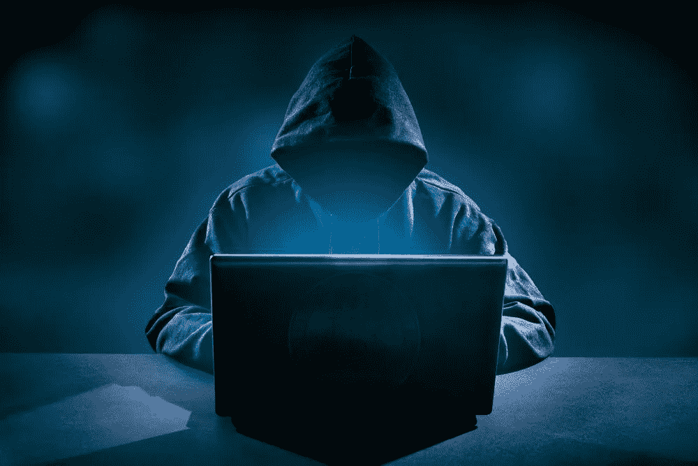

# 高调的加密货币黑客攻击

> 原文：<https://medium.com/hackernoon/high-profile-cryptocurrency-hacks-79d4f3cf1f36>

## 调查意见

Source: Fossbytes

加密货币类似于数字黄金，就像对应的矿物一样，有相当大的热情，这与 19 世纪 50 年代的加州淘金热没有太大的不同。人们渴望获得加密货币，因为它们的价值在过去几年里飙升。比特币的价格已经从 2011 年的个位数价值上升到 2017 年的 1 万多美元。这是可交易商品历史上前所未有的数量级增长。由于这种增长，该市场已成为黑客和网络罪犯的目标。这些年来，出现了许多高调的加密货币黑客攻击。

在深入研究本文的主题之前，简要解释几个有助于读者理解主题的概念是很重要的。拥有像比特币这样的加密货币意味着一定数量的比特币驻留在所有者的数字地址中。钱包中比特币所有权的证明取决于对加密密钥(私有和公共)的拥有。把这些想象成你的信用卡号码和 CVV 号码。如果黑客得到了这些密钥，他们可以将你钱包中的比特币或其他密码转移到另一个钱包中。以下是迄今为止发生的三起最引人注目的加密货币黑客攻击。

# 1.刀客

大多数高调的加密货币黑客攻击都发生在加密货币交易平台上。 [DAO hack](https://www.cryptocompare.com/coins/guides/the-dao-the-hack-the-soft-fork-and-the-hard-fork/) 是这种模式的一个例外。DAO 是一个基于以太坊的风险投资组织，由所有参与者管理。它被设想为一个健壮的平台，能够在其平台上创建和实现 DApps(分散式应用程序)。2016 年 5 月，DAO 的众筹筹集了超过 1.5 亿美元的资金。接下来的一个月，黑客利用了 DAO 的一个缺陷，窃取了 5000 万美元。

## 黑客攻击的细节

DAO 中的缺陷与所谓的“分割函数”有关这个函数允许用户收回已经投入到 DAO 中的以太。这一过程涉及返还投资的乙醚并将返还款登记在分类账中，以更新"道"的记录。黑客能够创建一个“递归函数”，这基本上是一个自我重复的函数，使分裂函数的第一步不断重复。代码没有转到注册令牌反转的第二步，而是继续返回到第一步，直到价值 5000 万美元的乙醚从 DAO 中被盗。

## 黑客的影响

整个以太坊架构遭受了巨大的打击，在 DAO 黑客攻击的直接后果中有许多混乱和不确定性。第一个主要步骤是执行区块链的软分叉。软分支被认为是有问题的，因为如果实施的话，它会造成许多 DDoS 攻击。由于无法达成共识，以太坊社区很快就出现了分裂，最终导致了一场硬分叉。这创造了两个截然不同的以太坊区块链；[以太坊经典(ETC)和以太坊(ETH)](https://blockgeeks.com/guides/what-is-ethereum-classic/) 。ETC 区块链是由拒绝硬叉的参与者组成的，由于 DAO hack，他们选择不改变区块链。

# 2.Bitfinex 黑客

Bitfinex 是 iFinex Inc .旗下位于香港的加密货币交易平台，它还为加密货币提供钱包和交易服务。Bitfinex 在运营期间遭受了几次黑客攻击，但最大的一次是在 2016 年，当时有近 12 万 BTC 从平台上被盗。这相当于约 7200 万美元，是第二大比特币交易所黑客攻击。前一年，大约有 1500 个 BTC 被黑客从平台上窃取。

## 黑客攻击的细节

2016 年 8 月 4 日，黑客利用 Bitfinex 平台的 multisig 安全协议中的一个缺陷，从几个客户账户中窃取了价值 7200 万美元的 119756 BTC。为了加强操作的安全措施，Bitfinex 决定使用 multisig(多重签名)安全协议。这就为一个钱包创建了 3 个私钥，由三个所有者分享。进入钱包需要三把钥匙中的两把。Bitfinex 与 BitGo 建立了合作关系，每个客户钱包的 1 个私钥存储在 BitGo 服务器上。

黑客攻击的具体细节仍不得而知，但流行的理论是 Bitfinex multisig 安全框架根本不是 multisig。据称，该系统的设置方式使得 Bitfinex 服务器仍然是单点故障。因此，当黑客入侵 Bitfinex 服务器时，他们能够绕过 BitGo 安全协议。

## 黑客的影响

黑客攻击的后果并没有终结 Bitfinex 的运营，但该公司受到了很大的影响。Bitfinex 的回应是发行 BFX 代币作为一种借据，代替被盗的资金。他们还扩大了其平台上提供的加密货币交易对。这增加了 Bitfinex 平台的交易量，他们得以恢复。至于比特币的价格，它下跌了近 20%，但随后不久就回升了。

# 3.Mt. Gox 黑客

当情况良好时，马克·卡佩斯和 Mt. Gox 位于比特币交易食物链的顶端。超过 70%的全球比特币交易量由该平台处理，因为它是目前市场上最大的平台。成立于 2010 年，迅速成长为比特币交易市场的巅峰。在 2014 年该平台发生最大的加密货币黑客攻击后，它崩溃了。这导致超过 70 万 BTC 被盗，价值约 4.73 亿美元。

## 黑客攻击的细节

在 2014 年的黑客攻击之前，早在 2011 年平台上就发生过一次入侵。一名黑客或一群黑客闯入系统，从客户钱包中转移走大量 BTC，最终在交易所出售。在这次黑客攻击中，价值超过 800 万美元的 BTC 被盗，但与 3 年后发生的事情相比，这根本不算什么。

2014 年 Mt. Gox 黑客攻击的实施者使用了一种交易延展性攻击来完成黑客攻击。缺乏适当的版本控制协议和软件开发流程的低效设置意味着黑客可以获得控制权并在平台上进行未经授权的交易。一天结束时，744，408 BTC 从平台上被盗。

## 黑客的影响

由于盗窃规模巨大，该平台宣布破产，超过 10 万名客户失去了投资。该公司的首席执行官马克·卡尔佩莱斯被捕并被指控欺诈。该平台从未从黑客攻击中恢复。

黑客的威胁仍然是加密货币市场中一个明显而现实的危险。因此，许多平台采取具体措施来提供足够的安全措施。即使采取了这些措施，采取某些措施来保护您的加密硬币仍然很重要。其中一个步骤是永远不要把大量的加密硬币放在网上钱包里。投资 Trezor 和 Ledger Nano 这样的硬件钱包是更好的选择。此外，努力保持你的私人钥匙的安全。

渴望了解更多关于 FundYourselfNow 的信息吗？在我们的 [*电报*](https://t.me/fundyourselfnow) *群上加入我们的众筹革命对话，或者在* [*推特上关注我们。*](https://twitter.com/fundyourselfnow)