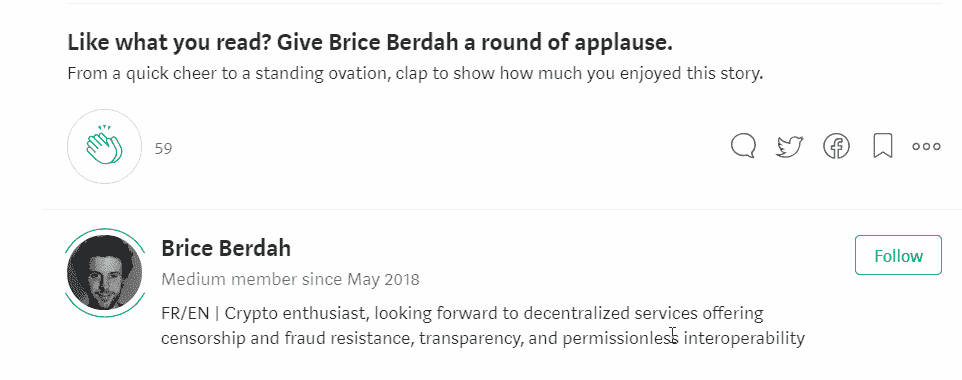

# 希洛，密码社区可以学习、分享和成长的地方？

> 原文：<https://medium.com/hackernoon/hilo-the-place-where-the-crypto-community-can-learn-share-and-grow-7074401e9d3a>

虽然加密货币市场和基础技术正在发展，但我们正处于从外部看起来可能是青少年的阶段。市场是冲动的，容易被操纵，[泵和转储集团仍然活跃](https://theoutline.com/post/3074/inside-the-group-chats-where-people-pump-and-dump-cryptocurrency)，定性的新闻和分析很难找到。

这些是加密货币新闻本身的问题，但另一个重要问题很少被讨论:**关于加密的讨论基本上发生在旧的、数据饥渴的交易平台上，如脸书、Reddit、Telegram，当然还有这里的 Medium** 。它带来了几个问题，其中一些与前面提到的问题有关:

*   **病毒式传播与质量脱节|** 最受欢迎的内容不是质量上的内容([脸书](https://hackernoon.com/tagged/facebook)就是一个很好的例子)，而是最吸引人的内容。如果人们分享这些信息，骗局或其他虚假的职业培训就会传播开来。
*   **用户放弃自己数据的所有权|** 用户无法控制自己在平台上的身份。他们不知道他们的数据是如何被精确使用的，即使他们删除了他们的账户，他们也不能保证他们的数据不会再被用于广告目的。
*   **平台的商业模式是不可持续的|** 为了继续发展他们的利润，平台只有几个选择，所有这些对用户来说都是有害的:比如增加广告量，收集更多/更精确的数据，或者将数据出售给更多的人。从本质上来说，**平台开发的收入流越多，暴露的用户数据就越多。**

*注意:在本文中，我不会讨论传统社交网络的问题。这仍然是理解希洛解决问题方法的相关性的一个重要方面。*

好消息是几个月前我写了两篇关于这个话题的文章。 [*第一个解决了对用户的后果*](/@BBerdah/facebook-x-cambridge-analytica-the-hidden-cost-of-free-services-3f5724e80baf) *和* [*第二个详细描述了对整个社会的影响，以及随着失去对我们数据的所有权而带来的政治和个人权力的丧失*](/@BBerdah/growing-beyond-the-advertising-model-to-achieve-democracys-true-potential-5990de48a86f) *。*

# HILO，一个社交加密网络

在加密市场活跃了一段时间的人将使用无数不同的服务来跟踪其资产并保持自己的信息，他/她将立即看到单一服务对所有人的价值。

对于缺乏经验的用户来说，这个项目可能很难理解，因为目前还没有类似的项目。**如果您考虑当前可用的服务，Hilo 有点像四合一，具有协同作用提供的附加值:**

*   [投资组合](https://blockfolio.com/) |个人加密投资组合跟踪器，
*   [硬币市场](https://coinmarketcap.com) |硬币发现、
*   [隐密恐慌](https://cryptopanic.com) |隐密新闻辛迪加和市场情绪，
*   [Steemit](https://steemit.com/) |去中心化的 Reddit 式(内容联合)。

我们将通过该平台提供的主要功能来准确描述整体。

## 投资组合跟踪

投资组合跟踪功能是最容易理解的。用户可以连接钱包或交换账户，以跟踪其资产和交易。**每位用户最多可以免费连接两个 exchange/wallet 账户**，支付 HILO 费用后还可以使用更多账户。

Hilo’s Portfolio View (Source: [Whitepaper](https://hilo.io/assets/whitepaper.pdf))

一旦建立连接，用户将能够访问其加密资产及其当前价值的全面概述。目前大约整合了 30 个不同的交易所，该团队正在为推出 90 个交易所而努力。

对钱包的监控是自动的，并且使用公钥来完成。因此，**不需要特殊访问。**要连接到 exchange wallets，需要使用 exchanges API。它们通常使用基于密钥的认证系统，您可以将密钥设置为只读(例如在币安上)。

## 社交图表

让我对 HILO 最感兴趣的一个功能是社交图。这是一个用户可以评论和注释的交互式图表。这将需要某种形式的过滤，但我认为，如果该功能经过仔细测试和优化，它可能会成为该平台成功的关键部分。

Hilo’s Social Graph (Source: [Whitepaper](https://hilo.io/assets/whitepaper.pdf))

Hilo 的团队设想了一个游戏化系统(下面会有更多相关内容),用户可以通过对平台的贡献获得 HILO 奖励，从而促进定性交流。

## 影响者溢价

用户将能够在平台上相互关注，以获得关于新贡献的通知。虽然前面提到的打电话的能力每个人都可以使用，但对有影响力的人来说可能会变得特别重要。事实上，通过常规方式进行的呼叫和加密支持的呼叫之间的差异是显著的。

假设这是一条推文:`$BTC will hit $52,343 in 2018`区块链的不变性允许不可伪造的可证实的预测。如果预测结果是真的，**作者将能够证明其真实性(包括做出预测的日期)和所有权。**基于区块链的预测服务的整个市场正在建立，像[这样的项目预示着](https://www.augur.net/)。

有影响力的人也可以将他们的资产分配货币化。如果他们愿意的话，他们可以通过付费解锁功能支付 HILO 费用来访问他们的(幻想)投资组合。

## 游戏化和发现

希洛的项目计划利用区块链提供的社交网络的全部潜力。**平台开发是由游戏化所激发的行动所驱动的。这些包括:注册、链接钱包、填写用户档案、打电话或发帖…**

当用户完成这些挑战时，他们会收到显示在其个人资料上的徽章。当收集到一定数量的徽章时，**用户可以升级，获得 HILO 奖励并访问平台上新的美学定制功能**。

HILO 奖励取自用户增长池(UGP)。**该池服务于平台开发和用户增长，**由平台上涉及 HILO 的某些活动的低费用(2%至 5%)资助，如付费解锁或某些消息功能。

Hilo’s Discover Tab (Source: [Whitepaper](https://hilo.io/assets/whitepaper.pdf))

“发现”选项卡就像一个内置的 coinmarketcap.com。您可以搜索硬币和代币，创建观察列表，并查看当天最大的交易量和价格。

## 幻想密码

为了配合游戏化特性，该平台的 v2 将提供一个梦幻组合选项。**用户将能够跟踪、分享和货币化由多达 20 种不同加密令牌组成的虚拟投资组合**。这将允许初学者在投入真实资本之前获得加密货币的经验。

该功能还没有预览，但你可以期待看起来非常像上面介绍的真正的投资组合。

## 仪表板和通知

仪表板使用户能够查看市场(*市场资本总额*)、他们关注的人的活动(*活动*)以及 Hilo 上的趋势。

Hilo’s Dashboard (Source: [Whitepaper](https://hilo.io/assets/whitepaper.pdf))

用户可以在 Hilo 上看到过去一天、一周或一个月的硬币趋势。这些是 Hilo 公共部门讨论最多的项目。

最后，最后一个面板给出了高点和低点的概述。所有面板都可以设置为显示每小时、每天、每周、每月或每年的数据。

## 分散网络和令牌化治理

Hilo 的团队非常重视网络数据基础设施及其治理的去中心化。在白皮书的开头，我们在摘要中提醒:

> ***用户数据是用户的，不是平台的。***
> 
> ***平台无权访问用户数据，从而保证用户隐私。***
> 
> *用户因优秀的内容而相互奖励。*
> 
> *用户显著控制平台治理。*

从一开始就需要权力下放，特别是在治理方面。**如果没有一个社区驱动的治理模式，平台将会朝着一个最终可能让用户失去兴趣的方向发展。**

关于用户数据，所有权归平台用户所有，平台无权访问。对某些人来说，数据的所有权似乎没什么大不了的，但是随着平台的发展，数据也在增长；随着多年的使用，它可以成为一个非常准确和可利用的用户画像(你好脸书)。**从长远来看，保护用户隐私将有助于建立和维护对服务的信任。**

## 技术条件

Hilo 将通过一个网站以及 iOS 和 Android 上的移动应用程序提供。HILO 令牌是一个 ERC-20 令牌(基于以太坊)。使用已建立的领先协议将允许访问有趣的合作伙伴关系，如 Civic，安全身份生态系统也是支持者之一。

# 喂，有人住的地方吗？

HILO 的目标是成为加密货币社区的包容性平台。该平台的功能旨在促进初学者、专家和有影响者之间的资源和信息交流。

每个人都将从中受益的主要功能是基础 Hilo 平台本身:**一个全面的资产跟踪解决方案，它与主要的交易所和钱包服务相集成**。互动图表、排行榜和社区评论等社交功能将允许不同专业水平的用户之间进行互动。

除了通用功能之外，我们还设想了更具体的功能来满足每个特定配置文件的需求:

*   徽章系统将帮助**密码初学者** [交互式地学习](https://hackernoon.com/tagged/learn)基本知识:注册、身份验证、钱包链接。
*   密码专家和有影响力的人可以公开呼吁市场，并通过徽章系统获得证明。排行榜将对最准确的来电者进行排名。
*   最后，**影响者**可能会探索一个潜在的额外收入流，通过“付费解锁”:他们的资产分配只有那些支付 HILO 费用的人才能看到。

# 结论

虽然 Hilo 展示的模型很有吸引力，但目前**还不能在以太坊区块链**上全面推广。幸运的是，随着项目的发展，以太坊网络基础设施也将发展。一个重要的更新即将到来，Casper:用于验证交易的协议将从工作证明切换到利益证明，从而提高验证速度，而分片的使用将极大地提高可扩展性。

代币出售的候选人名单已经开放[。](https://hilo.io/)网站上提供了该平台前三个版本的计划。在该平台准备好迎接成千上万的用户之前，还需要进行大量的微调和开发。而是当鸥群到来时谁会做好准备。

**写这篇文章是为了通过** [**赏金 0x**](https://bounty0x.io/) **换取一个潜在的令牌奖励。**

如果你喜欢这篇文章，请告诉我，并查看我的维基以获得更多类似的内容。 **别忘了拍拍它** **帮它传播:**可以一直按👏高达 50 次鼓掌。

[Learn more about Bounty0x, a decentralized bounty hunting platform](https://bounty0x.io/)

# 有用的链接

## 主要链接

*   [网站](https://hilo.io/)
*   [白皮书](https://hilo.io/assets/whitepaper.pdf)

## 官方社交网络账户

*   [中等](https://medium.com/hilocrypto)
*   [推特](https://twitter.com/HiloCrypto)
*   [脸书](https://www.facebook.com/HiloCrypto/)
*   [电报](https://t.me/HiloCrypto)
*   [领英](https://www.linkedin.com/company/hilocrypto/)