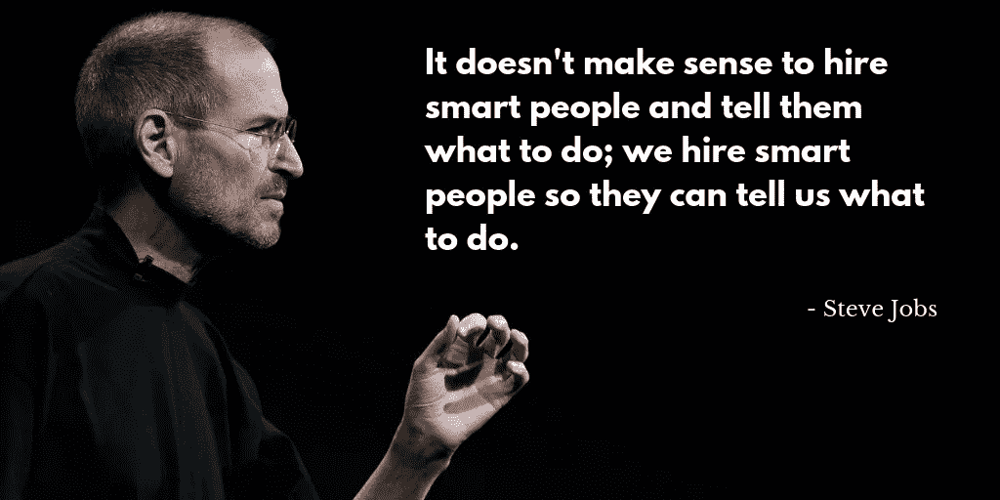

# 雇佣聪明的人，让他们告诉你该做什么——就像史蒂夫·乔布斯那样

> 原文：<https://medium.com/hackernoon/hire-smart-people-and-let-them-tell-you-what-to-do-just-like-steve-jobs-did-c38d92d11213>

Timeless hiring advice from Steve Jobs

 [## 每当彼得·施罗德发表文章时，就收到一封电子邮件。

### 每当彼得·施罗德发表文章时，就收到一封电子邮件。通过注册，您将创建一个中型帐户，如果您还没有…

medium.com](/subscribe/@peterschroederr) 

每位成功的创始人都会谈到，在公司历史的某个时刻，[人是如何成为你最好的资本和最大的资产的。如果你理解错了，这就是*成功和失败*的区别。](https://elearningindustry.com/employee-lifecycle-tips-help-rule-market-talent-king)

没错，你公司最重要的资产不是你能得到的。它不是设备或实体工厂，也不是数据、技术或知识产权。你公司最有价值的部分是人——人力资本——任何推动你公司发展的计划都必须从这里开始。

史蒂夫·乔布斯曾经说过，“雇佣聪明人并告诉他们该做什么是没有意义的；我们雇佣聪明的人，这样他们就能告诉我们该怎么做。”最聪明的领导者有一种不可思议的能力，那就是雇佣比他们聪明得多的人，这些人将推动他们进行多样化的思考，并推动他们的业务向前发展。

# 让人们成为他们想成为的人

The type of people Steve Jobs hired

史蒂夫·乔布斯在雇佣摇滚明星员工方面非常成功，因为二十年前，领导力就是命令和控制——果断和权威。过去的领导者被期望知道所有的答案，并告诉他们的员工该做什么。雇员们必须遵守规则，做他们被告知的事情，并付出他们的努力，直到他们被提升到一个权威的位置。

> 信任+天赋+坚韧+培训=优秀的员工

这并不意味着乔布斯没有控制权。[他有着令人难以置信的职业道德。乔布斯告诉他的传记作者，当他 1996 年回到苹果时，他每天从早上 7 点工作到晚上 9 点。他不知疲倦地工作，并患有肾结石。但是他坚持激励他的公司，不断出现并推动人们做出最好的产品，他们因此而尊敬他。](https://www.businessinsider.com/steve-jobs-guide-to-getting-what-you-want-2016-10)

乔布斯和我有着非常相似的心态，那就是，“我真的相信，当你感到舒适的时候，你就开始死亡。如果你不努力让自己变得更好，那么你就会慢慢变得更差。”—彼得·施罗德

 [## 史蒂夫·乔布斯真正的领导力课程

### 他的传奇是放大版的创业神话:史蒂夫·乔布斯于 1976 年在父母的车库里共同创立了苹果公司…

hbr.org](https://hbr.org/2012/04/the-real-leadership-lessons-of-steve-jobs) 

# 热爱你所做的工作

Do what you love, and you’ll never work a day in your life

回想一下你小时候。还记得人们总是跪下来问你长大后想做什么吗？你记得你对那个问题的回答是什么吗？

是的，工作和娱乐是完全不同的两件事。工作需要努力和付出，以支付账单和把食物放在桌子上，而玩耍则是乐趣和享受。如果你幸运的话，你可以将一些快乐和激情融入到你的日常生活中。但是，这绝对不意味着你的整个职业生涯将是在公园散步。

正如史蒂夫·乔布斯曾经说过的，“有激情的人可以改变世界。”成功的企业家对产品充满热情，但不一定是对产品。他们对自己的使命充满热情。他们对自己的产品或服务对客户生活的意义充满热情。他们热衷于改变世界或打破既定的类别。

例如，乔布斯对计算机硬件没有热情。他热衷于开发能够帮助人们释放个人创造力的工具。什么是你迫切想要的，以至于你“别无选择”，只能去追随它？

乔布斯痴迷于设计，以至于他参加了一个书法课程[，只是为了好玩。这就是他说的跟随你的心，相信点点滴滴在未来会连接起来的最终含义。“这种方法从未让我失望，它让我的生活变得完全不同，”他说。](/startup-grind/how-lifelong-learning-and-a-growth-mindset-can-propel-your-career-c5fd680f4069)

# 保持饥饿，保持愚蠢

Steve Jobs on changing the world

即使苹果变成了公司，乔布斯还是在广告中宣称他的反叛和反文化倾向，好像在宣称他本质上仍然是一个黑客和嬉皮士。[著名的“1984”广告](https://adage.com/videos/apple-1984/1165)展示了一个叛离的女人逃脱思想警察，向奥威尔式的老大哥的屏幕投掷大锤。回到苹果后，乔布斯帮助撰写了“与众不同”广告的文字:

> “为疯狂的人干杯。不合群的人。叛军。麻烦制造者。方孔里的圆木钉……”

如果有人怀疑他是在描述自己，不管是有意还是无意，他用最后一句话消除了这种怀疑:“虽然有些人认为他们是疯子，但我们认为他们是天才。因为那些疯狂到认为自己可以改变世界的人才是真正改变世界的人。”

成为改变。

# 关于作者

彼得在 [Circle](https://www.circle.com/en/) 领导万物整合运动，该公司的使命是通过无摩擦的金融价值交换促进全球经济繁荣。在加入 Circle 之前，Peter 已经在多家 SaaS 公司领导了 10 多年的高增长营销团队。多年来，Peter 为自己能够带来大规模提供个性化营销体验所需的人员、流程和技术而自豪。

彼得还在[撰写 API Economy](https://www.apifirst.tech/) ，你可以在 [Twitter](https://twitter.com/peterschroederr) 或 [LinkedIn](https://www.linkedin.com/in/peter-schroeder/) 上关注彼得，了解最新的新兴技术趋势。