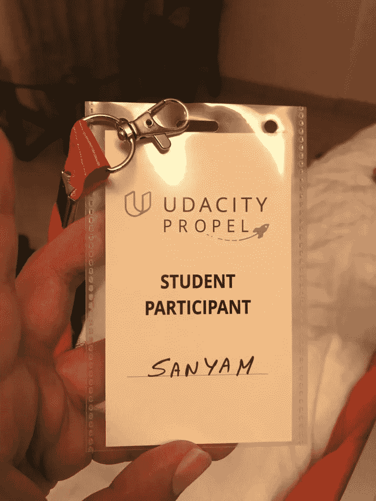

# 我的第一次招聘会经历

> 原文：<https://medium.com/hackernoon/hiring-fair-experience-39ff232e95a8>

上周，我参加了我的第一场招聘会。

这是一篇关于我的经历和我在现实世界中第一次[面试](https://hackernoon.com/tagged/interview)的帖子。

## Udacity 推进

Udacity 在印度举办招聘会。
过程很简单，他们在双方达成协议后在船上招聘合伙人，进行背景调查。之后，一旦他们有足够多的招聘伙伴和足够多的职位空缺，他们就会举办招聘会。

纳米学位的学生或毕业生可以参加这些展会。

# 我的期望:

我现在是本科学习的最后一年。这些公司大多招聘有经验的全职候选人。

我坐在一个挤满了来自印度各地的 180 名候选人的房间里。

从应届大学毕业生到寻求向经验丰富的专家转型的人。

我在寻找入门级的数据/ML/DL/SDC 职位。

# 轮廓

这是我在展会前最终整理好的简历。

*   [简历链接](https://drive.google.com/file/d/1cv9dbKSD9mGBlotfPmeAY3kV80et3QST/view)

到目前为止，我个人资料的亮点是:

*   快速人工智能联谊
*   Udacity DL 纳米学位研究生
*   IIT-R 实习
*   ONGC 实习
*   IIT-M 项目工作。

我强调要严格工作，并在我渴望工作的领域建立一个强大的档案。

问题是，我没有经验，大多数公司都在招聘有经验的候选人。

# 结果

有两家公司在为 ML 招聘员工。

*   留声机严格雇佣有经验的人。
*   Marax.ai 对新生感兴趣，我被他们接走了！！！我得到了一个实习生的职位，因为他们正在招人，但我还是个学生，他们有兴趣给我一次机会——他们把我列入了下一轮面试的候选名单。

我认为我通过了面试这一事实是一个很好的迹象，表明我走在正确的道路上。

我不会为推进事件提供反馈。我是 Udacity 的粉丝，你不评论你的英雄。我非常欣赏他们的课程和活动。竖起大拇指，感谢他们为我们所做的一切。

我也一定会参加下一次 Propel！

午餐时，Udacity 用披萨招待我们。所以，我不能说不。

# 参加招聘会的一些建议:

*   携带大量的简历复印件。我带了 20 个，如果我是一个有经验的人，肯定会更少。
*   这听起来可能很荒谬——无耻一点。我有勇气走进一些公司的房间，这些公司正在审视那些拥有 4-5 年工作经验的人。我请求他们考虑我的申请，然后当我被拒绝后，征求他们的反馈。我认为他们的反馈很有帮助。
*   耐心点！活动时间是上午 9 点到下午 6 点。我几乎放弃了希望，直到下午 4:50 我的名字被叫到！！
*   问！我确信可以和那些经常被叫去面试的人交谈。我讨论了他们的道路，并寻求反馈。
*   对你的简历了如指掌。
    我的简历中有很大一部分是关于教育的，尽管我相信我比我的大学朋友做了更多的项目。我的简历第一眼看上去还是有“学生”在喊。
*   如果讨论一个技术问题，大声思考！
    一个人不可能在 1-2 个小时内理解你。所以大声谈论你的思考过程。这就是几个小时面试的意义所在。

# 一点个人意见:(和一些愚蠢的想法)

对我来说，直到去年秋天我才知道如何拉，现在我能够走进一个完全专业的场景，完全自信地接受采访，这一事实仍然令人难以置信。

[如果你和一个月前的我一样](https://hackernoon.com/my-machine-learning-path-cb6edab4630)，这里有一些给我信心的傻事:

*   我打电话给我最大的吹牛朋友——和他们比较我的努力，我觉得我并不是最差的候选人。(这家伙是个艺术家，但他喜欢在 DL 进进出出，我想我比他更了解一些事情)
*   我告诉自己“在过去的几个月里，我度过的每一天都是为了抓住机会，所以要自信。我已经做好了功课”
*   这一次很可笑:我在面试前一天打电话给一家奥迪销售商，询问他们 R8 的颜色选择——我甚至没有想到我可能会被拒绝。我走进去，心里想着我会赚很多钱，可以开着奥迪回家，尽管我很确定第二天我会去优步游泳池。
*   面试的前一天晚上，我一直在计划着一旦得到“工作邀请”该去哪里庆祝。
*   要知道面试你的人是站在你这边的！

TL:DR；自信——我真的很紧张，但是这几件傻事真的帮助我保持自信。

我仍然很不博学，我仍然没有得到一份“工作”,但是我真的相信我已经朝着正确的方向前进了。

接下来的几篇文章将是技术性/概念性的，因为这是我真正想写的；但是如果你像我一样开始，我希望我的愚蠢想法也能给你信心。如果你是专家，认为我的方法正确/错误，请告诉我。

*如果你对此感兴趣并想保持联系，你可以在 Twitter 上找到我* [*这里*](http://twitter.com/bhutanisanyam1) *。*