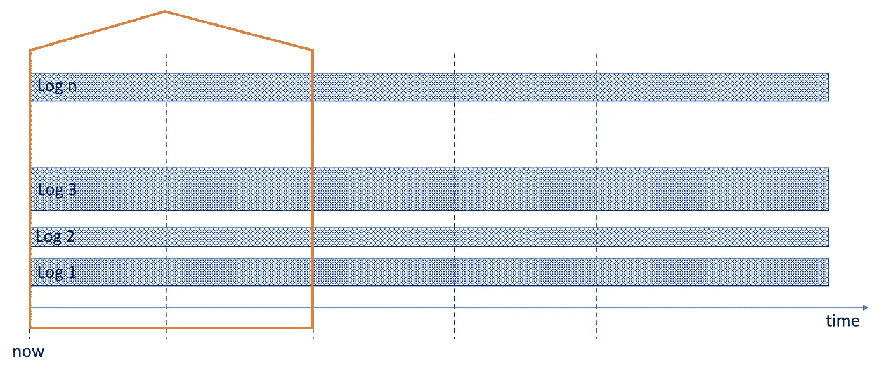
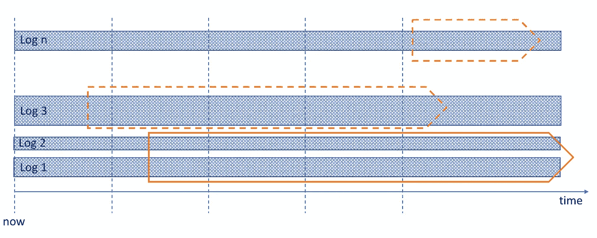

# 历史日志分析和 SIEM 限制

> 原文：<https://medium.com/hackernoon/historical-log-analysis-and-siem-limitations-7f3e30d30a9f>

A glimpse of history. Photo by [Sergiu Vălenaș](https://unsplash.com/photos/knrpCSJ6XlQ?utm_source=unsplash&utm_medium=referral&utm_content=creditCopyText) on [Unsplash](https://unsplash.com/?utm_source=unsplash&utm_medium=referral&utm_content=creditCopyText)

我最近在 SIEMs 上浏览 Anton Chuvakin 的帖子，对一个特殊的要求“将它们分开”变得特别不安:[实时与历史分析](https://blogs.gartner.com/anton-chuvakin/2014/07/30/siem-real-time-and-historical-analytics-collide/)。他在 2014 年关于这个主题的帖子很好地概述了这两者之间的对立(向下滚动到表格！).

在我的信息安全职业生涯和构建 [SpectX](https://www.spectx.com) 的时候，我一直在思考这个问题，所以我决定详细阐述这个列表。真正困扰我的是:自 2014 年以来，尽管数据量一直在大幅增长，但在这些差异方面没有任何改善吗？对 SIEMs 来说，历史和近期分析的对抗性在技术上有困难吗？我认为是这样的，最好的解释方式就是详细阐述丘瓦金的比较列表中的项目，并添加一些我自己的项目。

## **SIEMs 和近实时分析的可扩展性模型**

自诞生以来，SIEM 的主要任务一直保持不变:实时**检测已知威胁(尽管在其他功能方面已经有了相当大的发展)。实时性还意味着相对受限的数据范围:您需要实时的输入事件和一定数量的最新数据，以便检测规则/模型能够工作。但是，系统必须能够处理大量的输入源数据。**

Figure1: Analysis scope of near real-time analysis

从技术角度来看，良好性能的关键是**索引**。计算元数据可以加快搜索速度，并在几秒(或几分钟)内满足性能要求。然而，*范围内的所有*数据都必须被索引，以保证及时响应。

索引带来了限制和复杂性成本:

*   在将数据提交给查询之前，必须对数据进行索引，这意味着架构必须在处理和存储方面进行扩展。
*   指数计算必须处理输入事件的波动(峰值)。
*   查询处理必须与索引的计算竞争。

## 为什么 SIEMs 不是历史分析的最佳选择

历史日志分析(模式发现、威胁追踪、取证调查等)的范围是不同的。单个任务通常涉及**来自几个选定来源**的**更长时间**的数据，远远超出 SIEM 的可见性。同时，SIEM 的数据源集也必须可用于历史分析。

Figure2: Analysis scope of a historical analysis. Different analysis tasks involve different source data scopes.

然而，查询性能预期低于接近实时的处理，在几分钟或几十分钟内获得结果是完全可以接受的。此外，单个分析任务中包含的数据量通常与短期分析的 SIEM 索引数据总量相差不大。需要注意的关键点是，用于历史分析的**可用的**数据总量**要大得多**。

通过索引来实现这种可伸缩性并不是最佳选择。除了复杂性成本，索引还会占用大量空间，通常与数据本身一样多，有时甚至更多。这对于更能容忍时间的历史分析来说是不合理的。

## 可伸缩性的实际限制

当然，以上所有的讨论都只是理论上的。在实践中，根据数据量及其保留期，扩展 SIEMs 以包括大量数据源是可以实现的。然而，一如既往，还是有局限性的。寻求扩展免费开源解决方案的组织通常只关注实现方面(成本、技术、工作)，而没有估计到维护和边缘情况的影响。一旦他们遇到当前设置的限制，就很难找到具有特定技能的人来挖掘历史数据，因为技术复杂性呈指数增长。网上有很多关于这个话题的讨论，例如这里的、这里的和这里的。很多组织也[失败](https://blogs.gartner.com/anton-chuvakin/2017/04/11/why-your-security-data-lake-project-will-fail/)。

那些试图扩展弹性搜索系统的人面临着一个特殊的问题:数据膨胀的影响。如果日志事件还不是 JSON 格式，它们将在弹性 ETL 过程中被转换成 JSON 格式。不幸的是，与列表格式或 csv 格式相比，JSON 的开销很大。例如，1 Gb 的标准 Apache web 服务器访问日志在转换为 JSON 后，大约会占用 2,5 Gb 的空间。这是一个问题，因为由于扩展的复杂性，它直接转化为存储周期。

许多商业 SIEMs 压缩数据用于内部存储。这是一个很好的方法，因为同样 1 Gb 的 Apache 访问日志在用 gzip 压缩后会缩小到 200…250 MB。此外，扩展的复杂性得到了更好的记录，并且提供了支持。只要你有足够的资金支付费用。定价是许多商业 SIEMs 的主要限制因素。

## 对一个像样的历史分析工具有什么期望？

历史分析包含许多实际任务，如取证分析、数据发现、威胁搜寻等。当从日志中识别恶意行为时，这些是建立基本事实的基本方法。**的重点是发现**威胁、模式、迹象等。完成的方式通常是**探索性的**，在不同的路径上分支，产生中间结果。在实践中，这意味着通过多个步骤，结合不同的源数据和其他中间结果。

所有这些都与 SIEM 的主要目标**基于已知模式检测威胁大相径庭。**因此，SIEM 只提供数据发现所需的最低限度:简单的搜索、过滤、提取字段的基本描述性统计。

为了有效地支持探索过程，分析工具应提供以下关键功能:

*   **灵活的搜索/分析语言，用于检索和操作数据。**由于分析主题(威胁、模式、恶意行为等)是复杂的过程，因此逐步探索应该以类似于 SQL 的灵活性和功能为后盾。大多数 SIEMs 使用图形用户界面、下拉列表和复选框提供的简单搜索是不够的。
*   **用于分析数据的丰富函数库**:聚合、数学、基本描述统计、字符串操作、基本编码解码、基本加密等。NB！聚合、统计和数学函数必须是大数据可扩展的(即在整个被查询的数据集上提供数学上正确的结果)。
*   **提供扩展函数库**的手段(允许用户自定义函数)。没有一个内置的图书馆能满足生活抛给你的每一个案例的需要。一旦出现这种情况，就没有时间等待供应商更新库了。
*   **提供使用外部第三方工具的 API**。再说一遍，现实生活远比任何一个供应商所能涵盖的要丰富得多。灵活处理数据中的意外情况通常标志着成功和失败。

到目前为止，我们已经讨论了可伸缩性和分析过程本质的差异。显然，有许多细节将短期和长期分析区分开来。然而，最关键的争议来自如何处理数据。这就是我要在文章的[下一部分](/p/448c4be041d3/)讨论的内容。