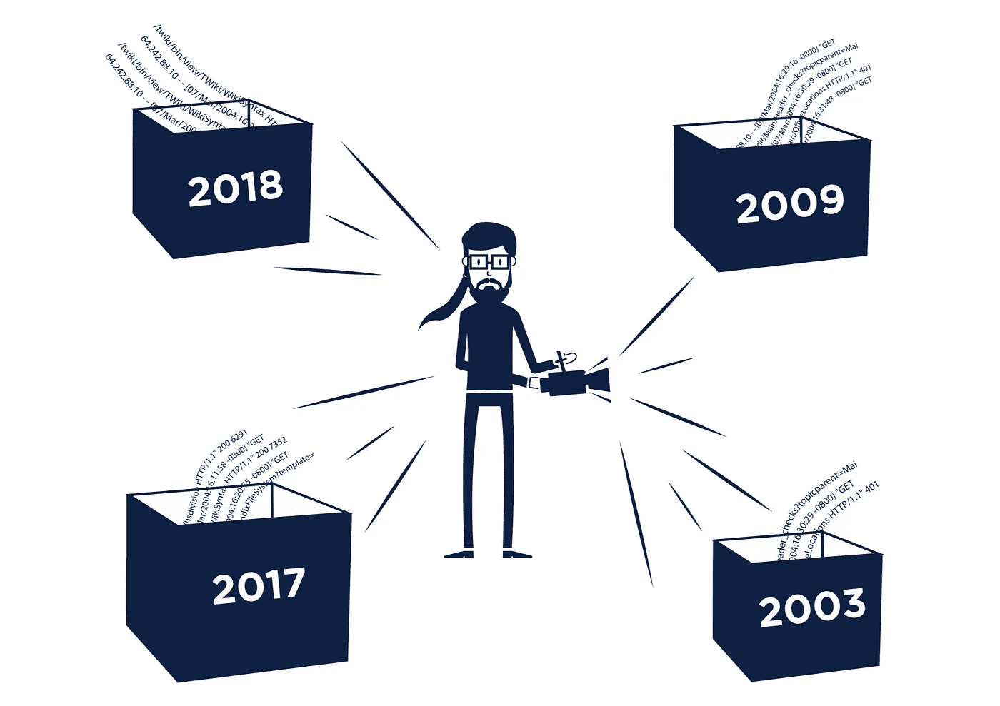

# 历史日志分析和 SIEM 限制:第二部分

> 原文：<https://medium.com/hackernoon/historical-log-analysis-and-siem-limitations-part-ii-448c4be041d3>

在[上一部分](/p/7f3e30d30a9f/)中，我们讨论了历史和 SIEM 提供的短期实时分析在可扩展性和性质(原因和方式)上的差异。现在让我们看看数据在两个世界是如何被处理的。

区分短期和长期分析的方面不仅仅是结构化和非结构化数据。事实上，它们中的一些对两种分析都是严峻的挑战，以至于导致严重的限制或昂贵的决策。

## 数据标准化

让我们首先讨论日志的标准化，这是大多数 SIEM 供应商采用的方法。根据其[定义](https://securosis.com/blog/understanding-and-selecting-siem-lm-aggregation-normalization-and-enrichmen)的标准化包括将数据元素(即日志记录字段)减少到一个已知的公共集合。这是应用索引和一致存储事件的必要步骤。这个过程的缺点是**数据丢失** : a)直接——丢弃的数据元素，b)元数据——关于日志记录结构的信息，例如字段序列、字段中的数据元素、语法模式等。

SIEMs 通常不认为数据丢失是一个问题，因为它们的主要目标是利用已知模式进行检测。另一方面，历史分析的主要任务是发现新的信息，任何数据的丢失都会减少成功的机会。这意味着持续的正常化是一个大禁忌。

虽然很容易理解直接数据字段的重要性，但元数据经常被低估。但在许多情况下，元数据对于区分恶意使用模式至关重要。例如，在电子商务欺诈领域，欺诈者通常面临扩大欺诈交易规模或同时模仿正常客户行为的两难境地。他们做了相当大的努力来融入常态，通常只有自动化的痕迹才能够识别他们。自动化的痕迹可以在元数据中找到，比如查询参数的某个序列(或缺失)、X-FORWARDED-FOR 头中的 ip 地址、JSON 有效负载的组成等。将数据元素转换成 JSON 会使这些信息消失。

## 抽取、转换、加载至目的端（extract-transform-load 的缩写）

其次，规范化过程包括提取(字段)、转换(分配类型)和加载(到系统中)。 **ETL 的缺点是**它**不能抵抗非机器可读格式(JSON，XML)的日志的记录结构**的变化。从这样的日志中提取依赖于对数据元素的顺序和格式的假设。当这种情况发生时，你基本上有两个选择，都有严重的后果:

1.  ETL 过程被中止(假设解析过程能够检测到解析失败),导致系统中的**数据丢失。考虑一下丢失重要实时警报数据源的影响。**
2.  无效数据被加载到系统中，并且**错误持续存在**。显然，这可能会导致一个原本正确的分析得出错误的结论，不管它是近期的还是历史的。

从这种情况中恢复需要修复提取(解析)步骤并重复整个 ETL。第二种情况实际上更糟，因为它涉及到识别和删除存储中的错误记录。尽管如此，这两者都对 SIEM 监控和历史分析流程有很大影响。这就是 SIEM 解决方案使用非常静态的输入数据(网络安全设备日志、商用 web 服务器日志等)的原因。事实上，我认为这是阻止使用应用程序日志进行安全事件监控和分析的主要因素。这是非常不幸的，因为应用程序日志在用于识别许多类型的恶意行为的上下文中非常丰富。

当进行历史分析时，当您查看更长时间的日志时，结构变化的可能性甚至更高。未能识别变更等于丢失输入数据，这可能导致错误的结果和发现新信息的失败。

## 供应商锁定数据

现在应该很明显为什么**试图使用 SIEM 作为你的长期数据存储是一个非常糟糕的主意**。然而，它甚至还有一个方面。所有输入 SIEM 的数据最终都以特定于供应商的格式存储。当您希望使用另一个工具尝试新的算法和方法时，您将面临导出数据的任务。如果供应商为此提供工具，那你就很幸运了。通常情况并非如此。由于供应商通常不公开他们的内部格式，导出任务实质上变成了一个逆向工程任务，从技术和法律两方面来说都有问题。回想一下，每次转换也可能导致数据丢失。

## 数据丰富

数据丰富的概念意味着添加补充信息(如地理位置、交易号、应用程序数据等。)到日志和事件，以增强分析和报告(此处的定义借用了)。本质上，有两种添加补充数据的方法:I)作为日志记录的附加字段，在加载时添加；ii)作为结果集中的附加字段，在查询时添加。

许多 SIEM 只允许通过第一种方法进行浓缩。这是可以理解的，因为他们需要以实时方式交付结果，这解释了为什么他们希望卸载任何额外的处理。在执行查询之前添加补充数据在这里也不是问题，因为任务是检测已知的威胁。

然而，这成为历史分析的一个问题。带着发现新信息的使命，在开始分析之前，您无法真正预测您需要哪些补充信息。唯一合理的方法是动态地丰富数据。

# 摘要

**永远保持你的日志的原始状态。**以并行方式向您的 SIEM 提供数据，但不要替代长期存储(即日志管理是必须具备的)。这样，您可以避免数据丢失和供应商锁定的情况。

**使用分析工具，允许在查询期间定义数据的模式/格式**(与 ETL 期间相反)**。**这为您提供了适应日志记录结构变化的灵活性。如果该工具能够通知您更改，那就更好了。

总而言之，我认为 SIEM 供应商将会努力征服长期分析领域。