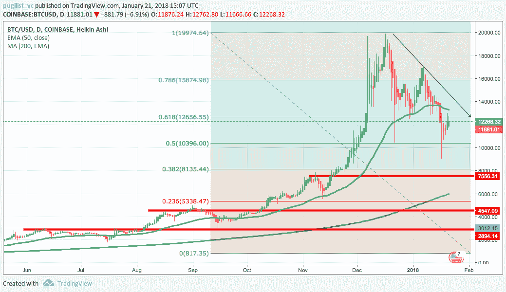
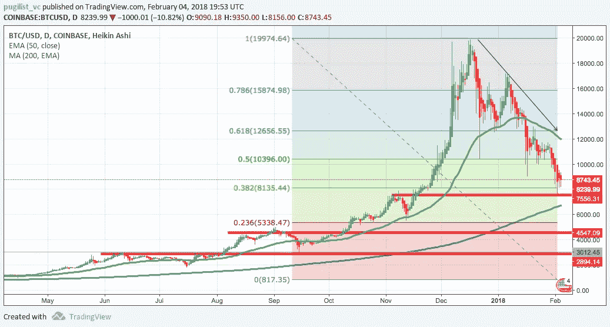
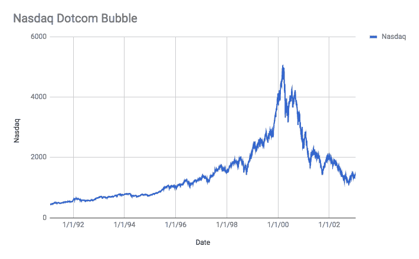
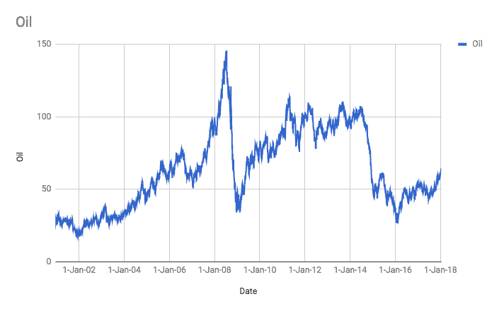
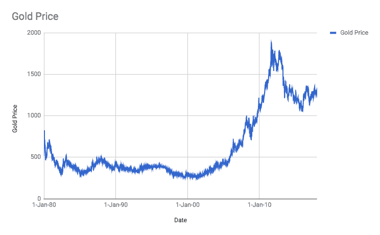
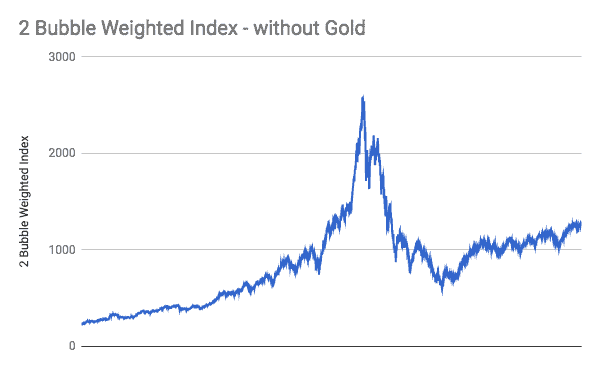

# 加密市场的历史主义(更新)

> 原文：<https://medium.com/hackernoon/historicism-for-cryptomarkets-552269d59209>

# **当前事态(更新)**

加密市场在 2018 年经历了下滑。主要加密资产的技术分析(TA)图表继续形成价格下降趋势；即使最近有所反弹。

January 21, 2018

February 4, 2018

# **进一步的思考(更新)**

*   **TA 指标:** 50 日[移动平均线](https://www.investopedia.com/terms/m/movingaverage.asp)趋向 200 移动平均线，[斐波那契回撤](https://www.investopedia.com/ask/answers/05/fibonacciretracement.asp)水平出现只是时间问题，并且不到强[支撑](https://www.investopedia.com/university/technical/techanalysis4.asp)直到 4500 美元——6000 美元区间。**仍然有效。**
*   **缺乏新需求:**错过了第四季度“水泵”的散户投资者想要进入加密市场，要么是因为交易所设备不良，要么是因为技术层面的阻碍。我们听过无数这样的轶事。**关于 Bitfinex 和 Tether 可能在 2017 年操纵 BTC 价格的新进展，使得这一因素在短期内变得更加危险。**
*   负面消息:随着价格继续走高，大多数牛市都摆脱了媒体的坏消息。这在 2017 年全年都在发生，但在 2018 年停止了。每一次负面新闻发布似乎都会伤害市场。仍然有效，似乎是世界各国政府的一项持续策略。
*   **自我保护:**眼睁睁看着账面财富缩水 30%的新晋密码百万富翁可能开始或已经开始出售部分密码资产，这进一步加剧了价格下行压力。对损失的恐惧超过对收益的渴望，这是人类的基本天性。此外，最近的一篇 [Cointelegraph](https://cointelegraph.com/news/gold-sales-spike-during-crypto-market-crash-highlighting-inverse-correlation) 文章强调了这些投资者中的一些人可能会转向黄金作为更安全的避风港。**仍然有效。**
*   [**反身性**](https://hackernoon.com/xrp-the-dichotomy-of-ripple-2cce13d3241f) **:** 反身性对下行的作用方式和对上行一样。简而言之，价格下跌改变了投资者的预期，对市场基本面产生负面影响，导致价格进一步贬值。冲洗并重复，直到找到底部。**仍然有效，如果 Bitfinex / Tether 丑闻被证明属实，可能会大大加速。**

# **历史性**

没有人知道未来，但历史背景是不祥的。对之前泡沫的分析表明，价格加速上涨后通常会很快崩溃；大约在 12 到 18 个月内。加密市场进入加速阶段至少有 12 个月了。

互联网泡沫开始时是一个正常的牛市，但后来当价格从 1998 年 10 月到 2000 年 3 月呈指数增长时，它变成了一个泡沫。从最高点到最低点，纳斯达克指数下跌了 77%。

石油再次以牛市开始，然后价格从 2007 年 1 月到 2008 年 7 月成指数增长。几乎令人毛骨悚然的是，价格从峰值到谷底暴跌了约 77%。

在回顾了这些数据后，我不会认为黄金是泡沫，而是一种由不断变化的经济驱动的资产，即过度创造货币基础以资助战争和避免萧条，加上自由主义者积累“硬”货币以对抗即将到来的恶性通货膨胀。黄金的上涨更像是一个强劲的牛市，随后的下跌没有纳斯达克和石油那么严重；峰谷比下降了约 44%。

拳击风险投资公司从两种“泡沫”资产中创建了一个加权泡沫指数，以衡量潜在的价格通缩。我们剔除了黄金，因为如前所述，我们不一定认为黄金的增长符合泡沫模型。从这张图表中，我们可以看到约 72%的峰谷贬值。

# **回复到平均值**

***比特币的 9 年均值:*** $709.38

# **总结**

人类是出了名的差劲预测者，历史只会押韵；它很少重复。然而，市场行为使得拳击风险投资在短期内非常谨慎，在长期内非常兴奋，因为这种贬值可能允许加密生态系统重新专注于长期创新而不是短期收益。

> **— —免责声明:**本文作者和 Pugilist Ventures 都不提供投资、财务或法律建议。这不能代替专业建议和独立的事实验证。本网站提供的内容仅供参考，不应被解释为任何投资机会的任何类型的投资邀约。