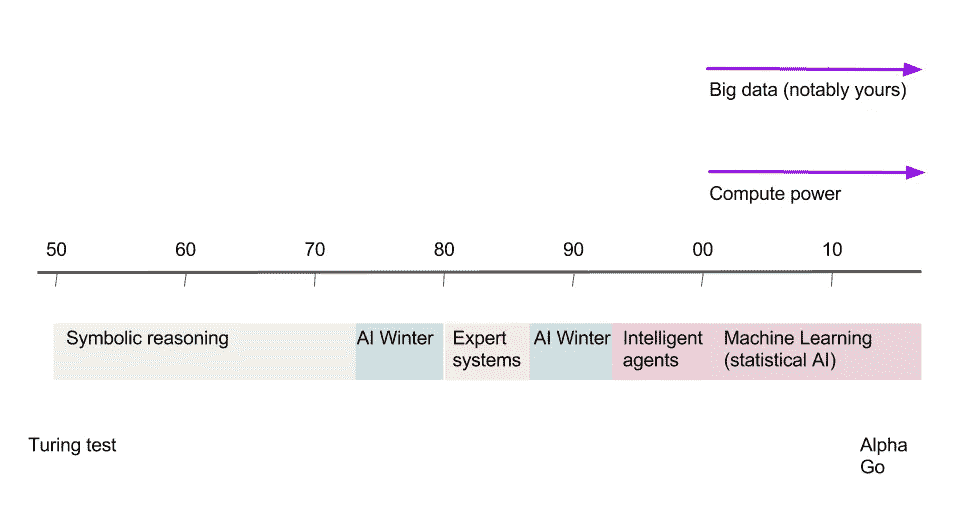

# 人工智能中的历史、波浪和冬天

> 原文：<https://medium.com/hackernoon/history-waves-and-winters-in-ai-dd5feb558e45>

> “我看不出人类的智慧是人类永远无法理解的。”
> 
> ~约翰·麦卡锡，1989 年 3 月

**Is it?** Credits: [DM Community](https://dmcommunity.org/2017/02/05/a-short-history-of-machine-learning/)

这个帖子是由[李开复](https://medium.com/u/13ba09f08ed3?source=post_page-----dd5feb558e45--------------------------------)在**的谈话“人工智能将带我们去哪里？**

这里是[链接](https://www.youtube.com/watch?v=0YbyjxiZ5YA)到所有的监听器。如果你喜欢阅读，我正在(轻轻地)编辑它们。一切功劳归于 [*李开复*](https://medium.com/u/13ba09f08ed3?source=post_page-----dd5feb558e45--------------------------------) *，一切责任归于我等。*

读者可以跳到下一节，如果他们的脑海里回响着“*来吧，我知道这个！*”。我会尽量简洁地解释一切。
每个链接都提供了对主题的不同见解(除了通常的 wiki ),所以试试吧！

# 介绍

流行词

人工超级智能(ASI)
人工智能的领军人物之一，尼克·博斯特罗姆(Nick Bostrom)将超级智能定义为“在几乎每个领域，包括科学创造力、普遍智慧和社交技能，都比最优秀的人类大脑聪明得多的智力。”一台能够不断学习和改进自己的机器可能是不可阻挡的。人工超级智能的范围从只比人聪明一点点的计算机到聪明几万亿倍的计算机——全面覆盖。这就是为什么人工智能的话题如此辛辣，为什么“不朽”和“灭绝”这两个词会在这些帖子中多次出现。想想 [HAL 9000](http://2001.wikia.com/wiki/HAL_9000) ！

**人工通用智能(AGI)** 有时被称为*强 AI* ，或*人类级别的 AI* ，人工通用智能是指一台全面与人类*一样聪明的计算机——*一台可以执行人类可以执行的任何智力任务的机器。Linda Gottfredson 教授将智力描述为“一种非常普遍的心理能力，其中包括推理、计划、解决问题、抽象思考、理解复杂想法、快速学习和从经验中学习的能力。”AGI 能够像你一样轻松地完成所有这些事情。

**人工智能(AI)** AI 是制造智能机器，尤其是智能计算机程序的科学与工程。它与使用计算机理解人类智能的类似任务相关，但 AI 不必局限于生物学上可观察到的方法。

**智能增强(IA)** 计算和数据被用来创造增强人类智力和创造力的服务。搜索引擎可以被视为 IA 的一个例子(它增强了人类的记忆和事实知识)，自然语言翻译也是如此(它增强了人类的交流能力)。

**机器学习(ML)** 机器[学习](https://hackernoon.com/tagged/learning)是让计算机在没有明确编程的情况下行动的科学。例如，代替将国际象棋的规则和策略编码到计算机中，计算机可以观看许多国际象棋比赛并通过例子学习。机器学习包含各种各样的算法。

**深度学习(DL)** 深度学习是指多层神经网络，一类特定的机器学习算法。深度学习正在实现前所未有的艺术成果，在迄今为止它所应用的几乎所有领域，包括图像识别、语音识别和语言翻译。

**大数据
这是一个空洞的营销术语，错误地让许多人相信数据的大小才是最重要的。这也让公司在他们实际上并不需要的 Hadoop 集群上花费了大量资金。**

Only some are mentioned! Credits: [Nvidia](https://blogs.nvidia.com/blog/2016/07/29/whats-difference-artificial-intelligence-machine-learning-deep-learning-ai/)

# 历史

我先说一个故事。

迈克尔·乔丹在 SysML 18 的[演讲](https://www.youtube.com/watch?v=4inIBmY8dQI)中解释了创造“人工智能”这个术语的故事，以及它与通常所说的没有什么不同。事情是这样的，“并不是[明斯基](https://en.wikipedia.org/wiki/Marvin_Minsky)、[帕佩特](https://en.wikipedia.org/wiki/Seymour_Papert)、[纽维尔](https://en.wikipedia.org/wiki/Allen_Newell)都坐在一起开会。是[麦卡锡](https://en.wikipedia.org/wiki/John_McCarthy_(computer_scientist))来到了麻省理工学院，他说我将从事计算智能方面的工作，他们说这不是控制论吗[吗](https://en.wikipedia.org/wiki/Cybernetics)我们已经有了从事这项工作的[诺伯特·维纳](https://en.wikipedia.org/wiki/Norbert_Wiener)。他说，“不，不，这是不同的。”因此，它是如何*不同*。嗯，他不能真正说服人们这是基于逻辑，而不是控制理论，信号处理，优化。所以，他必须给它一个新的流行词，他发明了“*人工智能*”。"人工智能是一个通用术语，指表现出智能行为的硬件或软件."人工智能是围绕人如何思考而设计的。这是对人类智慧的模仿。

人工智能领域在过去经历了快速发展和大肆宣传的阶段，随后投资和兴趣迅速冷却，通常被称为“*人工智能冬天*”。

# 海浪和冬天

## 第一波(1956 年至 1974 年)

在此期间开发的程序简直令人震惊。计算机是丹尼尔·博布罗的程序[的学生](https://en.wikipedia.org/wiki/STUDENT_(computer_program))解决代数应用题，证明几何定理，比如明斯基的学生[詹姆斯·斯拉格](https://en.wikipedia.org/w/index.php?title=James_Slagle&action=edit&redlink=1)和特里·温诺格拉德的[什德卢](https://en.wikipedia.org/wiki/SHRDLU)学习说英语所写的[赫伯特·格勒恩特](https://en.wikipedia.org/wiki/Herbert_Gelernter)的[几何定理证明器](https://en.wikipedia.org/w/index.php?title=Geometry_theorem_prover&action=edit&redlink=1)和[圣](https://en.wikipedia.org/w/index.php?title=Symbolic_automatic_integrator&action=edit&redlink=1)。感知器是神经网络的一种形式，由弗兰克·罗森布拉特于 1958 年推出，他预测“感知器最终可能能够学习、决策和翻译语言。(剧透预警:*确实有*)”

## 第一个冬天(1974-1980)

在 20 世纪 70 年代，艾受到了批评和财政挫折。人工智能研究人员未能意识到他们所面临问题的难度。他们极度的乐观让期望高得不可思议，当承诺的结果未能实现时，对 AI 的资助就消失了。在七十年代早期，人工智能程序的能力是有限的。即使是最令人印象深刻的也只能处理他们应该解决的问题的琐碎版本；从某种意义上说，所有的程序都是“玩具”。

## 第二次浪潮(1980-1987 年)

人们一度相信，我们会利用人类的智慧，并将其作为规则来实施，从而有办法像人一样行动。我们告诉他们我们思考的步骤。例如，如果我饿了，我会出去吃饭，如果我这个月花了很多钱，我会去一个更便宜的地方。便宜的地方意味着麦当劳，麦当劳我不吃油炸食品，所以我只吃汉堡。因此，我们认为我们推理的“如果-那么-否则”就是第一代所谓的专家系统或符号人工智能如何进行的。这是第一波让人们兴奋地认为我们可以写规则的浪潮。20 世纪 80 年代早期另一个令人鼓舞的事件是联结主义在约翰·霍普菲尔德和 T2 的作品中的复兴。

## 第二个冬天(1987 年至 1993 年)

带有手写“如果-那么-否则”规则的专家系统或[符号人工智能](https://en.wikipedia.org/wiki/Symbolic_artificial_intelligence)具有局限性，因为当我们写下规则时，规则实在太多了。MCC 的一位名叫 Douglas Lenat 的教授开始雇佣 100 个人来写下他们能想到的所有规则，他们认为一种方式可以完成，这将是一个名为 Cyc 的项目中的大脑。但是世界上的知识太多了，它们之间的相互作用太复杂了。我们知道的基于规则的系统真的不知道如何构建它，这完全失败了，导致只有少数几个有点有用的应用程序，并导致每个人都认为人工智能注定要失败，不值得追求。专家系统不能扩展，事实上，永远也不能扩展，我们的大脑可能不会像我们想象的那样工作。为了简化我们决策过程的表达，我们使用“如果-那么-否则”作为人们理解的语言，但我们的大脑实际上比这复杂得多。

## 第三次浪潮(1993 年至今)

人工智能领域已经发展了半个多世纪，最终实现了一些最古老的目标。2005 年，一个斯坦福机器人在一条未经训练的沙漠小道上自主驾驶了 131 英里，赢得了 DARPA 大挑战。两年后，一个来自 CMU 的团队赢得了 [DARPA 城市挑战赛](https://en.wikipedia.org/wiki/DARPA_Urban_Challenge)，在城市环境中自主导航 55 英里，同时遵守交通危险和所有交通法规。2011 年 2 月，在一次[的危险中！](https://en.wikipedia.org/wiki/Jeopardy!) [智力竞赛节目](https://en.wikipedia.org/wiki/Quiz_show)表演赛， [IBM](https://en.wikipedia.org/wiki/IBM) 的[问答系统](https://en.wikipedia.org/wiki/Question_answering_system)， [Watson](https://en.wikipedia.org/wiki/Watson_(artificial_intelligence_software)) ，打败了两个最大的 Jeopardy！冠军。

从 2010 年代初开始，大量的训练数据和巨大的计算能力(由一些大公司提供)促使人们重新评估一些特定的 30 年前的神经网络算法。令许多研究人员惊讶的是，这种结合在新创新的帮助下，成功地使这些'[深度学习](https://en.wikipedia.org/wiki/Timeline_of_machine_learning)'系统在几个领域的性能远远超过传统方法——特别是在语音和图像识别以及大多数分类任务中。

在 DL/ML 中，想法是为系统提供训练数据，使它能够“编程”自己——不需要人工编程！在世界各地的实验室里，小人工智能(狭义)正在焕发生机。有些人下棋比任何人都下得好。有些人正在学习[驾驶一百万辆汽车行驶十亿英里](https://www.wired.com/story/god-is-a-bot-and-anthony-levandowski-is-his-messenger/)同时拯救比大多数医生或急救人员一生还多的生命。有些人会确保你的盘子是干的，没有污点，或者你洗的衣服是适当起毛的，没有一点褶皱。无数的这种智能正在被构建和编程；它们只会变得更聪明、更普遍；他们会比我们更好，但他们永远不会像我们一样。

深度学习是今天人工智能爆发的原因。这个领域诞生了许多流行语，如 [CNN](http://colah.github.io/posts/2014-07-Conv-Nets-Modular/) 、[、](http://colah.github.io/posts/2015-08-Understanding-LSTMs/)、[、](http://karpathy.github.io/2015/05/21/rnn-effectiveness/)、 [GAN](https://medium.freecodecamp.org/an-intuitive-introduction-to-generative-adversarial-networks-gans-7a2264a81394) 、___net、deep__、___GAN 等，这些流行语也访问了 [RL](https://medium.freecodecamp.org/an-introduction-to-reinforcement-learning-4339519de419) 、 [NLP](/@ageitgey/natural-language-processing-is-fun-9a0bff37854e) 等领域，并取得了非常有趣的成果，如 [AlphaGo](/applied-data-science/alphago-zero-explained-in-one-diagram-365f5abf67e0) 、 [AlphaZero、](/@josecamachocollados/is-alphazero-really-a-scientific-breakthrough-in-ai-bf66ae1c84f2) [自动驾驶汽车、](https://thenextweb.com/artificial-intelligence/2018/07/06/this-startup-can-teach-a-car-how-to-drive-itself-in-20-minutes/) [它赋予了计算机非凡的能力，比如几乎像人一样识别口语单词的能力，这种技能太复杂，无法用手工编码到机器中。深度学习改变了计算机视觉，极大地改善了机器翻译。它现在被用来指导医药、金融、制造等领域的各种关键决策。](/swlh/the-ultimate-chatbot-building-guide-for-non-technical-marketers-5ac603bf862d)

我们不(也不能)理解机器学习实例如何在任何符号(相对于还原)意义上运作。同样，我们不知道大脑中的什么结构和过程使我们能够以智能的方式处理符号:通过符号进行抽象、交流和推理，无论它们是单词还是数学变量，以及跨领域和跨问题进行这些操作。此外，从第一类系统(机器学习)到第二类系统(人脑)，我们没有令人信服的进展路径。换句话说，尽管机器学习取得了真正的进展，但这似乎是另一个关于智能的死胡同:*第三个人工智能冬天很快就会到来*。已经有一种观点认为，能够询问人工智能系统如何得出结论是一项基本的法律权利。机器学习背后有太多的钱让 2018 年出现第三个冬天，但用不了多久，人工智能进步的有限性就会被理解。

**In short, this is how it happened** Credits: [matter2media](https://matter2media.com/blog/the-third-ai-winter/)

# 下一步是什么？

我们的生活沐浴在数据中:从关于“关注”或“交友”谁的建议，到数据驱动的自动驾驶汽车。

> 我们生活在大数据时代，我们点击的每一个链接、发送的每一条消息和做出的每一个动作都会产生大量的信息。

在过去的两年里，全世界产生了超过 90%的数字数据。新技术每天产生大约 250 亿字节。数据从社交媒体和手机、气象卫星和太空望远镜、数码相机和视频、医疗记录和图书馆收藏中涌入。技术监测我们每天行走的步数，大坝和桥梁的结构完整性，以及表明一个人正在患帕金森病的几乎察觉不到的颤抖。

人工智能时代的数据被描述了无数种方式:*新黄金*、*新石油*、*新货币*甚至 [*新培根*](https://www.ibm.com/blogs/business-analytics/data-is-the-new-bacon/) 。现在，每个人都明白了:从审计到电子商务，数据对企业非常有价值。但它有助于理解它能做什么和不能做什么，这是商界许多人仍必须把握的一个区别。

> “所有的机器学习都是关于纠错的。”
> 
> *-Yann LeCun，脸书首席人工智能科学家*

今天的人工智能，我们称之为*弱人工智能，*实际上是一个*优化器*，基于一个领域的数据，他们学会非常好地做一件事。这是一个非常垂直的单一任务，你不能教它很多东西，常识，给予情感，没有自我意识，因此没有欲望，甚至不理解如何爱或支配。作为一种工具，它很棒，可以增加价值和创造价值，这也将取代许多人类工作的平凡任务。

如果我们看看人工智能的历史，深度学习类型的创新在 60 年里只发生过一次，我们有了突破。我们不能去预测我们明年和下个月会有突破。应用程序的指数级采用现在正在发生，这是伟大的，但指数级发明是一个荒谬的概念。

正如 Douglas Hofstadter 在《大西洋月刊》的[这篇文章](https://www.theatlantic.com/technology/archive/2018/01/the-shallowness-of-google-translate/551570/)中所清楚解释的那样，我们看到语音到语音的翻译和业余翻译一样好，但现在还没有达到专业水平。最终可能在未来，我们不需要学习外语，我们将有一个[耳机](https://en.wikipedia.org/wiki/Google_Pixel_Buds)来翻译其他人所说的话，这在便利性、生产力、价值创造、节省时间方面是一个很好的补充，但同时我们必须认识到翻译将失业。当我们回顾工业革命时，我们看到它做了很多好事，创造了很多就业机会，但过程是痛苦的，一些策略是有问题的，我们会看到所有这些问题在人工智能革命中再次出现，并且变得更糟。在工业革命中，许多人事实上被取代和取代，他们的工作没有了，他们不得不生活在贫困之中，尽管创造了总体就业和财富，但这是由少数人创造的。幸运的是，工业革命持续了很长时间，而且是渐进的，政府可以一次处理一个群体的工作，在工业革命期间，某些职业道德得以延续，资本家希望世界上的其他人认为，如果我努力工作，即使是例行的重复性工作，我也会得到补偿，我将拥有一定程度的财富，这将给予我尊严和自我实现，人们看到他努力工作，他有房子，他是社会的好公民。这肯定不是我们希望作为人类被记住的方式，但这是地球上大多数人相信他们目前存在的方式，现在这是极其危险的，因为人工智能将取代大多数这些无聊、例行、平凡、重复的工作，人们将失去工作。失去工作的人过去认为他们的存在是职业道德，努力工作得到房子，供养家庭。

> 在理解这些执行重复任务的人工智能工具时，它肯定会告诉我们，做好重复任务不能使我们成为人类，人工智能的到来至少会消除不能成为地球上存在理由的东西。我们存在的潜在原因是我们创造，我们发明东西，我们庆祝创造，我们对科学过程非常有创造力，治愈疾病，对写书，讲故事等等有创造力。这些是我们应该庆祝的创造力，这也许是让我们成为人类的原因。

我们需要人工智能。它是人类发挥自身潜能的终极加速器。进化不是组装。我们仍然只利用了大脑总功能的 10%。想想随着人工智能的不断发展、改进和进步，我们将拥有的额外的大脑功能潜力。

> 计算机科学家唐纳德·克努特(Donald Knuth)说，“到目前为止，人工智能已经成功地做了基本上所有需要‘思考’的事情，但未能做大多数人和动物‘不用思考’就能做的事情。”"

客观地说，人工智能能够并将会扩展我们的新大脑皮层，并作为我们 3 亿大脑模块的延伸。根据美国作家、计算机科学家、发明家和未来学家雷·库兹韦尔(Ray Kurzweil)的说法，“*未来的人将是生物和非生物的混合体。*

如果你喜欢我的文章，**请砸了👏下面你喜欢多少次文章** ( *剧透* *预警:50 是*极限，我试过了！所以其他人会在媒体上看到这个。

如果你有任何想法，意见，问题，欢迎在下面评论。

> **进一步“非常非常非常有趣”读作**

杰弗里·辛顿[[https://Toronto life . com/tech/ai-superstars-Google-Facebook-apple-studied-guy/](https://torontolife.com/tech/ai-superstars-google-facebook-apple-studied-guy/)]

yann le Cun[[https://www . Forbes . com/sites/insights-Intel ai/2018/07/17/yann-le Cun-an-ai-ground breaker-takes-stock/](https://www.forbes.com/sites/insights-intelai/2018/07/17/yann-lecun-an-ai-groundbreaker-takes-stock/)]

you shua beng io[[https://www . cifar . ca/news/news/2018/08/01/q-a-with-yo shua-beng io](https://www.cifar.ca/news/news/2018/08/01/q-a-with-yoshua-bengio)]

Ian good fellow GANfather[[https://www . technology review . com/s/610253/the-gan father-the-man-who-given-the-machines-the-gift-of-imagination/](https://www.technologyreview.com/s/610253/the-ganfather-the-man-whos-given-machines-the-gift-of-imagination/)]

人工智能阴谋:加拿大黑手党[[https://www . recode . net/2015/7/15/11614684/AI-阴谋-深度学习背后的科学家](https://www.recode.net/2015/7/15/11614684/ai-conspiracy-the-scientists-behind-deep-learning)

道格拉斯·霍夫施塔特[[https://www . theatlantic . com/magazine/archive/2013/11/the-man-who-could-teach-machines-to-think/309529/](https://www.theatlantic.com/magazine/archive/2013/11/the-man-who-would-teach-machines-to-think/309529/)]

马文·明斯基[[https://www . space . com/32153-god-artificial-intelligence-and-the-pass-of-Marvin-Minsky . html](https://www.space.com/32153-god-artificial-intelligence-and-the-passing-of-marvin-minsky.html)

朱迪亚·珀尔[[https://www . theatlantic . com/technology/archive/2018/05/machine-learning-is-stick-on-asking-why/560675/](https://www.theatlantic.com/technology/archive/2018/05/machine-learning-is-stuck-on-asking-why/560675/)]

约翰·麦卡锡[[http://jmc . Stanford . edu/人工智能/what-is-ai/index.html](http://jmc.stanford.edu/artificial-intelligence/what-is-ai/index.html)

尼克·博斯特罗姆教授——人工智能将是历史上最伟大的革命[[https://www.youtube.com/watch?v=qWPU5eOJ7SQ](https://www.youtube.com/watch?v=qWPU5eOJ7SQ)

Fran ois Chollet[[https://medium . com/@ Francois . Chollet/the-不可能性情报爆炸-5be4a9eda6ec](/@francois.chollet/the-impossibility-of-intelligence-explosion-5be4a9eda6ec) ]

安德烈·卡帕西[[https://medium.com/@karpathy/software-2-0-a64152b37c35](/@karpathy/software-2-0-a64152b37c35)

沃尔特·皮茨[[]](http://nautil.us/issue/21/information/the-man-who-tried-to-redeem-the-world-with-logic)

机器学习[[https://techcrunch.com/2016/10/23/wtf-is-machine-learning/](https://techcrunch.com/2016/10/23/wtf-is-machine-learning/)

神经网络[[https://physicsworld.com/a/neural-networks-explained/](https://physicsworld.com/a/neural-networks-explained/)

智能机器[[https://www . quanta magazine . org/to-build-true-intelligent-Machines-teach-them-cause-and-effect-2018 05 15/](https://www.quantamagazine.org/to-build-truly-intelligent-machines-teach-them-cause-and-effect-20180515/)]

自我意识人工智能[[https://www . wired . com/story/how-to-build-a-self-Conscious-AI-machine/](https://www.wired.com/story/how-to-build-a-self-conscious-ai-machine/)]

人工智能石英指南:它是什么，为什么它很重要，我们应该害怕吗？[[https://qz . com/1046350/the-quartz-guide-to-manual-intelligence-it-is-it-why-it-is-it-is-it-is-it-is-it-is-it-is-it-is-it-is-it-is-is-it-is-is-it-is-is-it-is-it-is-it-is-](https://qz.com/1046350/the-quartz-guide-to-artificial-intelligence-what-is-it-why-is-it-important-and-should-we-be-afraid/)

伟大的人工智能觉醒[[https://www . nytimes . com/2016/12/14/magazine/the-Great-ai-觉醒. html](https://www.nytimes.com/2016/12/14/magazine/the-great-ai-awakening.html?_r=1) ]

中国的人工智能觉醒

人工智能革命[[https://getpocket . com/explore/item/the-AI-Revolution-the-the-the-the-the-the-the-the-the-the-the-the-the-the-the-the-the-the-the-the-the-the-the-the-the-the-the-the-the-the-the-the-the-the](https://getpocket.com/explore/item/the-ai-revolution-the-road-to-superintelligence-823279599)

人工智能—革命尚未发生[[https://media . com/@ mijordan 3/人工智能—革命尚未发生—5e1d 5812 e1e 7](/@mijordan3/artificial-intelligence-the-revolution-hasnt-happened-yet-5e1d5812e1e7)]

AI 的语言问题[[https://www . technology review . com/s/602094/ais-Language-Problem/](https://www.technologyreview.com/s/602094/ais-language-problem/)]

人工智能的下一个重大挑战:理解语言的细微差别[[https://HBR . org/2018/07/ais-Next-Great-Challenge-underlying-the-nuance-of-the-the-the-the-the-the-the-the-Great-Challenge-underlying-the-the-underlying-the-the-the-the-the-](https://hbr.org/2018/07/ais-next-great-challenge-understanding-the-nuances-of-language)

AI 核心的黑暗秘密[[https://www . technologies review . com/s/604087/AI 核心的黑暗秘密/](https://www.technologyreview.com/s/604087/the-dark-secret-at-the-heart-of-ai/) ]

我们应该有多害怕人工授精？[[https://www . new Yorker . com/magazine/2018/05/14/我们应该有多害怕 ai]](https://www.newyorker.com/magazine/2018/05/14/how-frightened-should-we-be-of-ai)

人工智能的真正威胁[[https://www . nytimes . com/2017/06/24/意见/Sunday/人工智能-经济-不平等. html](https://www.nytimes.com/2017/06/24/opinion/sunday/artificial-intelligence-economic-inequality.html) ]

人工智能的'黑匣子'没什么好怕的[【https://www . nytimes . com/2018/01/25/opinion/artificial-Intelligence-Black-Box . html】](https://www.nytimes.com/2018/01/25/opinion/artificial-intelligence-black-box.html)

人工智能的临界点[[https://www . datanami . com/2018/07/20/the-tipping-point-for-Artificial-Intelligence/](https://www.datanami.com/2018/07/20/the-tipping-point-for-artificial-intelligence/)]

艾冬天不来了[[https://www . technology review . com/s/603062/AI-Winter-not-coming/](https://www.technologyreview.com/s/603062/ai-winter-isnt-coming/)]

AI winter 正在路上[[https://blog . piekniewski . info/2018/05/28/AI-winter-is-well-on-way/](https://blog.piekniewski.info/2018/05/28/ai-winter-is-well-on-its-way/)]

人工智能在泡沫中[[https://www . the globe and mail . com/business/commentation/article-artificial-intelligence-is-in-a-bubble-heres-why-we-should-build-it/](https://www.theglobeandmail.com/business/commentary/article-artificial-intelligence-is-in-a-bubble-heres-why-we-should-build-it/)]