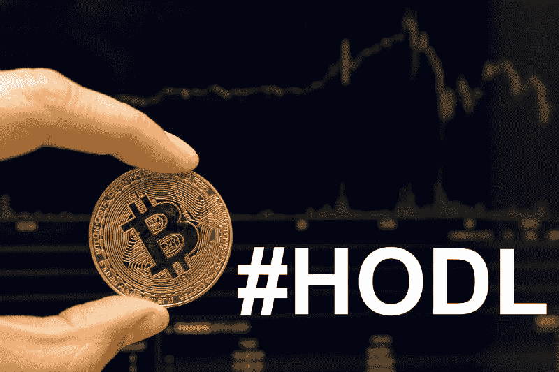
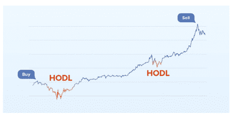
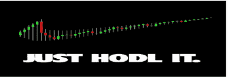

# HODL:最好的加密交易策略应该是什么样的

> 原文：<https://medium.com/hackernoon/hodl-what-the-best-crypto-trading-strategy-should-look-like-63450be2c0fd>

Image credit: [Marco Verch](https://www.flickr.com/photos/30478819@N08/38976727855/) | [CC BY 2.0](https://creativecommons.org/licenses/by/2.0/)

> “股票市场是一个把钱从没有耐心的人身上转移到有耐心的人身上的装置”——沃伦·巴菲特

加密货币市场以其波动性而闻名。这常常成为抱怨的来源。在波动的 24 小时内，加密硬币价值的两位数甚至三位数的增加或减少经常会给加密交易者带来戏剧性的和突然的损失或利润。过去几个月，甚至比特币、Ripple、以太坊(Ethereum)和其他加密工具也遭遇了波动性问题。

2017 年，这些硬币的表现继续聚集动力，更多的人投资于市场。在过去的几个月里，这些硬币和其他数字货币的价格已经下跌了无数倍，但其市场价值却在持续增长。三种最受欢迎的加密货币在这个技术进化时期获得了巨大的收益。Ripple 和以太坊在几个月内以超过 40 倍的速度持续增值。

那么，2018 年末最好的加密策略是什么样的呢？

# **秘密投资:两种观点**

许多密码的价格，以及它们的技术潜力，导致了密码交易的两种主要观点的发展。一方面，有一些交易者和投资者认为密码是非常有利可图和强大的交易工具。这些人将波动性，实际上包括下跌和上涨，视为获取更多利润的机会。如果 cryptos 的价值对他们不利，这一类别的大多数人都准备好迅速清算他们的头寸，当他们重新进入加密交易环境时，他们愿意限制他们的损失或保护他们的利润。

在大多数密码交易者和区块链爱好者中，最流行的交易策略是 HODL，这是“珍惜生命”的首字母缩写这些是准备无限期持有加密硬币的投资者和交易者，不管价格或当前价格波动。然而，必须指出的是，最近大多数硬币的价值，特别是比特币的价值，在几周内从 20，000 美元跌至约 6，450 美元，导致许多霍德勒怀疑这是最佳的加密交易策略。

# **了解加密交易的策略**

投资者对加密货币交易感兴趣有很多原因。一些人对加密硬币本身的基础资产不太敏感，因为他们主要被加密市场特有的高波动性交易的兴奋感所吸引。一些人受到区块链技术潜力的启发。不管投资加密货币的原因是什么，只要说没有人投资加密货币是为了赔钱就够了。无论你投资你一生的积蓄是为了永远不用再工作，还是你想投资你的零花钱来测试交易策略，事实是你打算增加你投资的价值。如前所述，这两种交易方法源于简单的“买入并持有”…但是每种策略的基本方法是什么呢？

传统投资领域最流行的一句话是“慢一毛钱或快一毛钱”Slow dime 指的是在长期内赚很多钱，而不是立即获得小利润的方法。可以肯定地说，大多数密码交易者被吸引到密码领域是因为它有可能成为“快速的镍”幸运的是，该行业的许多新来者运气不错(尤其是那些在 10 月下旬至 12 月中旬投资的人)。然而，许多人感到失望——尤其是那些在比特币价格为 2 万美元时投资的人，他们只能眼睁睁地看着比特币崩盘。

潜在的理由是，加密货币对大多数寻求因其不可预测的涨跌而快速获利的交易者来说尤其具有诱惑力和吸引力。相关的高波动性使得保持利润成为一个挑战。此外，加密货币经济具有不可预测性的迷人历史，这不一定与传统技术分析的基本面相关。据 [Cointelegraph](https://cointelegraph.com/news/heres-how-world-fiat-money-affects-bitcoin-price) 报道，比特币的价格并不遵循标准货币市场的价格路径。因此，人们可能会错过低点和高点的目标，这可能会导致损失大量的资金，预测错误的市场事件。

# **HODL——最佳加密交易策略**

创造于 2013 年的“HODL”一词是一名加密爱好者在比特币聊天论坛上使用的，他被比特币价格的下跌所触动，但决定不出售它。他错写了“我是霍德林”而不是“拿着”拼写错误引起了普通比特币社区的注意，但最终还是恢复了。现在它已经变成了一个通用的缩写词，用来表示“为了亲爱的生命坚持下去”。这确实是最近神秘领域波动的真实情况。这是整个密码疯狂和主流投资社区的一个指标。

在 HODL 这个词被创造出来的时候，比特币的价格下跌了 24.7%，是 12 月中旬至 1 月初 46%跌幅的一部分。这种价格变动是人们可能恐慌的原因之一。对于那些相信区块链以及加密货币的破坏性力量的投资者来说，HODL 是最佳的交易策略，因为持有硬币会带来长期利益，这将导致加密货币的普遍接受。尽管对加密技术的认识不断提高，但一些人(尤其是非洲和拉丁美洲的人)还没有通过传统的交易媒介接受加密技术。然而，相信区块链技术的革命性潜力的人仍然认为，密码的价值将在许多年内增加。

一项资产过去的表现并不能保证它未来的成功。没有办法确定其价格的走向。传统交易系统中采用的大多数方法只是通过考虑包括复杂的数学分析和公众意见在内的几个因素来寻求增加成功的可能性。总的来说，它们都依赖于历史数据来做出好的决策，并取得不同的成功。在一段时间内，当我们分析密码的历史价格时，有几次低谷和高峰，但价格总体上是向上的。

买入和持有策略并不复杂；它就是你认为的那样。不管市场如何，你购买和持有密码是为了维持投资。按照这种方法，交易者将着眼于长期回报，而忽略短期和中期的市场波动。

有些秘密投资者和交易者尽管在市场上“出血”却从不动摇，但后来赢了。一个很好的例子是那些在 2013 年比特币事件中保持投资的人。这意味着霍德林带领他们做出了惊人的投资决定。他们现在正在庆祝，因为他们获得了一大笔奖金。

# **知道什么对 HODL 来说是关键**

任何了解投资科学的人都知道让任何投资组合长期有效的秘密；规则就是简单的多样化。聪明的投资者和交易者总是明白这样一个事实:多样化对于长期商业目标是必要的。加密货币也是如此，特别是随着现代区块链驱动的资产类别的出现。当你投资于多种密码，而每种密码都有多种风险水平时，你是在试图让你的投资组合免受市场不利走势的影响。本质上，最大化您的回报，同时最小化风险。此外，分散您的加密组合增加了获得更好投资回报的可能性，并且您可以重新平衡您的组合以反映您的目标回报和业务目标。

不幸的是，很多人——包括自称有经验的加密投资者——不理解投资组合多样化在加密中的应用，甚至不知道它是如何工作的。还有其他加密持有者，在光谱的另一端，以太坊或比特币是他们的第一笔投资。对于这些交易者来说，尤其是这个行业的新人，他们太容易陷入狂热的崇拜、和一些硬币的炒作中。

简单地说，分散你的加密投资组合包括把你的硬币放在几个地方以降低风险。通过在不同的投资组合中分配你的硬币，你分散了风险，所以如果一枚硬币下跌，你不会一下子失去所有的投资。几个具有复杂用户界面的交易所的碎片化和对特定硬币的适当信息的普遍缺乏是人们仍然在努力实现其加密组合多样化的一些原因。

# **如何分散加密投资组合**

尽管 HODL 的加密交易方法过去取得了成功，但现在仅仅通过投资单一资产并坐以待毙来盈利变得越来越难了。2013 年，加密货币屈指可数，现在已有近 2000 种。并不是所有的 2000 年都是投资储蓄的好选择。

为了最大化你的机会，你应该投资一个加密资产的投资组合。多元化是成功的关键，但你如何在成千上万的另类硬币中成功识别有前途的资产呢？在菲亚特交易所，这些问题可以通过 ETF 等工具或纳斯达克综合指数、标准普尔 500 指数等市场指数得到部分解决。直到最近，加密货币市场还没有这样的工具，但是由于[的加密指数](https://cryptoindex.io/)项目，事情已经发生了变化。

它是一种信息工具，为投资者提供了全球 100 种表现最佳的加密货币的人工智能驱动的分析快照。CIX100 由一种名为“Zorax”的复杂算法自动计算，该算法过滤掉投机交易和“过度炒作”的硬币，而是分析情感数据，以确定最有希望的硬币。结果是:Cryptoindex 表现出了超过市场和比特币高达 70%的潜力。