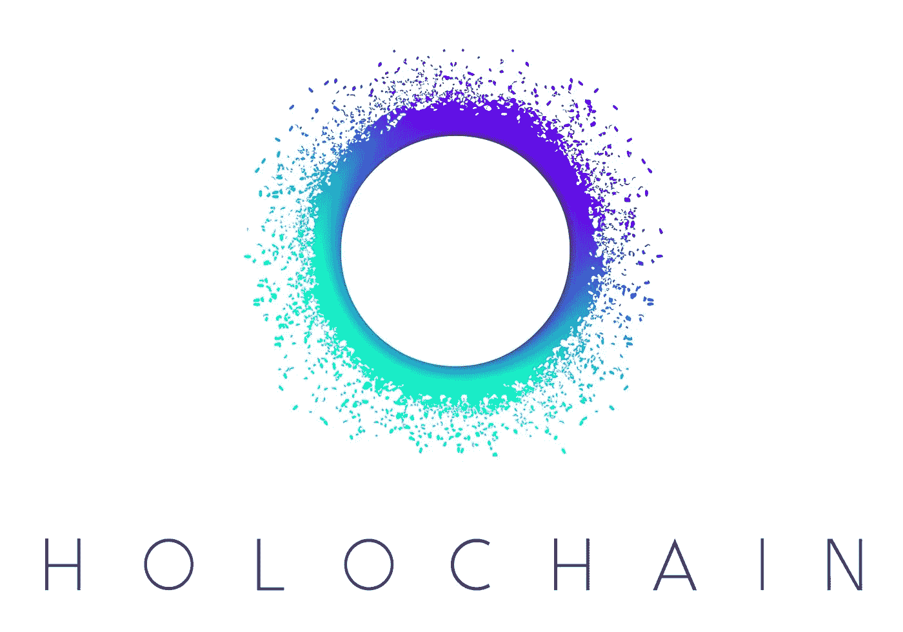
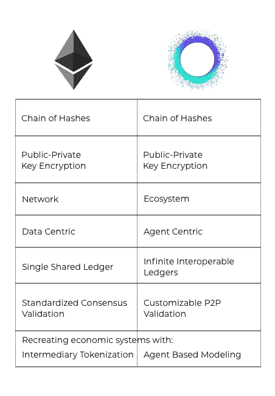
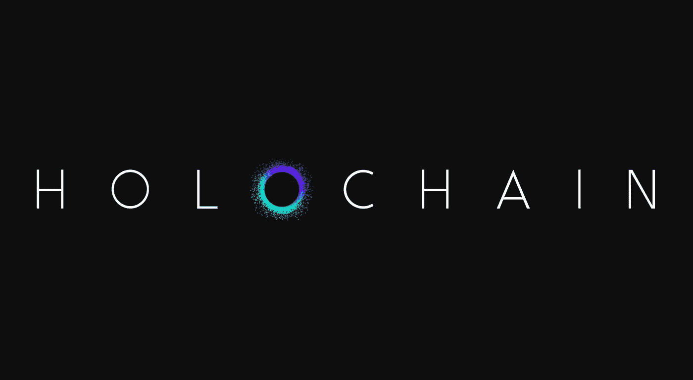

# 全息链——思考社会和分布式系统的新方式

> 原文：<https://medium.com/hackernoon/holochain-a-new-way-of-thinking-about-society-and-distributed-systems-dc9b414b5ff1>

Holochain 是一个构建点对点应用的框架，比如 Ruby on Rails，但是它直接在你的设备上运行你的应用，而不是在服务器上。当我被介绍给 Holochain 时，我持怀疑态度，但在做了更多的研究、与社区交谈并在其上构建了一些基本应用程序后的几个月里，我逐渐意识到它是我长期以来见过的设计最好的软件系统之一。这是我在研究全息链时的笔记汇编，所以它更像是我最初的想法和观察，而不是技术性的深入探讨。我将介绍它的价值、核心组件和类似的技术。

# 介绍

全息链背后的组织[元货币项目](http://metacurrency.org/)，是几年前由[亚瑟·布洛克](/@artbrock)发起的。它的目的与中本聪心目中的比特币截然不同，比特币是一种匿名的数字现金系统，具有预定义的经济模型。布洛克认为，金钱只是社会运行的一小部分，然而它却占据了大部分注意力。在一个过于简化的解释中，*元货币项目正在研究能够创造更复杂的社会组织模式的多维价值体系*。一个比比特币更宏伟的目标。全息链是一个开发框架，它来自于多年的实验，这些实验是关于如何创建这些复杂的社会系统的。它有着与区块链相似的价值观和特征，但却有着完全不同的哲学和技术基础。

# 全息链的价值

*   **社会>科技** —科技不会创造更好的人类，人类创造更好的科技。元货币项目和全息链的人不认为技术会改变社会，我们必须先修复社会和人类如何互动，技术将因此而改变。全息链是关于启用已经被逼到后台的人性中更好的一面。技术是科学的艺术，艺术是关于人性的。
*   **仿生学** —全息链的基础架构旨在促进类似于自然界中的生态系统。该团队着眼于他们周围的世界，着眼于数十亿年的进化，以深入了解适应性强的自组织社区是如何出现并维持自身的。[更多关于仿生？](https://biomimicry.org/what-is-biomimicry/)
*   **个人代理** — Holochain 把你放在中心，而不是节点/网络控制。在区块链上，网络决定你是谁，你的交易必须经过验证，然后你才能更改自己的数据。有了全息链，你就有了自己的网络，你可以完全控制自己的身份和个人数据。

> “幸运的是，新一波由使命驱动的区块链项目意识到了它们的总体社会影响。像[全息链](https://holochain.org/)、[公平币](https://fair-coin.org/)、[耶塔](https://yetta.io/)和[本地支付](http://localpay.tech/)这样的倡议明确地将他们的代码基础与他们的社会事业联系起来。”— [世界经济论坛](https://www.weforum.org/agenda/2018/04/blockchain-survive-backlash-social-purpose-jem-bendall/)

*   约束——他们希望人们有意识地约束自己，这样你们社区就能围绕社会规则成长。群体的普遍意愿是明确的，因此人们遵守集体制定的规则和期望。Matt Schutte 形容它就像游戏中的玩家，我们都必须遵循相同的规则才能进步。如果你不遵守规则，你就不会和其他人一起玩这个游戏——你当然可以开始一个类似的新游戏，它可能会比上一个更好，吸引更多的玩家。
*   **协作>竞争**——“领导者和组织都意识到，即使是他们最大的个人努力也无法抵挡当今复杂且相互关联的问题。他们抛开私利，相互合作……”——[HBR](https://hbr.org/2013/01/collaboration-is-the-new-compe)。全息链的开放网络和设计原则的演变使得不同的服务很容易使用相同的规则，同时仍然是独立的应用程序，就像区块链 dapps 一样。

# 核心组件

## 来源链

Holochain 应用程序的每个用户都通过写入自己的本地数据存储来记录自己的操作和条目(也称为区块链)。每个应用程序一个链直接存储在您的设备上。通过这些链接的散列有内在的数据完整性，类似于 Git 跟踪它的许多分支和分叉。您可以轻松地管理许可访问，以允许存储在网络上其他设备上的 Holochain 分布式哈希表中的数据全局公开，限制为 Holochain 用户的子集，或者完全安全和私有，甚至阻止同一用户的其他源链的访问。如果你的数据只存储在你的设备上，而且从未被矿工验证过，我怎么知道你的数据是可靠的？

这就是约束和规则再次出现的地方，而不是一个单一的全球共识机制，每个应用程序都指定必须如何处理数据才能使用。当任何应用程序提交到自己的源代码链时，它必须遵守这些规则，任何时候你和我交换信息时，我们的设备都会检查传入的数据，以验证我们都遵守了相同的规则。

## 分布式哈希表

分布式哈希表( [DHT](https://en.wikipedia.org/wiki/Distributed_hash_table) )是用于存储和访问文件或任意数据片段的分布式系统。当数据被放入源链时，它的入口地址只是用于 DHT 查找的阿沙-256 散列。网络中的所有节点都负责维护哈希表。分布式哈希表的例子包括 [IPFS](https://ipfs.io/) 和 [BitTorrent](https://www.bittorrent.com/) 。每个全息链应用或 happ 都有自己的全息链网络，所以每个应用都有自己的 DHT。

在全息链网络中，分布式哈希表的新条目必须遵守验证规则，以便被接受并传播到其他节点。这意味着，作为一个使用 Holochain 的应用程序的参与者，如果你是按照你一开始同意的“服务条款”来写的话，你就只能写共享空间。为了保证数据可用性和低参与壁垒，每个用户(或节点)携带总可用数据的一小部分。对于大型用户池，需要存储的数据量越来越少，但数据的弹性和可用性仍然更高。

## 应用程序

区块链 dapps 仅仅是分散的，而全息链 HPP 是完全分布式的，因为一切都是点对点的。我的应用程序代码和链存储在我的设备上，这意味着它可以完全离线工作。作为一个没有服务器或数据库的 p2p 网络意味着我也不需要互联网连接，你和我可以直接相互连接发送消息或照片。

> “我按照与分布式版本的 Github(T4)相连的 Java 虚拟机(T2)的路线想象一些东西。每当这个 JVM 运行一个程序时，它就用它的开发者在代码库中签名的散列来确认它将要执行的代码的散列。”— [艺术布洛克](/holochain/beyond-blockchain-simple-scalable-cryptocurrencies-1eb7aebac6ae)

## 双重条款和协议

因为您拥有自己的数据，所以您可以定义如何使用这些数据。如今，当你在 App Store 下载一款应用时，你会被迫签署该应用提供的条款和协议。要么全有，要么全无，你没有发言权。为了实现更复杂的互动，你必须让人们以他们感觉最好的方式建立关系，有时这意味着双方达成不同的协议。我的应用可能需要访问您的身份以在帖子上添加您的个人资料，但您不希望您的身份与此应用相关联。基本上，你可以定义你的数据有多公开，作为一个应用程序，你可以定义你的成员的数据有多公开。

它必须是由你、应用程序和所有其他相关方共同创建的协议。

# 类似的技术

全息链并不是第一个。有许多其他公司正在寻找其他可能比单一区块链网络更可行的解决方案，如 [Polkadot](https://polkadot.network/) 和 [Blockstack](https://blockstack.org) 。阅读官方全息链[对比列表](https://github.com/Holochain/holochain-proto/wiki/Comparisons)。

> *“如果你要求独立代理人对本地行动达成全球共识，系统将永远无法扩展……*这为需要遵循将情报和代理推向边缘的原则的事情增加了荒谬的复杂性开销*”—亚瑟·布洛克*

## 区块链 vs 全息链

# 结论

我相信每个人都有自己的人生目标。全息链的存在只有一个简单的原因:人们发现了他们改变世界的力量。

全息链是我很久以来见过的设计最好的软件系统之一。抛开区块链/DLT 的大肆宣传，他们花了数年时间来实验、设计和测试一种完全不同的方式，让人们通过互联网相互交流，这种方式也很可能改变我们对物理世界的看法。如果你看过我的简介，我研究并应用混沌理论，基于主体的建模是一种流行的方法，所以我可能有偏见。也就是说，我鼓励你深入研究全息链。

其他资源:

*   [全息链简介](https://unblock.net/introduction-holochain/)
*   [开发者门户](https://developer.holochain.org/Getting_Started)
*   [全息链对比以太坊指标](https://github.com/holochain/benchmarks/blob/master/README.md)
*   [全息链视频精选](/h-o-l-o/best-of-holo-and-holochain-videos-be6740cf63fe)
*   [全息链常见问题解答](https://github.com/Holochain/holochain-proto/wiki/FAQ#why-do-you-call-it-holochain)
*   [全息链白皮书](https://github.com/holochain/holochain-proto/blob/whitepaper/holochain.pdf)